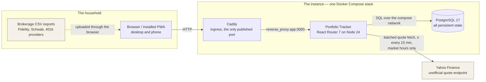
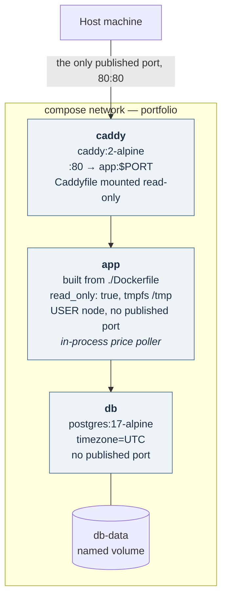
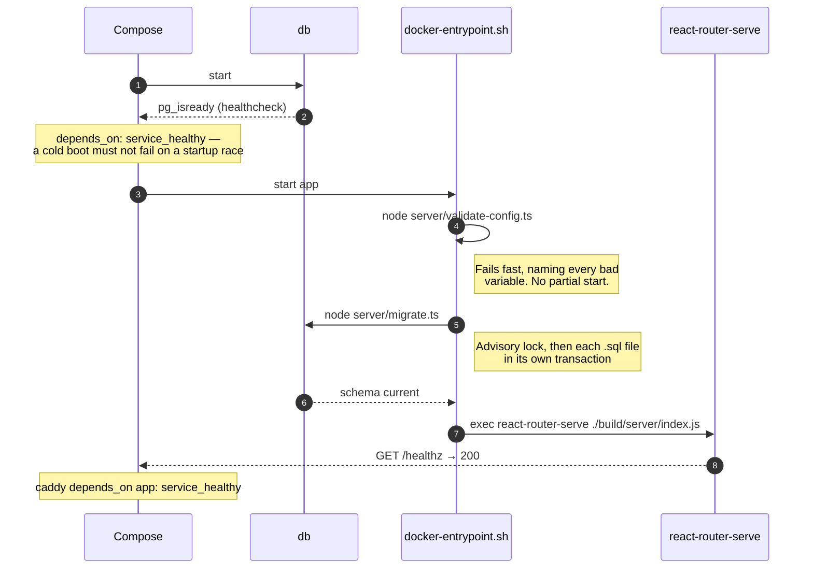
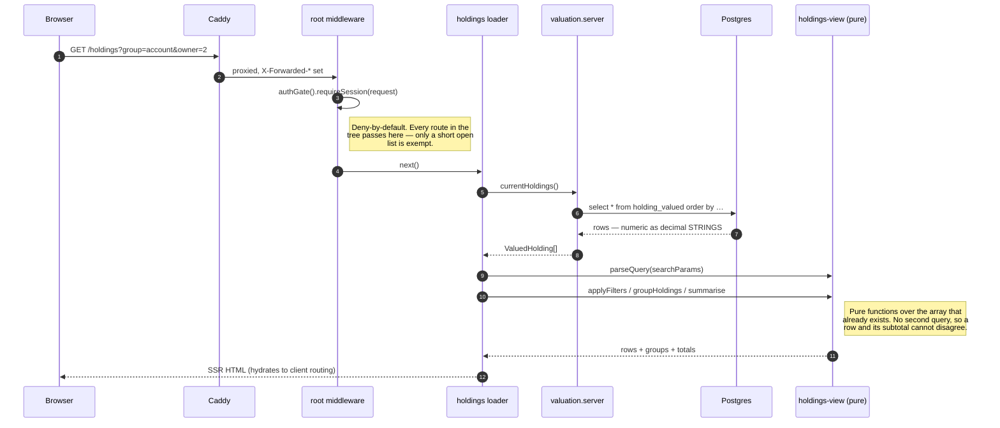
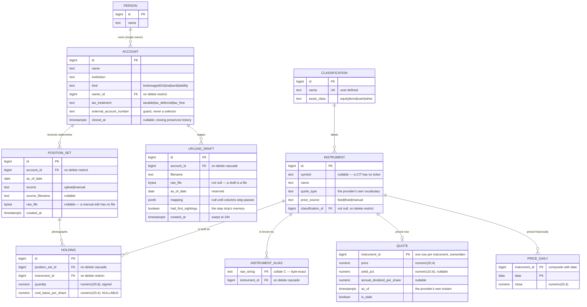
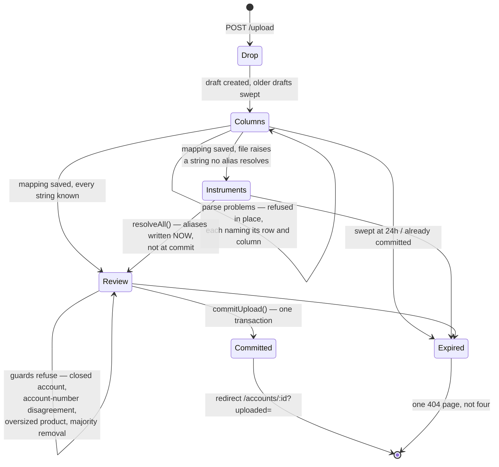
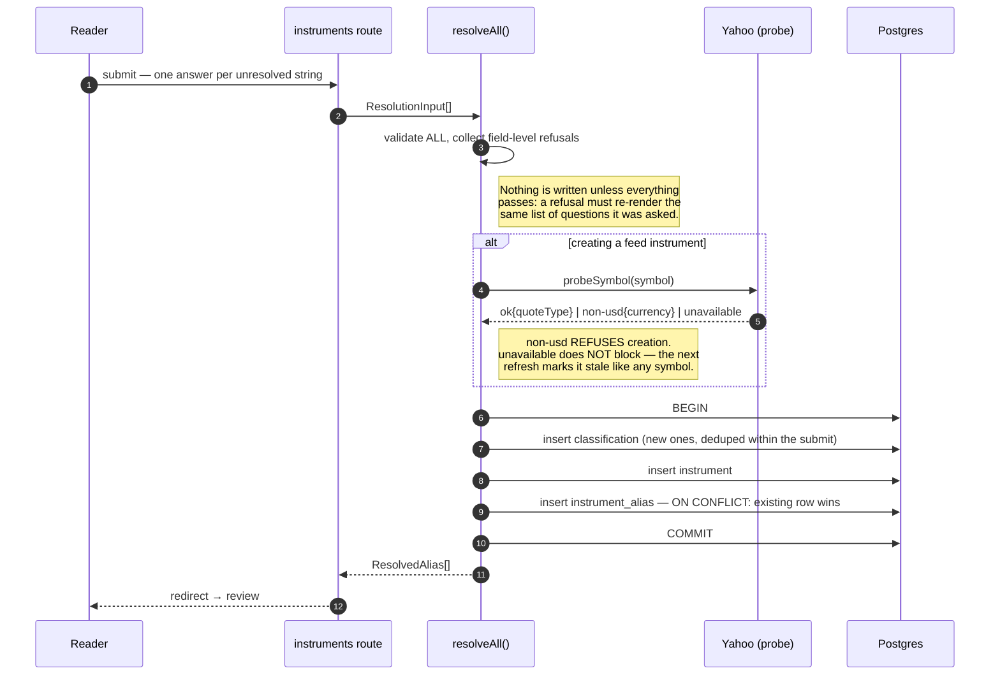
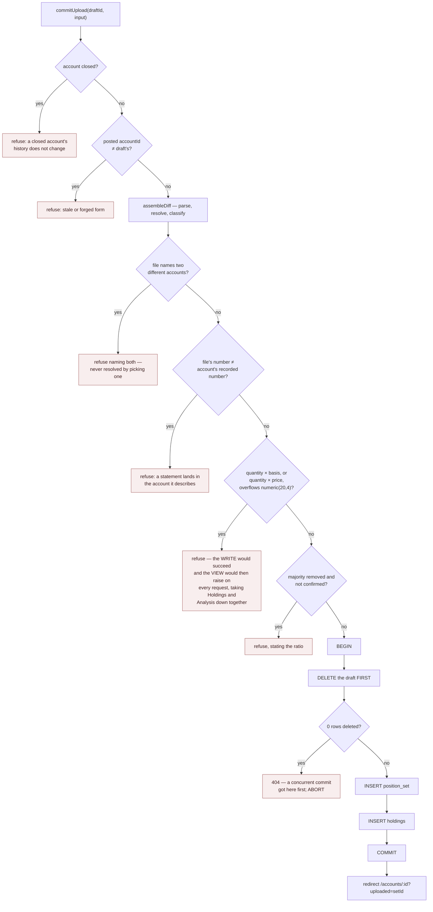
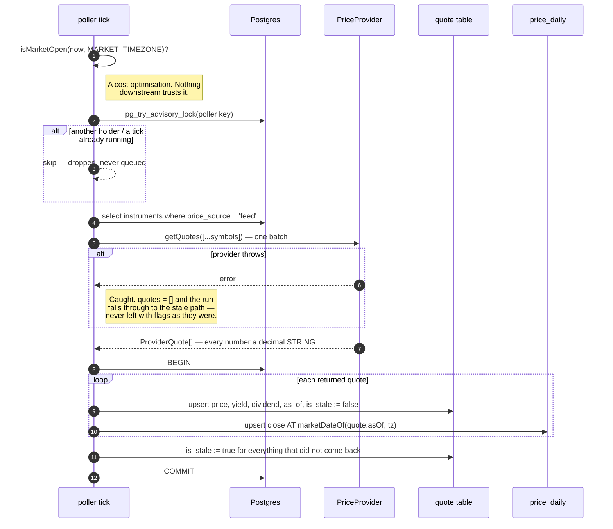

# Portfolio Tracker — Architecture

**An engineering reference for the system as built.** Where [DESIGN.md](DESIGN.md) records *what was
decided and why*, this document records *how the running system is put together*: its processes, its
layers, the shape of its data, and the paths a byte takes from a brokerage CSV to a figure on a
dashboard.

Everything below describes code that exists. Where a claim can be checked, it is anchored to a file
and a symbol.

---

## Contents

1. [How to read this document](#1-how-to-read-this-document)
2. [System context](#2-system-context)
3. [Deployment architecture](#3-deployment-architecture)
4. [Runtime architecture](#4-runtime-architecture)
5. [Data architecture](#5-data-architecture)
6. [Dataflows](#6-dataflows)
7. [Cross-cutting concerns](#7-cross-cutting-concerns)
8. [Build, release, run](#8-build-release-run)
9. [Testing architecture](#9-testing-architecture)
10. [Performance and scale envelope](#10-performance-and-scale-envelope)
11. [Known weaknesses and evolution paths](#11-known-weaknesses-and-evolution-paths)
12. [Appendix A: module map](#appendix-a-module-map)
13. [Appendix B: glossary](#appendix-b-glossary)

---

## 1. How to read this document

The repository carries four kinds of document, and they answer different questions. Reaching for the
wrong one is the usual way to end up re-litigating a settled decision:

| Document | Question it answers | Authority |
|---|---|---|
| [DESIGN.md](DESIGN.md) | *Why is it like this?* Domain model, scope, rejected alternatives, design tokens. | Authoritative on **decisions**. |
| **ARCHITECTURE.md** (this) | *How is it put together?* Processes, layers, schema, dataflow, invariants. | Authoritative on **structure**. |
| [`docs/specs/`](docs/specs) | *What was this slice asked to do?* One document per slice, written before the code. | Authoritative on **acceptance**. |
| [`docs/design/`](docs/design) | *What should the screen look and behave like?* UI briefs. | Authoritative on **screen behaviour**. |

This document does not restate DESIGN.md's reasoning. Where a structural fact exists because of a
decision, it cites the section — `§4.1`, `§6.2` — and moves on.

**A note on the source.** This codebase argues its decisions in module headers rather than in commit
messages. Almost every non-obvious choice below has a paragraph of prose above it in the file that
implements it, and those headers are the primary source. If this document and a module header ever
disagree, the header is nearer the code and probably right; fix this document.

---

## 2. System context

One household, one instance, one database. There are no tenants, no external consumers, and exactly
one third-party dependency in the request path.



**External dependencies, in full.** Yahoo Finance for quotes, and nothing else. There is no email,
no object store, no queue, no cache tier, no identity provider, no analytics. The one third party is
reached through a single-method interface (§7.5) precisely because it is unofficial and expected to
break.

**Trust boundaries.** Three, marked here because §7.6 depends on them:

| Boundary | Crossing | Trusted? |
|---|---|---|
| Browser → Caddy | HTTP request, optional session cookie | No. Every form input is re-validated server-side. |
| Caddy → app | `X-Forwarded-*` headers | **Yes, unconditionally** — which is why `app` publishes no port. |
| app → Yahoo | JSON quote payload | No. Parsed through Zod, currency-guarded, floats converted at the boundary. |

---

## 3. Deployment architecture

The deliverable is one application image plus a Compose file. `docker compose up -d` on a fresh
machine with an empty volume produces a working instance with no manual steps (DESIGN.md §10.1).

### 3.1 Topology



Three services, and the count is a decision rather than an accident:

- **No worker container.** The quote refresh loop runs inside the `app` process
  (`app/lib/price-poller.server.ts`). DESIGN.md §10 chose this for "one process to deploy, one place
  to read logs", and accepts the trade-off: a restart mid-session misses a poll until the next tick.
- **No published port on `app` or `db`.** Only `caddy` is reachable from the host. This is what makes
  the app's unconditional trust of `X-Forwarded-*` safe (§7.6) and keeps the database credentials off
  the LAN.
- **One named volume.** `db-data` holds every byte of persistent state, so there is exactly one
  backup target — `pg_dump`, documented rather than built in.

The `app` container is `read_only: true` with a `tmpfs` at `/tmp`. That is enforcement, not
intention: it is a statement that the container writes nothing to its own filesystem and can be
destroyed and recreated freely. A file-backed session store would discover this loudly on the first
login, which is one reason the session is a signed cookie and nothing else.

### 3.2 Startup sequence

`docker-entrypoint.sh` runs three steps under `set -eu`, each to completion before the next begins.
The ordering is load-bearing: either of the first two exiting non-zero stops the script, and the
server is never reached.



**Why migrations run in the entrypoint rather than as a one-shot service.** No request is ever served
against a half-migrated schema. Migrations are idempotent — the runner skips what the
`schema_migrations` ledger already records — so a restart is always safe.

**Why `/healthz` also checks migrations.** A migration on disk that the database has no record of
means the image and the database disagree: the instance is running, but it is serving pages against a
schema older than the code reading it. `app/routes/healthz.ts` returns 503 for that, and Compose's
healthcheck gates `caddy` on it.

### 3.3 Configuration surface

Every setting is an environment variable, and `server/config.ts` is the only module in the codebase
that reads `process.env`. It is a Zod schema, parsed once, with cross-field rules.

| Variable | Default | Required | Effect |
|---|---|---|---|
| `DATABASE_URL` | — | **yes** | Postgres connection URI; validated as one. |
| `AUTH_PASSWORD` | unset | no | Setting it **enables** the login gate. Unset means no auth, with a persistent UI banner. |
| `SESSION_SECRET` | unset | conditionally | Cookie signing key. Becomes required the moment `AUTH_PASSWORD` is set. |
| `PORT` | `3000` | no | HTTP listen port, 1–65535. |
| `PRICE_POLL_INTERVAL_MINUTES` | `15` | no | Poller cadence, 1–1440. |
| `MAX_UPLOAD_MB` | `10` | no | Upload body cap. Bounds what an accident can put in memory. |
| `MARKET_TIMEZONE` | `America/New_York` | no | Market-hours calculation and trading-day attribution. Validated as an IANA zone. |
| `TZ` | `UTC` | no | Container clock. The database stores UTC regardless. |

Two properties of this module are structural rather than cosmetic:

- **Pure and side-effect free.** `loadConfig(env)` neither reads `process.env` nor exits. That is
  what lets the same module be bundled into the server build by Vite *and* executed directly by
  Node's type stripping from `server/validate-config.ts`, from a runtime image containing no source
  tree.
- **Empty string reads as unset.** `FOO=` in a `.env` file, or an unsubstituted Compose variable,
  must not read as "configured to empty".

The one setting that is deliberately *not* an environment variable is the capital gains rate. It
lives in the `app_setting` table, because it is the household's own number rather than a description
of the deployment, and the person who wants it changed is the person reading the screen — not the
person with a shell on the container (`migrations/0005_app_setting.sql`).

---

## 4. Runtime architecture

### 4.1 One process, four layers

The application is a single Node process serving server-rendered React through React Router 7. There
is no separate API tier: a screen's loader calls a domain module directly, in the same process, and
the framework handles serialisation.

```
┌──────────────────────────────────────────────────────────────────────────────┐
│  ROUTES            app/routes/**                                             │
│                    loaders, actions, components                              │
│                    ── thin translators ──                                    │
│  Read a form, hand raw fields to a domain function, render whatever comes     │
│  back. A route never imports Zod and never states a domain rule.              │
└────────────────────────────────┬─────────────────────────────────────────────┘
                                 │
┌────────────────────────────────▼─────────────────────────────────────────────┐
│  DOMAIN            app/lib/*.server.ts                                       │
│                    accounts · people · positions · balances · uploads        │
│                    instrument-resolution · prices · settings · auth          │
│  Every rule about what may be written and what a refusal says. Returns        │
│  ValidationError with a message per field, never a 500.                       │
└──────┬─────────────────────────────────────────────┬─────────────────────────┘
       │                                             │
┌──────▼────────────────────────────┐  ┌─────────────▼─────────────────────────┐
│  QUERY LAYER                      │  │  PURE DOMAIN   app/lib/*.ts           │
│  app/lib/valuation.server.ts      │  │  money · statement · csv              │
│  The ONLY reader of holding_valued│  │  holdings-view · allocation           │
│  for valuation purposes.          │  │  market-hours · format                │
│  A translation layer, not a       │  │  No database, no request. Every        │
│  service: no caching, no rules.   │  │  awkward file is a fixture.           │
└──────┬────────────────────────────┘  └───────────────────────────────────────┘
       │
┌──────▼───────────────────────────────────────────────────────────────────────┐
│  SQL               migrations/*.sql                                          │
│                    holding_valued · holding_valued_at(d) · latest_position_set│
│  Every valuation rule lives here, in SQL, where the arithmetic is exact.      │
└──────────────────────────────────────────────────────────────────────────────┘
```

**The layering rule that matters most:** *the arithmetic goes down, never up.* Money is multiplied and
summed in SQL at `numeric` precision. When a figure has to be combined in JavaScript — a subtotal
under a grouped table, a percentage — it goes through `app/lib/money.ts`, which works on `BigInt`
counts of the last decimal place. Nothing else in the codebase adds a money value.

### 4.2 Single-site invariants

A recurring shape in this codebase: a hazard is contained by making exactly one place able to cause
it. These are the ones worth knowing before changing anything, each verifiable with a grep.

| Invariant | The one site | What a second site would cost |
|---|---|---|
| Postgres pool construction | `server/db.ts` | The `numeric`/`int8`/`date` type-parser override is registered here. A second pool is a code path where money is a rounding float. |
| Reading `process.env` | `server/config.ts` | A setting that exists but is not in the documented surface, and not validated at start. |
| Importing `yahoo-finance2` | `app/lib/price-provider.server.ts` | The provider swap stops being a day's work. The interface is also the test seam — CI never reaches the network. |
| Writing a price | `app/lib/prices.server.ts` | A second writer that files a quote under today's date instead of the quote's own trading day (§6.2). |
| JS money arithmetic | `app/lib/money.ts` | A second implementation of rounding. It was *moved* out of `allocation.ts` rather than copied for exactly this reason. |
| Valuing holdings | `app/lib/valuation.server.ts` over `holding_valued` | The failure DESIGN.md §8.2 names as the weakest point in the whole design: two pages showing different totals, with no error anywhere. |
| Multipart body reading | `app/lib/uploads.server.ts` | A second place to forget the size cap. Every other action uses `formFields`, which drops file parts by design. |

**One documented exception.** `prices.server.ts:356` (`priceFreshness`) also selects from
`holding_valued` — not to value anything, but to scope the "as of" freshness line to instruments
actually held in an open account. It reads `quote.as_of` and counts distinct instruments; it computes
no money. The invariant is about *valuation*, and this read stays inside it.

### 4.3 The `.server` convention

React Router's Vite plugin excludes `*.server.ts` from the client bundle. The suffix therefore marks
a real boundary, not a naming preference:

- `*.server.ts` may import the database, the config, and Node built-ins.
- `*.ts` in `app/lib` must be safe in a browser bundle. `allocation.ts` and `holdings-view.ts` import
  `ValuedHolding` from `valuation.server.ts` — but as a **type-only import**, which is erased at
  compile time and pulls no server code across. That is what lets a screen component call
  `allocationByPerson()` directly on loader data.

### 4.4 Request lifecycle

A representative read — `GET /holdings?group=account&owner=2` — end to end:



Three properties of this path are deliberate:

1. **The gate is middleware on the root route**, so it sees every request to every route in the tree
   and refuses anything not on `auth.server.ts`'s short open list. A route added by a later slice is
   protected the moment it is routable; nobody has to remember to protect it.
2. **Filtering and grouping are pure functions over one array**, not seven new SQL predicates. The
   screen's table and the subtotals under it are computed from the same rows, so agreement is
   structural rather than something to keep true.
3. **Numbers never become numbers.** The rows leave Postgres as decimal strings and stay that way
   through grouping, subtotalling and rendering.

### 4.5 Write paths

Every write in the application is one of five operations. All of them are *appends* — nothing in the
domain is ever updated in place except a quote and a settings row.

| Operation | Module | Writes | Append-only? |
|---|---|---|---|
| Commit an upload | `uploads.server.ts` → `commitUpload` | `position_set` + `holding`s, deletes the draft | Yes — a new set |
| Set a balance | `balances.server.ts` → `setBalance` | `position_set` + one `USD` `holding` | Yes — a new set |
| Correct a position | `positions.server.ts` → `revisePosition` | `position_set` + the whole account copied forward with one row changed | Yes — a new set |
| Resolve an instrument | `instrument-resolution.server.ts` → `resolveAll` | `classification`, `instrument`, `instrument_alias` | Yes — vocabulary, never revised |
| Refresh quotes | `prices.server.ts` → `refreshQuotes` | `quote` (upsert), `price_daily` (upsert) | No — the intraday tier is overwritten by design |

**Why append-only is not a preference.** `holding_valued_at(d)` reads position sets for every date the
net worth chart plots. An `update holding set quantity = …` would not correct a number — it would
silently restate every figure back to the date of the statement that row landed in. Your March net
worth would move because you fixed an August typo, with nothing on any screen saying so
(`positions.server.ts` header).

**Why a correction carries the whole account forward.** A position set is a photograph of everything
an account holds, so "a missing row means sold" (DESIGN.md §5.2). A set containing only the corrected
row would record every other security in the account as sold. `revisePosition` therefore copies the
old set across verbatim with one row changed.

---

## 5. Data architecture

### 5.1 The one valuation rule

Everything in this schema exists to make one sentence true without exception (DESIGN.md §2):

```
value = quantity × price        summed over every holding in the system
```

Everything on the balance sheet is a position, including cash and debt:

| Thing | Instrument | Quantity | Price | Value |
|---|---|---|---|---|
| 100 shares of VTI | `VTI` | `100` | `250.00` | `25,000` |
| Brokerage sweep cash | `USD` | `3,000` | `1.00` | `3,000` |
| Checking account | `USD` | `12,500` | `1.00` | `12,500` |
| Personal loan | `USD` | `−8,000` | `1.00` | `−8,000` |

**The sign lives in quantity, never in price.** A price is a positive market fact; a negative quantity
is the standard encoding for a liability. The structural consequence is that net worth is a single
`SUM` with no branches, and there is no `is_liability` special case in any calculation, any view, or
any screen.

Four seed rows in `migrations/0001_initial_schema.sql` are what make this hold end to end: a `Cash`
classification, a `USD` instrument with `price_source = 'fixed'`, a `quote` of `1.00`, and — the
load-bearing one — a `price_daily` row for `USD` dated **1970-01-01**. Because the as-of function
carries the last close forward, that single row resolves USD to `1.00` for every date the system will
ever be asked about, including statements dated before the app was installed.

### 5.2 Entity relationships



Four tables stand outside the graph because they reference nothing:

| Table | Shape | Purpose |
|---|---|---|
| `manual_networth` | `date` PK, `amount numeric(20,4)` | Hand-typed points covering the period before the app existed. Computed values always win on overlapping dates. |
| `column_mapping` | unique `(institution, header_fingerprint)`, `mapping jsonb` | How a brokerage's export format is remembered once and applied to every later file. |
| `app_setting` | `id boolean PK check (id)`, `capital_gains_rate numeric(9,6)` | Singleton, enforced by the schema. A second row is a constraint violation, not a silent ambiguity. |
| `schema_migrations` | `filename` PK, `applied_at` | The migration ledger. Created by the runner, since it must exist before anything else. |

### 5.3 What deletion does — the history policy, read off the FKs

`ON DELETE` is where "nothing is ever deleted" stops being a promise and becomes a constraint. The
split is exact and each side is a decision:

| Referencing → referenced | Action | Why |
|---|---|---|
| `account.owner_id` → `person` | `RESTRICT` | A person owning accounts cannot be removed out from under them. |
| `position_set.account_id` → `account` | `RESTRICT` | A position set is **history**. It must survive anything. |
| `holding.instrument_id` → `instrument` | `RESTRICT` | An instrument something was ever held as cannot vanish. |
| `instrument.classification_id` → `classification` | `RESTRICT` | Not-null, so a row would be orphaned. |
| `holding.position_set_id` → `position_set` | `CASCADE` | Holdings have no meaning apart from their set. |
| `instrument_alias.instrument_id` → `instrument` | `CASCADE` | An alias is vocabulary about a row that no longer exists. |
| `quote` / `price_daily` → `instrument` | `CASCADE` | Prices for a nonexistent instrument. |
| `upload_draft.account_id` → `account` | `CASCADE` | A draft is **scaffolding**, not history. A half-finished upload into a gone account stages nothing. |

Retirement is `account.closed_at`, never a delete. `holding_valued` excludes closed accounts;
`holding_valued_at(d)` includes them for the dates they were open (`closed_at is null or closed_at >
d`), so history before a closure is preserved and today's figures are not polluted.

### 5.4 The derived layer

Three SQL objects sit between the tables and every screen. They are the mitigation for the failure
DESIGN.md §8.2 names as the weakest point in the whole design.

```
                    latest_position_set(account_id, as_of := null)
                    ── the tie-break, defined exactly once ──
                    order by as_of_date desc, created_at desc, id desc
                    limit 1
                              │
              ┌───────────────┴────────────────┐
              │                                │
    holding_valued (VIEW)          holding_valued_at(d date)
    latest_position_set(a.id)      latest_position_set(a.id, d)
    closed_at is null              closed_at is null or closed_at > d
    price := quote.price           price := last price_daily close ≤ d
    is_stale := quote.is_stale     is_stale := false
              │                                │
              └───────────────┬────────────────┘
                              │
                    returns setof holding_valued
                    ── ONE row type, not two ──
```

**`latest_position_set(account_id, p_as_of)`** — `stable`, one function, one ordering. "Latest" is
`max(as_of_date)` per account, tie-broken by `created_at desc` then `id desc`. Re-uploading a
correction for an as-of date that already has a set is a real occurrence; without the tie-break the
answer is a coin flip. Surrogate keys are `bigint generated always as identity` precisely so that
"tie-break by id descending" means "the later insert wins" — a random UUID would make it arbitrary.
The ordering matches `position_set_account_as_of_idx` exactly, so this is an index scan stopping at
the first row.

**`holding_valued`** — a plain, **non-materialised** view. Data changes on upload, a household's
portfolio is small, and a materialised view would introduce a refresh step whose omission shows up as
silently stale totals. It exposes account, owner, institution, kind, tax treatment, instrument,
classification and asset class alongside the numbers, so every dashboard grouping is available with
no additional join.

**`holding_valued_at(d date)`** — a set-returning function, because a plain view cannot be
parameterised. Critically it is declared `returns setof holding_valued`, so it has *literally the
view's row type*: adding a column to the view forces this to move with it. It is not a second
definition of "holdings, valued"; it is the same definition varying only what must vary.

Four rules are encoded in the view, and each one is a refusal to understate:

1. **`LEFT JOIN quote`.** An instrument that has never been priced yields a null price and a null
   value and the row **still appears**, carrying `is_priced = false`. An inner join would make the
   holding vanish from every total silently.
2. **Null propagates through `unrealized`.** `value - cost_basis` is null when either side is null.
   Nothing coalesces a null cost basis to zero — that would report a fake gain equal to the entire
   untracked position.
3. **A stale price is used, not discarded.** `is_stale` is carried through unchanged; the last known
   value beats a zero or a null.
4. **Rounded to the money scale exactly once.** `quantity × price` carries scale 12 and is cast back
   to `numeric(20,4)` in a named `cross join lateral`, so `unrealized` is literally `value -
   cost_basis` rather than a second rounding of a second expression that could disagree by a fraction
   of a cent.

The carry-forward in `holding_valued_at` is what removes the calendar from the read path entirely.
Non-trading days get no `price_daily` row at all (§6.2), so a Saturday resolves to Friday's close, a
Sunday to the same Friday, and a market holiday to the trading day before it — with no calendar table
anywhere.

### 5.5 Indexes, and what each one is for

| Index | Definition | Serves |
|---|---|---|
| `position_set_account_as_of_idx` | `(account_id, as_of_date desc, created_at desc, id desc)` | `latest_position_set` — matched exactly, so the tie-break is an index scan stopping at row one. The hottest index in the schema. |
| `holding_one_row_per_instrument` | unique `(position_set_id, instrument_id)` | The lot-folding contract: a statement exporting one fund as three tax lots must arrive as **one** holding (`foldLots` in `statement.ts`). |
| `holding_instrument_id_idx` | `(instrument_id)` | The instrument → holdings direction: which accounts hold this fund. |
| `instrument_symbol_idx` | `(symbol)` | The refresh loop's symbol lookup. |
| `instrument_alias_instrument_id_idx` | `(instrument_id)` | Which raw strings point at this instrument. |
| `account_owner_id_idx` | `(owner_id)` | Grouping by person. |
| `instrument_classification_id_idx` | `(classification_id)` | Grouping by classification and asset class. |
| `upload_draft_created_at_idx` | `(created_at)` | The 24-hour draft sweep. |
| `column_mapping_one_per_fingerprint` | unique `(institution, header_fingerprint)` | One saved mapping per exact header, per institution. |

### 5.6 The numeric boundary

The single most consequential line of infrastructure in the codebase is in `server/db.ts`:

```ts
const STRING_TYPE_OIDS = [
  pg.types.builtins.NUMERIC,   // 1700 — parsed to a float by default, which ROUNDS
  pg.types.builtins.INT8,      // 20   — outside Number.MAX_SAFE_INTEGER
  pg.types.builtins.DATE,      // 1082 — a calendar date, not an instant
] as const;
```

`node-postgres` parses `numeric` into a JavaScript number by default. A six-figure balance then
surfaces later as two dashboards disagreeing by cents, with no error anywhere. Registering the
override anywhere other than at pool construction would leave a code path that gets numbers — which
is why there is exactly one construction site (§4.2).

The `date` override is the same class of bug in different clothing: `pg` parses Postgres `date` into a
JS `Date` at *local* midnight, so formatting it back in any timezone west of UTC yields the previous
day. `position_set.as_of_date` shifting by a day would select the wrong position set, silently.

`timestamp` and `timestamptz` are deliberately left alone. `created_at`, `closed_at` and
`quote.as_of` are genuine instants, compared in SQL rather than in JavaScript, and a `Date` is the
right shape for them.

What that means for a value crossing the system:

```
Postgres numeric(20,4)  ──▶  "12345.6700"  ──▶  toUnits(s, 4) → 123456700n
        ▲                     decimal string        BigInt count of the last place
        │                     (the VALUE, not a           │
        │                      rendering of it)           │  add / divide / compare
        │                                                 ▼
        └── SQL arithmetic ◀── never re-enters      render(units, 4) → "12345.6700"
            (the default)      as a number                 │
                                                           ▼
                                              format.ts → "$12,345.67"
                                              (renders, never computes)
```

Three rules follow, and the codebase holds all three:

- **Never `Number()`, `parseFloat`, or JSON round-trip a money value.** The permitted `Number()` calls
  in `app/lib` are all on cardinalities — row counts, header indices, clock minutes — never on a
  `numeric` column.
- **Do the arithmetic in SQL, or in `money.ts`.** There is no third option and no decimal library.
- **`format.ts` refuses to compute and `money.ts` refuses to format.** Neither does the other's job.

The generated types enforce the string half at compile time: `npm run db:types` runs
`kysely-codegen --numeric-parser string --date-parser string` against the live database, **including
views**, so `holding_valued` is typed like a table. CI verifies the committed types match the schema
(`npm run db:types -- --verify`), which is what makes regeneration after a migration mandatory rather
than remembered.

---

## 6. Dataflows

### 6.1 Ingest — a brokerage CSV becomes a position set

The largest subsystem in the application, and the one where a wrong answer would be silent. It is
four screens, each a real URL with no client state, over one staging row.

#### The pipeline

```
  bytes                rows                 positions              instruments            a set
    │                    │                     │                       │                    │
    ▼                    ▼                     ▼                       ▼                    ▼
┌────────┐   ┌────────────────────┐   ┌──────────────────┐   ┌──────────────────┐   ┌──────────────┐
│ upload │──▶│      csv.ts        │──▶│   statement.ts   │──▶│instrument-       │──▶│  uploads.    │
│ _draft │   │  readCsv(bytes,    │   │  parseStatement( │   │resolution.server │   │  server.ts   │
│  row   │   │          delim?)   │   │    rows, mapping)│   │  resolveAll()    │   │ commitUpload │
└────────┘   └────────────────────┘   └──────────────────┘   └──────────────────┘   └──────────────┘
             sniffs delimiter,        applies the column      byte-exact alias       one transaction:
             tolerates preambles,     mapping; folds tax      lookup; asks once      position_set +
             footers, ragged rows;    lots; refusals are      per unseen string;     holdings, draft
             NEVER throws on          DATA addressed to a     writes vocabulary      deleted
             content                  row and a column        immediately
                    │                          │                       │                    │
                    └── pure, no DB ───────────┘                       └── writes ──────────┘
```

Both parsing halves are **pure** — no database, no request — so every awkward file in existence is a
fixture and a test rather than a bug found on the review screen with a household's real statement in
hand. Six live in `tests/fixtures/statements/`: Fidelity, Schwab, a 401k, a liability, a lot-level
export, and a semicolon-delimited one.

Two invariants everything downstream leans on:

- **`readCsv` never throws on content.** Malformed UTF-8 becomes replacement characters, an
  unterminated quote runs to end of file, a stray quote mid-field is kept as a character. A file it
  cannot make sense of still yields rows for the caller to judge, so the refusal a reader eventually
  sees is a sentence about their statement — never a stack trace.
- **Row indices are stable.** Blank rows are *kept* in the row list, because a saved mapping's
  `headerRow` is an index into these rows. Dropping a blank line would silently shift every mapping
  made against a file after it.

**`parseStatement` returns refusals as data, not throws.** Each problem is addressed to a row and a
column, because the mapping screen renders the refusal beside the row that caused it and remapping is
the fix. A thrown error could name only the first fault, and a screen cannot point at a stack trace.
Problems present means the file must not be committed; the positions that *did* parse are still
returned so the screen has something to show beside the complaint.

#### The step machine



**Where the draft got to is a property of the row, not a status column.** `mapping` is null until the
columns step passes; with one, the file's own strings decide between instruments and review.
`parseDraft` computes that in one place, and `/upload/:draftId` — the bare address — is a loader with
no page that redirects to whichever step is still owed. That is what makes a reload, the back button
and a bookmarked half-finished upload all behave.

**A dead draft is one 404, not four.** Swept, already committed, mistyped and belonging-to-a-closed-
account all read the same expired-or-recorded page, because the reader's next move — start again from
`/upload` — is the same in every case.

#### Column mapping: how a brokerage is remembered

The key is `(account.institution, headerFingerprint)`. The fingerprint is SHA-256 over the header
row's cells: each trimmed, lowercased, internal whitespace collapsed, joined with U+001F, in file
order. Data rows never affect it, so the same export next quarter fingerprints the same however the
positions moved.

The two sensitivities are chosen in opposite directions, deliberately:

| Change to the header | Same fingerprint? | Consequence |
|---|---|---|
| `SYMBOL` retitled `Symbol` | **Yes** | A brokerage changing case has not changed what any column means. |
| Columns reordered | **No** | One re-map — cheaper than a mapping that silently follows a column that moved. |

`NOT_IN_FILE` (`"__none__"`) is a sentinel distinct from the empty string: "unset" and "not in this
file" are different answers, and only the deliberate one survives a save.

#### Instrument resolution: vocabulary, remembered forever

Lookup against `instrument_alias` is **byte-exact** — that is `collate "C"` doing its job. No
trimming, no case folding, no heuristics. A respelling is rightly a first sighting even when the
instrument is old news, because a heuristic that "helpfully" merged two near-identical strings would
attach a holding to the wrong fund silently. A miss prompts once and is remembered permanently.



**The writes happen at this step rather than at commit, deliberately.** An alias is a fact about
vocabulary, not about this statement, so re-uploading a corrected file must not ask the same
questions again. A draft abandoned after this step leaves the vocabulary behind, which is correct:
the next upload is quieter, and nothing was recorded as held.

There is deliberately **no skip**. A skipped row is a holding silently missing from the statement.

#### Commit: the flow's one write

`commitUpload` is the deepest function in the codebase — three parameters over six guards and a
transaction. The guards run in this order, and the order is the design:



Two of those deserve emphasis:

- **The product guard.** A product past `numeric(20,4)` does not fail the *write* — it succeeds, and
  then `holding_valued` raises on every request afterwards, taking Holdings and Analysis down
  together. Checking both multiplications before storing turns a site-wide outage into one sentence
  about one row.
- **Delete-first as the transaction's guard.** The draft's deletion leads. A concurrent commit that
  got here first has already taken the row, so `numDeletedRows === 0` aborts everything. Nothing
  before that point wrote anything.

**The account number is a guard, never a selector.** A file naming an account different from the one
the draft targets is refused; it is never silently rerouted to the account it names. It is also
*captured*: when the account has no number recorded and the committed file carries one, the commit
writes it onto the account (`uploads.server.ts:1025`), so the guard arms itself on the first upload
and every later statement is checked against it.

**Removals are listed in full, never counted.** A count alone is how a filtered export sells 28
holdings nobody read about. `UploadDiff.removed` carries every removed position individually, and a
majority removal demands an explicit tick.

### 6.2 Pricing — quotes into two tiers



**The two tiers, and why the split exists:**

| Table | Cardinality | Lifecycle | Read by |
|---|---|---|---|
| `quote` | one row per instrument | overwritten in place | `holding_valued` — today's figures |
| `price_daily` | one row per instrument per trading day | the immutable spine | `holding_valued_at(d)` — every historical figure |

**The single most important line in the pricing subsystem** is which date a close is filed under: *the
date inside the quote's own timestamp, in the market's zone — never today's date.* Two silent failures
follow from getting it wrong:

- A mutual fund strikes one NAV after the close. An afternoon poll sees yesterday's NAV still
  standing; filed under today it becomes a fabricated close for a day that has not finished, and
  tomorrow's poll files the real one a day late, permanently.
- A poll on a market holiday sees Friday's quote. Filed under the holiday it manufactures a row for a
  day the market did not trade — which history queries then read as real, because a real row and an
  absent one mean different things to the carry-forward.

Keyed on the quote's own instant, both cases collapse into rewriting the row that quote already owns.
This is the **trust asymmetry** that is `market-hours.ts`'s real interface:

| Function | Kind | If it is wrong |
|---|---|---|
| `isMarketOpen(instant, tz)` | cost optimisation | The poller wastes a handful of requests on Good Friday. Stored data is still correct. |
| `marketDateOf(instant, tz)` | **correctness mechanism** | A real price is written under the wrong date — a permanent error in the immutable spine. |

`marketDateOf` never consults the holiday calendar. That is why the calendar is allowed to be a
hardcoded five-year list rather than a rule engine: it decides whether to spend a request, never what
to store.

**Failure is a marked price, never a missing one.** A provider that throws — network failure, rate
limit, the unofficial endpoint changing shape — is the expected case. Left to propagate, the run would
end with every `is_stale` flag exactly as it was, so the UI would keep presenting last week's prices
as current. Instead the error is caught, the batch becomes empty, and every selected instrument falls
through the same path a symbol that did not come back takes: **the last known price is kept and used,
and the row is flagged.** Never zeroed, never nulled into a sum.

**The freshness line reports the *oldest* `as_of`, not the newest.** A portfolio where ninety-nine
instruments updated a second ago and one has been failing for a week would report itself current under
a newest-first reading — which is exactly the "silently showing yesterday's net worth as though it
were live" failure this application refuses. `priceFreshness` also excludes `fixed` and `manual`
sources: every bank and loan account holds the seeded `USD` row, whose `as_of` is written once at
install, and without that filter the "as of" line would be pinned to the install timestamp forever.

**Poller hazards, all three handled explicitly** (`price-poller.server.ts`):

| Hazard | Guard |
|---|---|
| Two timers in one process — `react-router dev` re-executes the module graph on every edit | The handle is pinned to `globalThis`, which Vite does not reset, and disposed on hot update |
| Two timers in two processes — a restart overlapping a shutdown | Postgres advisory lock per tick, with a key distinct from the migration runner's |
| A tick outliving its interval — a slow provider | Serialised by a flag; an overlapping tick is **dropped, not queued** — a queue of pending fetches against an unofficial API is how an instance gets rate-limited |

`/healthz` deliberately reports none of this. A health check that failed during a third-party outage
would make Compose restart a perfectly healthy app.

### 6.3 Read path — dashboards

Every screen that shows money reads through `valuation.server.ts`. Its public surface is nine reads
falling out of three private helpers written once against both sources:

```ts
currentHoldings()              // every holding held right now, valued
netWorth()                     // one SUM, plus how many holdings it was computed from
holdingsAt('2026-02-14')       // the same, for any past date
netWorthAt('2026-02-14')
accountTotals() / accountTotal(id) / accountHoldings(id)
netWorthSeries(dates) / accountSeries(id, dates)
manualNetWorth() / netWorthChange() / firstRecordedDate()
```

The seam is `ValuedSource` — `valuedNow()` and `valuedAt(date)` are two adapters over the *same* row
type, so every read below the seam is written once and works for both.

```
   Screen                Reads                            Shape it groups by
   ─────────────────────────────────────────────────────────────────────────────
   Overview      netWorth, netWorthSeries,        account totals, chart series
                 manualNetWorth, netWorthChange
   Holdings      currentHoldings ──▶ holdings-view.ts (pure)
                                     7 dimensions: person · account · institution
                                     · kind · tax_treatment · classification
                                     · asset_class
   Analysis      currentHoldings ──▶ allocation.ts (pure)
                                     by person · by account kind · by asset class
                                     + unrealized gains and estimated tax
   Account       accountTotal, accountHoldings, accountSeries, uploadReceipt
```

**No dashboard writes its own join.** Filtering, grouping and subtotalling happen as pure functions
over the array the query layer already returned, because the grouping key is already on every row —
`holding_valued` was built to expose exactly the eight dimensions §8.3 names. Three `GROUP BY`
queries would be three more hand-rolled dashboard queries, which is the drift the view exists to
prevent.

**Coverage travels with every figure.** A total is `{ amount, coverage: { known, total } }`, never a
bare number, so a partial answer is labelled "based on 8 of 12 holdings" rather than quietly
understated. An unpriced holding contributes nothing to `amount` and is counted in `coverage.total`.

**A filter is only offered when it can discriminate.** `availableFilters` returns a dimension only if
the data holds two or more distinct values for it, so a one-person household is never shown an Owner
select that can only mean "everyone", and no *single* filter can select an empty table.

**History starts at the first upload.** An account with no position set at or before a date
contributes **no rows** — not a zero. Callers read `coverage.total` rather than the amount to decide
where a line begins, so a chart starts where history starts instead of climbing out of a fictional
zero. The pre-app period is `manual_networth`'s job, and computed values win on overlapping dates.

### 6.4 Manual write paths

Two writes exist alongside the upload flow, for the two cases where a four-screen statement import is
more ceremony than the fact deserves.

| | Set balance | Correct a position |
|---|---|---|
| Where | Account page, `bank` and `liability` only | Inline on the Holdings table |
| Module | `balances.server.ts` | `positions.server.ts` |
| Writes | `position_set(source='manual')` + one `USD` holding | `position_set(source='manual')` + the whole account carried forward, one row changed |
| The sign | **Derived, never typed** — the household types what they owe and the module negates it | **Refused if it flips** — the box shows the current sign, so reversing it asserts an asset became a debt |
| Guards | Closed account; kind must accept it | Closed account; position still present; direction unchanged; both products fit `numeric(20,4)` |

Both differ from an upload only in carrying `source = 'manual'` and no filename. Nothing downstream
learns a new shape: `latest_position_set` picks the new set up by the same tie-break, and every figure
in the application moves because one row landed in the table they all already read.

Why the sign is handled differently in the two: a form that accepts a signed number accepts `14500`
for a debt, which does not fail — it silently moves household net worth by twice the loan.
`setBalance` avoids that by refusing to accept a sign at all. `revisePosition` cannot, because its box
opens containing the number the table prints, so it refuses the *change* instead.

---

## 7. Cross-cutting concerns

### 7.1 The error model

Three error types, and the layer each one is answered at.

| Type | Raised by | Carries | Answered by | Becomes |
|---|---|---|---|---|
| `ValidationError` | domain modules | `FieldErrors` — a message per field, plus `FORM_ERROR` for submission-level ones | the route's `catch` | the same form re-rendered, message beside the box that caused it, every other box keeping what was typed |
| `NotFoundError` | domain modules | a sentence | the route's `catch` | `throw new Response(message, { status: 404 })` |
| `DraftNotReadyError` | `uploads.server.ts` | the step still owed | the upload routes | a redirect to that step |

**A refusal is an ordinary outcome of a form submission — never a 500.** That rule is what keeps
routes thin: a route reads the form, hands the raw fields to a domain function, and renders whatever
comes back. It never imports Zod, and it never states a rule that a second caller could then get a
different answer for.

`DraftNotReadyError` is the interesting one: it is neither a refusal nor a 404. The reader's next
move is an earlier step, so the error names that step and the routes translate it into a redirect.

### 7.2 Transactions and concurrency

Single-instance deployment makes contention unlikely rather than impossible — a restart can overlap a
still-shutting-down container, and a determined operator can run two.

| Race | Guard | Where |
|---|---|---|
| Two migration runners on a cold start | Session-level `pg_advisory_lock`, then the ledger re-read *after* taking it | `server/migrations.ts` |
| Two poller ticks in different processes | Advisory lock per tick, distinct key | `price-poller.server.ts` |
| Two poller ticks in one process | A serialising flag; the later tick is dropped | `price-poller.server.ts` |
| Two commits of one draft | **Delete the draft first, inside the transaction.** Zero rows deleted aborts everything | `uploads.server.ts` |
| Two drafts resolving the same string | `insert … on conflict do nothing`; the existing row wins and is returned | `instrument-resolution.server.ts` |
| A form posted against a position that moved | `currentPosition` re-read inside the write, refusing if it is gone | `positions.server.ts` |
| An account closed while a draft sat open | Checked *before* field validation, in every write path | all three writers |

The advisory lock keys are arbitrary constants that must not change, and must not collide — a cold
start with a shared key would have a poll and a migration blocking each other for no reason.

**`inTransaction` and the test seam.** Three modules carry the same small helper:

```ts
db.isTransaction ? body(db) : db.transaction().execute(body)
```

Kysely refuses `.transaction()` on a handle that is already one, and the primary test seam *is* a
transaction (§9). The check is therefore load-bearing rather than defensive.

### 7.3 Idempotency

| Operation | Idempotent? | Mechanism |
|---|---|---|
| Applying migrations | Yes | The `schema_migrations` ledger; re-running skips what is recorded |
| `startPricePoller()` | Yes | After the first call it is a property lookup on `globalThis` |
| A quote refresh | Yes | Upserts keyed on `instrument_id` and `(instrument_id, date)` |
| Re-POSTing a commit | **No, and deliberately so** | The draft is gone, so the second POST is a 404 rather than a second position set |
| Re-uploading the same statement | No | It appends a new set. Uploads append, never mutate (DESIGN.md §5.2) — the tie-break decides which speaks |

A past `price_daily` row *can* be rewritten, and that is not a violation: it is only ever rewritten
with the provider's own price for the day that provider says it belongs to, so a rewrite is idempotent
unless the provider itself revises a close — which is a correction, not corruption.

### 7.4 Observability

Deliberately thin. There is no metrics endpoint, no tracing, and no structured log pipeline; this is
one household's instance and the operator reads `docker compose logs`.

| Signal | Where |
|---|---|
| `GET /healthz` | Database reachability **and** migration currency. 200 or 503, `Cache-Control: no-store`, never authenticated |
| Startup | The migration runner logs `applied` / `skip` per file |
| Refresh outcome | `RefreshReport { requested, priced, stale, closes }` per run |
| Provider failure | `console.error`, then every selected instrument marked stale |
| Failed login | `console.warn` with the **forwarded** address — the only address that means anything behind a proxy |
| Freshness, in the UI | The "as of" line, driven by the *oldest* `quote.as_of` among held feed instruments |

The two non-goals of `/healthz` are as important as what it checks: it never tests the price provider,
and it never requires credentials.

### 7.5 The provider seam

```
        ┌───────────────────────────────────────────────────────────┐
        │  PriceProvider                                            │
        │    getQuotes(symbols: string[]): Promise<ProviderQuote[]> │
        └───────────────────────┬───────────────────────────────────┘
                    ┌───────────┴────────────┐
                    ▼                        ▼
        yahooPriceProvider()          the tests' fake
        the ONLY importer of          implements this and nothing else;
        yahoo-finance2                CI never reaches the network
```

`yahoo-finance2` is an unofficial client for an endpoint Yahoo never published, with no SLA. What
makes that tolerable is that swapping it is a day's work — which is only true while this interface is
the sole thing the write path imports.

Three conversions happen at this boundary and nowhere else:

- **Floats become decimal strings.** The provider hands back JavaScript numbers, which is exactly what
  a money column must never see. The conversion happens once, here — not in the write path, where it
  would be one more place to forget.
- **The payload is parsed through Zod**, so a shape change is a refusal rather than a `NaN`.
- **The currency guard.** A non-USD quote is refused. `getQuotes` turns that into an *absent* quote,
  because a refresh must not lose ninety-nine prices over one foreign listing. `probeSymbol`, used at
  instrument creation, returns it *named* — because there the caller is a person creating one
  instrument, and collapsing "a currency we refuse" into "the provider had a bad day" would destroy
  the one distinction they can act on.

### 7.6 Security posture

The threat model is a household LAN, not the open internet, and the document says so rather than
implying more.

| Control | State |
|---|---|
| Authentication | **Optional.** `AUTH_PASSWORD` enables one password, one signed cookie, one login page. Unset means open, with a persistent UI banner |
| Authorisation | None. There is no user table and no per-person permissions — every session sees everything |
| Enforcement point | One middleware on the root route. **Deny-by-default**: everything not on a short open list is refused, including paths that do not exist yet |
| Session revocation | Sessions are pinned to a SHA-256 of the password, so changing `AUTH_PASSWORD` logs everyone out. That is the only revocation an instance with no user table can offer |
| Password comparison | `timingSafeEqual` over hashes |
| Cookie `Secure` | Chosen from the *browser's* scheme via `X-Forwarded-Proto`, not the app's own — behind a TLS-terminating proxy the request arrives over plain HTTP and the cookie must still be `Secure` |
| Session storage | A signed cookie and nothing else. The container is `read_only`, which a file-backed store would discover on the first login |
| TLS | **Not configured.** The app serves plain HTTP and never manages certificates; terminating TLS is Caddy's job once a real hostname is set |
| Upload bounds | Guarded twice — `Content-Length` before the body is read, then `File.size` after |
| SQL injection | Kysely parameterises; the `sql` template tag is used only with bound values |

**The forwarded-header decision, stated plainly.** The app trusts `X-Forwarded-*` unconditionally, and
that trust has one deployment requirement behind it: **the app must not be reachable directly**,
because anything that can connect to it can set these headers. `compose.yaml` publishes no port for
`app` for exactly this reason. What is at stake if the requirement is broken is small and worth being
exact about: a forged `X-Forwarded-Proto` changes only the `Secure` attribute on the sender's own
session cookie, which can cost them their own session and nobody else's. It grants no access — the
gate reads none of it.

**Two consequences of no TLS**, both deployment constraints rather than bugs:

1. Service workers require a secure context, so an instance served over plain HTTP at a LAN IP
   **cannot install as a PWA on a phone**.
2. The login cookie will not carry `Secure`, because the browser's scheme is `http`.

---

## 8. Build, release, run

### 8.1 Image

Three stages, each with one job:

```
┌─ deps ────────────────────────────────────────────────────────────────┐
│ node:24-slim · COPY package.json package-lock.json · npm ci --include=dev│
│ Invalidated by a dependency change and by nothing else — changing a    │
│ route does not reinstall.                                             │
└───────────────────────────────┬───────────────────────────────────────┘
┌─ build ───────────────────────▼───────────────────────────────────────┐
│ npm run build          → client and server bundles, via Vite          │
│ npm prune --omit=dev   → the production tree, guaranteed a SUBSET of  │
│                          the one the build was verified against       │
│ rm -rf node_modules/typescript                                        │
│   ── tsc is an OPTIONAL PEER of @react-router/node, kept by prune;    │
│      the runtime stage is specified to contain no compiler            │
└───────────────────────────────┬───────────────────────────────────────┘
┌─ runtime ─────────────────────▼───────────────────────────────────────┐
│ node:24-slim · USER node · NODE_ENV=production TZ=UTC PORT=3000       │
│ node_modules/ build/ package.json                                     │
│ server/{config,validate-config,db,migrations,migrate}.ts              │
│   ── run under Node's TYPE STRIPPING; no build step for them          │
│ migrations/*.sql   ── the DB is the source of truth, so they ship     │
│ HEALTHCHECK GET /healthz                                              │
│ No compiler, no dev dependencies, no source tree.                     │
└───────────────────────────────────────────────────────────────────────┘
```

The five `server/*.ts` files in the runtime image are the reason `server/config.ts` and `server/db.ts`
are dependency-light and side-effect free: they are executed two different ways — bundled into the
server build by Vite for the app, and run directly by Node for the entrypoint's config gate and
migration runner.

### 8.2 CI

`.github/workflows/ci.yml`, on every push to `main` and every PR:

```
npm ci
  └─▶ npm run typecheck    ── react-router typegen && tsc --noEmit
  │                           The runtime strips types WITHOUT checking them,
  │                           so this is the only place they are verified.
  └─▶ npm run build
  └─▶ compose -f compose.test.yaml up -d --wait   ── a REAL Postgres
      └─▶ npm run migrate
      └─▶ npm test
      └─▶ npm run db:types -- --verify
            ── the committed types are derived from the live database, so a
               migration landing without a regeneration would silently leave
               every query typed against the old schema
```

That last step is what makes the regeneration step in the README mandatory rather than remembered.

### 8.3 Adding a migration

1. Add `migrations/000N_name.sql` with a zero-padded numeric prefix — files are applied in **filename
   order compared as plain strings**.
2. Write it so it can run exactly once; the runner's ledger guarantees that, and seeds carry their own
   `ON CONFLICT` guards anyway, because a seed that depends on bookkeeping elsewhere to stay singular
   is only accidentally idempotent.
3. `npm run migrate`, then `npm run db:types` and commit the regenerated
   `app/lib/database.generated.ts`.

Each file runs inside its own transaction as a single simple-protocol query, so it may contain many
statements and all of them plus the ledger row commit or roll back together. A failure rolls that
migration back whole and leaves the ledger without its filename, so the next run retries it from a
clean state rather than resuming halfway through.

---

## 9. Testing architecture

**35 test files, 581 cases, against a real Postgres.** No mock, no in-memory substitute, no
SQLite. The risk this codebase carries lives in Postgres-specific SQL and in `numeric` handling, and
both disappear under a substitute: a fake database would pass while the real one silently rounded
money or resolved the wrong position set.

### 9.1 The two seams

```
┌──────────────────────────────────────────────────────────────────────────┐
│  withDatabase(body)                       15 files                       │
│  ── real Postgres, migrations applied, fixtures seeded ──                │
│                                                                          │
│  database.transaction() ─▶ body({ db: trx, ...makeFixtures(trx) })       │
│                         ─▶ throw Rollback  ─▶ ALWAYS rolled back         │
│                                                                          │
│  A test may read its own writes; nothing survives it. No test can see    │
│  another's rows, ordering never matters, and the suite leaves the        │
│  database exactly as it found it — including after a failure.            │
└──────────────────────────────────────────────────────────────────────────┘

┌──────────────────────────────────────────────────────────────────────────┐
│  Pure-module tests                        20 files                       │
│  csv · statement · money · market-hours · holdings-view · allocation     │
│  · format · config · forwarded                                           │
│  No database at all, because those modules have none. Six real brokerage │
│  exports live in tests/fixtures/statements/.                             │
└──────────────────────────────────────────────────────────────────────────┘
```

`fileParallelism: false` — integration tests share one Postgres and are kept off each other's toes.
The Vitest config deliberately omits the React Router plugin; its route and manifest generation only
gets in the way of server-module tests.

### 9.2 Rules the suite is held to

- **Seed through the builder, never raw SQL.** `tests/support/fixtures.ts` exposes `seedPerson`,
  `seedAccount`, `seedPositionSet`, `seedQuote`, `seedDailyClose`. Raw `INSERT` statements belong in
  the builder and nowhere else — that is what keeps a schema change from rewriting every test.
- **Test what would hurt to break**: domain rules, money and quantity maths, ingest and parsing edges,
  and a reproducing case for every bug fixed. Tests that assert framework behaviour, restate the
  implementation line by line, or mock so heavily they only exercise the mock are deliberately absent.
- **No test touches the network.** The provider interface (§7.5) and `ResolutionDeps.probe` are the
  two injection points, and both take a one-line stub.

### 9.3 The standing constraint

**No test in this repo imports a route.** There is no `@testing-library`, `happy-dom` or `jsdom` in
`package.json`, so anything living in a route module is untestable by construction. This is worth
treating as a design constraint rather than a gap: it is the strongest argument for keeping routes as
thin translators, and it is why logic keeps migrating out of `app/routes/**` and into `app/lib/**`.
The two `.test.tsx` files test components in isolation, not routes.

---

## 10. Performance and scale envelope

The design target is one household: two to four people, a dozen accounts, of the order of 100
instruments, and three or four statement uploads a quarter. Every structural choice below is sized to
that, and each would be wrong at a hundred times the scale.

| Choice | Right here because | Would break at |
|---|---|---|
| `holding_valued` is **not** materialised | The data changes on upload and the row count is in the hundreds. A refresh step whose omission shows up as silently stale totals costs more than the scan | Tens of thousands of holdings, or a read-heavy multi-tenant load |
| Filtering and grouping in JavaScript over the full array | Seven dimensions over a few hundred rows; agreement between a row and its subtotal is structural | A table that cannot be sent to the browser whole |
| One batched provider call every 15 minutes | ~100 symbols; the endpoint is unofficial and a queue of pending fetches is how an instance gets rate-limited | Thousands of symbols, or a real-time requirement |
| In-process scheduler | One process to deploy, one place to read logs | Horizontal scaling — two app containers would both poll, and only the advisory lock keeps that correct rather than efficient |
| Drafts swept inline at the next upload, not by cron | The table holds at most a handful of rows | Concurrent uploaders |
| Whole CSV buffered in memory, capped at `MAX_UPLOAD_MB` | A brokerage CSV is tens of kilobytes | Multi-megabyte statements, which would want streaming |

**The one query that is genuinely hot** is `latest_position_set`, called once per account per read.
`position_set_account_as_of_idx` matches its ordering exactly, so it is an index scan stopping at the
first row. It is also the one place where a schema change could quietly cost real time: adding a
column to that ordering without adding it to the index would turn every dashboard read into a sort.

**`netWorthSeries` is one round trip, not one per point.** The dates are joined laterally against
`holding_valued_at(d.date)`, with the narrowing pushed *inside* the lateral — a `WHERE` in the outer
query is evaluated after the join and would reject the all-null row a `LEFT JOIN` manufactures for an
uncovered date, taking the uncovered date down with it.

---

## 11. Known weaknesses and evolution paths

### 11.1 The weakest point, named by the design itself

> Three hand-rolled queries can disagree on edge cases — null cost basis, stale prices, an account
> whose first position set starts mid-chart. You will not get an error; you will get two pages showing
> different totals. (DESIGN.md §8.2)

`holding_valued` plus `valuation.server.ts` is the entire mitigation, and it holds only as long as
nothing else joins to `holding` directly. **This is the first place to look when two screens
disagree**, and the first thing to check in a review of any new dashboard.

### 11.2 Structural limits accepted on purpose

| Limit | Consequence | What lifting it costs |
|---|---|---|
| Positions, not transactions | No realized gains, no dividend history, no tax lots, no time- or money-weighted return | A transaction ledger — a substantially different ingest problem |
| No cash-flow tracking | The history chart cannot separate market movement from contributions. A $10k deposit and a 40% rally look identical — which is why it is labelled **"Total value"**, never "return" | The same ledger |
| Single owner per account | Joint accounts are not modelled | Revisiting `account.owner_id`, and multi-user auth alongside it |
| USD only | A non-USD instrument is refused at creation | A currency dimension through every money column and every sum |
| One password, no user table | No per-person permissions; changing the password is the only revocation | A separate design, per DESIGN.md §10 |
| In-process poller | A restart mid-session misses a poll until the next tick | A worker container — two images, two deployments, two log streams |

### 11.3 Live architectural debt

From the review in [`docs/research/2026-08-23-architecture-review.md`](docs/research/2026-08-23-architecture-review.md),
which was run adversarially against the codebase rather than against its own claims:

- **One predicate, computed twice, at two instants.** "Does this file raise a first sighting?" is
  computed inside `saveMapping` (to persist `had_first_sightings`) and again in the columns route (to
  choose the redirect). The bytes are parsed twice, and the two answers are taken at different
  moments. A single `rememberMapping(draftId, mapping, rows, db) -> { nextStep }` would close it.
- **Chart-range primitives duplicated** across `routes/overview.tsx` and `routes/account.tsx` — the
  range set, the sample count, the drawability rule. The drawability rule has already drifted three
  ways. Note that `windowDays` should *not* be shared: the two differ for a documented domain reason.
- **`inTransaction` exists three times** — in `prices.server.ts`, `instrument-resolution.server.ts`
  and `uploads.server.ts` — identically. All three already import from `db.server.ts`.
- **`labelOf` exists three times**, in `account-options.ts`, `allocation.ts` and `holdings-view.ts`.
- **Two settings routes never render a form-level refusal**, so a future `.superRefine` on
  `accountInput` would produce a refusal nobody sees. Latent rather than live.
- **Logic stranded in route modules** — `describe(filters)` in `holdings.tsx` among it — is untestable
  by construction (§9.3).
- **One stale schema comment.** `migrations/0001_initial_schema.sql:61` describes
  `external_account_number` as "used to auto-select the account on upload". The shipped ingest slice
  made it a guard and a capture instead, and nothing in `app/` selects an account by it. The column is
  right; the comment predates the decision.

### 11.4 Where the next feature probably goes

| Wanted | Likely shape |
|---|---|
| A saved view builder (DESIGN.md §8.3) | `holdings-view.ts` already models the eight dimensions; the missing piece is persistence, plus absorbing the five array calls in `holdings.tsx` into a `holdingsTable` |
| A second price provider | Implement `PriceProvider` and change one construction site. The interface was built for this |
| TLS | A real hostname in the `Caddyfile` site block. Nothing in the app changes — it already reads the browser's scheme from `X-Forwarded-Proto` |
| Dividend history | A transaction ledger, and therefore a different ingest problem. Not an extension of this schema |

---

## Appendix A: module map

### `server/` — runs both bundled and under Node's type stripping

| File | Role |
|---|---|
| `config.ts` | The whole configuration API. The only reader of `process.env`. Pure, side-effect free |
| `db.ts` | The only Postgres pool construction site, because the type-parser overrides are registered here |
| `migrations.ts` | Discovery, ledger, advisory lock, per-file transactions |
| `migrate.ts` | The CLI the entrypoint runs |
| `validate-config.ts` | The startup gate — fails fast, naming every bad variable |

### `app/lib/` — domain (`.server`) and pure

| File | Role |
|---|---|
| `db.server.ts` | The process-wide Kysely handle, and `/healthz`'s report |
| `valuation.server.ts` | **The only reader of `holding_valued` for valuation.** Nine reads over one seam |
| `uploads.server.ts` | Drafts, multipart reading, the diff, and `commitUpload` — the ingest flow's one write |
| `instrument-resolution.server.ts` | First sightings, and the writes that remember a resolution forever |
| `column-mapping.server.ts` | Header fingerprinting and the saved mapping |
| `prices.server.ts` | **The only writer of a price.** Both tiers, and the freshness read |
| `price-provider.server.ts` | **The only importer of `yahoo-finance2`.** The provider interface and the symbol probe |
| `price-poller.server.ts` | The in-process refresh loop and its three concurrency guards |
| `positions.server.ts` | Correcting one position, append-only, carrying the account forward |
| `balances.server.ts` | Setting a single-position balance; the sign is derived, never typed |
| `accounts.server.ts` / `people.server.ts` | The management surface. Nothing is ever deleted |
| `settings.server.ts` | The capital gains rate |
| `auth.server.ts` | The optional gate — deny-by-default, one cookie |
| `forwarded.server.ts` | Reading the request as the client actually made it |
| `first-run.server.ts` | One question, three answers |
| `input.server.ts` | `ValidationError`, `parseInput`, and the shared field shapes |
| `money.ts` | **The only place JS money arithmetic happens.** `BigInt` counts of the last decimal place |
| `csv.ts` | Bytes to rows. Never throws on content; row indices are stable |
| `statement.ts` | Rows to positions. Pure; refusals are data addressed to a row and column |
| `holdings-view.ts` | The Holdings table: seven dimensions, filtering, grouping, subtotals |
| `allocation.ts` | Three allocation cuts plus unrealized gains by asset type |
| `market-hours.ts` | `isMarketOpen` (an optimisation) and `marketDateOf` (a correctness mechanism) |
| `format.ts` | Renders. Never computes |
| `database.generated.ts` | `kysely-codegen` output, views included. Regenerated after every migration |

### `migrations/`

| File | Adds |
|---|---|
| `0001_initial_schema.sql` | The whole day-zero schema and the four seed rows that let cash and debt travel the share position's path |
| `0002_holding_valued.sql` | `latest_position_set()` and the `holding_valued` view |
| `0003_holding_valued_at.sql` | `holding_valued_at(d date) returns setof holding_valued` |
| `0004_upload_draft.sql` | The ingest staging row |
| `0005_app_setting.sql` | The singleton settings row |

---

## Appendix B: glossary

| Term | Meaning here |
|---|---|
| **Position set** | One photograph of everything an account held on one date. The unit of ingest. Immutable |
| **Holding** | One instrument within a position set: a signed quantity and an optional cost basis per share |
| **Latest** | `max(as_of_date)` per account, tie-broken by `created_at desc, id desc`. Defined once, in `latest_position_set` |
| **First sighting** | A raw instrument string with no `instrument_alias` row behind it. Asked about once, remembered forever |
| **Alias** | A byte-exact raw string from a statement, mapped to an instrument. `collate "C"` — no trimming, no case folding |
| **Fingerprint** | SHA-256 over a normalised header row. Order-sensitive, case-insensitive |
| **Coverage** | `{ known, total }` beside every figure, so a partial answer is labelled partial rather than understated |
| **Stale** | A price that exists and failed to refresh. Distinct from **unpriced**, which is a price that has never existed |
| **Carry-forward** | Resolving a date to the last `price_daily` close at or before it. Why Saturday is worth Friday's close, and why USD prices at 1.00 on any date |
| **The spine** | `price_daily` — one row per instrument per trading day. Non-trading days get no row at all |
| **Draft** | An in-progress upload. Scaffolding, not history: cascaded on account delete, swept at 24 hours |
