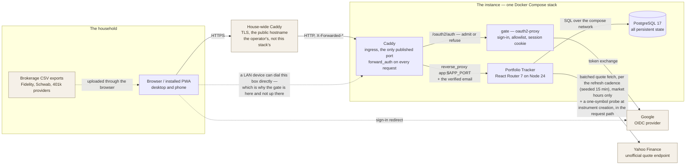
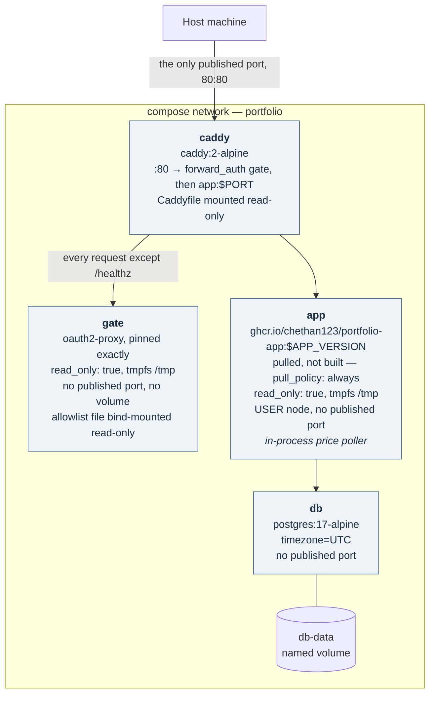
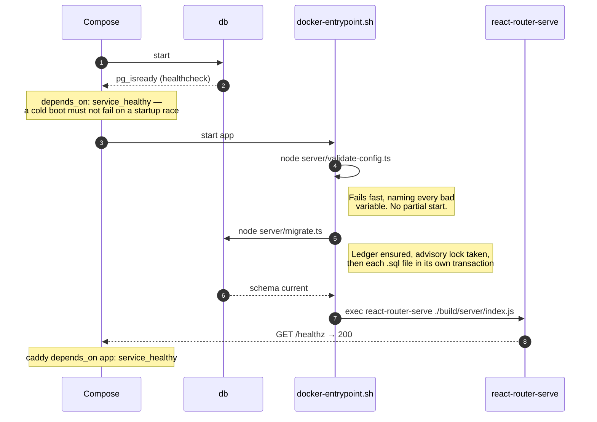
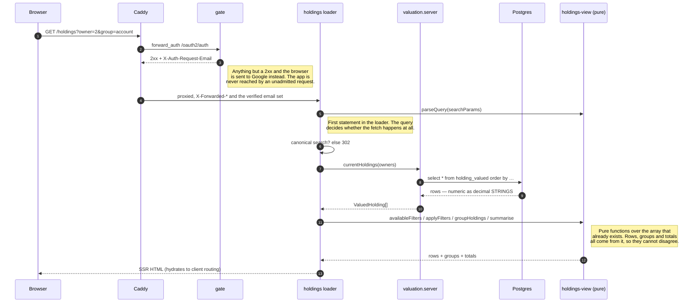
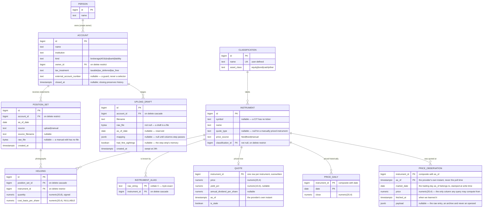
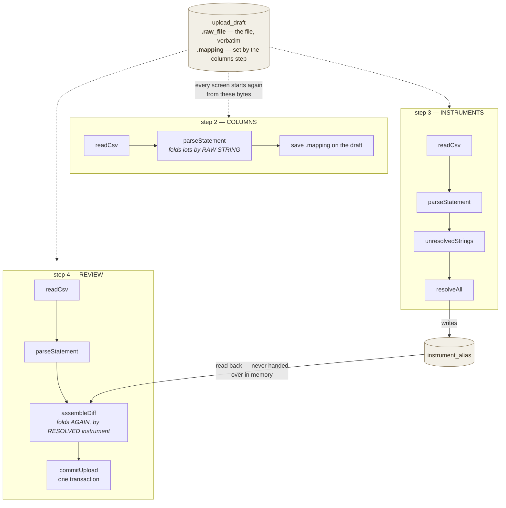
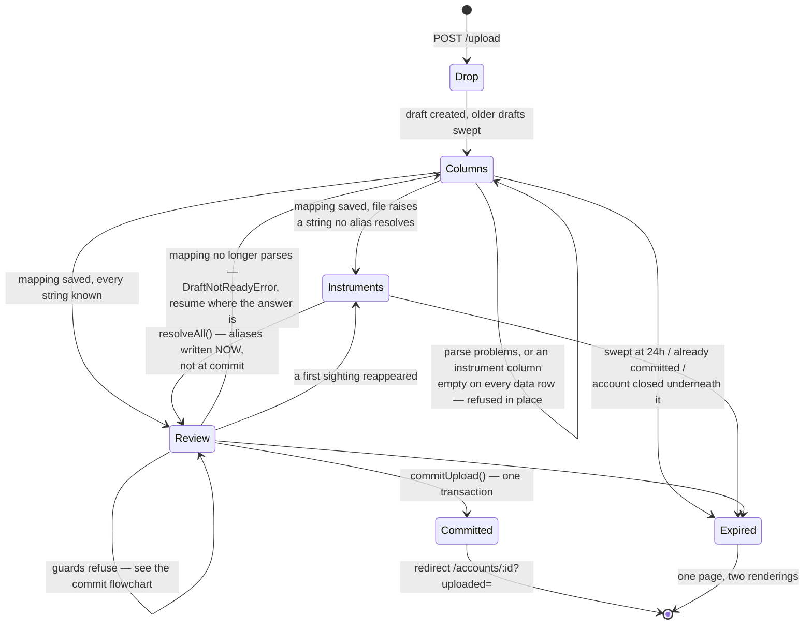
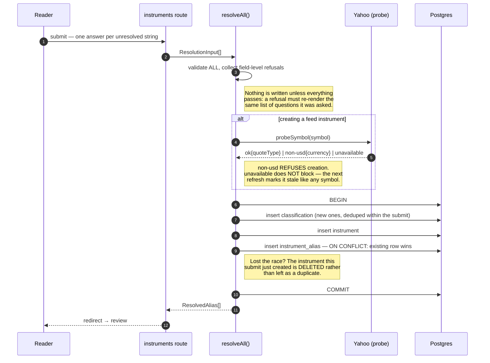
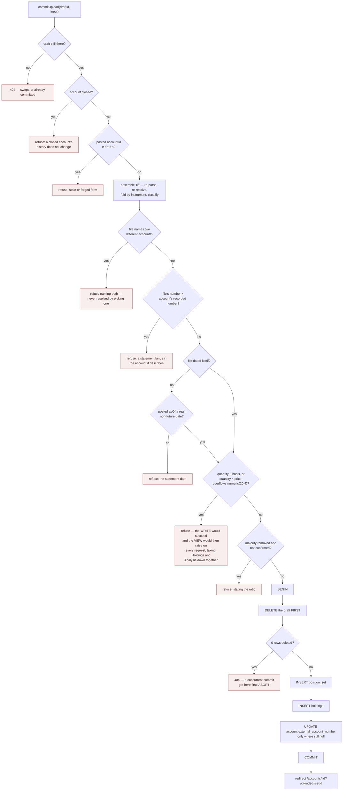
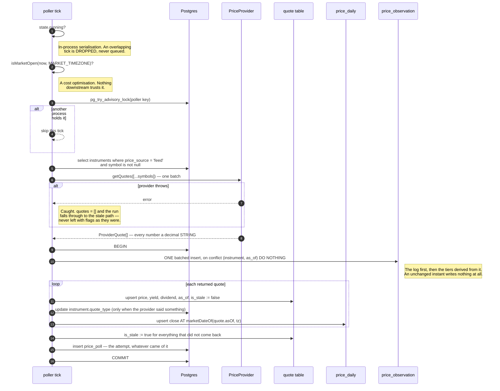

# Portfolio Tracker — Architecture

**An engineering reference for the system as built.** Where [DESIGN.md](DESIGN.md) records *what was
decided and why*, this document records *how the running system is put together*: its processes, its
layers, the shape of its data, and the paths a byte takes from a brokerage CSV to a figure on a
dashboard.

Everything below describes code that exists. Where a claim can be checked, it is anchored to a file
and a symbol.

---

## Contents

1. [How to read this document](#1-how-to-read-this-document)
2. [System context](#2-system-context)
3. [Deployment architecture](#3-deployment-architecture)
4. [Runtime architecture](#4-runtime-architecture)
5. [Data architecture](#5-data-architecture)
6. [Dataflows](#6-dataflows)
7. [Cross-cutting concerns](#7-cross-cutting-concerns)
8. [Build, release, run](#8-build-release-run)
9. [Testing architecture](#9-testing-architecture)
10. [Performance and scale envelope](#10-performance-and-scale-envelope)
11. [Known weaknesses and evolution paths](#11-known-weaknesses-and-evolution-paths)
12. [Appendix A: module map](#appendix-a-module-map)
13. [Appendix B: glossary](#appendix-b-glossary)

---

## 1. How to read this document

The repository carries four kinds of document, and they answer different questions. Reaching for the
wrong one is the usual way to end up re-litigating a settled decision:

| Document | Question it answers | Authority |
|---|---|---|
| [DESIGN.md](DESIGN.md) | *Why is it like this?* Domain model, scope, rejected alternatives, design tokens. | Authoritative on **decisions**. |
| **ARCHITECTURE.md** (this) | *How is it put together?* Processes, layers, schema, dataflow, invariants. | Authoritative on **structure**. |
| [`docs/specs/`](docs/specs) | *What was this slice asked to do?* One document per slice, written before the code. | Authoritative on **acceptance**. |
| [`docs/design/`](docs/design) | *What should the screen look and behave like?* UI briefs. | Authoritative on **screen behaviour**. |

This document does not restate DESIGN.md's reasoning. Where a structural fact exists because of a
decision, it cites the section — `§4.1`, `§6.2` — and moves on.

**A note on the source.** This codebase argues its decisions in module headers rather than in commit
messages. Almost every non-obvious choice below has a paragraph of prose above it in the file that
implements it, and those headers are the primary source. If this document and a module header ever
disagree, the header is nearer the code and probably right; fix this document.

---

## 2. System context

One household, one instance, one database. There are no tenants, no external consumers, and exactly
one third-party dependency the *application* talks to.



**External dependencies, in full.** Two, and they belong to different components. **Yahoo Finance**
is the application's, and its only one: no email, no object store, no queue, no cache tier, no
analytics. It is reached two ways — the poller's batched refresh, which is off the request path
entirely, and `probeSymbol`, a single-symbol currency check that runs *inside* a form submission when
someone creates a feed-priced instrument (§6.1). The second is the only place a third party can make
a person wait. Both go through the one interface in §7.5, precisely because the endpoint is
unofficial and expected to break. **Google** is the `gate` service's, and the app never speaks to it:
the browser is redirected there to sign in and the sidecar exchanges the code for a token, both
outside the app process entirely. That seam is what keeps "an identity provider" out of the
application's dependency list while the instance still has one.

**Trust boundaries.** Marked here because §7.6 depends on them:

| Boundary | Crossing | Trusted? |
|---|---|---|
| Browser → Caddy | HTTP request, the gate's session cookie | No. The gate decrypts the cookie itself and re-checks its address against the allowlist on every request; every form input is re-validated server-side. |
| House proxy → Caddy | `X-Forwarded-*` | Believed, bounded by `trusted_proxies static private_ranges` in the `Caddyfile`. The honest reading: **any LAN peer can forge these headers**, because this repository cannot know the operator's proxy address. See below for why that is affordable. |
| Caddy → gate | `X-Forwarded-*`, `X-Real-IP`, `X-Forwarded-Uri` | **Yes, unconditionally.** The sidecar runs in reverse-proxy mode and builds its sign-in redirects from them, which is why `gate` publishes no port. |
| Caddy → app | `X-Forwarded-*` and `X-Auth-Request-Email` | **Yes, unconditionally** — which is why `app` publishes no port. The trust costs nothing today: the app reads none of these (§7.6), and `copy_headers` replaces any client-sent email header with the gate's own, so a browser cannot assert an identity. |
| app → Yahoo | JSON quote payload | No. Parsed through Zod, currency-guarded, floats converted at the boundary. |

**Why a forgeable forwarded header is affordable.** Nothing downstream *authorises* on one. The
gate's verdict comes from a session cookie it decrypts itself, and the origin it sends people back
to is pinned in `compose.yaml` rather than read off a `Host` header. What a forged header can still
reach is the *cosmetics* of a sign-in redirect and whatever Caddy logs as the client address — not
admission. That is the trade this repository makes deliberately: naming the operator's proxy address
would be a guess, and `private_ranges` states the real bound instead of pretending to a narrower one.
An operator who knows their proxy's address can narrow it in one line.

---

## 3. Deployment architecture

The deliverable is one application image plus a Compose file. `docker compose up -d` on a fresh
machine with an empty volume produces a working instance once the gate's Google credentials exist,
and **refuses to start until they do** — the required gate variables use Compose's `${VAR:?}` form,
which is evaluated before any container runs (DESIGN.md §10.1). Fail-closed replaced an older
no-manual-steps promise that was kept by booting an unprotected instance.
The image is pulled from GitHub Container Registry rather than built on the host: CI publishes a
multi-architecture image on a `v*` tag, and `compose.yaml` deliberately carries no `build:` stanza
so a deployment cannot silently become a build (§8.2).

### 3.1 Topology



Each service is a decision rather than an accident:

- **No worker container.** The quote refresh loop runs inside the `app` process
  (`app/lib/price-poller.server.ts`). DESIGN.md §10 chose this for "one process to deploy, one place
  to read logs", and accepts the trade-off: a restart mid-session misses a poll until the next tick.
- **A separate `gate` container, and enforcement in *this* stack's Caddy.** Authentication is one
  sidecar answering `forward_auth`, not code in the app (ADR-0005). It sits here rather than in the
  operator's house-wide proxy because a LAN device can dial this box's published port and land on
  this Caddy directly — and that device is the threat the gate exists for.
- **No published port on `app`, `db` or `gate`.** Only `caddy` is reachable from the host. This is
  what makes the forwarded-header trust safe (§7.6), keeps the database credentials off the LAN, and
  is the *whole* reason the gate cannot be walked around: there is no route to `app` that does not
  pass the door where the check happens.
- **One named volume.** `db-data` holds every byte of persistent state, so there is exactly one
  backup target — `pg_dump`, documented rather than built in.

The `app` container is `read_only: true` with a `tmpfs` at `/tmp`, and `gate` is the same. That is
enforcement, not intention: it is a statement that neither writes anything to its own filesystem and
that either can be destroyed and recreated freely. It holds for the gate because its sessions live
in an encrypted cookie in the browser — a sidecar with a session database would need a volume, and
this one does not have one.

### 3.2 Startup sequence

`docker-entrypoint.sh` runs three steps under `set -eu`, each to completion before the next begins.
The ordering is load-bearing: either of the first two exiting non-zero stops the script, and the
server is never reached.



**Why migrations run in the entrypoint rather than as a one-shot service.** No request is ever served
against a half-migrated schema. Migrations are idempotent — the runner skips what the
`schema_migrations` ledger already records — so a restart is always safe.

**Why `/healthz` also checks migrations.** A migration on disk that the database has no record of
means the image and the database disagree: the instance is running, but it is serving pages against a
schema older than the code reading it. `app/routes/healthz.ts` returns 503 for that, and Compose's
healthcheck gates `caddy` on it.

### 3.3 Configuration surface

Every setting is an environment variable, and `server/config.ts` is the only module that
*interprets* one. Callers hand the environment in — `loadConfig(env)` is pure — so
`validate-config.ts:12`, `migrate.ts:24` and `scripts/seed-demo.ts:1140` pass `process.env` without
knowing what is in it, and `getConfig()` is the single place a value is actually read and cached. It
is a Zod schema, parsed once. It carries no cross-field rules: the one it used to have coupled the
deleted password to the deleted cookie secret, and every remaining variable stands alone.

| Variable | Default | Required | Effect |
|---|---|---|---|
| `DATABASE_URL` | — | **yes** | Postgres connection URI; validated as one. |
| `AUTH_GATE` | `none` | no | `external` or `none`: whether something in front of the app authenticates. It enables nothing — the app authenticates nobody either way — and decides only whether the unprotected-instance banner is drawn. A union rather than a boolean so a third posture is a value, not a redesign. |
| `PORT` | `3000` | no | HTTP listen port, 1–65535. |
| `MAX_UPLOAD_MB` | `10` | no | Upload body cap. **Not wired through `compose.yaml`** — under the documented deployment it is permanently 10 MB (§11.3). |
| `MARKET_TIMEZONE` | `America/New_York` | no | Market-hours calculation and trading-day attribution. Validated as an IANA zone. |
| `TZ` | `UTC` | no | Container clock. The database stores UTC regardless. |

More variables exist that the application never reads, all Compose-level and none of them validated
by `server/config.ts`, which never sees them. **`POSTGRES_PASSWORD`** is consumed by the `db`
service and must be kept in sync with the credentials inside `DATABASE_URL`. **`APP_VERSION`**
selects the published image tag the `app` service runs, defaulting to the floating major. **The
gate's own settings** — its Google client id and secret, its cookie encryption key, and `PUBLIC_ORIGIN`, the
`https://` origin the house proxy serves and the gate builds its redirect from — configure the
`gate` service. They are the only settings anywhere with no default, and they are interpolated
with `${VAR:?}` so a missing one stops `docker compose up` naming it, before any container runs. Who
may enter is not a variable at all: it is `allowed-emails.txt`, bind-mounted into `gate` with
`create_host_path: false`, so a missing file stops `up` the same way rather than becoming an empty
directory and a crash-looping sidecar.

Two properties of this module are structural rather than cosmetic:

- **Pure and side-effect free.** `loadConfig(env)` neither reads `process.env` nor exits. That is
  what lets the same module be bundled into the server build by Vite *and* executed directly by
  Node's type stripping from `server/validate-config.ts`, from a runtime image containing no source
  tree.
- **Empty string reads as unset.** `FOO=` in a `.env` file, or an unsubstituted Compose variable,
  must not read as "configured to empty".

The settings that are deliberately *not* environment variables are the household's own: the capital
gains rate, the masking policy and the refresh cadence, each a column on the single-row
`app_setting` table. They are the household's numbers rather than descriptions of the deployment,
and the person who wants one changed is the person reading the screen — not the person with a shell
on the container (`migrations/0005_app_setting.sql`; `0008_refresh_cadence.sql` for why the
cadence's old `PRICE_POLL_INTERVAL_MINUTES` variable was removed outright rather than kept as a
fallback).

---

## 4. Runtime architecture

### 4.1 One process, four layers

The application is a single Node process serving server-rendered React through React Router 7. There
is no separate API tier: a screen's loader calls a domain module directly, in the same process, and
the framework handles serialisation.

```
┌──────────────────────────────────────────────────────────────────────────────┐
│  ROUTES            app/routes/**                                             │
│                    loaders, actions, components                              │
│                    ── thin translators ──                                    │
│  Read a form, hand raw fields to a domain function, render whatever comes     │
│  back. A route never imports Zod and never states a domain rule.              │
└────────────────────────────────┬─────────────────────────────────────────────┘
                                 │
┌────────────────────────────────▼─────────────────────────────────────────────┐
│  DOMAIN            app/lib/*.server.ts                                       │
│                    accounts · people · positions · balances · uploads        │
│                    instrument-resolution · prices · settings · auth          │
│  Every rule about what may be written and what a refusal says. Returns        │
│  ValidationError with a message per field, never a 500.                       │
└──────┬─────────────────────────────────────────────┬─────────────────────────┘
       │                                             │
┌──────▼────────────────────────────┐  ┌─────────────▼─────────────────────────┐
│  QUERY LAYER                      │  │  PURE DOMAIN   app/lib/*.ts           │
│  app/lib/valuation.server.ts      │  │  money · statement · csv              │
│  The ONLY reader of holding_valued│  │  holdings-view · allocation           │
│  for valuation purposes.          │  │  market-hours · format                │
│  A translation layer, not a       │  │  No database, no request. Every        │
│  service: no caching, no rules.   │  │  awkward file is a fixture.           │
└──────┬────────────────────────────┘  └───────────────────────────────────────┘
       │
┌──────▼───────────────────────────────────────────────────────────────────────┐
│  SQL               migrations/*.sql                                          │
│                    holding_valued · holding_valued_at(d) · latest_position_set│
│  Every valuation rule lives here, in SQL, where the arithmetic is exact.      │
└──────────────────────────────────────────────────────────────────────────────┘
```

**The layering rule that matters most:** *the arithmetic goes down, never up.* Money is multiplied and
summed in SQL at `numeric` precision. When a figure has to be combined in JavaScript — a subtotal
under a grouped table, a percentage — it goes through `app/lib/money.ts`, which works on `BigInt`
counts of the last decimal place. Nothing adds a money value except through `money.ts`'s units.

### 4.2 Single-site invariants

A recurring shape in this codebase: a hazard is contained by making exactly one place able to cause
it. These are the ones worth knowing before changing anything — but they are not all the same kind of
guarantee, and treating them as one kind is how a reader ends up disproving the table with a single
grep. They come in three tiers.

**Enforced by structure — a second site is not reachable without deleting the first.**

| Invariant | The one site | What a second site would cost |
|---|---|---|
| Postgres pool construction | `server/db.ts:62` | The `numeric`/`int8`/`date` type-parser override is registered here. A second pool is a code path where money is a rounding float. |
| Importing `yahoo-finance2` | `app/lib/price-provider.server.ts:388` | The provider swap stops being a day's work. The interface is also the test seam. |
| Writing a price | `app/lib/prices.server.ts` | A second writer that files a quote under today's date instead of the quote's own trading day (§6.2). |

**Owned by a module, upheld by its callers.**

| Invariant | The owner | The obligation |
|---|---|---|
| Reading the environment | `server/config.ts` | `loadConfig(env)` is pure; `getConfig()` is the one place `process.env` is actually read and cached. Three callers pass `process.env` in — `validate-config.ts`, `migrate.ts`, `scripts/seed-demo.ts` — and none of them reads a variable itself. |
| The upload size cap | `app/lib/uploads.server.ts` | The module owns the cap and the file handling, but the multipart body is read in the route (`app/routes/upload.tsx:48`), which must call `refuseOversizedBody` first. Every other action goes through `formFields`, which drops file parts by design. |
| Everything read off an account's kind | `app/lib/account-options.ts` | The kinds, their labels, and the two predicates derived from them — which kinds hold their whole position in one number, which run negative — are written once, here, so none of them can drift from the schema's check constraints or from each other. The obligation is that it stays plain data: the client bundle imports it, so a rule needing a query cannot live here. |
| What an account actually holds, asked at a write | `app/lib/current-statement.server.ts` | `kind` is a label and the rows are the fact, and the two writers that can act on the difference ask this module rather than believing the label: `setBalance` before it replaces a whole statement with one figure, `updateAccount` before it relabels an account as one that holds a single balance. It resolves the seeded `USD` row itself and returns the id, so a caller cannot answer the guard from one row and write to another. |

**Shared primitives, with exceptions that are documented rather than denied.**

| Invariant | The primitive | The exceptions |
|---|---|---|
| Money representation and its rounding | `app/lib/money.ts` | Five modules do `BigInt` arithmetic on `money.ts`'s units, which is the intent. What is meant to exist once is the *rounding rule*, and it is spelled twice: `positions.server.ts:276` rounds the overflow-guard product inline instead of calling `divide`. |
| Valuing holdings | `app/lib/valuation.server.ts` over `holding_valued` | Two, both real (below). The failure this guards is the one DESIGN.md §8.2 names as the weakest point in the design: two pages showing different totals, with no error anywhere. |
| Whose money a screen is reading | The readers' own signatures — the **owner filter** is a required first argument with no default on every household-scoped read (ADR-0008, and Appendix A on where the narrowing then goes) | The account-scoped readers, which do not take it because an account already has exactly one owner, and `manualNetWorth` and `latestObservedSession`, which are out for their own reasons — both given in `manualNetWorth`'s own docstring, where the line falls. The argument cannot make the filter impossible to skip — a new screen can pass `ALL_OWNERS` and draw no control — only **visible in review** rather than invisible by omission, which is the most a signature can do. The same trick, for the same reason, as the chart's required `masked` prop. |

**The two valuation exceptions, stated rather than buried:**

- `prices.server.ts:520` (`priceFreshness`) selects from `holding_valued` — not to value anything, but
  to scope the "as of" line to instruments held in an open account, filtered to `price_source =
  'feed'`. It reads `quote.as_of` and counts distinct instruments; it computes no money.
- `uploads.server.ts:620` (`valueAt`) computes `quantity × price` **in JavaScript**, for the review
  diff's Value column — a row the account does not hold yet has no `holding_valued` row to compute it
  in. It deliberately mirrors the view's digits (units of 10⁻¹² divided back to 10⁻⁴, half away from
  zero) and is never summed into a total. This is the one place a valuation figure is produced outside
  the view, and it is worth watching.
- `valuation.server.ts:697` (`readSessionSeries`) values holdings from `price_observation` rather
  than through `holding_valued` — the 1D chart's line, and the only valuation anywhere that reads the
  observation log. Not an escape from the invariant but an extension of it: the same module owns
  both, so the rule stays "one module values holdings" rather than becoming "one view does". It
  hand-writes the join to `holding` that §11.1 warns about, because no view can express "priced at
  an instant", and it earns that by living beside the readers it must agree with — the last point of
  its line and `netWorth()` are the same figure by construction (ADR-0006). A screen writing its own
  join over `price_observation` has left the mitigation exactly as one over `holding` has.

### 4.3 The `.server` convention

React Router's Vite plugin excludes `*.server.ts` from the client bundle. The suffix therefore marks
a real boundary, not a naming preference:

- `*.server.ts` may import the database, the config, and Node built-ins.
- `*.ts` in `app/lib` must be safe in a browser bundle. `allocation.ts` and `holdings-view.ts`
  import `ValuedHolding`, and `account-options.ts` imports `AccountKind`/`TaxTreatment`, from
  `valuation.server.ts` — all **type-only imports**, which are erased at compile time and pull no
  server code across. That is what lets a
  screen component call `allocationByPerson()` directly on loader data.

**One file breaks this today.** `app/lib/statement.ts:32` imports `recordedDate` from
`input.server.ts` as a **value**, not a type, and uses it at `:608`. It stays out of the client bundle
only because `parseStatement` is reachable from loaders and actions alone and is tree-shaken away;
nothing enforces that. A component-side call to `parseStatement` would drag `input.server.ts` across
the boundary. Worth fixing before that happens rather than after.

### 4.4 Request lifecycle

A representative read — `GET /holdings?owner=2&group=account` — end to end. The parameter order
matters: `toSearch` builds a canonical search string, and a URL that does not match it is bounced
before any database work happens (`holdings.tsx:119`), so `?group=account&owner=2` would 302 first.



Three properties of this path are deliberate:

1. **The gate is in front of the process, not inside it.** There is no authentication middleware and
   no open list in the app; a request that reaches a loader has already been admitted at the front
   door. Everything the app serves is behind it, static assets included — which the in-app gate this
   replaced could not manage, because assets are served ahead of the router. A route added by a later
   slice is protected the moment it exists, and nobody has to remember to protect it. See §7.6.
2. **Filtering and grouping are pure functions over one array**, not seven new SQL predicates. The
   screen's table and the subtotals under it are computed from the same rows, so agreement is
   structural rather than something to keep true. Nothing the table displays costs a second query;
   an open `?edit=` row costs exactly one more read (`holdings.tsx:196`), for the date the correction
   will be filed under.
3. **Numbers never become numbers.** The rows leave Postgres as decimal strings and stay that way
   through grouping, subtotalling and rendering.

### 4.5 Write paths

Five operations produce **history** — the position sets every figure is computed from, and the
vocabulary that makes them readable. All five append; none rewrites a past fact.

| Operation | Module | Writes | Append-only? |
|---|---|---|---|
| Commit an upload | `uploads.server.ts` → `commitUpload` | `position_set` + `holding`s, deletes the draft, captures `account.external_account_number` when still null | Yes — a new set |
| Set a balance | `balances.server.ts` → `setBalance` | `position_set` + one `USD` `holding` | Yes — a new set |
| Correct a position | `positions.server.ts` → `revisePosition` | `position_set` + the whole account copied forward with one row changed | Yes — a new set |
| Resolve an instrument | `instrument-resolution.server.ts` → `resolveAll` | `classification`, `instrument`, `instrument_alias` | Yes, with one compensating delete: an instrument that loses the alias race is removed rather than left as a duplicate (`instrument-resolution.server.ts:663`) |
| Refresh quotes | `prices.server.ts` → `refreshQuotes` | `quote` (upsert), `price_daily` (upsert), `instrument.quote_type` | No — the intraday tier is overwritten by design |

**This is not every write in the application.** The management surface updates rows in place, as
CRUD should: `accounts.server.ts:246` edits an account and `:362` closes one, `people.server.ts:113`
renames a person and `:148` deletes one outright when they own no accounts, `settings.server.ts:88`
writes the tax rate, `column-mapping.server.ts:96` upserts a saved mapping, and `uploads.server.ts`
inserts, updates and sweeps drafts. The append-only rule is a rule about **history**, not about the
database: a position set, once written, is never edited, because `holding_valued_at` reads it for
every date the chart plots.

**Why append-only is not a preference.** An `update holding set quantity = …` would not correct a
number — it would silently restate every figure back to the date of the statement that row landed in.
Your March net worth would move because you fixed an August typo, with nothing on any screen saying
so (`positions.server.ts` header).

**Why a correction carries the whole account forward.** A position set is a photograph of everything
an account holds, so "a missing row means sold" (DESIGN.md §5.2). A set containing only the corrected
row would record every other security in the account as sold. `revisePosition` therefore copies the
old set across verbatim with one row changed.

---

## 5. Data architecture

### 5.1 The one valuation rule

Everything in this schema exists to make one sentence true without exception (DESIGN.md §2):

```
value = quantity × price        summed over every holding in the system
```

Everything on the balance sheet is a position, including cash and debt:

| Thing | Instrument | Quantity | Price | Value |
|---|---|---|---|---|
| 100 shares of VTI | `VTI` | `100` | `250.00` | `25,000` |
| Brokerage sweep cash | `USD` | `3,000` | `1.00` | `3,000` |
| Checking account | `USD` | `12,500` | `1.00` | `12,500` |
| Personal loan | `USD` | `−8,000` | `1.00` | `−8,000` |

**The sign lives in quantity, never in price.** A price is a positive market fact; a negative quantity
is the standard encoding for a liability. The structural consequence is that **net worth is a single
`SUM` with no branches** — no `is_liability` column, and no branch for cash or debt in the view, the
as-of function, or any total.

There is exactly one place the sign is read: the allocation denominator. A slice's share is computed
against the gross *positive* total rather than the net, because $8,000 of debt and $8,000 of assets
are not the same slice of anything (argued at `allocation.ts:45-52`, applied in `allocateShares` at
`:216-250`), and the Analysis screen prints that caveat to the reader.

Four seed rows in `migrations/0001_initial_schema.sql` are what make this hold end to end: a `Cash`
classification, a `USD` instrument with `price_source = 'fixed'`, a `quote` of `1.00`, and — the
load-bearing one — a `price_daily` row for `USD` dated **1970-01-01**. Because the as-of function
carries the last close forward, that single row resolves USD to `1.00` for every date the system will
ever be asked about, including statements dated before the app was installed.

### 5.2 Entity relationships



These tables stand outside the graph because they reference nothing:

| Table | Shape | Purpose |
|---|---|---|
| `manual_networth` | `date` PK, `amount numeric(20,4)` | Hand-typed points covering the period before the app existed. Computed values always win on overlapping dates. |
| `column_mapping` | `id bigint PK`, unique `(institution, header_fingerprint)`, `mapping jsonb` | How a brokerage's export format is remembered once and applied to every later file. |
| `app_setting` | `id boolean PK check (id)`, `capital_gains_rate numeric(9,6) default 23.8 check (0–100)`, `masking_policy text default 'masked' check (masked / unmasked / as_last_left)`, `refresh_cadence_minutes integer default 15 check (1–1440)` | Singleton, enforced by the schema. A second row is a constraint violation, not a silent ambiguity. |
| `price_poll` | `id bigint PK`, `started_at timestamptz`, `requested`/`priced`/`stale integer` | One refresh attempt, recorded whether or not any observation resulted. Deliberately references no instrument: it describes the attempt, not a price. |
| `schema_migrations` | `filename` PK, `applied_at` | The migration ledger. Created by the runner, since it must exist before anything else. |

### 5.3 What deletion does — the history policy, read off the FKs

`ON DELETE` is where "nothing is ever deleted" stops being a promise and becomes a constraint. The
split is exact and each side is a decision:

| Referencing → referenced | Action | Why |
|---|---|---|
| `account.owner_id` → `person` | `RESTRICT` | A person owning accounts cannot be removed out from under them. |
| `position_set.account_id` → `account` | `RESTRICT` | A position set is **history**. It must survive anything. |
| `holding.instrument_id` → `instrument` | `RESTRICT` | An instrument something was ever held as cannot vanish. |
| `instrument.classification_id` → `classification` | `RESTRICT` | Not-null, so a row would be orphaned. |
| `holding.position_set_id` → `position_set` | `CASCADE` | Holdings have no meaning apart from their set. |
| `instrument_alias.instrument_id` → `instrument` | `CASCADE` | An alias is vocabulary about a row that no longer exists. |
| `quote` / `price_daily` / `price_observation` → `instrument` | `CASCADE` | Prices for a nonexistent instrument. The observation log is append-only and never pruned, but it is not history in the sense a position set is: it describes an instrument, and an instrument that never existed was never quoted. |
| `upload_draft.account_id` → `account` | `CASCADE` | A draft is **scaffolding**, not history. A half-finished upload into a gone account stages nothing. |

**Only two of those deletes are reachable from the application at all:** a person who owns no
accounts (`people.server.ts:178`), and a just-created, never-held instrument that lost an alias race
(`instrument-resolution.server.ts:663`). There is no account delete and no position-set delete
anywhere in `app/`. The rest of the table is a standing guarantee about someone with a `psql`
session, not about a screen.

Retirement is `account.closed_at`, never a delete. `holding_valued` excludes closed accounts;
`holding_valued_at(d)` includes them for the dates they were open (`closed_at is null or closed_at >
d`), so history before a closure is preserved and today's figures are not polluted.

### 5.4 The derived layer

Three SQL objects sit between the tables and every screen. They are the mitigation for the failure
DESIGN.md §8.2 names as the weakest point in the whole design.

```
             latest_position_set(p_account_id, p_as_of default null)
                    ── the tie-break, defined once in SQL ──
                    order by as_of_date desc, created_at desc, id desc
                    limit 1
                              │
              ┌───────────────┴────────────────┐
              │                                │
    holding_valued (VIEW)          holding_valued_at(d date)
    latest_position_set(a.id)      latest_position_set(a.id, d)
    closed_at is null              closed_at is null or closed_at > d
    price := quote.price           price := last price_daily close ≤ d
    is_stale := coalesce(          is_stale := false
      quote.is_stale, false)
              │                                │
              └───────────────┬────────────────┘
                              │
                    returns setof holding_valued
                    ── ONE row type, not two ──
```

**`latest_position_set(p_account_id, p_as_of)`** — `stable`, one function, one ordering. "Latest" is
`max(as_of_date)` per account, tie-broken by `created_at desc` then `id desc`. Re-uploading a
correction for an as-of date that already has a set is a real occurrence; without the tie-break the
answer is a coin flip. Surrogate keys are `bigint generated always as identity` precisely so that
"tie-break by id descending" means "the later insert wins" — a random UUID would make it arbitrary.
The ordering matches `position_set_account_as_of_idx` exactly, so this is an index scan stopping at
the first row.

One caller re-states that ordering on purpose. `uploadReceipt` (`uploads.server.ts:1157`) needs the
*predecessor* of a given set — "what did this account hold before this upload landed" — which the
function cannot express, so it repeats the `order by` with a citation back to it. That is the only
second copy, and it is the exception that keeps "defined once" meaningful rather than aspirational.

**`holding_valued`** — a plain, **non-materialised** view. Data changes on upload, a household's
portfolio is small, and a materialised view would introduce a refresh step whose omission shows up as
silently stale totals. It exposes account, owner, institution, kind, tax treatment, instrument,
classification and asset class alongside the numbers, so every dashboard grouping is available with
no additional join.

**`holding_valued_at(d date)`** — a set-returning function, because a plain view cannot be
parameterised. Critically it is declared `returns setof holding_valued`, so it has *literally the
view's row type*: adding a column to the view forces this to move with it. It is not a second
definition of "holdings, valued"; it is the same definition varying only what must vary.

Four rules are encoded in the view, and each one is a refusal to understate:

1. **`LEFT JOIN quote`.** An instrument that has never been priced yields a null price and a null
   value and the row **still appears**, carrying `is_priced = false`. An inner join would make the
   holding vanish from every total silently.
2. **Null propagates through `unrealized`.** `value - cost_basis` is null when either side is null.
   Nothing coalesces a null cost basis to zero — that would report a fake gain equal to the entire
   untracked position.
3. **A stale price is used, not discarded.** `is_stale` is carried through where a price exists; the
   last known value beats a zero or a null. A holding with no `quote` row at all comes back
   `is_stale = false`, not null — `coalesce(q.is_stale, false)` — because unpriced is not stale.
   Staleness is a property of a price that exists.
4. **Rounded to the money scale exactly once.** `quantity × price` carries scale 12 and is cast back
   to `numeric(20,4)` in a named `cross join lateral`, so `unrealized` is literally `value -
   cost_basis` rather than a second rounding of a second expression that could disagree by a fraction
   of a cent.

The carry-forward in `holding_valued_at` is what removes the calendar from the read path entirely.
Non-trading days get no `price_daily` row at all (§6.2), so a Saturday resolves to Friday's close, a
Sunday to the same Friday, and a market holiday to the trading day before it — with no calendar table
anywhere.

### 5.5 Indexes, and what each one is for

| Index | Definition | Serves |
|---|---|---|
| `position_set_account_as_of_idx` | `(account_id, as_of_date desc, created_at desc, id desc)` | `latest_position_set` — matched exactly, so the tie-break is an index scan stopping at row one. The index every valuation read goes through. |
| `holding_one_row_per_instrument` | unique `(position_set_id, instrument_id)` | The lot-folding contract: a statement exporting one fund as three tax lots must arrive as **one** holding (`foldLots` in `statement.ts`). |
| `holding_instrument_id_idx` | `(instrument_id)` | The instrument → holdings direction: which accounts hold this fund. |
| `instrument_symbol_idx` | `(symbol)` | Resolving which row is cash (`current-statement.server.ts:80-86`) — on every `setBalance` write, and on every kind change into a kind that holds one balance. The lookup conjoins `price_source = 'fixed'`, which no index covers; `symbol` is the selective half. Also the refresh loop's `order by symbol`, which never looks a symbol up by value — it selects all feed instruments and matches in memory. |
| `instrument_alias_instrument_id_idx` | `(instrument_id)` | Which raw strings point at this instrument. |
| `account_owner_id_idx` | `(owner_id)` | Grouping by person. |
| `instrument_classification_id_idx` | `(classification_id)` | Grouping by classification and asset class. |
| `upload_draft_created_at_idx` | `(created_at)` | The 24-hour draft sweep. |
| `column_mapping_one_per_fingerprint` | unique `(institution, header_fingerprint)` | One saved mapping per exact header, per institution. |
| `price_daily_pkey` | `(instrument_id, date)` | The carry-forward lateral in `holding_valued_at` — an index scan stopping at the first row, executed once per holding per plotted date. |
| `price_observation_pkey` | `(instrument_id, as_of)` | Two jobs. It is the dedup: an unchanged quote conflicts and writes nothing, which is what keeps the log a record of distinct instants rather than of polls. And it is matched exactly by the 1D reader's "latest observation at or before this instant" lateral, once per holding per plotted instant. |
| `price_observation_market_date_idx` | `(market_date, as_of)` | Session resolution, both halves: `max(market_date)` finds the most recent session observed at all (a backward index scan stopping at row one), and the leading-column range scan then walks that session's distinct instants in order. |

### 5.6 The numeric boundary

The single most consequential line of infrastructure in the codebase is in `server/db.ts:43-47`:

```ts
const STRING_TYPE_OIDS = [
  pg.types.builtins.NUMERIC,
  pg.types.builtins.INT8,
  pg.types.builtins.DATE,
] as const;
```

Three OIDs, for three different reasons. `NUMERIC` (1700) is the one that changes behaviour:
`node-postgres` parses `numeric` into a JavaScript number by default. A six-figure balance then
surfaces later as two dashboards disagreeing by cents, with no error anywhere. Registering the
override anywhere other than at pool construction would leave a code path that gets numbers — which
is why there is exactly one construction site (§4.2).

`DATE` (1082) is the same class of bug in different clothing: `pg` parses Postgres `date` into a JS
`Date` at *local* midnight, so formatting it back in any timezone west of UTC yields the previous day.
`position_set.as_of_date` shifting by a day would select the wrong position set, silently. `INT8`
(20) changes nothing — `pg` already returns bigints as strings — and is listed to make the guarantee
explicit rather than inherited, which is why every surrogate key crosses the boundary as a string.

`timestamp` and `timestamptz` are deliberately left alone. `created_at`, `closed_at` and
`quote.as_of` are genuine instants, compared in SQL rather than in JavaScript, and a `Date` is the
right shape for them.

What that means for a value crossing the system:

```
Postgres numeric(20,4)  ──▶  "12345.6700"  ──▶  toUnits(s, 4) → 123456700n
        ▲                     decimal string        BigInt count of the last place
        │                     (the VALUE, not a           │
        │                      rendering of it)           │  add / divide / compare
        │                                                 ▼
        └── SQL arithmetic ◀── never re-enters      render(units, 4) → "12345.6700"
            (the default)      as a number                 │
                                                           ▼
                                              format.ts → "$12,345.67"
                                              (renders, never computes)
```

Three rules follow, and the codebase holds all three:

- **Never `Number()`, `parseFloat`, or JSON round-trip a money value.** Almost every `Number()` call
  in `app/lib` is on a cardinality — a row count, a header index, a clock minute. There are exactly
  two deliberate exceptions, and both are narrow enough to state: `format.ts:203` (`toPlotValue`)
  floats a money value to position a chart point, where the result is multiplied by a pixel height
  and rounded to a screen coordinate — never use it for a figure that is shown, compared or summed;
  and `price-provider.server.ts:172` floats a yield or a per-share dividend rate only to decide
  whether the column it is bound for can hold it, returning the original string when it fits and
  null when it does not.
- **Do the arithmetic in SQL, or on `money.ts`'s units.** There is no third option and no decimal
  library.
- **`format.ts` refuses to compute and `money.ts` refuses to format.** Neither does the other's job.

The generated types carry the **read** half of this: `npm run db:types` runs `kysely-codegen
--numeric-parser string --date-parser string` against the live database, including views, so a
`numeric` column selects as a `string`. Two caveats a reader needs:

- The generated `Numeric` is `ColumnType<string, number | string, number | string>` — the select side
  is a string, but an insert or update still *accepts* a JavaScript number. On the write path the
  rule is a convention, not a compile-time guarantee.
- Postgres reports every column of a view as nullable regardless of the underlying column, so
  `holding_valued` comes out entirely `| null`. That is why `valuation.server.ts:117-128` exists: a
  `required()` narrower that throws, wrapped around fourteen columns in `toValuedHolding`. The view is
  typed *from* a table, not typed *like* one.

CI verifies the committed types match the schema (`npm run db:types -- --verify`), which is what makes
regeneration after a migration mandatory rather than remembered.

---

## 6. Dataflows

### 6.1 Ingest — a brokerage CSV becomes a position set

The largest subsystem in the application, and the one where a wrong answer would be silent. It is
four screens, each a real URL with no client state, over one staging row.

#### The pipeline



**Nothing passes between steps in memory.** Each screen re-reads the draft's bytes, re-parses them
through the saved mapping, and re-resolves against the alias table. `resolveAll` is not a stage that
hands its output to the commit — it has one caller, the instruments route, and it communicates with
the commit only by having written rows into `instrument_alias`. That is what makes a reload, the back
button and a bookmarked half-finished upload all behave, and it is why the mapping records its own
delimiter rather than letting a second sniff reach a different verdict.

**Lots are folded twice, for different reasons.** `parseStatement` folds by the *raw string*, so three
tax-lot rows of one fund collapse into one position. `assembleDiff` (`uploads.server.ts:663`) folds
again by the *resolved instrument*, so two spellings of one fund — `FCASH` and `CASH & CASH
INVESTMENTS` — collapse once the alias table says they are the same thing. The parser cannot do the
second fold because it does not know about aliases.

Both parsing halves are **pure** — no database, no request — so every awkward file in existence is a
fixture and a test rather than a bug found on the review screen with a household's real statement in
hand. Six live in `tests/fixtures/statements/`: Fidelity, Schwab, a 401k, a liability, a lot-level
export, and a semicolon-delimited one.

Two invariants everything downstream leans on:

- **`readCsv` never throws on content.** Malformed UTF-8 becomes replacement characters, an
  unterminated quote runs to end of file, a stray quote mid-field is kept as a character. A file it
  cannot make sense of still yields rows for the caller to judge, so the refusal a reader eventually
  sees is a sentence about their statement — never a stack trace.
- **Row indices are stable.** Blank rows are *kept* in the row list, because a saved mapping's
  `headerRow` is an index into these rows. Dropping a blank line would silently shift every mapping
  made against a file after it.

**`parseStatement` returns refusals as data, not throws.** Each problem carries the row and the column
that caused it. The *column* is what the screen uses structurally — `problemFieldsOf`
(`columns.tsx:207`) marks the offending `<select>` as invalid, because remapping is the fix; the row
travels inside the message the reader sees ("on line 12"). A thrown error could name only the first
fault, and a screen cannot point at a stack trace.

Problems present means the file must not be committed. Whether anything is still returned depends on
what went wrong, and the distinction matters: a *row's* problem does not discard the rows around it,
so the screen has something to show beside the complaint. A problem with the **mapping itself** — a
required column not named, a column name the header row does not carry — returns no positions at all
(`statement.ts:322`), because nothing below it could be trusted. The second case is the ordinary
one: a saved mapping meeting a renamed column.

#### The step machine



**Where the draft got to is a property of the row, not a status column.** `mapping` is null until the
columns step passes; with one, the file's own strings decide between instruments and review.
`parseDraft` computes that in one place. `/upload/:draftId` matches two things: a layout
(`upload/draft.tsx` — the page title, the step strip, and the one expired-draft error boundary all
four steps throw into) and an index route with no page of its own (`upload/index.tsx`), whose loader
redirects to whichever step is still owed. Nothing renders at the bare address; a screen there would
be a fifth step nobody asked to stand on.

**A dead draft is one page, not four.** Swept, already committed, mistyped and
belonging-to-a-closed-account all reach the same expired-or-recorded boundary, because the reader's
next move — start again from `/upload` — is the same in every case. The one variation is deliberate: a
re-POSTed review knows which account the statement already landed in, so it throws
`data({ accountId }, { status: 404 })` (`review.tsx:100`) and that rendering adds a second link to the
account. Every other step throws a plain-string 404 and gets the single link.

#### Column mapping: how a brokerage is remembered

The key is `(account.institution, headerFingerprint)`. The fingerprint is SHA-256 over the header
row's cells: each trimmed, lowercased, internal whitespace collapsed, joined with U+001F, in file
order. Data rows never affect it, so the same export next quarter fingerprints the same however the
positions moved.

The two sensitivities are chosen in opposite directions, deliberately:

| Change to the header | Same fingerprint? | Consequence |
|---|---|---|
| `SYMBOL` retitled `Symbol` | **Yes** | A brokerage changing case has not changed what any column means. |
| Columns reordered | **No** | One re-map — cheaper than a mapping that silently follows a column that moved. |

`NOT_IN_FILE` (`"__none__"`) is a sentinel distinct from the empty string: "unset" and "not in this
file" are different answers, and only the deliberate one survives a save.

#### Instrument resolution: vocabulary, remembered forever

Lookup against `instrument_alias` is **byte-exact** — that is `collate "C"` doing its job. No
trimming, no case folding, no heuristics. A respelling is rightly a first sighting even when the
instrument is old news, because a heuristic that "helpfully" merged two near-identical strings would
attach a holding to the wrong fund silently. A miss prompts once and is remembered permanently.



**The writes happen at this step rather than at commit, deliberately.** An alias is a fact about
vocabulary, not about this statement, so re-uploading a corrected file must not ask the same
questions again. A draft abandoned after this step leaves the vocabulary behind, which is correct:
the next upload is quieter, and nothing was recorded as held.

There is deliberately **no skip**. A skipped row is a holding silently missing from the statement.

#### Commit: the flow's one write

`commitUpload` is the deepest function in the codebase — three parameters over an entry check, seven
guards and a transaction. The order is the design:



Three of those deserve emphasis:

- **The as-of guard is easy to miss** and sits in the middle of the run. When the file dates itself,
  that date is used; when it does not, the date the reader typed is validated here — not in
  `parseStatement`, which never saw it.
- **The product guard.** A product past `numeric(20,4)` does not fail the *write* — it succeeds, and
  then `holding_valued` raises on every request afterwards, taking Holdings and Analysis down
  together. Checking both multiplications before storing turns a site-wide outage into one sentence
  about one row.
- **Delete-first as the transaction's guard.** The draft's deletion leads: a concurrent commit that
  got here first has already taken the row, so `numDeletedRows === 0` aborts everything, and nothing
  before that point wrote anything. The entry check at the top is the cheap version of the same
  question; this one is the version that is safe under a race.

**The account number is a guard, never a selector.** A file naming an account different from the one
the draft targets is refused; it is never silently rerouted to the account it names. It is also
*captured*, inside the same transaction: when the account has no number recorded and the committed
file carries one, the commit writes it onto the account (`uploads.server.ts:1101-1105`, guarded by
`where external_account_number is null` so a concurrent upload cannot be overwritten). The guard arms
itself on the first upload, and every later statement is checked against it.

**Removals are listed in full, never counted.** A count alone is how a filtered export sells 28
holdings nobody read about. `UploadDiff.removed` carries every removed position individually, and a
majority removal demands an explicit tick.

### 6.2 Pricing — quotes into three tiers



A refresh writes five tables: the three tiers below, plus `price_poll` and `instrument.quote_type`
when the provider names one — the latter is what keeps the Analysis screen's stocks-versus-funds
split correct for instruments created before that column was filled in.

**The three tiers, and why the split exists** (ADR-0006 fixes the vocabulary: an observation is not
history and a quote is not a fact):

| Table | Cardinality | Lifecycle | Read by |
|---|---|---|---|
| `price_observation` | one row per instrument per provider instant | append-only, deduped, never pruned | `netWorthSessionSeries` / `accountSessionSeries` — the 1D line, and nothing else |
| `quote` | one row per instrument | overwritten in place | `holding_valued` — today's figures |
| `price_daily` | **at most** one row per instrument per trading day | the immutable spine | `holding_valued_at(d)` — every historical figure |

`quote` is deliberately **not** a projection of the log and is not derivable from it: the seeded
`USD` row that prices every bank balance and liability will never generate an observation, and
`is_stale` asserts the *absence* of one — something an append-only log cannot represent.

The whole write is one transaction, so a committed fetch is recorded in all of them or in none. The
one thing that does not follow from it: a refresh whose writes fail leaves no `price_poll` row
either, so the table separates a quiet market from a server that was not running, but not from a
refresh that ran and could not commit.

**`price_observation.payload` is an archive, never an operand.** The provider's raw entry is kept on
the same precedent that keeps every uploaded CSV in `position_set.raw_file` — an audit artifact that
may later be re-read, never computed from. `price` is the only column in that table any query may
compute from; a figure needed for arithmetic is promoted to a typed `numeric` column in its own
migration, because summing out of `payload` is precisely the §5.6 violation the numeric boundary
exists to prevent. The honest rationale for keeping it is option value, and no consuming feature
exists or is planned — a future reader should not go hunting for one.

**The single most important line in the pricing subsystem** is which date a close is filed under: *the
date inside the quote's own timestamp, in the market's zone — never today's date.* Two silent failures
follow from getting it wrong:

- A mutual fund strikes one NAV after the close. An afternoon poll sees yesterday's NAV still
  standing; filed under today it becomes a fabricated close for a day that has not finished, and
  tomorrow's poll files the real one a day late, permanently.
- A poll on a market holiday sees Friday's quote. Filed under the holiday it manufactures a row for a
  day the market did not trade — which history queries then read as real, because a real row and an
  absent one mean different things to the carry-forward.

Keyed on the quote's own instant, both cases collapse into rewriting the row that quote already owns.
This is the **trust asymmetry** that is `market-hours.ts`'s real interface:

| Function | Kind | If it is wrong |
|---|---|---|
| `isMarketOpen(instant, tz)` | cost optimisation | The poller wastes a handful of requests on Good Friday. Stored data is still correct. |
| `marketDateOf(instant, tz)` | **correctness mechanism** | A real price is written under the wrong date — a permanent error in the immutable spine. |

`marketDateOf` never consults the holiday calendar. That is why the calendar is allowed to be a
hardcoded five-year list rather than a rule engine: it decides whether to spend a request, never what
to store.

**Failure is a marked price, never a missing one.** A provider that throws — network failure, rate
limit, the unofficial endpoint changing shape — is the expected case. Left to propagate, the run would
end with every `is_stale` flag exactly as it was, so the UI would keep presenting last week's prices
as current. Instead the error is caught, the batch becomes empty, and every selected instrument falls
through the same path a symbol that did not come back takes: **the last known price is kept and used,
and the row is flagged.** Never zeroed, never nulled into a sum.

That holds for anything that has ever had a price. An instrument that has never been priced has no
`quote` row to flag, so the stale update touches nothing and it stays `is_priced = false` in the view
— which is the honest answer, and the one the coverage counts are built to report.

**The freshness line reports the *oldest* `as_of`, not the newest.** A portfolio where ninety-nine
instruments updated a second ago and one has been failing for a week would report itself current under
a newest-first reading — which is exactly the "silently showing yesterday's net worth as though it
were live" failure this application refuses. Two more properties of `priceFreshness` are load-bearing:

- It excludes `fixed` and `manual` sources. Every bank and loan account holds the seeded `USD` row,
  whose `as_of` is written once at install; without that filter the "as of" line would be pinned to
  the install timestamp forever. A hand-typed price is as fresh as the person who typed it, and a
  refresh loop has no claim on it.
- It reads *through* `holding_valued`, so it is scoped to instruments actually held in an open
  account, and counts `distinct instrument_id` rather than holdings — one fund held in three accounts
  is one stale price, not three. An instrument nobody owns going stale is not a fact about anyone's
  net worth, and reporting it would make the banner unclearable.

**Poller hazards, all three handled explicitly** (`price-poller.server.ts`):

| Hazard | Guard |
|---|---|
| Two timers in one process — `react-router dev` re-executes the module graph on every edit | The handle is pinned to `globalThis`, which Vite does not reset, and disposed on hot update |
| Two timers in two processes — a restart overlapping a shutdown | Postgres advisory lock per tick, with a key distinct from the migration runner's |
| A tick outliving its interval — a slow provider | Serialised by a flag; an overlapping tick is **dropped, not queued** — a queue of pending fetches against an unofficial API is how an instance gets rate-limited |

The interval itself is the household's refresh cadence (`app_setting.refresh_cadence_minutes`,
edited at Settings → Prices). The timer is armed at the seeded 15 and each in-session tick re-reads
the row, re-arming when the value moved — which is the entire propagation mechanism: no restart, no
cross-process signal, every process converges within one old cadence because every process's next
tick reads the same row.

`/healthz` deliberately reports none of this. A health check that failed during a third-party outage
would make Compose restart a perfectly healthy app.

### 6.3 Read path — dashboards

Every screen that shows money reads through `valuation.server.ts`. Seven of its reads go through
the `ValuedSource` seam — `readHoldings`, `readTotal` and `readSeries`, written once and pointed at
either source; the rest are their own queries inside the same module, which is the point: they are
in the module, not scattered across routes.

```ts
// Household-scoped: an OwnerFilter first, required and never defaulted (ADR-0008).
currentHoldings(owners)                // every holding held right now, valued
netWorth(owners)                       // one SUM, plus how many holdings it was computed from
holdingsAt(owners, '2026-02-14')       // the same, for any past date
netWorthAt(owners, '2026-02-14')
accountTotals(owners)
netWorthSeries(owners, dates)
netWorthSessionSeries(owners, session)
netWorthChange(owners, since) / firstRecordedDate(owners)

// Account-scoped: already narrower than an owner, so they take no filter.
accountTotal(id) / accountHoldings(id) / accountSeries(id, dates)
accountSessionSeries(id, session) / accountFirstRecordedDate(id)

// Neither: facts about the feed and about the hand-typed prefix.
latestObservedSession()        // which session 1D plots, off the observation log
manualNetWorth()
```

`owners` is the **owner filter** (spec 0013, ADR-0008) — required, and with no default, on every
household-scoped read: `ALL_OWNERS` is the whole household and is a word somebody typed rather than
an argument somebody forgot. An account-scoped read does not take it, because an account already has
exactly one owner; `manualNetWorth` and `latestObservedSession` do not either, and
`manualNetWorth`'s docstring says why for both.

**Where the narrowing goes is the part a future change breaks silently**, so it is worth knowing
before editing any of these. Four shapes, and they are not interchangeable:

- The `ValuedSource` reads narrow on `holding_valued.owner_id`, in an ordinary `WHERE`. Safe there
  because the source *is* the view.
- **The series readers narrow inside the lateral**, on `v.owner_id` and `a.owner_id` — never in the
  outer `WHERE`. An outer predicate is evaluated after the LEFT join and rejects the all-null row the
  join manufactures for a date the selected owners hold nothing on, which takes that date off the
  line instead of reporting it as uncovered. The chart silently starts later than it should.
- `accountTotals` narrows on `account.owner_id`, because it selects from `account` and LEFT-joins the
  view so an account holding nothing still reports `0.0000`. An outer `WHERE` *is* right there:
  `account` is the preserved side, so narrowing it drops whole accounts rather than nulling coverage.
- `firstRecordedDate` narrows by subquery, because `position_set` carries `account_id` and no owner
  (DESIGN.md §4.2). That subquery spans **closed** accounts where the view excludes them, so a
  narrowed first-recorded date and a narrowed `currentHoldings` can disagree about which owners have
  any history — deliberately, and the Overview's chart reach depends on it.

The id guard is shared: `isOneOf` binds ids as one `bigint[]` behind a digits-and-length test, so an
id past the type's range answers "no such row" in SQL rather than erroring inside Postgres.

The seam is `ValuedSource` — `valuedNow()` and `valuedAt(date)` are two adapters over the *same* row
type, so a read built on it works for both. The reads that sit beside it rather than on it fall
into three groups. `accountTotals`, `accountTotal` and `netWorthChange` hand-write aggregates the seam cannot
express. `manualNetWorth`, `firstRecordedDate` and `accountFirstRecordedDate` deliberately read
elsewhere — `manual_networth` for the pre-app series, and `position_set` for "when does history
start", which must not depend on anything being priced. And `latestObservedSession`,
`netWorthSessionSeries` and `accountSessionSeries` read the observation log, which the seam cannot
reach at all: `ValuedSource`'s two adapters both price per *date*, and a session is priced per
instant.

`netWorthSeries` deserves one note, because its SQL *shape* is load-bearing for
correctness rather than for speed: the dates are joined laterally against `holding_valued_at(d.date)`
with the narrowing pushed **inside** the lateral. A `WHERE` in the outer query would be evaluated
after the join and would reject the all-null row a `LEFT JOIN` manufactures for an uncovered date,
taking the uncovered date down with it. See §10.

**The three intra-session reads are the module's second front** (ADR-0006). `latestObservedSession`
resolves which trading session 1D plots — `max(price_observation.market_date)`, so the session comes
from what was observed rather than from a calendar, and the UTC-today versus market-day seam never
decides what is drawn. `netWorthSessionSeries` and `accountSessionSeries` then value the positions
held *now* at each of that session's distinct instants, taking each instrument's latest observation
at or before the instant and falling back to the last close from **strictly before** the session.
That strictness is the load-bearing word: the session's own `price_daily` row is provisional and
converges on the last observation of the day, so including it would price the open at the price of
the close. Their query is inline here for the same reason `readSeries`'s is, and deliberately did
*not* become a migration-defined object: a third one would be bound by ADR-0001's row-type contract
for no gain. They mirror `readSeries`'s lateral shape, narrowing and all, and for the same reason.

```
   Screen                Reads                            Shape it groups by
   ─────────────────────────────────────────────────────────────────────────────
   Overview      netWorth, netWorthSeries,        account totals, chart series
                 manualNetWorth, netWorthChange
   Holdings      currentHoldings ──▶ holdings-view.ts (pure)
                                     7 dimensions: person · account · institution
                                     · kind · tax_treatment · classification
                                     · asset_class
                                     (the view exposes an 8th, `instrument`;
                                      holdings-view declines it deliberately —
                                      a filter over the thing each row IS is a
                                      search box wearing a dropdown)
   Analysis      currentHoldings ──▶ allocation.ts (pure)
                                     by person · by account kind · by asset class
                                     + unrealized gains and estimated tax
   Account       accountTotal, accountHoldings, accountSeries, uploadReceipt
```

**No dashboard writes its own join.** Filtering, grouping and subtotalling happen as pure functions
over the array the query layer already returned, because the grouping key is already on every row —
`holding_valued` was built to expose exactly the eight dimensions DESIGN.md §8.3 names. Three
`GROUP BY` queries would be three more hand-rolled dashboard queries, which is the drift the view
exists to prevent.

**Coverage travels with every figure computed from holdings.** Such a total is
`{ amount, coverage: { known, total } }`, never a bare number, so a partial answer is labelled "based
on 8 of 12 holdings" rather than quietly understated. An unpriced holding contributes nothing to
`amount` and is counted in `coverage.total`. Two shapes are deliberately bare: `netWorthChange`, since
a difference between two totals has no single coverage, and `ManualPoint`, since a hand-typed figure
has none by definition.

**A filter is only offered when it can discriminate.** `availableFilters` returns a dimension only if
the data holds two or more distinct values for it, so a one-person household is never shown an Owner
select that can only mean "everyone". One exception, and it is the right one: a dimension that already
carries a selection is returned anyway, with a "Not in this portfolio" option synthesised if the
selected key matches nothing (`holdings-view.ts:520`). A stale bookmark from before an account
closed therefore shows an empty table the reader can *see and clear*, rather than being silently
widened behind their back.

**History starts at the first upload.** An account with no position set at or before a date
contributes **no rows** — not a zero. Callers read `coverage.total` rather than the amount to decide
where a line begins, so a chart starts where history starts instead of climbing out of a fictional
zero. The pre-app period is `manual_networth`'s job, and computed values win on overlapping dates.

### 6.4 Manual write paths

Two writes exist alongside the upload flow, for the two cases where a four-screen statement import is
more ceremony than the fact deserves.

| | Set balance | Correct a position |
|---|---|---|
| Where | Account page, `bank` and `liability` only | Inline on the Holdings table |
| Module | `balances.server.ts` | `positions.server.ts` |
| Writes | `position_set(source='manual')` + one `USD` holding | `position_set(source='manual')` + the whole account carried forward, one row changed |
| The date the set carries | Taken from the form | `greatest(effectiveDate(before.asOf), the set it corrects)`, computed in SQL — a correction can never file *behind* the statement it corrects |
| The sign | **Derived, never typed** — the household types what they owe and the module negates it | **Refused if it flips in one edit** — zero matches either direction, so a genuine reversal is two deliberate edits, which is what the refusal tells the reader to do |
| Guards, in order | Account exists → kind accepts it → not closed → the seeded `USD` row exists → the current statement lists nothing but that row → fields parse | Account exists → not closed → position still present → fields parse → direction unchanged → both products fit `numeric(20,4)` |
| Atomicity | One statement — a data-modifying CTE, with the pre-check repeated **inside** the write; zero rows written is the refusal | The same, asked of one position rather than of the whole statement |

**Why one statement and not two.** A `position_set` that landed without its holdings would not read as
a failed write. It would read as a *successful* one meaning "this account now holds nothing" — and by
the tie-break it would outrank every earlier statement. Both writers are therefore a single
data-modifying CTE, so the set and its rows exist together or not at all.

**Why both writers ask their question twice.** `currentPosition` and `currentStatement` run before
the write as ordinary pre-checks, so the form can refuse politely and name what is in the way. Those
reads race. The checks that do not are inside the writes themselves: `revisePosition`'s `source` CTE
selects `latest_position_set(...)` *and* requires the instrument still be in it
(`positions.server.ts:410-425`), and `setBalance`'s `guard` CTE requires that same set to hold
nothing but the cash row it is replacing (`balances.server.ts:215-234`). Both inserts select from
those CTEs, so an account that changed underneath an open form produces no rows at all — no position
set, no holding — and "nothing landed" is what becomes the refusal.

**Why `setBalance` cannot trust the kind its own form was mounted from.** The panel is drawn from
`account.kind` alone (`account.tsx:173`), and a `bank` account can be holding securities with no kind
change behind it — `createDraft` (`uploads.server.ts:205`) reads only whether the account is closed,
so an upload lands wherever it is pointed. Hiding the panel in that state would leave the page with
no write control and nothing saying why; drawing it earns a refusal that names what is in the way.

Both differ from an upload only in carrying `source = 'manual'` and no filename. Nothing downstream
learns a new shape: `latest_position_set` picks the new set up by the same tie-break, and every figure
in the application moves because one row landed in the table they all already read. That is the whole
argument for routing them through the same mechanism instead of giving each a code path.

Why the sign is handled differently in the two: a form that accepts a signed number accepts `14500`
for a debt, which does not fail — it silently moves household net worth by twice the loan.
`setBalance` avoids that by refusing to accept a sign at all. `revisePosition` cannot, because its box
opens containing the number the table prints, so it refuses the *change* instead.

---

## 7. Cross-cutting concerns

### 7.1 The error model

Three error types, and the layer each one is answered at.

| Type | Raised by | Carries | Answered by | Becomes |
|---|---|---|---|---|
| `ValidationError` | domain modules | `FieldErrors` — a message per field, plus `FORM_ERROR` for submission-level ones | the route's `catch` | the same form re-rendered, message beside the box that caused it, every other box keeping what was typed |
| `NotFoundError` | domain modules | a sentence | the route's `catch` | `throw new Response(message, { status: 404 })`. One exception: `upload/review.tsx:100` throws `data({ accountId }, { status: 404 })` so the expired page can link back to the account |
| `DraftNotReadyError` | `uploads.server.ts` | the step still owed | the upload routes | a redirect to that step |

**A refusal is an ordinary outcome of a form submission — never a 500.** That rule is what keeps
routes thin: a route reads the form, hands the raw fields to a domain function, and renders whatever
comes back. It never imports Zod, and it never states a rule that a second caller could then get a
different answer for.

`DraftNotReadyError` is the interesting one: it is neither a refusal nor a 404. The reader's next
move is an earlier step, so the error names that step and the routes translate it into a redirect.

### 7.2 Transactions and concurrency

Single-instance deployment makes contention unlikely rather than impossible — a restart can overlap a
still-shutting-down container, and a determined operator can run two.

| Race | Guard | Where |
|---|---|---|
| Two migration runners on a cold start | Session-level `pg_advisory_lock`, then the ledger re-read *after* taking it. Note the ledger's own `create table if not exists` runs **before** the lock (`migrations.ts:126-128`), so it is not itself covered | `server/migrations.ts` |
| Two poller ticks in different processes | Advisory lock per tick, distinct key | `price-poller.server.ts` |
| Two poller ticks in one process | A serialising flag; the later tick is dropped | `price-poller.server.ts` |
| Two commits of one draft | **Delete the draft first, inside the transaction.** Zero rows deleted aborts everything | `uploads.server.ts` |
| Two drafts resolving the same string | `insert … on conflict do nothing`; the existing row wins and is returned | `instrument-resolution.server.ts` |
| A form posted against a position that moved | The write's own `source` CTE requires the position still be in the latest set; zero rows written *is* the refusal. `currentPosition` at `:321` is the earlier, racing pre-check | `positions.server.ts:410-425` |
| A balance typed against a statement that changed under it | The same shape: the write's own `guard` CTE requires the latest set to list nothing but the cash row being replaced, so a statement that landed in the gap leaves both inserts nothing to select from. `currentStatement` at `:170` is the earlier, racing pre-check | `balances.server.ts:215-234` |
| A statement landing while a kind change is in flight | **Unguarded, deliberately.** `updateAccount` reads the statement and then writes with no lock, because what the gap can cost is a label briefly disagreeing with the rows — never a row. The writer that could lose rows is the one carrying the in-write guard above, which is why this one needs no transaction | `accounts.server.ts:269` |
| An account closed while a draft sat open | Checked *before* field validation, in every write path | all three writers |

The advisory lock keys are arbitrary constants that must not change, and must not collide. They are
`7295380114023641` (migrations) and `…42` (poller). With a shared key the collision would be
one-directional rather than mutual: the migration takes a blocking `pg_advisory_lock` and would queue
behind a poll, while the poller takes `pg_try_advisory_lock` and would simply drop its tick.

**`inTransaction` and the test seam.** Three modules carry the same small helper:

```ts
db.isTransaction ? body(db) : db.transaction().execute(body)
```

Kysely refuses `.transaction()` on a handle that is already one, and the primary test seam *is* a
transaction (§9). The check is therefore load-bearing rather than defensive.

### 7.3 Idempotency

| Operation | Idempotent? | Mechanism |
|---|---|---|
| Applying migrations | Yes | The `schema_migrations` ledger; re-running skips what is recorded |
| `startPricePoller()` | Yes | After the first call it is a property lookup on `globalThis` |
| A quote refresh | Yes | Upserts keyed on `instrument_id` and `(instrument_id, date)` |
| Re-POSTing a commit | **No, and deliberately so** | The draft is gone, so the second POST is a 404 rather than a second position set |
| Re-uploading the same statement | No | It appends a new set. Uploads append, never mutate (DESIGN.md §5.2) — the tie-break decides which speaks |

A past `price_daily` row *can* be rewritten, and that is not a violation: it is only ever rewritten
with the provider's own price for the day that provider says it belongs to, so a rewrite is idempotent
unless the provider itself revises a close — which is a correction, not corruption.

### 7.4 Observability

Deliberately thin. There is no metrics endpoint, no tracing, and no structured log pipeline; this is
one household's instance and the operator reads `docker compose logs`.

| Signal | Where |
|---|---|
| `GET /healthz` | Database reachability **and** migration currency. 200 or 503, `Cache-Control: no-store`, never authenticated |
| Startup | The migration runner logs `applied` / `skip` per file |
| Refresh outcome | `RefreshReport { requested, priced, stale, closes }` per run |
| Provider failure | `console.error`, then every selected instrument marked stale |
| Refused sign-in | Not the app's. The gate logs it; `docker compose logs gate` is where a refusal is read, and the runbook is what indexes it by symptom |
| Freshness, in the UI | The "as of" line, driven by the *oldest* `quote.as_of` among held feed instruments |

The two non-goals of `/healthz` are as important as what it checks: it never tests the price provider,
and it never requires credentials. The second is now a property of the deployment rather than of the
app — the app authenticates nothing at all, and it is the `Caddyfile` that exempts this one path, so
the exemption survives only as long as that file says so.

### 7.5 The provider seam

```
        ┌───────────────────────────────────────────────────────────┐
        │  PriceProvider                                            │
        │    getQuotes(symbols: string[]): Promise<ProviderQuote[]> │
        └───────────────────────┬───────────────────────────────────┘
                    ┌───────────┴────────────┐
                    ▼                        ▼
        yahooPriceProvider()          the tests' fake
        the only importer in app/     implements this and nothing else;
        (price-provider.server:464)   the refresh tests reach no network
```

`yahoo-finance2` is an unofficial client for an endpoint Yahoo never published, with no SLA. What
makes that tolerable is that swapping it is a day's work — which is only true while this interface is
the sole thing the write path imports. One test imports the library directly
(`tests/price-provider.test.ts:338-364`), deliberately, to pin the static-versus-instance shape the
adapter depends on.

Three conversions happen at this boundary and nowhere else:

- **Floats become decimal strings.** The provider hands back JavaScript numbers, which is exactly what
  a money column must never see. The conversion happens once, here — not in the write path, where it
  would be one more place to forget.
- **The payload is parsed through Zod**, so a shape change is a refusal rather than a `NaN`.
- **The currency guard.** A non-USD quote is refused. `getQuotes` turns that into an *absent* quote,
  because a refresh must not lose ninety-nine prices over one foreign listing. `probeSymbol`, used at
  instrument creation, returns it *named* — because there the caller is a person creating one
  instrument, and collapsing "a currency we refuse" into "the provider had a bad day" would destroy
  the one distinction they can act on.

### 7.6 Security posture

**The LAN is not the trust boundary — the gate is.** This used to say the threat model was a
household LAN rather than the open internet, and that reading is now the wrong one: the LAN is where
the adversary is. It carries guest phones, a TV and whatever else joined the wifi, any of which can
find this box and dial its published port. Being on the network grants nothing; being on the
allowlist does.

| Control | State |
|---|---|
| Authentication | **Outside the app, and mandatory.** `caddy` asks the `gate` sidecar (oauth2-proxy, OIDC to Google) about every request and refuses anything it has not vouched for. The app authenticates nobody: it carries no password, no login route and no session of its own |
| Authorisation | **None; every session sees everything.** There is no user table and no per-person permissions. The verified email arrives on every request and the app reads it nowhere — attribution, never permission (`CONTEXT.md`, "Authenticated email"). A screen that consulted it would be inventing a household rule nobody made |
| Admission policy | One flat file of addresses, mounted read-only into `gate`. Deliberately not an email-domain rule: the narrowest domain that admits this family also admits every Gmail account alive |
| Enforcement point | This stack's `caddy`, and only there. **Everything is challenged except `/healthz`** — static assets included, which the in-app gate could not cover. The `Caddyfile` is the single list of exemptions in the deployment; the operator's house proxy is deliberately *not* an enforcement point, because a LAN device can bypass it by dialling this box directly |
| What makes it airtight | `app` publishes no port. Not tidiness: it is the reason there is no path to a loader that skips the check. A `ports:` line on `app` would not weaken the gate, it would end it |
| Session revocation | Two grains, both the operator's. Removing an address from the allowlist ends that person's sessions everywhere — the gate re-checks each request's email against the file, which it watches for changes. Rotating the gate's cookie secret ends everyone's at once. There is no per-device revocation, and no sign-out control (DESIGN.md §14) |
| Session storage | The gate's encrypted cookie and nothing else. Both `app` and `gate` are `read_only`, which a file-backed store would discover on the first sign-in |
| Cookie attributes | `SameSite=Lax` and `Secure`, pinned in `compose.yaml` rather than inherited. With the app carrying no cookie of its own, the gate's `SameSite` **is** this instance's CSRF posture, so it is stated rather than defaulted |
| Fail-closed startup | Every variable the gate requires is a `${VAR:?}` interpolation, and the allowlist bind mount sets `create_host_path: false`. A missing credential or a missing allowlist stops `docker compose up` naming it, rather than starting an instance that is open |
| TLS | **The operator's, in front of this stack.** Everything inside speaks plain HTTP; the public hostname and its certificate belong to the house-wide proxy, and `PUBLIC_ORIGIN` is the `https://` origin it serves — which is also the redirect URI registered with Google, character for character |
| Upload bounds | Guarded twice — `Content-Length` before the body is read, then `File.size` after |
| SQL injection | Kysely parameterises; the `sql` tag interpolates only bound values and compile-time-literal identifiers (`valuation.server.ts:375-376` — the `accountId` there is bound behind a `/^\d+$/` guard) |
| Error disclosure | Contained. The error page prints fixed wording chosen by the response status — nothing the throwing code wrote is printed (`app/components/error-page.tsx`, rendered by the `ErrorBoundary` at `root.tsx`) |

**The forwarded-header decision, stated plainly.** `caddy` trusts what reaches it from the house
proxy within `private_ranges`, and `app` and `gate` trust `caddy` unconditionally. Both rest on one
deployment requirement: **neither `app` nor `gate` may be reachable directly**, because anything that
can connect to them can set these headers — which is why `compose.yaml` publishes no port for either.
What is at stake if the LAN half is forged is worth being exact about, because it is small: the app
reads no forwarded header at all, so a forged one reaches the gate's redirect construction and
Caddy's idea of the client address, and nothing that decides admission. The verified email is the one
header that could matter, and it cannot be spoofed from outside: `copy_headers` in the `Caddyfile`
replaces any client-supplied value with the gate's own before the request is forwarded.

**One consequence of the app never terminating TLS**, a deployment constraint rather than a bug: the
secure context a service worker needs comes from the house proxy, so a phone that reaches the
instance at `PUBLIC_ORIGIN` can install it and one reaching the box by LAN IP over plain HTTP cannot
— and the gate refuses that second request anyway.

**What this posture is not.** It is not a claim that this stack is safe to publish to the internet as
it stands. What the gate buys is that reachability is no longer access: an instance found by an
unwelcome device is met by Google sign-in and refused by the allowlist. What it does not buy is
everything else an internet-facing deployment wants — TLS terminated in front of it (assumed here,
enforced by nothing in this repository), rate limiting and abuse handling at the edge, and a
considered answer to the exposed `/healthz` path, which answers a pinned body to anyone who asks. The
gate is also a single point of failure by design: if it cannot start, nobody gets in. That is the
intended direction to fail, and the operator's break-glass path is a shell on the box rather than a
second way through the front door.

---

## 8. Build, release, run

### 8.1 Image

Three stages, each with one job:

```
┌─ deps ────────────────────────────────────────────────────────────────┐
│ node:24-slim · COPY package.json package-lock.json · npm ci --include=dev│
│ Invalidated by a dependency change and by nothing else — changing a    │
│ route does not reinstall.                                             │
└───────────────────────────────┬───────────────────────────────────────┘
┌─ build ───────────────────────▼───────────────────────────────────────┐
│ npm run build          → client and server bundles, via Vite          │
│ npm prune --omit=dev   → the production tree, guaranteed a SUBSET of  │
│                          the one the build was verified against       │
│ rm -rf node_modules/typescript \                                      │
│        node_modules/.bin/tsc node_modules/.bin/tsserver               │
│   ── tsc is an OPTIONAL PEER of @react-router/node, kept by prune;    │
│      the runtime stage is specified to contain no compiler, and the   │
│      two bin symlinks would otherwise still resolve                   │
│ node scripts/prune-unreachable-deps.mjs   → 59 packages, 9.6 MB       │
│   ── yahoo-finance2 declares the MCP SERVER SDK, a Deno shim and a    │
│      fetch-mocking library as RUNTIME deps, for a subpath and two     │
│      bins this app never imports; they bring a second Express, plus   │
│      Hono, jose, cors and ajv. The script marks the tree with those   │
│      three edges intact and again with them cut, and deletes only     │
│      the difference — so it cannot remove anything still reachable    │
└───────────────────────────────┬───────────────────────────────────────┘
┌─ runtime ─────────────────────▼───────────────────────────────────────┐
│ node:24-slim · USER node · NODE_ENV=production TZ=UTC PORT=3000       │
│ node_modules/ build/ package.json                                     │
│ server/{config,validate-config,db,migrations,migrate}.ts              │
│   ── run under Node's TYPE STRIPPING; no build step for them          │
│ migrations/*.sql   ── the DB is the source of truth, so they ship     │
│ HEALTHCHECK GET /healthz                                              │
│ No compiler, no dev dependencies, no source tree.                     │
└───────────────────────────────────────────────────────────────────────┘
```

The five `server/*.ts` files in the runtime image are the reason `server/config.ts` and `server/db.ts`
are dependency-light and side-effect free: they are executed two different ways — bundled into the
server build by Vite for the app, and run directly by Node for the entrypoint's config gate and
migration runner.

### 8.2 CI

`.github/workflows/ci.yml`, on every push to `main`, every PR, and every `v[0-9]*` tag:

```
job: check
  npm ci
    └─▶ npm run typecheck    ── react-router typegen && tsc --noEmit
    │                           The runtime strips types WITHOUT checking them,
    │                           so this is the only place they are verified.
    └─▶ npm run build
    └─▶ compose -f compose.test.yaml up -d --wait   ── a REAL Postgres
        └─▶ npm run migrate
        └─▶ npm test
        └─▶ npm run db:types -- --verify
        │     ── the committed types are derived from the live database, so a
        │        migration landing without a regeneration would silently leave
        │        every query typed against the old schema
        └─▶ compose down -v   (if: always())

job: audit                    ── runs in parallel
  npm ci --ignore-scripts     ── an audit job does not run the install hooks
    │                            of the packages it is in the middle of checking
    └─▶ npm audit signatures            ── would catch a pinned name@version
    │                                      being republished with new contents
    └─▶ npm audit --omit=dev --audit-level=high   ── the only BLOCKING advisory
    │                                                gate: production, serious
    └─▶ npm audit                       ── dev advisories, reported not enforced
    └─▶ deprecations, re-resolved first so a package deprecated SINCE the
        lockfile was committed still shows up

job: smoke                    ── runs in parallel, on a clean runner
  ./scripts/smoke-test.sh
    ── the ONLY test of everything §3.1 and §3.2 claim: that compose
       REFUSES to start with the gate unconfigured, then compose up on an
       empty volume, the app waiting for Postgres rather than racing it,
       migrations running at startup, a restart skipping applied ones,
       the .sql files actually being present in the runtime image, the
       §8.1 prune having removed what it claims and nothing more, exactly
       one published port and it belongs to caddy, and the front door
       turning away a request the gate has not vouched for. It runs the
       real sidecar on throwaway credentials — nothing contacts Google at
       startup — so the only leg left uncovered is the round trip through
       a real Google account, which is an operator's checklist

job: publish                  ── ONLY on a refs/tags/v* ref
  needs: [check, audit, smoke]   ── all three, so "the published image passed
    │                               CI" is a fact and not a convention
    └─▶ buildx, no QEMU        ── deps/build run on the runner's own arch
    └─▶ login ghcr.io          ── the built-in GITHUB_TOKEN, packages: write.
    │                             No PAT to create, store or rotate.
    └─▶ metadata-action        ── v1.2.3 ⟶ tags 1.2.3, 1.2, 1 and `latest`.
    │                             The leading `v` is stripped, which is why
    │                             compose.yaml pins `1`.
    └─▶ build-push             ── linux/amd64 + linux/arm64, one manifest list
```

The `db:types -- --verify` step is what makes regeneration after a migration mandatory rather than
remembered. The `smoke` job is the only thing standing between a `compose.yaml` or `Dockerfile` edit
and a broken deployment — the `vitest` suite cannot see either file. It runs against a build of the
tree under test rather than the published image: `scripts/smoke-test.sh` sets `COMPOSE_FILE` to
layer `compose.dev.yaml` over `compose.yaml`, and without that it would certify the last release and
go green regardless of the change in front of it.

**What `publish` still does not prove.** The image it pushes is a second build of the same tree,
not the artefact `smoke` exercised, and the `arm64` half is never executed anywhere before it is
published. The cross-compilation invariant in the `Dockerfile` header is what carries that risk;
nothing in CI checks it.

### 8.3 Adding a migration

1. Add `migrations/000N_name.sql` with a zero-padded numeric prefix — files are applied in **filename
   order compared as plain strings**.
2. Write it so it can run exactly once; the runner's ledger guarantees that, and seeds carry their own
   `ON CONFLICT` guards anyway, because a seed that depends on bookkeeping elsewhere to stay singular
   is only accidentally idempotent.
3. `npm run migrate`, then `npm run db:types` and commit the regenerated
   `app/lib/database.generated.ts`.

Each file runs inside its own transaction as a single simple-protocol query, so it may contain many
statements and all of them plus the ledger row commit or roll back together. A failure rolls that
migration back whole and leaves the ledger without its filename, so the next run retries it from a
clean state rather than resuming halfway through.

---

## 9. Testing architecture

**Every test in the `vitest` suite runs against a real Postgres.** No mock, no in-memory substitute,
no SQLite. (For the size of the suite, count it: `find tests -name '*.test.ts*'`.) The risk this codebase carries lives
in Postgres-specific SQL and in `numeric` handling, and both disappear under a substitute: a fake
database would pass while the real one silently rounded money or resolved the wrong position set.

Alongside the `vitest` suite there is exactly one other test: `scripts/smoke-test.sh`, run as its own
CI job, which is the only coverage of the deployment claims in §3.1, §3.2 and §8.1.

### 9.1 The three groups

```
┌──────────────────────────────────────────────────────────────────────────┐
│  withDatabase(body)                       32 files                       │
│  ── real Postgres, migrations applied, fixtures seeded ──                │
│                                                                          │
│  database.transaction() ─▶ body({ db: trx, ...makeFixtures(trx) })       │
│                         ─▶ throw Rollback  ─▶ ALWAYS rolled back         │
│                                                                          │
│  A test may read its own writes; nothing survives it. No test can see    │
│  another's rows, ordering never matters, and the suite leaves the        │
│  database exactly as it found it — including after a failure.            │
└──────────────────────────────────────────────────────────────────────────┘

┌──────────────────────────────────────────────────────────────────────────┐
│  Direct Postgres, no rollback wrapper      2 files                       │
│  migrations.test.ts · numeric.test.ts                                    │
│  They open their own pool because what they test IS the pool and the     │
│  migration runner — the things withDatabase depends on.                  │
└──────────────────────────────────────────────────────────────────────────┘

┌──────────────────────────────────────────────────────────────────────────┐
│  Genuinely pure                           23 files                       │
│  csv · statement · money · market-hours · holdings-view · allocation     │
│  · format · config · masking · …                                         │
│  No database, because those modules have none. Six real brokerage        │
│  exports live in tests/fixtures/statements/.                             │
└──────────────────────────────────────────────────────────────────────────┘
```

`fileParallelism: false` — integration tests share one Postgres and are kept off each other's toes.
The Vitest config deliberately omits the React Router plugin; its route and manifest generation only
gets in the way of server-module tests.

### 9.2 Rules the suite is held to

- **Seed through the builder, never raw SQL.** `tests/support/fixtures.ts` exposes eleven builders —
  `seedPerson`, `seedAccount`, `seedClassification`, `seedInstrument`, `seedInstrumentAlias`,
  `seedPositionSet`, `seedQuote`, `seedDailyClose`, `seedUploadDraft`, `seedManualNetWorth`, and
  `usdInstrument`. Raw `INSERT` statements belong in the builder and nowhere else — that is what keeps
  a schema change from rewriting every test. One live exception, now stale: `plantAlias` in
  `column-mapping.test.ts:53` inserts aliases directly, justified by a domain writer that did not
  exist at the time and does now (§11.3).
- **Test what would hurt to break**: domain rules, money and quantity maths, ingest and parsing edges,
  and a reproducing case for every bug fixed. Tests that assert framework behaviour, restate the
  implementation line by line, or mock so heavily they only exercise the mock are deliberately absent.
- **No test touches the network.** The provider interface (§7.5) and `ResolutionDeps.probe` are the
  two injection points, and both take a one-line stub.

### 9.3 The standing constraint

**A route module's logic is testable exactly as far as it is exported.** This section used to say
that no test imported anything under `app/routes/**`; `tests/routes/` now does, and so do the
journey and invariant suites, which is the better arrangement rather than a violation of it.

What those tests import is the point: a `loader` and an `action`, called directly. Everything still
living unexported in a route module's body — `describe(filters)` in `holdings.tsx` among it — is
untestable not by framework limitation but by where it was put. That is a stronger argument for thin
routes than "routes cannot be tested", and it is the one this repo actually supports.

Tests against `app/root.tsx` are a separate case: `tests/routes/root.test.ts` calls its loader
directly, and the `.test.tsx` files render `root.tsx`'s `Layout` through `createRoutesStub` and
`renderToStaticMarkup` — shell behaviour rather than isolated components, and deliberately so,
because the rule being protected is "every page carries the banner", which a component test would
not notice the shell dropping. The middleware that used to be tested alongside them is gone with the
in-app gate; what is left to pin on this seam is whether the banner is drawn, which is a fact about
the shell.

---

## 10. Performance and scale envelope

The design target is one household: two to four people, a dozen accounts, of the order of 100
instruments, and three or four statement uploads a quarter. Every structural choice below is sized to
that, and each would be wrong at a hundred times the scale.

The figures below describe the design target, not a measurement: there is no benchmark and no
`EXPLAIN` output in the repo. The demo household in `scripts/seed-demo.ts` — two people, six accounts,
three years of statements — is the largest dataset anything here has actually been run against.

| Choice | Right here because | Would break at |
|---|---|---|
| `holding_valued` is **not** materialised | The data changes on upload and the row count is in the hundreds. A refresh step whose omission shows up as silently stale totals costs more than the scan | Tens of thousands of holdings, or a read-heavy multi-tenant load |
| Filtering and grouping in JavaScript over the full array | Seven dimensions over a few hundred rows; agreement between a row and its subtotal is structural | A table that cannot be sent to the browser whole |
| One batched provider call per refresh cadence (seeded 15 minutes) | ~100 symbols; the endpoint is unofficial and a queue of pending fetches is how an instance gets rate-limited | Thousands of symbols, or a real-time requirement |
| Every distinct quote retained forever, payload and all | The owner would rather spend the disk than discard data whose future use is unknown (ADR-0006). At ~100 feed instruments and the seeded cadence it is roughly half a gigabyte a year, stated at Settings → Prices where the dial is | A faster cadence on a much larger instrument set — 1 minute is ~15× — or a host where the database is not the largest thing on the disk |
| The 1D line unsampled, one point per observation | The whole point of it: the line is as granular as the cadence the household chose, and no sampler decides otherwise. At the seeded cadence a session is ~27 instants, against `SAMPLE_BUDGET`'s 180 dates for a long range | A much faster cadence. The refresh cadence is therefore a *latency* dial as well as a storage one, and linearly: ~390 instants at 1 minute puts the query in the hundreds of milliseconds on a full household, paid on every Overview load with 1D selected |
| In-process scheduler | One process to deploy, one place to read logs | Horizontal scaling — two app containers would both poll, and only the advisory lock keeps that correct rather than efficient |
| Drafts swept inline at the next upload, not by cron | The table holds at most a handful of rows | Concurrent uploaders |
| Whole CSV buffered in memory, capped at `MAX_UPLOAD_MB` | A brokerage CSV is tens of kilobytes | Multi-megabyte statements, which would want streaming |

**Three indexes carry the read path**, and every one of them is a stop-at-the-first-row scan rather
than a sort. `latest_position_set` runs once per account per read, and
`position_set_account_as_of_idx` matches its ordering exactly; adding a column to that ordering
without adding it to the index would turn every dashboard read into a sort. The carry-forward lateral
inside `holding_valued_at` runs far more often — once per holding per plotted date — and rides
`price_daily`'s primary key. And the 1D reader's per-instant price lookup rides
`price_observation`'s primary key, `(instrument_id, as_of)`, which it matches exactly; that key is
also the dedup that keeps the log a record of distinct instants rather than of polls, which is the
one place in the schema where an index and a rule are the same object.

**The 1D line is one round trip too, and its cost is per instant rather than per date.** Its inner
laterals ride `price_observation`'s primary key and `price_daily`'s, both stopping at the first row,
executed once per holding per plotted instant — about twenty-seven instants a session at the seeded
cadence, against `SAMPLE_BUDGET`'s 180 dates for a long range. The session itself resolves from
`price_observation_market_date_idx` in one backward index scan. What grows here is the table, not the
query: the log gains rows forever, and the index is what keeps a session lookup from caring.

**`netWorthSeries` is one round trip, not one per point.** The dates are joined laterally against
`holding_valued_at(d.date)`, with the narrowing pushed *inside* the lateral — a `WHERE` in the outer
query is evaluated after the join and would reject the all-null row a `LEFT JOIN` manufactures for an
uncovered date, taking the uncovered date down with it.

---

## 11. Known weaknesses and evolution paths

### 11.1 The weakest point, named by the design itself

> Hand-rolled queries can disagree on edge cases — null cost basis, stale prices, an account
> whose first position set starts mid-chart. You will not get an error; you will get two pages showing
> different totals. (DESIGN.md §8.2)

`holding_valued` plus `valuation.server.ts` is the entire mitigation, and it holds only as long as
nothing else joins to `holding` directly. **This is the first place to look when two screens
disagree**, and the first thing to check in a review of any new dashboard.

### 11.2 Structural limits accepted on purpose

| Limit | Consequence | What lifting it costs |
|---|---|---|
| Positions, not transactions | No realized gains, no dividend history, no tax lots, no time- or money-weighted return | A transaction ledger — a substantially different ingest problem |
| No cash-flow tracking | The history chart cannot separate market movement from contributions. A $10k deposit and a 40% rally look identical — which is why it is labelled **"Total value"**, never "return" | The same ledger |
| Single owner per account | Joint accounts are not modelled | Revisiting `account.owner_id`, and multi-user auth alongside it |
| USD only | A non-USD instrument is refused at creation | A currency dimension through every money column and every sum |
| Authentication outside the app, no user table | The gate knows which family member is at the door; nothing behind it does. No per-person permissions, and no sign-out control — revocation is the allowlist or the cookie secret, both the operator's | A separate design, per DESIGN.md §10: `person` is an ownership label, and binding identity to it means revisiting single-owner accounts first |
| In-process poller | A restart mid-session misses a poll until the next tick | A worker container — two images, two deployments, two log streams |

### 11.3 Live architectural debt

Two sources, labelled rather than blended. **From the architecture review**
([`docs/research/2026-08-23-architecture-review.md`](docs/research/2026-08-23-architecture-review.md)),
still live in the current code:

- **`inTransaction` exists three times** — in `prices.server.ts`, `instrument-resolution.server.ts`
  and `uploads.server.ts` — identically. All three already import from `db.server.ts`.
- **Two settings routes never render a form-level refusal**, so a future `.superRefine` on
  `accountInput` would produce a refusal nobody sees. It is why `updateAccount`'s kind refusals are
  keyed to `kind` rather than to the form, which is where they belong anyway; the gap itself is
  still there. Latent rather than live.
- **Logic stranded in route module bodies** — `describe(filters)` in `holdings.tsx` among it —
  untestable where it currently sits (§9.3).
- **`<FieldError>` is open-coded at roughly fifteen sites.**
- **The poller's advisory-lock skip path has no test.** `tests/price-poller.test.ts` verifies the
  connection lifecycle, the market-hours gate, drop-not-queue and the cadence re-arm, but the
  cross-process case — a second holder of the lock making a tick skip — is still argued rather
  than verified.

**Found while writing this document**, not from the review:

- **`MAX_UPLOAD_MB` is not wired through `compose.yaml`**, so under the documented deployment the cap
  is permanently 10 MB whatever an operator puts in `.env` (§3.3).
- **`statement.ts:32` imports a `.server` module as a value** (§4.3). It stays out of the client
  bundle only by tree-shaking.
- **`plantAlias` in `column-mapping.test.ts:53`** inserts fixtures raw, on a justification that has
  since expired — both the domain writer and a `seedInstrumentAlias` builder now exist.

### 11.4 Where the next feature probably goes

| Wanted | Likely shape |
|---|---|
| A saved view builder (DESIGN.md §8.3) | `holdings-view.ts` already models seven of §8.3's eight dimensions — `instrument` is deliberately excluded — so the missing piece is persistence, plus absorbing the five array calls in `holdings.tsx` into a `holdingsTable` |
| A second price provider | Implement `PriceProvider` and change one construction site. The interface was built for this |
| A sign-out control | Not a UI change alone. The gate's sign-out URL clears only its own cookie and the next visit re-admits silently, so anything worth shipping has to end the Google session too or say plainly that it does not (DESIGN.md §14) |
| Recording *who* did something | The verified email already arrives on every request (§2), so it is a column and a write, not an auth redesign. The rule it must not break is that it stays attribution: nothing may read it to decide what someone may do |
| TLS inside this stack | A real hostname and a certificate in the `Caddyfile` site block, for an operator with no house-wide proxy. Nothing in the app changes — it terminates nothing and reads no forwarded header |
| Dividend history | A transaction ledger, and therefore a different ingest problem. Not an extension of this schema |

---

## Appendix A: module map

### `server/` — runs both bundled and under Node's type stripping

| File | Role |
|---|---|
| `config.ts` | The whole configuration API. `loadConfig(env)` is pure — it neither reads `process.env` nor exits, which is what lets it run under Node's type stripping at container start; `getConfig()` is the one place a value is read and cached |
| `db.ts` | The only Postgres pool construction site, because the type-parser overrides are registered here |
| `migrations.ts` | Discovery, ledger, advisory lock, per-file transactions |
| `migrate.ts` | The CLI the entrypoint runs |
| `validate-config.ts` | The startup gate — fails fast, naming every bad variable |

### `app/lib/` — domain (`.server`) and pure

| File | Role |
|---|---|
| `db.server.ts` | The process-wide Kysely handle, and `/healthz`'s report |
| `valuation.server.ts` | **The only reader of `holding_valued` for valuation, and the only valuation reader of `price_observation`.** Valuation reads over `holding_valued`, seven of them through the `ValuedSource` seam; the intra-session reads over the observation log (ADR-0006); and `manualNetWorth`, `firstRecordedDate` and `accountFirstRecordedDate` (spec 0008), which deliberately read elsewhere |
| `uploads.server.ts` | Drafts, multipart reading, the diff, and `commitUpload` — the ingest flow's one write |
| `instrument-resolution.server.ts` | First sightings, and the writes that remember a resolution forever |
| `column-mapping.server.ts` | Header fingerprinting and the saved mapping |
| `prices.server.ts` | **The only writer of a price.** All three tiers, the poll record, and the freshness read |
| `price-provider.server.ts` | **The only importer of `yahoo-finance2`.** The provider interface — including the raw entry it hands on for the archive, attached past every refusal — and the symbol probe |
| `price-poller.server.ts` | The in-process refresh loop and its three concurrency guards |
| `positions.server.ts` | Correcting one position, append-only, carrying the account forward |
| `balances.server.ts` | Setting a single-position balance: the sign is derived, never typed, and the write is refused when the account's current statement lists anything one figure would replace |
| `accounts.server.ts` | Accounts. Nothing is ever deleted — `closeAccount` is the only retirement. The kind is the one field an edit can refuse, because every screen reads it as a claim about what the rows mean |
| `current-statement.server.ts` | **The one reader of what an account holds now**, for the two writers that act on the difference between that and `kind`, and the one place the seeded `USD` row is resolved. A leaf: it imports the database handle and nothing else in `app/lib`, so neither writer meets a cycle reaching for it |
| `people.server.ts` | People. A person owning no account can be removed outright; one who owns any is refused, naming them |
| `account-options.ts` | The account-kind and tax-treatment vocabulary the forms are built from, and the two predicates read off a kind: which hold their whole position in one number, which run negative. Pure, and in the client bundle |
| `settings.server.ts` | The capital gains rate |
| `first-run.server.ts` | One question, three answers |
| `input.server.ts` | `ValidationError`, `parseInput`, the shared field shapes, and the one phrase-builder the refusals that name a list share |
| `money.ts` | **The only place JS money arithmetic happens.** `BigInt` counts of the last decimal place |
| `csv.ts` | Bytes to rows. Never throws on content; row indices are stable |
| `statement.ts` | Rows to positions. Pure except for one value import from `input.server.ts` (§4.3) |
| `holdings-view.ts` | The Holdings table: seven dimensions to group by, six of them to filter by, plus subtotals. `owner` is a grouping and not a filter — narrowing to an owner is household-wide (`owner-filter.ts`) |
| `allocation.ts` | `allocationBy` — one grouper over any figure — the three cuts adapted from it, plus unrealized gains by asset type |
| `market-hours.ts` | `isMarketOpen` (an optimisation) and `marketDateOf` (a correctness mechanism) |
| `format.ts` | Renders. Never computes |
| `chart-range.ts` | The chart's range vocabulary: the presets, the sampled date grid under its point budget, and the range cookie middleware (ADR-0003). 1D is the one preset that resolves to a session rather than to a grid, and bypasses the sampler outright (ADR-0006). Pure, and in the client bundle |
| `owner-filter.ts` | The owner filter's vocabulary (spec 0013, ADR-0008): the type, `ALL_OWNERS`, the parse, the canonical spelling every screen redirects to, and the search string the shell carries between them. Roster-free, so a loader can canonicalise before touching the database. Pure, and in the client bundle because the control needs it |
| `masking.ts` | The masking vocabulary: policy and per-browser state, the cookies that carry them, and what masks versus stays (ADR-0002). Pure, and in the client bundle by design |
| `database.generated.ts` | `kysely-codegen` output, views included. Regenerated after every migration |

**There is no authentication module, and its absence is the design.** A contributor looking for one
should read §7.6 and stop: authentication is a Compose service and a `Caddyfile`, not code in
`app/`. The only trace inside the process is `AUTH_GATE` deciding whether the warning banner is
drawn, and a comment in `app/root.tsx` — where the middleware used to be — recording that the
verified email rides in on every request and is read by nothing.

### `migrations/`

| File | Adds |
|---|---|
| `0001_initial_schema.sql` | The whole day-zero schema and the four seed rows that let cash and debt travel the share position's path |
| `0002_holding_valued.sql` | `latest_position_set()` and the `holding_valued` view |
| `0003_holding_valued_at.sql` | `holding_valued_at(d date) returns setof holding_valued` |
| `0004_upload_draft.sql` | The ingest staging row |
| `0005_app_setting.sql` | The singleton settings row |
| `0006_annual_dividend.sql` | `annual_dividend` through `holding_valued` and `holding_valued_at`, recreated in place (ADR-0001) |
| `0007_masking_policy.sql` | The `masking_policy` column on `app_setting` |
| `0008_refresh_cadence.sql` | The `refresh_cadence_minutes` column on `app_setting` |
| `0009_price_observation.sql` | `price_observation` and `price_poll`, and a `comment on table` stating each price tier's contract (ADR-0006) |

---

## Appendix B: glossary

| Term | Meaning here |
|---|---|
| **Position set** | One photograph of everything an account held on one date. The unit of ingest. Immutable |
| **Holding** | One instrument within a position set: a signed quantity and an optional cost basis per share |
| **Latest** | `max(as_of_date)` per account, tie-broken by `created_at desc, id desc`. Defined once in SQL, in `latest_position_set`; `uploadReceipt` restates the ordering to reach a set's *predecessor*, which the function cannot express |
| **First sighting** | A raw instrument string with no `instrument_alias` row behind it. Asked about once, remembered forever |
| **Alias** | A byte-exact raw string from a statement, mapped to an instrument. `collate "C"` — no trimming, no case folding |
| **Fingerprint** | SHA-256 over a normalised header row. Order-sensitive, case-insensitive |
| **Coverage** | `{ known, total }` beside every figure, so a partial answer is labelled partial rather than understated |
| **Stale** | A price that exists and failed to refresh. Distinct from **unpriced**, which is a price that has never existed |
| **Carry-forward** | Resolving a date to the last `price_daily` close at or before it. Why Saturday is worth Friday's close, and why USD prices at 1.00 on any date |
| **The spine** | `price_daily` — at most one row per instrument per trading day. Non-trading days get no row at all, and a missed poll is a visible gap the carry-forward closes |
| **Observation** | One price the feed reported for one instrument, filed under the instant the provider says it was struck. Kept forever, never edited, one row per distinct instant. Not history — history is finished days |
| **The log** | `price_observation` — every observation, append-only. Read by the 1D chart and by nothing else, and invisible to every valuation of a past date |
| **Poll** | One refresh attempt, recorded whether or not any observation resulted. What tells a quiet market apart from a server that was not running |
| **Session** | One trading day as 1D plots it: the instants the log holds for the latest `market_date` in it. Derived from what was observed, never from a calendar |
| **Draft** | An in-progress upload. Scaffolding, not history: swept at 24 hours, deleted by its own commit, and unreachable the moment its account closes. The FK cascades on account delete, which nothing in the application does |
