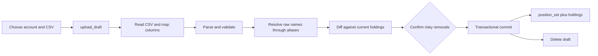
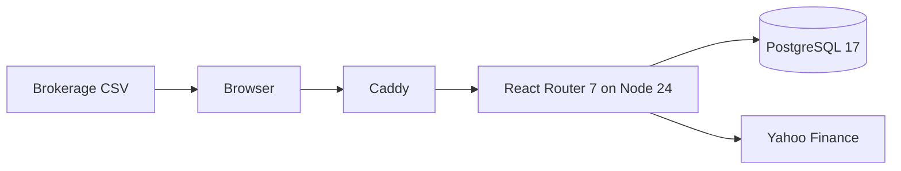

# Portfolio Tracker: data model and architecture review

Reviewed against commit `410a61f` on 2026-08-28.

This is a code-grounded review snapshot, not a new source of truth. `DESIGN.md` remains the
authority for product and domain decisions, `ARCHITECTURE.md` remains the contributor guide to the
implemented structure, and the SQL migrations remain the physical schema. This review brings those
views together, calls out places where they differ, and ranks the most useful improvements visible
in the current tree.

## Executive assessment

The application has a coherent shape: one server-rendered React Router application, one Postgres
database, an in-process quote poller, and no separate API or worker. Its strongest decision is to
put portfolio valuation in one relational read model rather than let each dashboard reinvent it.
Its second strongest decision is to represent statements as immutable position snapshots. Together,
those decisions make historical valuation, cash, securities, and liabilities travel through the
same path.

The main risks are not a need for more architecture. They are a small set of correctness and
resilience gaps at existing boundaries:

- a lost Postgres connection can terminate the app process;
- the login return target can still escape the origin through control-character input;
- some malformed statement rows can disappear without being reported;
- an upload can commit a different interpretation from the one reviewed in another tab;
- per-holding stale flags exist, but no page-level quote age shows when apparently current prices
  were last refreshed;
- historical charts and change figures can present a wholly unpriced portfolio as a real zero;
- an out-of-range provider price or invalid timestamp can roll back the whole refresh tick;
- several documented management capabilities are still future work.

The repository already contains a reproduced exploratory test report and an approved remediation
sequence for several of these. The right next move is to finish that sequence, not introduce a new
service, ORM, cache, or generalized repository layer.

## 1. Domain model

### 1.1 The modeling choice: positions, not transactions

The source of truth is a dated photograph of what each account held, not a transaction ledger.
`position_set` is the photograph and its `holding` rows are the contents
(`migrations/0001_initial_schema.sql:134-198`). A later statement appends another photograph; it
does not update the earlier one (`app/lib/uploads.server.ts:954-1125`). A one-position correction
also appends a full replacement photograph, copying the unedited holdings forward
(`app/lib/positions.server.ts:303-486`).

This model supports:

- current holdings and net worth;
- historical value based on recorded positions and daily prices;
- current cost basis and unrealized gain where a statement supplied basis;
- current allocation and projected annual dividend.

It cannot derive realized gains, tax lots, actual dividend payments, cash-flow-adjusted return, or
time-weighted return. Those require transaction and cash-flow facts the schema does not store. This
is a deliberate product boundary, not a missing query (`DESIGN.md:53-72`).

### 1.2 One valuation rule

Every asset and liability uses the same equation:

```text
value = quantity * price
```

Cash is a quantity of the seeded `USD` instrument at a fixed price of `1.00`. Debt is a negative
quantity of that same instrument. The sign therefore lives in `holding.quantity`, never in a price
or a branch in a dashboard (`DESIGN.md:23-51`; `migrations/0001_initial_schema.sql:254-283`). Net
worth is consequently one sum over holding values.

Three related rules preserve honest totals:

- An absent price remains `null`; the holding remains visible and coverage says that the total is
  partial.
- An absent cost basis remains `null`; it is never treated as zero, which would invent a gain.
- A stale price is still used and marked stale; the last known price is preferable to silently
  replacing it with zero.

The one explicit exception is projected annual dividend. A missing per-share dividend rate is
coalesced to zero, so the result is presented as a lower bound rather than with ordinary price
coverage (`migrations/0006_annual_dividend.sql:28-47,124-157`).

### 1.3 Ownership, account type, and tax treatment

Ownership attaches to an account. Every account has exactly one `person`; there is no joint-owner
join table. Account type and tax treatment are independent axes:

- `kind`: `brokerage`, `401k`, `ira`, `bank`, or `liability`;
- `tax_treatment`: `taxable`, `tax_deferred`, or `tax_free`.

This lets two workplace-plan accounts have different tax treatments without pretending the plan
kind determines the tax regime (`migrations/0001_initial_schema.sql:35-63`). Closing is a timestamp,
not deletion. Current reads exclude a closed account; historical reads retain it for the dates on
which it was open (`app/lib/accounts.server.ts:349-375`).

### 1.4 Instrument identity and classification

An instrument has a surrogate bigint identity. Its symbol is nullable, mutable, and non-unique:
ticker changes do not split history, and private workplace-plan trusts can exist without a public
symbol. A user-owned classification attaches to the instrument and rolls up to the fixed asset-class
set `equity | bond | cash | other` (`migrations/0001_initial_schema.sql:68-113`).

CSV vocabulary is separated from instrument identity. Each byte-exact, case-sensitive raw brokerage
string is an `instrument_alias` pointing to one instrument. Aliases are global, not scoped to an
institution (`migrations/0001_initial_schema.sql:115-131`). A first sighting is resolved once in the
upload wizard, then remembered.

## 2. Physical data model

### 2.1 Storage conventions

- Surrogate identifiers are `bigint generated always as identity`. The `pg` boundary returns them
  as strings so IDs never pass through JavaScript's unsafe integer range (`server/db.ts:24-53`).
- Money, prices, and per-share amounts use `numeric(20,4)`; quantities use `numeric(20,8)`; rates use
  six decimal places. Application reads preserve them as decimal strings.
- Calendar dates cross the driver as `YYYY-MM-DD` strings. Genuine instants such as `created_at`,
  `closed_at`, and quote `as_of` cross as `Date` values.
- Extensible value sets are text columns with `CHECK` constraints, not Postgres enum types.
- `app/lib/database.generated.ts` is generated from a migrated live database and is the Kysely schema
  contract. CI verifies that it still matches the migrations
  (`.github/workflows/ci.yml:38-65`).

### 2.2 Entity relationship diagram

```mermaid
erDiagram
    PERSON ||--o{ ACCOUNT : owns
    ACCOUNT ||--o{ POSITION_SET : records
    ACCOUNT ||--o{ UPLOAD_DRAFT : stages
    POSITION_SET ||--o{ HOLDING : contains
    CLASSIFICATION ||--o{ INSTRUMENT : classifies
    INSTRUMENT ||--o{ HOLDING : identifies
    INSTRUMENT ||--o{ INSTRUMENT_ALIAS : resolves
    INSTRUMENT ||--o| QUOTE : has_current
    INSTRUMENT ||--o{ PRICE_DAILY : has_history

    PERSON {
        bigint id PK
        text name
    }
    ACCOUNT {
        bigint id PK
        bigint owner_id FK
        text kind
        text tax_treatment
        timestamptz closed_at
    }
    POSITION_SET {
        bigint id PK
        bigint account_id FK
        date as_of_date
        text source
        timestamptz created_at
    }
    HOLDING {
        bigint id PK
        bigint position_set_id FK
        bigint instrument_id FK
        numeric quantity
        numeric cost_basis_per_share
    }
    CLASSIFICATION {
        bigint id PK
        text name UK
        text asset_class
    }
    INSTRUMENT {
        bigint id PK
        bigint classification_id FK
        text symbol
        text price_source
    }
    INSTRUMENT_ALIAS {
        text raw_string PK
        bigint instrument_id FK
    }
    QUOTE {
        bigint instrument_id PK_FK
        numeric price
        timestamptz as_of
        boolean is_stale
    }
    PRICE_DAILY {
        bigint instrument_id PK_FK
        date date PK
        numeric close
    }
    UPLOAD_DRAFT {
        bigint id PK
        bigint account_id FK
        bytea raw_file
        jsonb mapping
    }
```

`manual_networth`, `column_mapping`, `app_setting`, and `schema_migrations` are intentionally
standalone and appear in the catalog below.

### 2.3 Core household entities

#### `person`

Purpose: a named owner used for account grouping.

- `id`: identity primary key.
- `name`: required but intentionally not unique.
- Relationship: one person owns zero or more accounts.
- Delete behavior: `account.owner_id` uses `ON DELETE RESTRICT`; the service only deletes a person
  after confirming that no account references them (`app/lib/people.server.ts:148-178`).

#### `account`

Purpose: the ownership, institution, tax, and lifecycle boundary to which statements attach.

- Required text: `name`, `institution`, `kind`, `tax_treatment`.
- `owner_id`: required foreign key to `person`.
- `external_account_number`: optional brokerage identifier. In the current implementation it is a
  commit-time mismatch guard and a first-upload capture, not an account selector.
- `closed_at`: nullable close instant. There is no account delete operation.
- Constraints: closed sets for `kind` and `tax_treatment`.
- Index: `account_owner_id_idx` supports owner joins and delete checks.

The form treats institution as optional and stores an empty string, so the SQL `NOT NULL` constraint
means “a stored value exists,” not “the person typed a nonblank institution”
(`app/lib/accounts.server.ts:85-105,196-216`).

#### `classification`

Purpose: a user-facing instrument label plus a stable aggregation axis.

- `name`: required and unique.
- `asset_class`: required and constrained to `equity`, `bond`, `cash`, or `other`.
- Relationship: one classification labels zero or more instruments.
- Delete behavior: referenced classifications are restricted from deletion.

#### `instrument`

Purpose: stable identity for a security, cash unit, debt unit, or manually priced holding.

- `symbol`: nullable, mutable, and non-unique.
- `name`: required.
- `quote_type`: nullable, unconstrained provider vocabulary.
- `price_source`: `feed`, `fixed`, or `manual`.
- `classification_id`: required foreign key to `classification` with restricted deletion.
- Indexes: classification lookup and symbol lookup.

Duplicate symbols are supported intentionally in the refresh path: one provider quote updates every
matching instrument (`app/lib/prices.server.ts:90-107`). The UI exposes feed and manual creation;
`fixed` is primarily seeded/system data, although the schema does not reserve it exclusively for
USD (`app/lib/instrument-resolution.server.ts:353-369`).

#### `instrument_alias`

Purpose: map each raw instrument string seen in a statement to a stable instrument.

- `raw_string`: byte-exact primary key under `COLLATE "C"`.
- `instrument_id`: required foreign key to `instrument`.
- Delete behavior: deleting an instrument cascades to its aliases.
- Scope: global across institutions.

Resolution of a new classification, instrument, and alias is transactional. If a concurrent writer
wins the alias race, the winner is reused and the newly orphaned instrument is removed
(`app/lib/instrument-resolution.server.ts:572-674`).

### 2.4 Position and history entities

#### `position_set`

Purpose: one immutable, as-of-dated account snapshot.

- `account_id`: required foreign key to `account`, deletion restricted.
- `as_of_date`: date represented by the statement or manual balance.
- `source`: `upload` or `manual`.
- `source_filename` and `raw_file`: nullable provenance; uploads populate them and typed balances do
  not.
- `created_at`: insert instant used in deterministic tie-breaking.
- Index: `(account_id, as_of_date DESC, created_at DESC, id DESC)` matches the latest-set lookup.

Append-only behavior is an application invariant rather than a database trigger. The current tree
has no production path that edits a committed set, reparses its retained file, or deletes it.

#### `holding`

Purpose: one instrument row inside one complete snapshot.

- `position_set_id`: required foreign key, cascading on set deletion.
- `instrument_id`: required foreign key, restricted on instrument deletion.
- `quantity`: signed `numeric(20,8)`.
- `cost_basis_per_share`: nullable `numeric(20,4)`.
- Uniqueness: one row per `(position_set_id, instrument_id)`.

An absent instrument in the next snapshot means it is no longer held. A zero-quantity row is kept
so the inline correction screen can still reach and reopen it. Lot-level rows and distinct raw
aliases that resolve to the same instrument are folded before insertion.

#### `manual_networth`

Purpose: a hand-entered total series for the period before computed portfolio history begins.

- `date`: primary key.
- `amount`: `numeric(20,4)`.

The production application currently reads this series but has no management route that writes it
(`app/lib/valuation.server.ts:616-633`; `app/routes.ts:39-48`). Demo and test tooling populate it.

### 2.5 Pricing entities

#### `quote`

Purpose: the current/intraday price tier, overwritten on refresh.

- `instrument_id`: both primary key and cascading foreign key, giving zero or one quote per
  instrument.
- `price`: required `numeric(20,4)`.
- `yield_pct`: nullable `numeric(10,6)`; stored but not used by a production read.
- `annual_dividend_per_share`: nullable `numeric(20,4)`.
- `as_of`: provider/fetch instant.
- `is_stale`: required, default false.

#### `price_daily`

Purpose: the dated price spine used by historical valuation.

- Composite key: `(instrument_id, date)`.
- `close`: required `numeric(20,4)`.
- Delete behavior: cascades with the instrument.

Refresh writes the daily row under the market-local date derived from the provider's timestamp, not
the server clock (`app/lib/prices.server.ts:309-339`). A same-day row is upserted while the session
runs and converges on the close. “Immutable spine” therefore means history is not rewritten under a
different date; SQL does allow correction of the row for the same instrument and date.

#### Seeded cash rows

The first migration creates:

- the `Cash` classification;
- the `USD` fixed-price instrument;
- a current quote of `1.00`;
- a `price_daily` close of `1.00` on `1970-01-01`.

That old daily row is load-bearing: historical carry-forward can price cash and debt at every
supported date without a special case (`migrations/0001_initial_schema.sql:254-283`).

### 2.6 Ingest support entities

#### `column_mapping`

Purpose: remember how a particular institution/header shape maps to the application's statement
fields.

- `institution` plus `header_fingerprint` is unique.
- `mapping` is JSONB, validated through the statement Zod schema when read.
- There is deliberately no foreign key to `account`: institution is free text and mappings survive
  account lifecycle changes.

#### `upload_draft`

Purpose: durable server-side state for the URL-addressable upload wizard.

- Required account, filename, raw bytes, and creation instant.
- Nullable mapping and first-sighting marker record how far the wizard has progressed.
- Nullable `as_of_date` is reserved and currently unused.
- Drafts older than 24 hours are swept at the next upload.
- Draft deletion cascades when an account is deleted, because drafts are scaffolding rather than
  history.

At commit, deleting the draft is the first transactional write. That deletion acts as the
concurrency guard: only one concurrent submission can consume the draft and create a position set
(`app/lib/uploads.server.ts:1060-1081`).

### 2.7 Application and operational metadata

#### `app_setting`

Purpose: the household's capital-gains estimate rate.

- A boolean primary key constrained to `true` enforces exactly one possible row.
- `capital_gains_rate` is `numeric(9,6)`, constrained from 0 through 100, defaulting to 23.8.
- The migration seeds the row, so readers do not need a missing-settings state
  (`migrations/0005_app_setting.sql:15-48`).

#### `schema_migrations`

Purpose: record which migration filenames have been applied.

- `filename`: primary key.
- `applied_at`: timestamp defaulting to now.

The migration runner creates this table before applying migration files, serializes runners with a
Postgres advisory lock, and wraps each file plus its ledger insert in one transaction
(`server/migrations.ts:97-168`).

## 3. Relational and derived model

### 3.1 Cardinality and delete policy

The foreign keys express two different lifecycle classes.

History is protected:

- person -> account: `RESTRICT`;
- account -> position set: `RESTRICT`;
- classification -> instrument: `RESTRICT`;
- instrument -> holding: `RESTRICT`.

Owned details and staging data are replaceable:

- position set -> holding: `CASCADE`;
- instrument -> alias: `CASCADE`;
- instrument -> quote: `CASCADE`;
- instrument -> daily price: `CASCADE`;
- account -> upload draft: `CASCADE`.

The application exposes hard deletion only for a person with no accounts, expired/consumed upload
drafts, and a newly created instrument that loses an alias race. Accounts are closed, not deleted;
committed position sets have no deletion UI.

### 3.2 `latest_position_set`

`latest_position_set(account_id, optional_date)` is the single definition of which snapshot speaks
for an account. It selects the greatest `as_of_date`, then `created_at`, then monotonic `id`, with an
optional `as_of_date <= date` bound (`migrations/0002_holding_valued.sql:34-57`).

The ordering matters because a corrected upload can share an as-of date with an earlier upload. The
matching index prevents each valuation read from sorting all of an account's history.

### 3.3 `holding_valued`

The current view joins:

```text
account -> person
        -> latest position_set -> holding -> instrument -> classification
                                             |
                                             +-> quote (LEFT JOIN)
```

It excludes closed accounts and exposes every dimension the dashboards need. Its derived fields are:

- `value = cast(quantity * price as numeric(20,4))`;
- `cost_basis = cast(quantity * cost_basis_per_share as numeric(20,4))`;
- `unrealized = value - cost_basis`;
- `is_priced = quote exists`;
- `is_stale = quote.is_stale`, false when no quote exists;
- `annual_dividend = cast(quantity * coalesce(rate, 0) as numeric(20,4))`.

The quote join is left-sided, so an unpriced holding remains a row. This is the key protection
against totals silently omitting holdings merely because pricing failed
(`migrations/0006_annual_dividend.sql:81-166`).

### 3.4 `holding_valued_at(date)`

The historical set-returning function has the same row type as the current view. It changes only
the time-dependent decisions:

- it chooses the latest position set at or before the requested date;
- it includes an account when it had not yet closed on that date;
- it uses the most recent daily close at or before the requested date;
- it reports `is_stale = false`, because staleness is a live-quote property;
- it reports `annual_dividend = null`, because no historical dividend-rate series exists.

Non-trading days need no calendar in this query: the lateral price lookup naturally carries the
previous close forward (`migrations/0006_annual_dividend.sql:169-268`).

The function returns `SETOF holding_valued`; therefore a view column change also changes the
function's row contract. ADR-0001 requires replacing both in one migration
(`docs/adr/0001-holding-valued-row-type-contract.md`).

### 3.5 Application query boundary

`app/lib/valuation.server.ts` is the only general valuation reader. It maps the nullable generated
view type into the stronger `ValuedHolding` domain shape, selects current or historical sources,
sums money in SQL, and returns explicit coverage counts. Dashboard-specific grouping and percentage
work happens in pure modules using bigint-scaled decimal units, principally `allocation.ts`,
`holdings-view.ts`, and `money.ts`.

The deliberate exceptions are narrow:

- `prices.server.ts:priceFreshness` reads the view to scope freshness to held feed instruments, but
  computes no value;
- the upload preview computes a new row's value in bigint units because a not-yet-committed holding
  cannot exist in the view (`app/lib/uploads.server.ts:614-631`).

## 4. Write and data-flow model

### 4.1 Statement ingest



The wizard is represented by real nested routes under `/upload/:draftId`
(`app/routes.ts:13-29`). Raw bytes live in Postgres, so reload, back, and bookmarked steps work
without browser-held state.

The flow is:

1. `createDraft` validates the account, sweeps stale drafts, and stores the bytes.
2. The columns step reads tolerant CSV rows, validates a `StatementMapping`, parses quantities and
   optional basis/date/account-number cells, and saves the mapping.
3. Unresolved raw instrument strings are either attached to an existing instrument or create a new
   classification/instrument/alias combination.
4. `diffForDraft` folds lots, resolves aliases, and compares the parsed result to
   `accountHoldings` from the shared valuation layer.
5. `commitUpload` repeats all state-sensitive checks, deletes the draft as its concurrency guard,
   inserts one upload position set and its holdings, and captures a previously blank external
   account number—all in one transaction.

An absent holding in the committed snapshot is a sale/removal. The review therefore calls for
explicit confirmation when a strict majority of current positions would disappear.

### 4.2 Manual balance and position correction

Bank and liability balances use `setBalance`. It writes one manual position set containing the
seeded USD instrument. A liability amount becomes a negative quantity
(`app/lib/balances.server.ts:setBalance`).

The Holdings inline editor uses `revisePosition`. It can change the quantity and basis of an
instrument already in the current set, but cannot add membership. Its single SQL statement creates a
new manual set and copies every unchanged holding forward, preventing a partial snapshot from
implicitly selling everything else (`app/lib/positions.server.ts:303-486`).

Both paths repeat their important state checks at write time so a stale form cannot silently empty
an account.

### 4.3 Quote refresh

The first root loader request starts an idempotent timer stored on `globalThis`; it deliberately does
not fetch immediately (`app/root.tsx:60-78`; `app/lib/price-poller.server.ts:139-180`). Each tick:

1. skips outside the approximate market window;
2. skips when another tick is running in the process;
3. acquires a non-blocking Postgres advisory lock to prevent two processes refreshing together;
4. fetches every `feed` instrument with a symbol through the `PriceProvider` interface;
5. transactionally upserts current quotes, quote types, and daily closes;
6. retains last-known prices and marks an omitted instrument stale only when it already has a quote;
   a never-priced instrument remains unpriced rather than acquiring a stale quote;
7. logs a summary for an attempted refresh and releases the lock client on the handled paths.

Overlapping, closed-market, and advisory-lock-miss ticks return without a log. Promise-path failures
destroy the checked-out client, but the missing pool/client error listeners described in section 7.1
remain a process-termination risk (`app/lib/price-poller.server.ts:78-132`).

The provider boundary accepts `unknown`, validates with Zod, refuses non-USD quotes, and converts
provider floats to finite fixed-scale decimal strings before database writes. Yield and dividend
rate have explicit range ceilings, but price magnitude and numeric timestamp validity do not; that
gap is addressed in section 7.5 (`app/lib/price-provider.server.ts:105-152,221-315`).
`yahoo-finance2` is isolated behind one adapter and one shared client.

Missing or malformed string timestamps fall back to fetch time. That keeps a current quote usable,
but it can attribute a daily close to the fetch date rather than a genuine provider session date.
Section 7.5 separates those two timestamp policies.

### 4.4 Dashboard reads

- Overview: current net worth, current account rollups, sampled historical series, change, and the
  optional manual pre-history series.
- Holdings: one current holdings array, then pure query parsing, filtering, grouping, sorting, and
  summaries.
- Analysis: the same holdings plus allocation groupings and the singleton capital-gains rate.
- Income: the same holdings grouped by owner/account/tax axes for annual dividend and weighted yield.
- Account detail: the shared account total and holdings narrowed by account, plus an account-only
  historical series and optional upload/balance receipt.

The screens therefore share the relational valuation definition while retaining presentation rules
in pure modules.

## 5. Application architecture

### 5.1 System and deployment context



The production Compose stack has three services:

- Caddy is the only published port and forwards to the app.
- The app is a read-only, non-root container with `/tmp` on tmpfs.
- Postgres is reachable only on the Compose network and owns the sole persistent volume.

The app container validates configuration, applies migrations, and only then starts
`react-router-serve` (`docker-entrypoint.sh:13-18`). `/healthz` checks database reachability and
whether every migration shipped in the image is recorded as applied; it intentionally does not make
Yahoo availability a liveness dependency (`app/routes/healthz.ts:21-35`).

### 5.2 Runtime and framework

The package uses React Router Framework Mode with SSR enabled and client hydration
(`react-router.config.ts:3-13`). Route modules provide loaders, actions, components, and error
boundaries. A loader or action calls the domain/query modules directly in the same Node process; the
framework serializes the result. There is no REST/GraphQL layer and no second server application.

The declared core stack at review time is:

- Node `>=24.12.0`;
- React Router `^7.18.2`;
- React/React DOM `^19.2.8`;
- Kysely `^0.29.5` and `pg` `^8.23.0`;
- Zod `^4.4.3`;
- Vitest `4.1.x`, Vite `^7.3.6`, and TypeScript `^5.9.3`.

These values come from `package.json`; resolved versions remain lockfile-controlled.

### 5.3 Layer boundaries

```text
app/routes/** and app/root.tsx
  HTTP/request translation, React rendering, loaders and actions
        |
        v
app/lib/*.server.ts
  domain validation, database queries, write transactions, auth, pricing
        |                         \
        v                          v
valuation.server.ts             app/lib/*.ts
  shared valued read model        pure CSV, money, allocation, formatting,
        |                          market-hours, holdings-view rules
        v
migrations/*.sql
  schema, constraints, valuation functions and view
```

Important boundaries:

- `.server.ts` modules must stay out of the browser bundle.
- Routes translate requests and domain errors; they should not restate domain rules.
- Valuation arithmetic moves downward into SQL. Pure JavaScript arithmetic uses the fixed-point
  helpers in `money.ts`, not `Number`.
- All database functions accept an optional Kysely handle. Production defaults to the singleton;
  tests pass a transaction that rolls back.
- Generated route types live under `.react-router/types`; generated database types live in
  `app/lib/database.generated.ts`.

### 5.4 Route topology

The root route owns the HTML document, application shell, navigation, first-run prompt, optional
open-instance warning, auth middleware, and poller startup (`app/root.tsx`). The route registry is
explicit in `app/routes.ts`:

- `/`: Overview;
- `/holdings`, `/analysis`, `/income`: main read screens;
- `/accounts/:accountId`: account drill-down and typed balance action;
- `/upload` and `/upload/:draftId/{columns,instruments,review}`: ingest wizard;
- `/settings/{people,accounts,accounts/:accountId,tax}`: management writes;
- `/login`: optional shared-password entry;
- `/healthz`: unauthenticated resource route.

React Router's current Framework Mode documentation confirms that route middleware wraps matched
document and data requests, and that loaders/actions are first-class route-module data boundaries.
The implementation uses root server middleware as a deny-by-default login gate.

### 5.5 Configuration, database access, and type boundaries

`server/config.ts` is the single interpreter of environment configuration. `loadConfig(env)` is
pure and Zod-validated; `getConfig()` reads and caches `process.env`. The runtime surface includes
database URL, optional shared-password settings, port, quote cadence, upload cap, market timezone,
and container timezone.

`server/db.ts:createPool` is the sole pool-construction site. It installs string parsers for
Postgres `numeric`, `int8`, and `date`. `app/lib/db.server.ts` wraps the pool with Kysely and provides
an `AsyncLocalStorage` override used by route tests. This keeps exact decimal strings and test
transactions flowing through the same production query code.

### 5.6 Authentication and trust boundaries

Authentication is optional and intentionally not multi-user. When enabled it consists of one shared
password, a signed HTTP-only SameSite cookie, and root middleware. There are no user or session
tables and no per-person permissions (`app/lib/auth.server.ts`). `/login` and `/healthz` are the
explicit open paths for matched routes.

The cookie is signed, not encrypted, and contains an unsalted SHA-256 fingerprint of the configured
password (`app/lib/auth.server.ts:53-65,106,199-219`). The operator guide explicitly accepts no login
rate limit, CSRF token, or security headers for a trusted-LAN deployment
(`docs/operating.md:275-302`). Those are deployment-profile tradeoffs, not a multi-user model in
disguise.

Caddy is the only published service, so the application deliberately trusts forwarded protocol and
address headers from that internal hop. Deploying the app port directly would invalidate that trust
assumption (`compose.yaml:50-113`). TLS is not configured in the bundled Caddyfile.

### 5.7 Errors and validation

Raw form values are narrowed with Zod-backed schemas and translated to `ValidationError` field maps
or `NotFoundError`. Routes render expected refusals and convert missing resources into HTTP status
responses. Database check and foreign-key constraints remain the last line of defense. Several
URL-id and text edge cases still reach driver errors. In production, React Router sanitizes
server-thrown `Error` objects before the root boundary receives them; development and client-side
errors can still show their original message (`app/root.tsx:217-235`). The application has no
central unexpected-error reporting or correlation identifier. Those are improvement items below.

### 5.8 Testing and delivery

The Vitest suite combines:

- pure tests for CSV, statement, money, allocation, formatting, and market-time rules;
- database tests against real Postgres, normally rolled back per test;
- route loader/action tests through the database override;
- cross-query invariants and end-to-end domain journeys.

CI typechecks, builds, starts Postgres, migrates, runs tests, verifies generated DB types, audits
dependencies, and runs a separate container smoke test. Version tags publish amd64 and arm64 GHCR
images only after all three CI jobs pass (`.github/workflows/ci.yml`).

## 6. What is already strong

### Centralized valuation

`holding_valued`, `holding_valued_at`, and `valuation.server.ts` greatly reduce the highest-risk
failure in a finance UI: two screens deriving different money from the same holdings. The explicit
coverage model gives presentation code enough information to avoid silently partial totals, though
some current Overview rows and historical consumers do not yet preserve that information.

### Exact numeric boundary

The combination of Postgres `numeric`, string driver parsers, SQL arithmetic, bigint fixed-point
helpers, and overflow guards is unusually deliberate. The remaining problems are edge completeness,
not a flawed base representation.

### Append-only history

Uploads, balance changes, and inline corrections all preserve earlier statements. The complete-
snapshot rule is consistently defended at the write paths, including stale-form/concurrency guards.

### Provider isolation

Yahoo is behind a narrow interface and untrusted payloads are validated. Daily close attribution
normally uses the provider timestamp rather than a fragile server-date assumption. The fallback to
fetch time when that timestamp is absent or malformed is a remaining history-policy gap.

### Operational simplicity

One application process, one database, one ingress, one persistent volume, startup migrations, and a
real deployment smoke test are appropriate for the intended household scale.

## 7. Improvement opportunities

### 7.1 Finish the approved remediation sequence first

`docs/specs/0005-report-remediation.md` is already the reviewed build order. On the reviewed `main`,
the date floor is present (`app/lib/input.server.ts:234-314`), while these approved corrections are
still absent:

1. **Survive lost Postgres connections.** `server/db.ts:createPool` has no pool error listener, and
   the poller can hold a checked-out client over a provider request. The prior live test reproduced
   process termination on both idle and checked-out connection loss. The approved fix covers both
   states and includes behavioral tests (`docs/specs/0005-report-remediation.md:72-123`). Current
   node-postgres 8.x documentation explicitly warns that an unhandled pool `error` event can crash
   the process and documents both pool and client error events.

2. **Make login redirects origin-safe for every input.** `safeRedirectTarget` checks only the first
   characters (`app/lib/auth.server.ts:153-158`). Tabs/control characters, header-invalid Unicode,
   and URL dot-segment normalization require validating the normalized output as well as the input.
   The accepted algorithm and adversarial cases are already specified
   (`docs/specs/0005-report-remediation.md:125-166`).

3. **Refuse a quantity that has no instrument.** `parseStatement` silently skips a row with a blank
   mapped instrument even when the row has a real quantity. The shipped `401k.csv` fixture reproduced
   a materially incomplete upload. The parser is the correct seam because the mapping must not be
   remembered after this refusal (`docs/specs/0005-report-remediation.md:168-210`).

4. **Explain and handle a backdated statement.** A set dated behind the current one is stored and
   changes the historical window, but its review is diffed against “now” and the account receipt can
   disappear. The approved change adds an explicit filed-behind state without pretending the upload
   has no historical effect (`docs/specs/0005-report-remediation.md:212-251`).

These should stay separate pull requests. They are independently testable and already have grounded
acceptance work; combining them would only make review harder.

### 7.2 Make review and commit the same statement interpretation

The review loader and commit action independently read mutable `upload_draft.mapping` and reparse the
file (`app/lib/uploads.server.ts:889-894,954-1058`). Another tab can change the mapping after review;
the commit then safely validates and writes the new mapping's result, which is still not what the
person approved.

A minimal fix is optimistic concurrency: bind the review to a stable mapping/draft version or digest
and submit that token. The transaction's first mutation must conditionally consume or lock the draft
by both ID and reviewed token, returning the exact state that parsing and commit use. A separate
pre-transaction comparison would recreate the same time-of-check/time-of-use race. Do not duplicate
the parsed statement into browser state or introduce a second staging graph. The database draft
remains the source of truth, and the conditional consume preserves the existing double-submit guard.

### 7.3 Surface price age and strengthen freshness semantics

`priceFreshness()` already returns the oldest current quote time and stale counts for held feed
instruments (`app/lib/prices.server.ts:342-389`), but it has no production caller. Per-holding
`is_stale` notes are already rendered on Holdings and Account detail
(`app/lib/holdings-view.ts:745-755`; `app/routes/holdings.tsx:874`; `app/routes/account.tsx:551`).
However, that bit is set only after an attempted refresh fails or omits a symbol. If the poller never
starts, an arbitrarily old quote can continue to look fresh.

Use the existing query on Overview and global money screens; parameterize it by account or instrument
set for scoped pages, so one account's stale quote does not label another. Label the result narrowly
as the oldest **feed quote** time: the query inner-joins `quote` and therefore excludes never-priced
feed holdings, while manual prices have their own age (`app/lib/prices.server.ts:357-380`). Pair it
with valuation coverage and manual-price age before claiming an as-of time for the whole displayed
figure. Do not invent a second age threshold called “stale” before the product defines it. Keep the
provider out of `/healthz`; third-party failure should degrade pricing visibility, not cause restart
loops.

`docs/specs/pricing/05-pricing-ui.md` is not one ready implementation ticket. It combines freshness
across every read page, Refresh Now, and full instrument/manual-price management. It also promises a
non-USD refusal reason and count, but the provider returns successful quotes only and the Yahoo
adapter logs then discards `CurrencyRefused` (`app/lib/price-provider.server.ts:62-64,464-493`). Split
those independently buildable slices. Before specifying the refusal UI, decide whether refusal
metadata is ephemeral refresh output or persisted instrument state. In the freshness slice, replace
the current newest-quote rule with the scoped, oldest-source policy above.

### 7.4 Preserve price coverage in charts and change figures

The ordinary total path distinguishes unknown from zero, but the historical presentation drops that
distinction. `readSeries` can return `amount = 0.0000` with coverage `{known: 0, total: n}` when a
position set exists before any daily close (`app/lib/valuation.server.ts:559-575`). Overview and
Account keep points based only on `coverage.total > 0`, then discard coverage
(`app/routes/overview.tsx:184-189`; `app/routes/account.tsx:181-187`). The chart therefore draws an
entirely unpriced portfolio as a real zero. `netWorthChange` similarly coalesces each side to zero and
returns no coverage (`app/lib/valuation.server.ts:664-696`).

Carry the existing `Coverage` through the chart and change policies. Fully unpriced points should
break or label the series rather than become zero; partially priced points need an explicit display
rule. This reuses the current valuation contract and requires no second history subsystem.

The same qualification is missing from current Overview account rows. `AccountTotal` carries
coverage (`app/lib/valuation.server.ts:399-438`), but those rows render bare amounts
(`app/routes/overview.tsx:283-314`); a fully unpriced account can look like `$0.00`, and a partially
priced one like a complete total. Allocation bars are also calculated from the partial amounts and
fully unpriced accounts disappear (`app/routes/overview.tsx:254-267,320-363`). Preserve or annotate
coverage in both the rows and allocation policy. Once historical point coverage is carried through,
replace the current note that uses today's account coverage to qualify both “the figure and the
line” (`app/routes/overview.tsx:206-210,441-445`).

### 7.5 Enforce positive, representable prices at the data boundary

The domain says price is a positive market fact, but `quote.price` and `price_daily.close` have no
positive `CHECK` constraint (`migrations/0001_initial_schema.sql:204-228`). Provider parsing rejects
non-positive values, yet direct/manual/future writers and restored data can still violate the rule.
It also does not reject a positive value above `numeric(20,4)` or an invalid numeric timestamp
(`app/lib/price-provider.server.ts:105-108,221-264`). Because a refresh writes all results in one
transaction, either value can roll back every quote write and the stale marking for that tick
(`app/lib/prices.server.ts:174-234`).

First bound price and timestamp validation at the existing provider boundary, with regression tests,
so malformed provider data is refused before the write transaction. Add database constraints only
after auditing existing rows. Before a manual-price UI lands, define one command that validates range
and positivity and transactionally updates both current `quote` and dated `price_daily`; writing only
the daily table would leave the current view unpriced.

Use separate timestamp policies for the two tiers: a current quote may deliberately use fetch time
when provider time is absent, but a daily historical close should require a genuine valid provider
timestamp or explicitly skip the daily write. Otherwise Refresh Now outside market hours can create
history under the fetch date.

Also close the known residual in the derived products. Quantity writes check the quote that exists at
that moment, but a later refresh can replace price or dividend rate with an individually valid value
whose product overflows `numeric(20,4)` (`migrations/0006_annual_dividend.sql:53-75`). Prefer safely
widening the derived monetary output: checking a quote only against current quantities cannot prove
historical valuation safe, and a backdated statement can add a larger historical operand later. The
alternative must validate every applicable current and historical product on both quote and position
writes, which is a much wider invariant. The failure occurs on the subsequent valuation read, not
during the refresh write.

### 7.6 Centralize and bound external identifiers

Several request paths accept digit-only IDs and interpolate/cast them as Postgres bigint. A value can
match `^\d+$` while exceeding bigint range, turning “not found” into a database error. The current
checks are repeated in `accounts.server.ts`, `positions.server.ts`, `uploads.server.ts`, and
`valuation.server.ts`.

Create one Zod-derived identifier parser that returns the boundary shape used by Kysely. Reuse it for
route params and foreign-key form fields. Either adopt the application-safe canonical spelling used
by `parseRowKey`—`0|[1-9]\d{0,17}`—and explicitly reject zero for domain IDs, or parse with `BigInt`
and enforce PostgreSQL's positive bigint range `1..9223372036854775807`
(`app/lib/holdings-view.ts:845-877`). The current row-key grammar is deliberately narrower than the
database range. This is domain input narrowing, not an HTTP repository abstraction.

### 7.7 Refuse NUL at the input seam that owns it

NUL is a different problem from ID range. UTF-8 decoding accepts it, so a CSV instrument name can
reach the alias query and produce a raw Postgres error (`app/lib/uploads.server.ts:361-389`; reproduced
at `docs/research/2026-08-24-exploratory-test-report.md:629-660`). Refuse it while decoding/parsing the
file, before any mapping is remembered.

Ordinary form text is a separate shared seam: `requiredText` and `optionalText` currently trim and
length-check but do not reject NUL (`app/lib/input.server.ts:76-104`). Add that guard there for the
settings forms that use them. Upload resolution independently parses and writes instrument symbol,
name, and new-classification name, so reuse the small NUL refinement at that seam too
(`app/lib/instrument-resolution.server.ts:334-390,575-635`). Do not combine CSV rules, text fields,
and numeric IDs into one generic input abstraction.

### 7.8 Make unexpected errors observable without weakening production sanitization

React Router already replaces server-thrown error messages and stacks in production before rendering
the root boundary. Keep that behavior. Add the framework's server-side `handleError` hook in a custom
`entry.server.tsx` to log unexpected exceptions, while skipping aborted requests, and retain a stable
generic boundary. Preserve deliberate route `Response` statuses and messages; those are part of the
application's normal refusal model. `handleError` is a reporting hook and does not carry a generated
correlation identifier into the boundary; add such an identifier only after designing a real
request/response context path. Treat original messages rendered during development or thrown on the
client as developer diagnostics, not evidence of a production database-information leak.

### 7.9 Make close-day semantics internally consistent

Current valuation excludes an account immediately when `closed_at` becomes non-null. Historical
valuation includes it for the entire calendar day on which it closed
(`migrations/0006_annual_dividend.sql:158,255-259`). On the close date, the Overview headline can
therefore disagree with the final chart point.

Choose and state one rule for “today”: either the close takes effect for the whole date, or current
and historical endpoint reads share an instant-aware rule. Then encode it once and add an invariant
test comparing the current total to today's historical total after closing an account.

### 7.10 Reconcile displayed rows with displayed totals

Stored values and view products use four decimal places
(`migrations/0006_annual_dividend.sql:103-156`) while `formatMoney` normally renders two
(`app/lib/format.ts:88-99`). Summing the four-decimal rows and then rounding the total can differ by a
cent from adding the individually rounded cells. The exploratory report reproduced this across the
read screens.

Decide which contract the table promises. If visible rows must add to the visible total, allocate the
rounding remainder deterministically by adapting the existing largest-remainder pattern in
`allocation.ts:allocateShares`. Do not switch money calculations to floats or round the stored/query-
layer values down to cents globally. This is a display-policy problem; the stored arithmetic remains
exact.

### 7.11 Complete or narrow the documented management surface

The design describes user-editable classifications, instruments/manual prices, manual net-worth
history, and retained-file reparse/undo. The implemented Settings routes manage only people,
accounts, and tax rate (`app/routes.ts:39-48`; `app/routes/settings/index.tsx:51-55`). Committed
`position_set.raw_file` is retained but has no production reader.

Either build those capabilities as separate slices or label them clearly as future capability in the
canonical design. Manual pricing deserves priority over generic classification editing because a
manual instrument can be created today but has no complete current-and-historical price-management
path.

### 7.12 Protect applied migrations from silent editing

The migration ledger stores only filename and application time (`server/migrations.ts:97-103`).
Health compares filenames, and the runner skips a recorded filename without verifying its contents
(`server/migrations.ts:85-95,130-154`). Editing an already-applied SQL file therefore creates two
schemas—fresh installs and existing deployments—while `/healthz` still reports them current.

Store a SHA-256 for each applied file and fail migration startup/health when a recorded filename's
content differs. This is a small integrity extension of the existing runner, not a reason to adopt a
migration framework.

### 7.13 Remove small structural duplication after correctness work

The architecture review has already grounded several low-risk refactors
(`docs/research/2026-08-23-architecture-review.md`):

- move the identical `inTransaction` helper from three domain modules into `db.server.ts`;
- centralize shared chart-range primitives while keeping Overview and Account policy separate;
- render form-level account refusals consistently;
- reuse a small `FieldError` presentation component.

These improve locality but should not displace the approved correctness fixes. Avoid a generalized
repository/service base class: the write paths intentionally have different concurrency guards and
would need an abstraction as complicated as their implementations.

### 7.14 Correct documentation and deployment drift

Verified current mismatches:

- `CONTEXT.md:32-36` says the schema column is `account_kind`; the base table column is `account.kind`.
  `account_kind` is only the valued view's alias.
- `DESIGN.md` and several comments say an external account number auto-selects upload. The current UI
  requires an account first; the number is a commit guard and capture.
- The design names a PWA plugin, but `package.json` has no PWA dependency and there is no manifest or
  service worker.
- `.env.example` documents `MAX_UPLOAD_MB`, but `compose.yaml:72-79` does not pass it to the app.
- `ARCHITECTURE.md` contains line-number citations and enumerated test/module counts that have already
  drifted. It also still calls the already-fixed first-sighting race live and says the poller lacks a
  test even though `tests/price-poller.test.ts` exists. Its claim that the root boundary exposes raw
  server errors also omits React Router's production sanitization. Prefer symbols and state rules,
  matching `docs/README.md`.
- `docs/research/README.md:17-43` says no exploratory remediation is approved and only the first
  fixes landed; `docs/specs/0005-report-remediation.md` now exists and its date-floor step is on
  `main`.
- Pricing tickets 01 through 04 still say `ready-for-agent` with unchecked acceptance lists even
  though their core provider, calendar, refresh, poller, startup, and test work has shipped. They
  cannot simply be marked complete: ticket 01 requires caller-visible currency/refusal data that the
  current success-only `PriceProvider` discards; ticket 03's immutable-day and unusable-timestamp
  rules differ from the implemented upsert/fetch-time behavior; tickets 03 and 04 require refused
  counts that `RefreshReport` does not carry; and ticket 04 requires logs for every skipped tick plus
  explicit shutdown cleanup, neither of which is implemented. Reconcile deliberate design changes
  from unfinished acceptance, then split ticket 05 as described in section 7.3
  (`docs/specs/pricing/01-price-provider-and-usd-guard.md` through
  `docs/specs/pricing/05-pricing-ui.md`; `app/lib/prices.server.ts:50-60,228-233`;
  `app/lib/price-poller.server.ts:78-132`). `docs/operating.md:422-445` also contradicts itself about
  whether every tick logs.

Correct canonical documentation in the same pull request as the underlying behavior where possible.
For already-shipped facts, update the comment/doc directly rather than create another decision
record.

### 7.15 Make the seeded cash identity structural before expanding cash features

Balance writes find the semantic cash instrument by `(symbol = 'USD', price_source = 'fixed')` and
take the first matching ID (`app/lib/current-statement.server.ts:66-88`). Neither column is unique,
and the instrument-resolution path can create another USD-symbol instrument. Making all symbols
unique would conflict with deliberate duplicate-symbol support.

Before adding manual currencies, cash interest, or broader balance workflows, introduce an explicit
system role/key for the unit-of-account instrument, or another protected reference that makes “the
cash instrument” a schema fact rather than a heuristic.

## 8. Changes not recommended at current scale

- **No microservices or separate API tier.** Loaders/actions calling domain modules in-process are a
  clean fit for a single-household deployment.
- **No generic ORM/repository rewrite.** Kysely plus generated live-schema types keeps the central
  SQL view explicit. Hiding it would weaken the best part of the design.
- **No materialized valuation view yet.** Household-scale row counts do not justify refresh
  invalidation and stale-cache failure modes.
- **No queue or separate worker yet.** The in-process poller is adequate after its connection-loss
  and pricing-visibility gaps are fixed. Horizontal scaling is out of scope.
- **No transaction ledger as a “small improvement.”** It is a new domain model and ingest product,
  justified only when realized gains, cash flows, tax lots, or payment history become requirements.
- **No joint-account or multi-currency patchwork.** Both cut through every grouping and valuation.
  They need deliberate model changes, not nullable columns added opportunistically.
- **No institution-scoped aliases without a real collision.** Global exact aliases are simpler and
  currently match the intended household use case.

## 9. Recommended sequence

1. Land the remaining approved remediation PRs: pool resilience, safe redirects, nameless-quantity
   refusal, and filed-behind feedback.
2. Bind upload review to the mapping version it displays.
3. Split the pricing UI ticket; land scoped feed/manual freshness and preserve unknown/partial
   coverage in current rows, allocation bars, historical charts, and change figures.
4. Bound provider values, separate current-quote and daily-close timestamp policy, add positive/range
   constraints, widen unsafe derived products, and define the transactional price-write command.
5. Only then land separate Refresh Now and manual-price/history management tickets, after deciding
   the refused-quote state the UI can honestly report. Narrow any remaining promises in `DESIGN.md`.
6. Add bounded ID parsing, reject NUL at the relevant input seams, and improve unexpected-error
   reporting.
7. Align close-day totals and decide the visible-row rounding contract.
8. Add migration checksums before more migrations accumulate.
9. Correct the verified documentation/deployment drift with the behavior it describes.
10. Take the cash-identity and small duplication work when related features touch those areas.

Each item should remain independently typechecked, built, tested, and reviewable. The current
architecture is already deep enough; the useful work is tightening the seams it has.

## 10. Review basis and limits

Sources checked:

- all migrations and the generated Kysely database type;
- route registry, root shell, route loaders/actions, domain/query modules, configuration, migration
  runner, deployment files, CI, tests, `CONTEXT.md`, the sole ADR, `DESIGN.md`, and
  `ARCHITECTURE.md`;
- the reproduced 2026-08-24 exploratory report and the adversarially reviewed remediation spec;
- official React Router Framework Mode, middleware, error-boundary, and error-reporting
  documentation, checked 2026-08-28 against the project's locked React Router `7.18.2`;
- official node-postgres pooling, Pool API, and Client API documentation, checked 2026-08-28 against
  the project's locked `pg` `8.23.0`.

Local execution was not possible in this review environment because neither `node` nor `npm` was on
`PATH`. The repository's installed files were available for inspection, but `npm run typecheck`,
the Vitest suite, and the build were not re-run. Runtime findings above are labeled from the prior
reproduced report and then checked to ensure their implementation path is still present on the
reviewed commit.

External references:

- [React Router Framework Mode](https://reactrouter.com/start/modes)
- [React Router middleware](https://reactrouter.com/how-to/middleware)
- [React Router error boundaries and production sanitization](https://reactrouter.com/how-to/error-boundary)
- [React Router error reporting](https://reactrouter.com/how-to/error-reporting)
- [node-postgres pooling](https://node-postgres.com/features/pooling)
- [node-postgres Pool API and events](https://node-postgres.com/apis/pool)
- [node-postgres Client API and events](https://node-postgres.com/apis/client)
