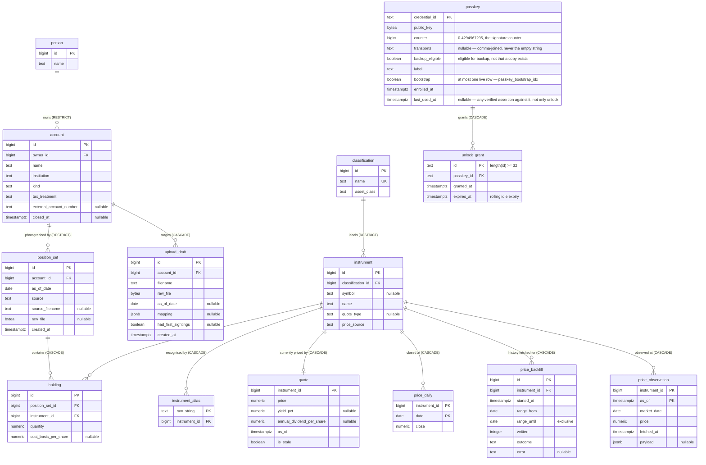
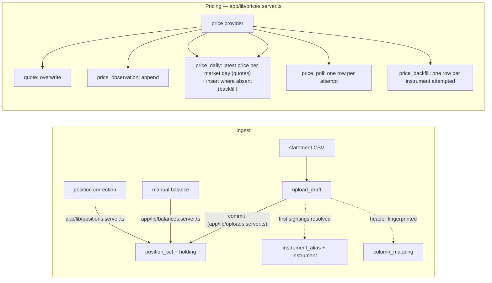

# Data model

This document explains the database: every table, what each column means, how the entities relate,
the invariants the schema enforces, and the derived objects the application reads through. It is
written for someone holding a database dump — extracting figures from it with plain SQL, or
rebuilding the service around it — and for a contributor who wants the whole schema in one sitting
before touching a migration.

**What to believe when this document and the database disagree: the database.** The schema is built
by the SQL files in [`migrations/`](../migrations/), applied in filename order; their header
comments carry the reasoning for each decision and are nearer the truth than any prose here.
[`DESIGN.md`](../DESIGN.md) §2–§8 is the design argument this schema implements;
[`app/lib/database.generated.ts`](../app/lib/database.generated.ts) is the TypeScript mirror of the
live schema, regenerated by `npm run db:types` and verified in CI; [`ARCHITECTURE.md`](../ARCHITECTURE.md)
§5 walks the same schema for a contributor navigating the code, entity diagram included. This
document retells all of them for a reader who may have none of them open — a deliberate
duplication, named here, with the migrations the ones to believe.

## 1. The model in one page

The database answers one question — *what does the household own, and what is it worth?* — from two
kinds of fact it never edits:

- **Positions**: an account's holdings are recorded as immutable, dated photographs
  (`position_set` + `holding`), one per statement upload or manual balance entry. There is no
  transaction ledger — no buys, sells, or transfers — and no row is ever updated. The current
  portfolio is simply the latest photograph per account; the portfolio on a past date is the latest
  photograph at or before that date (DESIGN.md §3, §7).
- **Prices**: each instrument's price history is a spine of daily closes (`price_daily`) — at most
  one row per trading day — plus a single overwritten current quote (`quote`) and an append-only
  log of intraday observations (`price_observation`).

Value is always `quantity × price`, computed in SQL at `numeric` precision. **The sign lives in the
quantity, never in the price**: a bank balance is a positive quantity of the seeded `USD` instrument
priced at 1.00, and a loan is a negative quantity of the same instrument — so cash and debt travel
the same code path as a share position and net worth is one `SUM` with no special cases
(DESIGN.md §2).

Everything else supports those two spines: `person` and `account` say whose money it is,
`instrument` / `classification` / `instrument_alias` say what a holding is and how to label and
price it, `manual_networth` covers the years before the app existed, and `upload_draft` /
`column_mapping` are the ingest machinery.

## 2. Entity-relationship diagram



The remaining tables stand alone, referencing nothing:

| Table | Role |
|---|---|
| `manual_networth` | hand-typed pre-app net worth points, one per date |
| `column_mapping` | saved CSV column mappings, keyed by institution + header fingerprint |
| `app_setting` | the household's settings — a single row, enforced by the schema |
| `price_poll` | one row per quote-refresh attempt, whatever it produced. Its backfill sibling `price_backfill` is in the graph above instead, since it names the instrument attempted |
| `schema_migrations` | the migration ledger, created by the runner |

## 3. Conventions the whole schema follows

These are stated once in [`migrations/0001_initial_schema.sql`](../migrations/0001_initial_schema.sql)
and hold everywhere:

- **Money and prices are `numeric(20,4)`; quantities are `numeric(20,8)`** so a
  dividend-reinvested fractional share is exact. Never floating point, in the schema or out of it.
  A value is `quantity × price` — scale 12 in the raw product — cast back to `numeric(20,4)`
  exactly once, in SQL.
- **Surrogate keys are `bigint generated always as identity`.** They are monotonic, which is what
  makes "tie-break by id descending" mean "the later insert wins"; a UUID would make that
  tie-break arbitrary. **One deliberate exception:** `unlock_grant.id` (§4.8) is application-generated
  random text, not an identity column, because that id travels in a cookie and is the whole of the
  cookie's security — a sequential one would hand a bearer token an attacker could simply count
  through. It is the only surrogate key in this schema this rule does not describe.
- **Enumerated columns are `CHECK` constraints, never `CREATE TYPE` enums.** Altering a check is a
  small operation; the value sets are expected to grow.
- **Timestamps are `timestamptz`**, stored in UTC regardless of the container clock. Statement and
  close dates are plain `date` — a statement describes a day, not an instant.
- **Numbers cross the driver boundary as strings.** The one pool
  ([`server/db.ts`](../server/db.ts)) registers type parsers that return `numeric`, `int8`, and
  `date` as strings, so JavaScript never rounds them; arithmetic happens in SQL or through
  `BigInt` in [`app/lib/money.ts`](../app/lib/money.ts). Anything that consumes a dump should
  treat these columns the same way.

## 4. Table reference

### 4.1 Household: `person`, `account`

**`person`** — a family member: a name, nothing else. Not a login; admission to the instance is the
sign-in gate's business, and a person row is purely whose money a screen says something is.

| Column | Type | Nullable | Meaning |
|---|---|---|---|
| `id` | `bigint` identity | no | primary key |
| `name` | `text` | no | display name |

**`account`** — one account at one institution, owned by exactly one person. Joint ownership is
deliberately unsupported; a workplace plan holding both Traditional and Roth money is two accounts
(DESIGN.md §4.2).

| Column | Type | Nullable | Meaning |
|---|---|---|---|
| `id` | `bigint` identity | no | primary key |
| `name` | `text` | no | display name |
| `institution` | `text` | no | brokerage/bank name, free text |
| `kind` | `text` | no | `brokerage` \| `401k` \| `ira` \| `bank` \| `liability` (CHECK) |
| `owner_id` | `bigint` → `person` | no | the single owner; `ON DELETE RESTRICT` |
| `tax_treatment` | `text` | no | `taxable` \| `tax_deferred` \| `tax_free` (CHECK) |
| `external_account_number` | `text` | yes | captured from a CSV; a guard against committing to the wrong account, never a selector |
| `closed_at` | `timestamptz` | yes | non-null means closed |

Indexes: `account_owner_id_idx` on `(owner_id)`.

Rules worth knowing when reading a dump:

- **Tax treatment is three-way, never a boolean**: $500k tax-deferred and $500k tax-free are very
  different amounts of spending power (DESIGN.md §4.5). `kind` and `tax_treatment` are independent
  axes — a `401k` may be either `tax_deferred` or `tax_free`.
- **Accounts close; they are never deleted.** A non-null `closed_at` removes the account from all
  current figures while it still counts on every date at or before the close. Closing is one-way —
  there is no reopen.
- Deleting a `person` is `RESTRICT`ed while they own accounts; the only person deletes that happen
  are of people owning nothing.

### 4.2 Instruments and labels: `classification`, `instrument`, `instrument_alias`

**`classification`** — user-editable category labels (grow over time), each rolled up to a fixed
asset class so mixed-axis labels still aggregate into a stock/bond/cash split (DESIGN.md §4.4).

| Column | Type | Nullable | Meaning |
|---|---|---|---|
| `id` | `bigint` identity | no | primary key |
| `name` | `text` | no | unique, user-facing label |
| `asset_class` | `text` | no | `equity` \| `bond` \| `cash` \| `other` (CHECK) |

**`instrument`** — anything a quantity can be held of: a listed security, a workplace-plan trust
with no public symbol, or the seeded `USD` cash instrument. The key is surrogate **because tickers
change** — Facebook's `FB` became `META`, and with the symbol as key that day would split position
and price history permanently; here it is a one-column update (DESIGN.md §4.3).

| Column | Type | Nullable | Meaning |
|---|---|---|---|
| `id` | `bigint` identity | no | primary key |
| `symbol` | `text` | yes | nullable and mutable; a workplace-plan trust has none |
| `name` | `text` | no | display name |
| `quote_type` | `text` | yes | the provider's vocabulary (`EQUITY`, `ETF`, `MUTUALFUND`, …), unconstrained |
| `price_source` | `text` | no | `feed` \| `fixed` \| `manual` (CHECK) — quoted by the provider, priced permanently (USD at 1.00), or hand-entered |
| `classification_id` | `bigint` → `classification` | no | required, so no consumer invents a fallback for an unclassified instrument; `ON DELETE RESTRICT` |

Indexes: `instrument_classification_id_idx`, `instrument_symbol_idx`.

**`instrument_alias`** — every string ever seen in a CSV, mapped to the instrument it means. The
raw string is the primary key, `COLLATE "C"` so the match is byte-exact and case-sensitive
regardless of the deployment's locale. Aliases are global, not per-institution: Fidelity's `CASH`
and Schwab's `Cash & Cash Investments` are two rows pointing at the same `USD` instrument. A miss
during upload prompts once and is remembered permanently — no normalisation heuristics.

| Column | Type | Nullable | Meaning |
|---|---|---|---|
| `raw_string` | `text collate "C"` | no | primary key; the string exactly as the brokerage wrote it |
| `instrument_id` | `bigint` → `instrument` | no | `ON DELETE CASCADE` |

Index: `instrument_alias_instrument_id_idx`.

### 4.3 Positions, append-only: `position_set`, `holding`

**`position_set`** — an immutable, as-of-dated photograph of what one account held. Every upload
and every manual balance entry appends a new set; **nothing ever updates or deletes one**, which is
what makes undo free and quantity history come for nothing (DESIGN.md §5.2). The one delete the
schema anticipates is removing a bad upload by hand — `delete from position_set where id = …` from
a `psql` session, as [`importing-history.md`](importing-history.md) shows; no screen offers it —
and the set's holdings go with it by cascade.

| Column | Type | Nullable | Meaning |
|---|---|---|---|
| `id` | `bigint` identity | no | primary key |
| `account_id` | `bigint` → `account` | no | `ON DELETE RESTRICT` — position sets are history and survive everything short of themselves |
| `as_of_date` | `date` | no | the *statement's* date, never the upload timestamp: a statement uploaded three days late describes the statement date |
| `source` | `text` | no | `upload` \| `manual` (CHECK) |
| `source_filename` | `text` | yes | null for a manual balance entry |
| `raw_file` | `bytea` | yes | the original CSV bytes, retained so a mis-mapped column can be re-parsed into a *new* set without re-downloading a statement the brokerage may no longer offer |
| `created_at` | `timestamptz` | no | default `now()`; the tie-break when two sets share an `as_of_date` |

Index: `position_set_account_as_of_idx` on `(account_id, as_of_date desc, created_at desc, id desc)`
— the exact ordering `latest_position_set` scans, so "which set speaks for this account" is an
index scan stopping at the first row.

**`holding`** — one instrument's line inside one position set.

| Column | Type | Nullable | Meaning |
|---|---|---|---|
| `id` | `bigint` identity | no | primary key |
| `position_set_id` | `bigint` → `position_set` | no | `ON DELETE CASCADE` — deleting a bad upload is the undo |
| `instrument_id` | `bigint` → `instrument` | no | `ON DELETE RESTRICT` |
| `quantity` | `numeric(20,8)` | no | **carries the sign**: negative for liabilities |
| `cost_basis_per_share` | `numeric(20,4)` | yes | **nullable with no default, deliberately**: 401k statements often omit it, and defaulting to zero would report a fake gain equal to the whole untracked position |

Constraint: `holding_one_row_per_instrument` — unique `(position_set_id, instrument_id)`. A CSV
listing one instrument across several lots is combined by the parser on the way in.
Index: `holding_instrument_id_idx`.

### 4.4 Prices: `quote`, `price_daily`, `price_observation`, and the two ledgers

Three price tiers, and two tables that record attempts rather than prices. The tiers carry one-line
contracts, stated as `COMMENT ON TABLE` in
[`migrations/0009_price_observation.sql`](../migrations/0009_price_observation.sql) and argued in
[ADR-0006](adr/0006-intraday-quotes-are-an-observation-log.md):

| Tier | Table | Contract |
|---|---|---|
| current answer | `quote` | one row per instrument, overwritten in place |
| finished-day spine | `price_daily` | at most one row per instrument per trading day; the only price source for any historical valuation |
| observation log | `price_observation` | instants the provider reported — append-only, deduped per instant, never pruned, invisible to valuations of past dates |

**`quote`** — the live price behind current-holdings screens.

| Column | Type | Nullable | Meaning |
|---|---|---|---|
| `instrument_id` | `bigint` → `instrument` | no | primary key (one row per instrument); `ON DELETE CASCADE` |
| `price` | `numeric(20,4)` | no | last known price — a failed fetch keeps it and sets `is_stale`, never zero and never null into a sum |
| `yield_pct` | `numeric(10,6)` | yes | provider-reported yield; stored but deliberately not exposed by the valuation view (its price snapshot disagrees with ours) |
| `annual_dividend_per_share` | `numeric(20,4)` | yes | the forward per-share rate behind the projected annual dividend |
| `as_of` | `timestamptz` | no | the provider's instant, not the fetch time |
| `is_stale` | `boolean` | no | default false; a stale price is *used*, not discarded |

**`price_daily`** — the spine. A refresh files each price under the day the provider says it
belongs to: usually the running session, whose row is rewritten through the day and settles on the
close, and sometimes the previous trading day — a fund's evening NAV fetched next morning, a
holiday poll returning Friday's close. A row is thus only ever rewritten with the provider's own
price for that same day, which makes the rewrite idempotent unless the provider itself revises a
close — a correction, not corruption ([`app/lib/prices.server.ts`](../app/lib/prices.server.ts)
argues this in its header). Non-trading days get **no row**; every historical query carries
forward the last close at or before the asked date, so Saturday equals Friday and a market holiday
equals the trading day before it, with no calendar table anywhere.

**Two paths write this table and only one may rewrite a row.** The refresh above upserts, because an
intraday poll converges on the close through the session. The backfill inserts where absent and never
updates: a close the instance recorded live is the record, and the feed's later restatement of it is a
revision nobody asked for
([ADR-0011](adr/0011-a-backfill-fills-the-spine-but-never-moves-it.md)). That asymmetry is the whole
of how two writers share one table without one silently owning the other's rows.

| Column | Type | Nullable | Meaning |
|---|---|---|---|
| `instrument_id` | `bigint` → `instrument` | no | PK part; `ON DELETE CASCADE` |
| `date` | `date` | no | PK part; the trading day |
| `close` | `numeric(20,4)` | no | the close |

**`price_observation`** — every distinct intraday price the feed reported, kept forever; what the
1D chart draws. `(instrument_id, as_of)` is the primary key, so an unchanged quote writes nothing.

| Column | Type | Nullable | Meaning |
|---|---|---|---|
| `instrument_id` | `bigint` → `instrument` | no | PK part; `ON DELETE CASCADE` |
| `as_of` | `timestamptz` | no | PK part; the instant the provider says the price was struck — never the poll time |
| `market_date` | `date` | no | `as_of` resolved to a trading day in the market's zone, stamped at write time |
| `price` | `numeric(20,4)` | no | **the only column here any query may compute from** |
| `fetched_at` | `timestamptz` | no | when we learned it — a fact about us, distinct from `as_of` |
| `payload` | `jsonb` | yes | the provider's raw entry, archived only when the typed parse succeeded — an audit artifact, never an operand |

Index: `price_observation_market_date_idx` on `(market_date, as_of)` — `max(market_date)` finds the
most recent observed session, then a range scan walks it in order. Storage parameters
(`toast_tuple_target = 128`, `autovacuum_vacuum_insert_scale_factor = 0.02`) keep price-only scans
dense and freezing incremental on an insert-only table; nothing prunes it, a priced and accepted
cost (ADR-0006).

**`price_poll`** — one row per refresh attempt, successful or not. Because unchanged quotes write
no observation, a silence in the log is ambiguous — a quiet market, a failed provider, and a
stopped server look identical — and this table is what tells them apart later.

| Column | Type | Nullable | Meaning |
|---|---|---|---|
| `id` | `bigint` identity | no | primary key |
| `started_at` | `timestamptz` | no | when the attempt began (an attempt that never commits leaves no row at all — stated, not solved) |
| `requested` | `integer` | no | instruments asked about (≥ 0, CHECK) |
| `priced` | `integer` | no | instruments that answered (≥ 0) |
| `stale` | `integer` | no | instruments left stale (≥ 0) |

**`price_backfill`** — one row per instrument per backfill attempt, recorded whether or not it wrote.
`price_poll`'s sibling and its reasoning, with two things of its own: it references an instrument,
because an attempt is about one; and it stores a named `outcome` and the provider's `error` text
where `price_poll` stores only counts. Those are what make it useful twice over — as the retry clock,
since an instrument attempted within the last day is not a candidate, so an unfillable gap costs one
request a day rather than one every tick; and as what lets Settings → Prices give a reason rather
than a silence, reading the latest row per instrument through the index below.

| Column | Type | Nullable | Meaning |
|---|---|---|---|
| `id` | `bigint` identity | no | primary key |
| `instrument_id` | `bigint` → `instrument` | no | the instrument attempted; `ON DELETE CASCADE` |
| `started_at` | `timestamptz` | no | when the fetch began, not when the row committed |
| `range_from` | `date` | no | the range asked for (CHECK `range_from < range_until`) |
| `range_until` | `date` | no | exclusive — today's market date, so today's row stays the poller's |
| `written` | `integer` | no | closes the spine did not already hold, counted from the insert's `RETURNING` (≥ 0, CHECK) |
| `outcome` | `text` | no | `filled` / `nothing_to_write` / `no_history` / `non_usd` / `split_unresolved` / `provider_failed` (CHECK) |
| `error` | `text` | yes | the provider's text, present **exactly** when the outcome is `provider_failed` (CHECK) |

Two more CHECKs tie the row together: `(outcome = 'filled') = (written > 0)`, so a count and an
outcome cannot disagree; and `(outcome = 'provider_failed') = (error is not null)`, so the text is
there exactly when there is something to read. Index: `price_backfill_instrument_started_idx` on
`(instrument_id, started_at)` — both the retry clock and the Settings list walk it, in opposite
directions, which a b-tree serves either way.

### 4.5 Pre-app history: `manual_networth`

Hand-typed net worth points covering the period before the app existed (DESIGN.md §7). Rendered as
a visually distinct chart series; on overlapping dates the computed series always wins. Never mixed
into any computed figure.

| Column | Type | Nullable | Meaning |
|---|---|---|---|
| `date` | `date` | no | primary key |
| `amount` | `numeric(20,4)` | no | net worth on that date, as typed |

### 4.6 Ingest machinery: `upload_draft`, `column_mapping`

**`upload_draft`** — the staging row behind an in-progress statement upload. The upload flow is a
sequence of URLs with no client state, so everything a step needs lives here: the bytes, the
filename, and — as steps pass — the mapping. Drafts are scaffolding, not history: anything older
than 24 hours is swept at the start of the next upload, and deleting an account cascades its drafts
away (unlike `position_set`, which restricts).

| Column | Type | Nullable | Meaning |
|---|---|---|---|
| `id` | `bigint` identity | no | primary key |
| `account_id` | `bigint` → `account` | no | `ON DELETE CASCADE` |
| `filename` | `text` | no | as uploaded |
| `raw_file` | `bytea` | no | the CSV bytes; not null here because a draft *is* a file, where a manual `position_set` has none |
| `as_of_date` | `date` | yes | reserved for a resume-the-date flow; nothing writes or reads it yet |
| `mapping` | `jsonb` | yes | null until the columns step passes — "how far did this draft get" is a property of the row, not a status column |
| `had_first_sightings` | `boolean` | yes | whether that mapping's parse raised any string no alias resolved; written at that moment because it is unrecoverable later |
| `created_at` | `timestamptz` | no | default `now()`; what the sweep reads |

Index: `upload_draft_created_at_idx`.

**`column_mapping`** — a saved CSV column mapping per institution and header shape, which is how a
new institution costs zero code: the first upload maps its columns in a UI, the header row is
fingerprinted, and the mapping auto-applies thereafter (DESIGN.md §5.3).

| Column | Type | Nullable | Meaning |
|---|---|---|---|
| `id` | `bigint` identity | no | primary key |
| `institution` | `text` | no | unique with fingerprint |
| `header_fingerprint` | `text` | no | fingerprint of the CSV header row |
| `mapping` | `jsonb` | no | which CSV column feeds which field |

Constraint: `column_mapping_one_per_fingerprint` — unique `(institution, header_fingerprint)`.

### 4.7 Settings and bookkeeping: `app_setting`, `schema_migrations`

**`app_setting`** — the household's settings: one row, enforced by the schema. The primary key is a
boolean CHECK-constrained to `true`, so a second row is a constraint violation rather than an
ambiguity; the migration seeds the row so no reader copes with an empty table. These are household
numbers, not deployment configuration — deployment settings are environment variables
(`migrations/0005_app_setting.sql` argues the boundary).

| Column | Type | Nullable | Meaning |
|---|---|---|---|
| `id` | `boolean` | no | primary key, CHECK `(id)` — always `true`, exactly one row |
| `capital_gains_rate` | `numeric(9,6)` | no | default `23.8`; a *percentage stored as the percentage* (`23.800000`, not `0.238`), CHECK 0–100; applied by the Analysis screen to unrealized gains in taxable accounts |
| `masking_policy` | `text` | no | default `'masked'`; `masked` \| `unmasked` \| `as_last_left` (CHECK) — what a browser nobody has toggled yet opens in ([ADR-0002](adr/0002-masking-is-a-display-state.md)) |
| `refresh_cadence_minutes` | `integer` | no | default `15`, CHECK 1–1440; how often prices refresh — quotes while the market is open, and a backfill batch beside them at any hour while some spine still has a gap |

**`schema_migrations`** — the ledger, created by the runner
([`server/migrations.ts`](../server/migrations.ts)) rather than by a migration, since it must exist
before anything else.

| Column | Type | Nullable | Meaning |
|---|---|---|---|
| `filename` | `text` | no | primary key; the applied migration file |
| `applied_at` | `timestamptz` | no | default `now()` |

### 4.8 The lock: `passkey`, `unlock_grant`

A browser past the gate is refused every screen until a passkey is checked
([ADR-0012](adr/0012-a-browser-past-the-gate-is-shown-nothing.md); `CONTEXT.md`'s `Locked`). `passkey`
is the household's own enrolled credentials; `unlock_grant` is a minted unlock grant, addressed by an
opaque id a cookie carries — the row is the authority, and the cookie carries no claim of its own. Not
one row per browser: minting supersedes only the row this request's own cookie named, so a browser
that lost its cookie and unlocks again leaves its old row live beside the new one, and a copied
cookie lets two browsers use the same row.

**`passkey`** — the public half of each enrolled credential, kept until a person removes it. The
instance is locked whenever at least one row exists here and stops the moment none do.

| Column | Type | Nullable | Meaning |
|---|---|---|---|
| `credential_id` | `text` | no | primary key; exactly as the library returns it, never re-encoded on the way in or out |
| `public_key` | `bytea` | no | the credential's public key |
| `counter` | `bigint` | no | default `0`; CHECK `counter >= 0 and counter <= 4294967295` — the signature counter, a 32-bit unsigned value by specification |
| `transports` | `text` | yes | comma-joined transport hints reported at registration; null means none reported (never the empty string) |
| `backup_eligible` | `boolean` | no | eligibility for backup, fixed at enrolment and never re-read — that the credential *can* sync, never that a copy already exists |
| `label` | `text` | no | human-readable, typed at enrolment, so Settings has something to print that is not a hash |
| `bootstrap` | `boolean` | no | default `false`; set only by the one enrolment that carried no assertion, because the household held no passkey yet |
| `enrolled_at` | `timestamptz` | no | default `now()` |
| `last_used_at` | `timestamptz` | yes | null until this passkey first authorises anything: `verifyScopedAssertion` (`app/lib/lock.server.ts`) writes it on **every** verified assertion, not only an unlock — including the "prove yourself" assertion that authorises enrolling another passkey or removing one |

Constraint: `passkey_bootstrap_idx` — a unique partial index on `(bootstrap) where bootstrap`, so at
most one live row ever carries the flag. It closes only the *concurrent* half of "the household's
first passkey needs no authorisation": the *committed* half is closed by the application's own
conditional insert, and neither is sufficient alone (migration 0012's own comment on the index has
the full argument).

**`unlock_grant`** — a minted unlock grant, addressed by its own opaque id. Minted two ways: by a
verified assertion against an already-enrolled passkey (an unlock, or the "prove yourself" step that
authorises enrolling another passkey or removing one), or — for the household's very first passkey
only — by that passkey's own successful registration, with no existing passkey to assert against
yet; minting a grant there is what keeps the enrolling browser from being locked out by its own
redirect back.

| Column | Type | Nullable | Meaning |
|---|---|---|---|
| `id` | `text` | no | primary key; CHECK `length(id) >= 32` — a cryptographically random token, never a sequential one, since it travels in a cookie and is the whole of the cookie's security |
| `passkey_id` | `text` → `passkey` | no | `ON DELETE CASCADE` — removing a passkey ends its grants with it |
| `granted_at` | `timestamptz` | no | default `now()` |
| `expires_at` | `timestamptz` | no | the rolling idle expiry, pushed forward by a request that uses the grant only once the window is already more than half spent (`touchGrant`'s own throttle — a request early in the window leaves it alone); deliberately unconstrained against `granted_at`, so a test can seed a row already past its expiry |

Index: `unlock_grant_expires_at_idx` on `(expires_at)` — what the sweep reads, matching
`upload_draft_created_at_idx`'s precedent.

**Neither table is history.** Both are scaffolding, on the same footing as `upload_draft`, and both
may be deleted from freely — where `position_set`, `holding` and the rest of the household's record
may not. `passkey` rows are deleted the moment a person removes one, cascading away that passkey's
own grants; `unlock_grant` rows are additionally swept once past their own expiry, superseded when
the browser holding one verifies another assertion, and deleted outright by an explicit lock.

## 5. Derived objects: how the schema is read

The valuation rules live in SQL, defined once, so no two screens can compute a different answer for
the same holding (DESIGN.md §8.2). Three objects carry all of it. In application code, the only
reader of the view and the as-of function is
[`app/lib/valuation.server.ts`](../app/lib/valuation.server.ts) — a screen writing its own join
over `holding` has left the design. `latest_position_set` is broader by design: any module that
needs "the current set" calls it, which is exactly what keeps the tie-break defined once.

### 5.1 `latest_position_set(p_account_id, p_as_of default null)`

*Which position set speaks for an account*, defined exactly once
([`migrations/0002_holding_valued.sql`](../migrations/0002_holding_valued.sql)): the greatest
`as_of_date` (bounded by `p_as_of` when given), tie-broken by `created_at` descending then `id`
descending — so a correction re-uploaded for a day that already has a set wins deterministically,
not by coin flip. The ordering matches `position_set_account_as_of_idx` exactly. `STABLE`,
`LANGUAGE sql`, returns the set's `id` or null, and `COST 1000` — a planner hint rather than a
property of the answer, argued in
[`migrations/0011_latest_position_set_cost.sql`](../migrations/0011_latest_position_set_cost.sql).

### 5.2 `holding_valued` (view)

Current holdings, valued — the shared definition every dashboard reads. One row per holding of
every open account. The rules it encodes, each a decision:

- **Latest set per account** via `latest_position_set(a.id)`.
- **Closed accounts excluded** (`closed_at is null`) — the filter lives here, not in consumers.
- **`quote` is LEFT-joined**: an instrument never priced yields a null price and value and the row
  *still appears*, carrying `is_priced = false`. Inner-joining would silently vanish it from every
  total — the understatement this design refuses everywhere. A total can therefore be labelled
  "based on 8 of 12 holdings" instead of quietly understating.
- **Null propagates through money maths.** `value = quantity × price`, `cost_basis = quantity ×
  cost_basis_per_share`, `unrealized = value − cost_basis`, each cast to `numeric(20,4)` exactly
  once — and nothing coalesces a null cost basis to zero, which would report a fake gain.
- **`is_stale` is carried through**: a stale price is used, not discarded; unpriced is not stale.
- **`annual_dividend = quantity × coalesce(annual_dividend_per_share, 0)`** — the one deliberate
  exception to null-propagation: a missing rate is a zero, so the figure is a lower bound
  (DESIGN.md §14, accepted limitation 9).

Columns (the generated `HoldingValued` type mirrors this list): account and owner context
(`account_id`, `account_name`, `institution`, `account_kind`, `tax_treatment`, `owner_id`,
`owner_name`), instrument and label (`instrument_id`, `symbol`, `instrument_name`, `quote_type`,
`price_source`, `classification`, `asset_class`), the numbers (`quantity`, `price`, `value`,
`cost_basis_per_share`, `cost_basis`, `unrealized`), coverage (`is_priced`, `is_stale`), and
`annual_dividend` last.

The view is plain, **not materialised**: the data changes on upload, a household's portfolio is
small, and a materialised view would add a refresh step whose omission shows up as silently stale
totals.

### 5.3 `holding_valued_at(d date)`

The same answer for any past date, as a set-returning function (a view can't take a parameter). It
declares `returns setof holding_valued`, so the *view's row type is the contract binding both* —
see the row-type warning below. Exactly three things differ from the view:

- The position set is the greatest `as_of_date <= d` per account, via `latest_position_set(a.id, d)`.
  An account with no set at or before `d` contributes **no rows — not a zero**: history starts at
  the first upload, and nothing before it is invented (the pre-app period is `manual_networth`'s
  job).
- An account counts when `closed_at is null or closed_at > d` — it counts on the dates it was open,
  including the calendar day it closed, and stops after.
- The price is the greatest `price_daily.close` at or before `d` (the carry-forward; LEFT lateral
  join, so a holding with no close on or before `d` still appears with `is_priced = false`).
  `is_stale` is constant `false` — a historical close is simply the close — and `annual_dividend`
  is constant `null`: the projection describes the portfolio *now*, and no historical rate is
  stored to compute one from.

### 5.4 The row-type contract (read before adding a column)

`holding_valued_at` returns `setof holding_valued`, and **PostgreSQL does not check that contract
at replace time**: `create or replace view` accepts an appended column and reports success, leaving
the function returning too few columns — nothing fails until something *calls* it. So any migration
touching the view's column list must replace **both objects in the same migration file** (each file
runs in one transaction), and may only *append* columns, position for position. The reproduction
and full argument: [ADR-0001](adr/0001-holding-valued-row-type-contract.md) and the header of
[`migrations/0006_annual_dividend.sql`](../migrations/0006_annual_dividend.sql).

## 6. The seed rows a dump will always contain

Migration 0001 seeds four rows that are load-bearing — they are why there is no
`if instrument is cash` branch anywhere:

1. A `classification` named `Cash` with `asset_class = 'cash'`.
2. An `instrument` with `symbol = 'USD'`, `price_source = 'fixed'`, classified as Cash.
3. A `quote` row pricing USD at `1.00`.
4. **A `price_daily` row closing USD at `1.00` on `1970-01-01`.** Because historical valuation
   carries forward the last close, this single row resolves USD to 1.00 for every date the system
   will ever be asked about — including statements dated before the app was installed. Do not
   remove it, and do not "tidy" it to a recent date.

Migration 0005 seeds the single `app_setting` row. When rebuilding a database by hand, running the
migrations produces all of these; a data-only restore must preserve them.

## 7. Write paths and lifecycle

Who writes what — useful both for auditing a dump and for rebuilding the service:



- **Statement upload** stages an `upload_draft`, resolves unrecognised strings into
  `instrument_alias` rows (creating `instrument` rows on first sighting, each given a
  classification at the prompt), saves the `column_mapping` when a new header shape is mapped, and
  commits one new `position_set` with its `holding` rows — `raw_file` retained. Commit consumes
  the draft.
- **Manual balance entries and position corrections** write a new `position_set` (`source =
  'manual'`, no file) — a correction is a new photograph, never an edit. Setting a single-position
  account's balance is [`app/lib/balances.server.ts`](../app/lib/balances.server.ts); correcting
  one position inside a set is [`app/lib/positions.server.ts`](../app/lib/positions.server.ts).
- **The price refresh** ([`app/lib/prices.server.ts`](../app/lib/prices.server.ts) — the only
  price writer, taking the provider through the `PriceProvider` interface
  [`app/lib/price-provider.server.ts`](../app/lib/price-provider.server.ts) defines;
  [`server/yahoo-client.ts`](../server/yahoo-client.ts) — reached from the price worker process, not
  this one — is the only importer of the provider library) overwrites `quote`, appends new
  `price_observation` instants, keeps each market day's `price_daily` row at the provider's latest
  price for that day, and records the attempt in `price_poll`. It also refreshes
  `instrument.quote_type` from the provider. The **backfill batch** runs on the same refresh and
  writes the other two: `price_daily` again, inserting only days the spine does not already hold,
  and one `price_backfill` row per instrument attempted.
- **Deletes are rare and enumerable.** From the application: a `person` owning no accounts, an
  `instrument` that lost an alias race, a `passkey` a person removes (cascading its own
  `unlock_grant` rows away with it), and swept, consumed or explicitly-cleared scaffolding —
  `upload_draft` rows and `unlock_grant` rows alike (§4.8). From a `psql` session only: a bad
  upload's `position_set` — the design's undo, holdings cascading — which no screen offers yet
  ([`importing-history.md`](importing-history.md) carries the statement). Nothing else is ever
  deleted; accounts close via `closed_at`.
- **Never updated**: `position_set`, `holding`, `price_observation`, and `manual_networth` rows
  are append-only facts, and a `price_daily` row is only ever rewritten with the provider's own
  price for its day — a finished day changes only if the provider revises its close. Overwritten
  in place: `quote`, `app_setting`, an `upload_draft` as its steps write parts back, `account`'s
  editable columns (name, institution, kind, owner, tax treatment and `external_account_number`
  from the Settings edit — a commit also captures an account number where the column is empty —
  and `closed_at` when it closes; note for a dump auditor that a historical position set reports
  under the account's *current* owner), and `instrument.quote_type` on each refresh. `instrument`'s symbol,
  name and classification are mutable by design — a ticker change is a one-column update
  (DESIGN.md §4.3) — though nothing writes them today.

## 8. Extracting from a dump

A full `pg_dump` carries the view and both functions, so after a plain restore the queries below
work as written. Given only data (or a foreign system), §5 is the specification to re-implement:
every rule is stated there and in the two migration files it cites.

Treat `numeric` and `bigint` columns as strings/decimals in whatever consumes the output — a float
will corrupt exactly the figures this schema exists to keep exact.

**Current net worth** — one sum, no branches (cash and liabilities included by construction):

```sql
select sum(value) as net_worth,
       count(*) filter (where is_priced)     as priced_holdings,
       count(*) filter (where not is_priced) as unpriced_holdings
from holding_valued;
```

**Net worth on a past date** (the chart's series is this, per date):

```sql
select sum(value) from holding_valued_at(date '2025-06-30');
```

**Current holdings, grouped** — every dashboard grouping is a `group by` over the view:

```sql
select owner_name, tax_treatment, asset_class, sum(value)
from holding_valued
group by owner_name, tax_treatment, asset_class
order by owner_name, tax_treatment, asset_class;
```

**One account's statement history** — every photograph ever taken of it:

```sql
select ps.as_of_date, ps.source, ps.created_at,
       i.symbol, i.name, h.quantity, h.cost_basis_per_share
from position_set ps
join holding h    on h.position_set_id = ps.id
join instrument i on i.id = h.instrument_id
where ps.account_id = $1
order by ps.as_of_date, ps.created_at, ps.id, i.name;
```

**A price on an arbitrary date, with the carry-forward** (what `holding_valued_at` does per
holding):

```sql
select close
from price_daily
where instrument_id = $1 and date <= $2
order by date desc
limit 1;
```

**Which position set is current for an account, without the function** — the tie-break spelled
out, if only data was restored:

```sql
select id
from position_set
where account_id = $1               -- and as_of_date <= $2 for the as-of variant
order by as_of_date desc, created_at desc, id desc
limit 1;
```

**Recovering an original statement file**:

```sql
-- \copy is a psql meta-command: it binds no $1 and interpolates no :variable, so write the id in.
-- The translate() strips the newlines encode() inserts, which COPY would otherwise escape to
-- literal \n and break the decode.
\copy (select translate(encode(raw_file, 'base64'), e'\n', '') from position_set where id = 42) to 'statement.b64'
-- then: base64 -d statement.b64 > statement.csv
```

Things a dump-reader should not do: sum anything out of `price_observation.payload` (an archive,
never an operand — `price` is the only computable column there); mix `manual_networth` into
computed figures (it is a separate chart series that loses to computed values on overlap); treat a
missing `price_daily` row as a zero (it is a non-trading day — carry forward); or coalesce a null
`cost_basis_per_share` (the null means *untracked*, and zero would fabricate a gain).

## 9. Rebuilding the service

To stand the schema up from nothing:

1. Run the SQL files in [`migrations/`](../migrations/) in filename order (plain string compare —
   hence the zero-padded prefixes), each in its own transaction, recording each applied filename in
   `schema_migrations`. That is all [`server/migrations.ts`](../server/migrations.ts) does, plus an
   advisory lock against concurrent runners; `npm run migrate` is the CLI. The migrations are
   forward-only (no down files) and idempotent via the ledger.
2. The seeds of §6 arrive with migrations 0001 and 0005 — nothing else needs inserting before the
   app works.
3. Regenerate the TypeScript mirror from the live database: `npm run db:types` (CI verifies the
   committed copy matches).

What the application layer assumes about this schema, for anyone rebuilding on top of it:

- One pool, constructed in [`server/db.ts`](../server/db.ts) and nowhere else, registering the
  type parsers that keep `numeric` / `int8` / `date` as strings.
- All holdings reads go through the §5 objects via
  [`app/lib/valuation.server.ts`](../app/lib/valuation.server.ts); all JavaScript-side money
  combination goes through [`app/lib/money.ts`](../app/lib/money.ts) (`BigInt` counts of the last
  decimal place). ARCHITECTURE.md §4.2 carries the full single-site invariant table, §5.6 the
  numeric boundary.
- Migrations that change `holding_valued`'s columns must follow §5.4.
