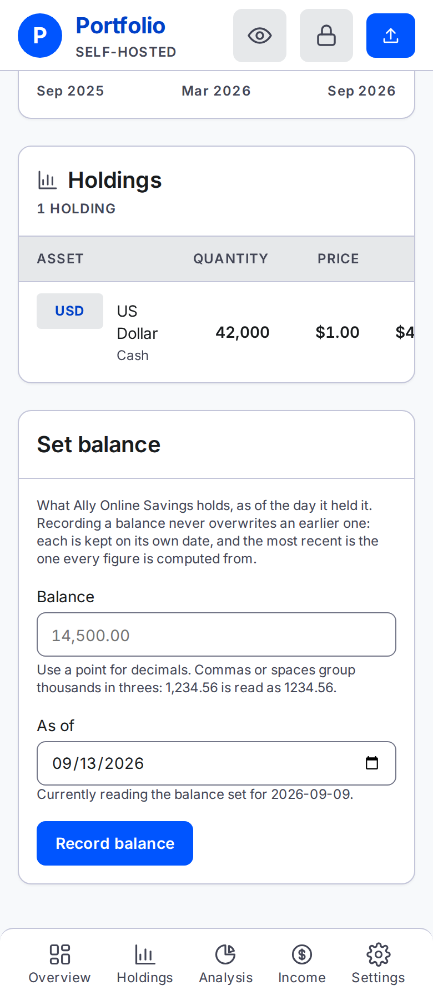

# One account

Everything the app knows about a single account, and the one place a bank or loan balance is typed.

Open it from the account list on **Overview**. The breadcrumb at the top gets you back.

## The identity block

The top panel is what the account *is*, not what it is worth:

- **Owner** — the one person it belongs to.
- **Institution** — a dash when none was recorded. It is optional.
- **Kind** — brokerage, workplace plan, IRA, bank or loan.
- **Tax treatment** — taxable, tax-deferred or tax-free.

All four are edited under Settings. **Edit details** on the right goes straight there.

## The total

**Total value** is what this account is worth now. It is the same figure the Overview row for this
account shows. The **As of** line above it, with its **Refresh now** button, is the same control
every figure screen carries — [Why a number did not change](prices.md) explains both.

Three things it can say instead of a figure:

- **"Based on N of M holdings."** under the total — some positions have never been priced. They are
  left out of the figure rather than counted as zero. See [Why a number did not
  change](prices.md#this-holding-shows-a-dash).
- **No figure, and a sentence saying none of this account's holdings has ever been priced.** There
  is nothing to add up.
- **No figure, and a sentence saying nothing has been recorded yet.** New account, no statement and
  no balance.

## The chart

**Performance** uses the same ranges as [Overview](overview.md#the-range-control), but reads this
account alone. All starts at its first statement; Custom uses the dates you choose within that history. Manual household history is
never included. The chosen range lives in the URL and is remembered in this browser.

A line needs two valued-date samples with holdings. Try All or let more days accumulate; another
statement is not required. The empty panel's second-statement instruction is outdated.
For 1D, the latest stored session needs two observed instants.
The readout names the selected point and can differ from the current headline.

## The holdings table

Every position this account holds, with the count in the panel header.

- **Asset** — the ticker as a badge where there is one, the name, and a note line underneath giving
  the asset class and, where it applies, **price is stale** or **never priced**.
- **Quantity**, **Price**, **Value** — a dash rather than `$0.00` wherever nothing can be priced.

There is no "today's change" column, and no change figure beside the total. The chart shows account value, not investment return.

There is no **Annual dividend** column either, though [Holdings](holdings.md#the-columns) has one.
What this account is projected to pay is a row of the by-account breakdown on
[Income](income.md#annual-dividend-by-account), and answering the same question on two screens is
how the two come to disagree.

An account with nothing recorded shows a short note in place of the table, pointing at whichever way
in applies to it — a balance for a bank or loan, [an upload](upload.md) for anything else.

## Just after an upload

Landing here from a recorded statement puts one line above the identity block: the file's name, how
many positions were added, updated and removed, the date the statement was recorded under, and how
many positions the account now holds. A first statement reads as additions only, since there was
nothing to update or remove.

It is a sentence, not a pop-up, and every figure in it is read back from what was actually stored.
It goes when you navigate away.

## Set balance

Bank and loan accounts offer a form for recording a single USD balance. Any open account can also
receive a CSV upload. Securities accounts have no Set balance form because one cash row would
replace their other holdings; use an upload or a Holdings correction.

### The amount

Type a **plain positive amount**. The app applies the direction from the kind of account:

- On a bank account the box is captioned **Balance**.
- On a loan it is captioned **Amount owed**, and what you type counts against the household. You
  never type the minus sign — typing one is refused.

Dollar signs and thousands separators are fine. Cents are the limit — a third decimal place is
refused rather than rounded.

The box opens **empty** rather than pre-filled. The figure it is replacing is stated beside it
instead, so re-recording a stale number is never one click.

### The date

As of starts at today. Dates before 1970 or after tomorrow are refused. Tomorrow is allowed for
households ahead of the server’s time zone. The form also states the current snapshot’s date.

### What saving does

Record balance appends a snapshot on the date you choose. A later submission for the same date
supersedes the earlier one. A backdated balance can change values from that date until the next
snapshot; an older record does not replace a newer current balance. Undo by recording another entry.

## On a phone

The identity block drops from a row of four to one field per line, and **Total value** with its
buttons sits below rather than beside it. The range buttons on **Performance** scroll sideways past
the edge of the screen rather than wrapping, the same as every strip of chips in this guide —
**1Y** and the rest are there, just off to the right.

---

**Next:** [Holdings](holdings.md) — every position across every account, filtered and grouped.
