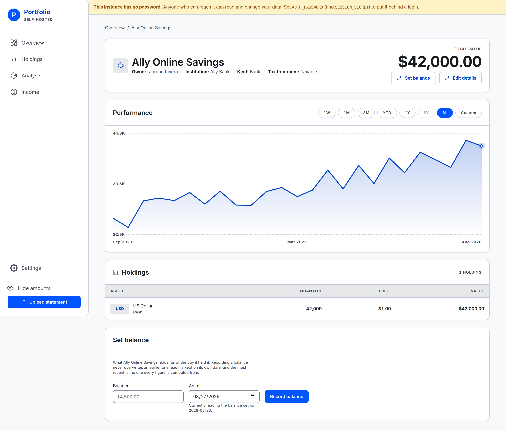

# One account

Everything the app knows about a single account, and the one place a bank or loan balance is typed.

Open it from the account list on **Overview**. The breadcrumb at the top gets you back.

## The identity block

The top panel is what the account *is*, not what it is worth:

- **Owner** — the one person it belongs to.
- **Institution** — a dash when none was recorded. It is optional.
- **Kind** — brokerage, workplace plan, IRA, bank or loan.
- **Tax treatment** — taxable, tax-deferred or tax-free.

All four are edited under Settings. **Edit details** on the right goes straight there.

## The total

**Total value** is what this account is worth now. It is the same figure the Overview row for this
account shows.

Three things it can say instead of a figure:

- **"Based on N of M holdings."** under the total — some positions have never been priced. They are
  left out of the figure rather than counted as zero. See [Why a number did not
  change](prices.md#this-holding-shows-a-dash).
- **No figure, and a sentence saying none of this account's holdings has ever been priced.** There
  is nothing to add up.
- **No figure, and a sentence saying nothing has been recorded yet.** New account, no statement and
  no balance.

## The chart

**Performance** draws this account alone, over the same eight ranges Overview offers — **1W**,
**1M**, **3M**, **YTD**, **1Y**, **5Y**, **All** or a **Custom** span you pick yourself. It opens on
1Y, or on whichever range this browser last picked on either screen.

The range is part of the address, so a chosen range survives a reload and can be bookmarked or sent
to someone else in the household. A range this account's own history cannot reach yet — 5Y on an
account eight months old — shows greyed out rather than doing what All already does.

**All and Custom are measured from this account's own first statement, never the household's.** An
older sibling account does not make this one's history look any longer than it is, and neither
range ever pulls in the household's hand-typed pre-app figures — see below.

A line needs two dated points. With fewer than two in the chosen range, the panel says how many it
has — try **All**, or wait until a second statement or balance is recorded.

The chart never draws the household's hand-typed pre-history. That figure is the household's net
worth, not this account's.

## The holdings table

Every position this account holds, with the count in the panel header.

- **Asset** — the ticker as a badge where there is one, the name, and a note line underneath giving
  the asset class and, where it applies, **price is stale** or **never priced**.
- **Quantity**, **Price**, **Value** — a dash rather than `$0.00` wherever nothing can be priced.

There is no "today's change" column, and no change figure beside the total. See [Account
detail](../../README.md#account-detail--one-account-end-to-end) for why.

There is no **Annual dividend** column either, though [Holdings](holdings.md#the-columns) has one.
What this account is projected to pay is a row of the by-account breakdown on
[Income](income.md#annual-dividend-by-account), and answering the same question on two screens is
how the two come to disagree.

An account with nothing recorded shows a short note in place of the table, pointing at whichever way
in applies to it — a balance for a bank or loan, [an upload](upload.md) for anything else.

## Just after an upload

Landing here from a recorded statement puts one line above the identity block: the file's name, how
many positions were added, updated and removed, the date the statement was recorded under, and how
many positions the account now holds. A first statement reads as additions only, since there was
nothing to update or remove.

It is a sentence, not a pop-up, and every figure in it is read back from what was actually stored.
It goes when you navigate away.

## Set balance

A bank or loan account has no statement worth mapping, so it gets a form instead. The panel sits at
the foot of the page, and **Set balance** in the header jumps to it.

**Only bank and loan accounts are offered it.** A brokerage, IRA or workplace plan holds individual
positions, and typing one cash figure against it would record everything else it holds as sold — so
those accounts have no form at all, and a submission against one is refused. Use [an
upload](upload.md) for them.

### The amount

Type a **plain positive amount**. The app applies the direction from the kind of account:

- On a bank account the box is captioned **Balance**.
- On a loan it is captioned **Amount owed**, and what you type counts against the household. You
  never type the minus sign — typing one is refused.

Dollar signs and thousands separators are fine. Cents are the limit — a third decimal place is
refused rather than rounded.

The box opens **empty** rather than pre-filled. The figure it is replacing is stated beside it
instead, so re-recording a stale number is never one click.

### The date

**As of** opens on today. **A date in the future is refused** — a balance is
recorded once it is true. Only tomorrow is allowed through, which covers a household in a time zone
ahead of the server. **A date before 1970-01-01 is refused** too — that is the first day this
application can put a price on anything, so nothing dated earlier could be valued. It is the floor a
mistyped millennium lands under: `1026` for `2026` is one keystroke, it is not in the future, and it
used to be accepted.

Under the box the form says which day the account is currently reading, and whether that came from a
balance you set or from a statement.

### What saving does

**Record balance** **appends a new record on its own date.** It does not overwrite anything:

- Every earlier balance stays where it was, so your net worth last March does not move because you
  recorded a figure in August.
- Recording a second balance for a date that already has one is a correction, and the later
  submission is the one that counts.
- Undo is another entry, not a delete.

After it saves, the form empties and a line confirms what the account now reads and as of when.

---

**Next:** [Holdings](holdings.md) — every position across every account, filtered and grouped.
