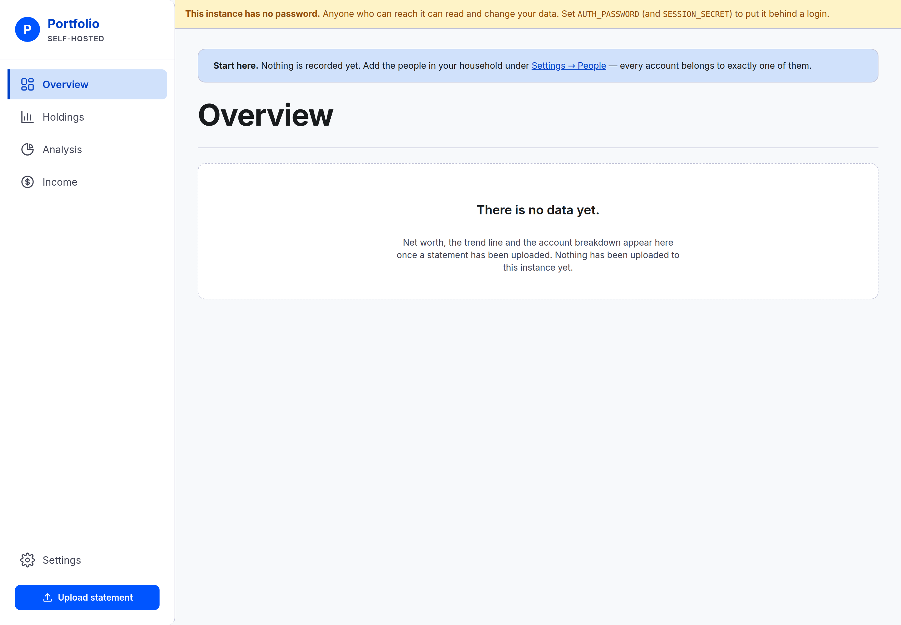

# Opening the app for the first time

What a brand-new instance shows you, and the two things to do before it can hold anything.

## Signing in with Google

Open the address whoever runs the instance gave you. Before the app draws anything you are handed
to Google's own sign-in — there is no password to type and no sign-in screen belonging to this app.
Choose the Google account whose address you gave to whoever runs the instance, and you arrive on
**Overview**.

On a phone already signed in to that account it is usually one tap, and often nothing at all. Every
so often the app asks again; while your browser is still signed in to Google, that renewal happens
without showing you a screen.

What is not there, so you do not go looking for it:

- **No password**, and nothing to reset. Whatever protects your Google account protects this.
- **No sign-up.** You are let in because your address is on a short list whoever runs the instance
  keeps. Nothing in the app adds you to it.
- **No account each, inside the app.** Everyone who gets in sees the same screens and can change the
  same things — see [People and accounts](people-and-accounts.md#add-the-people).
- **No sign-out control.** Closing the tab does not sign you out. If a phone is lost or a device
  should stop getting in, tell whoever runs the instance — that is done from outside the app.

**If sign-in finishes and you get an error instead of the app**, you signed in with an address that
is not on the list. There is nothing to retry: ask whoever runs the instance to add the address you
actually use, or sign in to Google with the one they already have.

## What a new instance shows

Overview is where sign-in leaves you, and on a fresh instance it says **There is no data yet.** That
is correct: nothing has been uploaded, so no figure is shown.

## If a warning strip says nothing is in front of the instance

A yellow strip across the top of every page means you reached the app without being asked to sign
in — so anyone who can reach it on the same network can read and change your data too. It is the
state the screenshots in this guide were taken in, which is why most of them carry it.

The strip cannot be dismissed, and nothing you can do in the app removes it: putting the sign-in
gate in front of the instance is a job for whoever runs it. Ask them, and point them at
[Operating an instance](../operating.md).

## The "Start here" prompt

A highlighted card sits above every page until the instance is set up:

> **Start here.** Nothing is recorded yet. Add the people in your household under
> Settings → People — every account belongs to exactly one of them.

Do that, and it changes to **One more step**, pointing at Settings → Accounts. Once at least one
person and one account exist, it disappears for good.

It goes away at that point, **not** after your first upload. An instance with accounts and no
statements is set up and waiting, so there is nothing left to prompt about.

The prompt is not dismissible, and it is hidden while you are inside Settings — it would be telling
you to go where you already are.

## Getting around

Down the left side:

- **Overview** — net worth, the trend line, and every account.
- **Holdings** — every position you hold, filtered and grouped any way you ask.
- **Analysis** — the same total broken down by owner, account type and asset class.
- **Income** — what the portfolio is projected to pay over the coming year, and how much of that
  is taxed.

Like Overview and Analysis, Income draws nothing until a statement has been uploaded: one sentence
saying so, and no ring, no zero and no empty chart frame. An instance with nothing in it and a
portfolio that genuinely pays nothing must not look alike.

**Settings** sits on its own at the foot, with the **Show amounts** / **Hide amounts** control
beneath it, and the filled **Upload statement** button below that is how a statement gets in.

## If every amount shows as dots

Amounts start hidden on a browser nobody has answered for: each shows a run of dots, while names,
dates and the shape of the chart stay readable. Press **Show amounts** in the navigation to reveal
them on this browser; hiding them again is the same control. What a fresh browser opens showing is
a household choice at [Settings → Display](settings.md#display). It is a defence against being read
over your shoulder, not a lock — the sign-in above is the only thing that keeps anyone out.

## Light and dark

The app follows whatever your device is set to. There is no toggle in the app, and nothing to
configure — switch your system between light and dark and the next page you open matches.

## On a phone

The left rail becomes a bar across the bottom with the same items in it, and tables reflow to fit.
Nothing is held back on a small screen: adding people, adding accounts, setting a balance and the
whole of Settings all work from a phone.

On the household's own `https://` address — the one the sign-in runs on — the browser offers a real
install: the app gets its own icon and opens in its own window, like any store app. Installing
stores nothing on the phone, and when the app cannot reach home — off the VPN, or the instance
unreachable — it shows a page saying so rather than any figure.
[Installing on a phone](../operating.md#installing-on-a-phone) is the operator's side of it.

---

**Next:** [People and accounts](people-and-accounts.md) — add the household, then what it owns.
