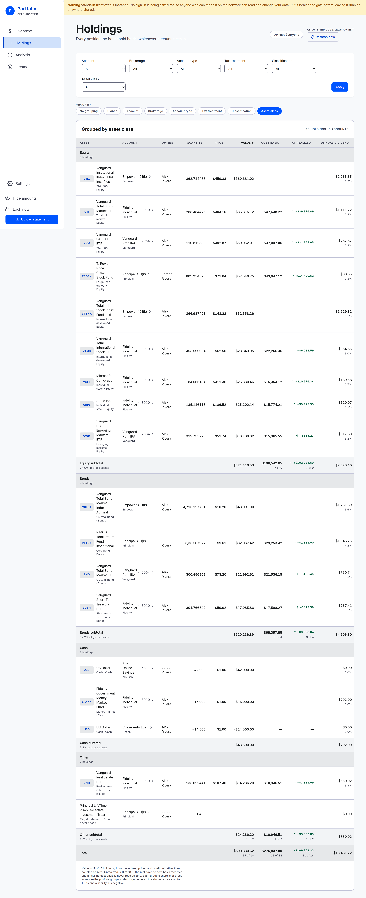
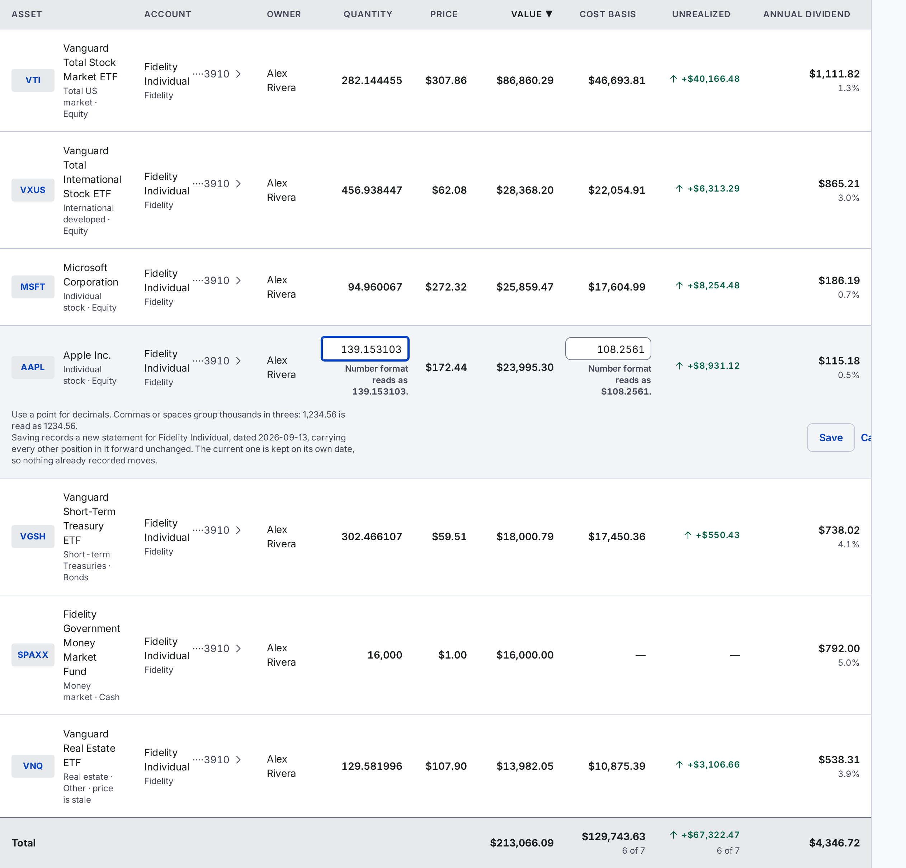

# Holdings

Every position the household holds, in one table you can narrow, group and sort.

## The seven ways to slice it

There are seven dimensions. **Six work as both a filter and a grouping. Owner groups only** —
narrowing to an owner is a household-wide reading you set once and carry across all four money
screens, from the control at the top of this one. See
[reading a screen as one owner](owner-filter.md).

- **Owner** — who the account belongs to. Grouping only; the control at the top does the narrowing.
- **Account** — one account by name. The dropdown adds the institution, because two accounts can
  be called "Roth IRA".
- **Brokerage** — the institution the account is held at.
- **Account type** — brokerage, workplace plan, IRA, bank, loan.
- **Tax treatment** — taxable, tax-deferred, tax-free.
- **Classification** — your own label for what a holding is: "S&P 500", "US total bond",
  "Money market".
- **Asset class** — Equity, Bonds, Cash, Other.

**To filter**, set one or more dropdowns in the bar at the top and press **Apply**. **Clear
filters** appears beside it once something is set.

**To group**, click a chip in the strip below the bar. **No grouping** turns it off. Grouping
keeps your filters, and filtering keeps your grouping.

**To sort**, click a column heading. A caret shows which column is in force and which way. A first
click on a money column starts at the largest, a first click on a name starts at A. The table
opens sorted by Value, largest first.

All three live in the address bar, so a view survives a reload, can be bookmarked, and can be sent
to the other person in the household.

## Why a filter is missing

**A dropdown only appears once the data holds two different values for it.** A household that
banks in one place gets no Brokerage filter; one holding only brokerage accounts gets no Account
type filter. Nothing is being hidden — there is simply no choice to offer.

Every option in a dropdown is a value something in the portfolio really has. Because of that, **no
single filter can leave you with an empty table.**

Two of them still can — nobody holds bonds at that particular brokerage — and when that happens
the screen names the pair rather than leaving you to work it out:

> No holding matches every filter at once. Nothing in the portfolio is at Fidelity and bonds.

The sentence also says how many holdings are recorded in all, and a **Clear filters** button sits
beneath it.

An old link can also point at something that no longer exists — an account you have since closed.
That reads differently, as a filter naming something the portfolio does not hold, and the
dropdown shows "Not in this portfolio" so you can see which one it was.

**An empty result is not an empty portfolio.** A table with nothing in it because of a filter says
so in those words. It never says "nothing has been uploaded yet", which would be false.

**With the owner filter also set, the sentence names whose portfolio it means** — "Alex Rivera
holds nothing at Fidelity." The dropdowns are built from every holding in the household rather than
from the selected owner's, so an unqualified "nothing in the portfolio is at Fidelity" would be
plainly untrue on a narrowed table. The owner filter has its own empty answers, in
[reading a screen as one owner](owner-filter.md#when-a-narrowed-screen-is-empty).

## Grouping and subtotals

Each group gets a heading with its own count, its rows, then a subtotal.

The percentage under a subtotal — "81.5% of gross assets" — is a share of the positive groups
added together, not of the Total row underneath. With a loan in the table the two differ, so the
denominator is named rather than assumed. A group nothing could price has no percentage at all.

The panel header counts what you are looking at: "14 holdings · 4 accounts · filtered from 18".
That last part is there so a filtered table never looks like the whole portfolio — including to
you, a day later, following your own bookmark.

Grouping by Owner or by Account drops that column from the table, since the heading above each
group already says it.

Grouping by Owner is still worth doing under the owner filter — set to two owners, it is how you
read one table as two.

## The columns

- **Asset** — the instrument, with its symbol as a badge, its classification and its asset class
  underneath.
- **Account** — the account that holds it, with the institution underneath. The name is a link to
  that account's page.
- **Owner** — whose account that is.
- **Quantity** — units held. Negative for something owed.
- **Price** — the last price known for it.
- **Value** — quantity times price.
- **Cost basis** — what the whole position cost.
- **Unrealized** — value minus cost basis, with an arrow and a sign.
- **Annual dividend** — what the position is projected to pay over the next year, with that as a
  percentage of its own value underneath. The amount grows with the size of the position; the
  percentage is the figure that compares one row against another.

A dash is not a zero. A dash means the figure is not known: no price recorded, or no cost basis
recorded.

**Annual dividend is the exception, and it never shows a dash.** A holding with no dividend rate on
file reads `$0` — including one nobody can price, which shows a blank Value and `$0` in the same
row. There is no way to tell "this pays nothing" apart from "nobody was asked about it", so both
are counted as nothing and the total is a **lower bound**: it leaves out anything unquoted, all
interest on cash, and any interest on a loan. A holding worth nothing has an amount and no
percentage, since there is nothing to be a percentage of.

Something owed can show a negative figure. A loan whose note carries a rate reads as money going
out rather than coming in, with the rate it is charged at underneath — the same two lines as any
other row, with the other sign.

This column added up — for the whole portfolio, and split by tax treatment and by account — is the
[Income](income.md) screen.

## The totals, and the coverage counts under them

The Total row carries **its own count under each figure that can be short**, and they are genuinely
different numbers.

A workplace plan routinely reports a price and no cost basis at all. So the Value total can cover
every holding while the Unrealized total covers far fewer. The sentence under the table spells out
both:

> Value is all 14 holdings. Unrealized is 9 of 14 — the rest have no cost basis recorded, and a
> missing cost basis is never read as zero.

Do not read one count as covering the row. A cost basis over 11 holdings sitting beside a value
over 17 would look like a gain that nothing in the database supports.

Where a column is complete, it says nothing. The absence of a count is the claim that nothing is
missing. Annual dividend never carries one: every row has a figure, so there is nothing to count.

## Notes on a row

Under the asset name, after the classification and asset class:

- **never priced** — no price has ever been recorded for it. Its price and value show a dash and
  it is left out of the totals.
- **price is stale** — the last known price is being used rather than discarded.

Both are explained in [prices.md](prices.md).

## Correcting a position in place

A statement arrives quarterly and a position changes weekly. Rather than run the whole upload for
"the 401k contribution added eleven units", correct the row here.

**To do it:** click the pencil at the end of a row. The Quantity and Cost basis cells become
boxes. Type, then **Save**. **Cancel** closes without writing.

Two things to know before you type:

- **The cost basis box takes what one share cost**, not what the whole position cost. The column
  prints the position; the box holds the per-share figure a statement prints. The box says "per
  share" until you type in it.
- **Price, Value and Unrealized keep showing the stored figures** while the row is open. They are
  what you are checking your correction against.

### What saving actually does

The line under the open row says it before you click:

> Saving records a new statement for Fidelity Individual, dated 2026-08-23, carrying every other
> position in it forward unchanged. The current one is kept on its own date, so nothing already
> recorded moves.

In plain terms:

- Your correction is filed as **a new statement for that account**, dated today — or dated the day
  of the statement you are correcting, if that one is dated later still. The line names the exact
  date it will use.
- Every other position in the account is carried across unchanged, because a statement is a
  photograph of the whole account.
- **Nothing already recorded moves.** Your net worth in March does not change because you fixed a
  figure in August.
- **To undo, correct it again.** There is no delete. A second correction is another statement, and
  the latest one speaks.

After it lands, a line under the row reads the result back out of the database: "Recorded. Fidelity
Individual now reads 130 of Apple Inc."

### What it will not do

- **It cannot add an instrument.** A correction says "not 100 units but 120", and it can say
  "zero", and it cannot say "and also some Apple". Adding something the account has never held is
  what an upload is for — see [upload.md](upload.md).
- **It cannot turn a holding into a debt.** The sign lives in the quantity, so flipping it would
  move net worth by twice the figure while looking like an ordinary edit. The screen refuses and
  tells you to record zero first if the position really did turn around.
- **On a bank or loan row it takes at most two decimal places**, because that box is holding
  money rather than units.

If a figure is refused, the message appears under the row and the boxes keep what you typed.

### The editor is an address

Opening a row puts `?edit=` in the address bar, so exactly one row is open, and a reload keeps it
open.

**Touching any filter, chip or column heading closes it.** Those controls rebuild the address from
your view alone, and a half-typed correction does not follow you into a different one.

---

**Next:** [Analysis](analysis.md) — the same portfolio as four breakdowns.
