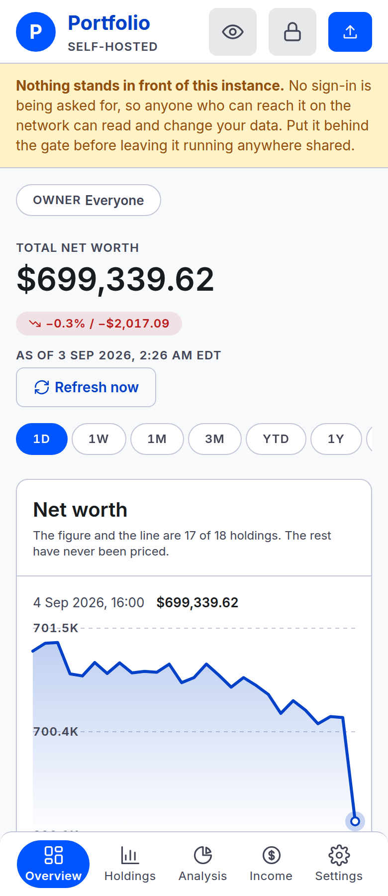
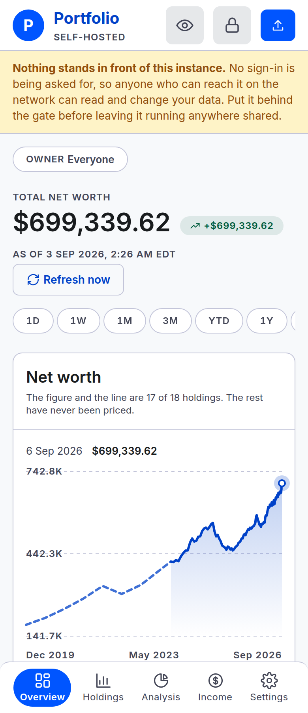

# Overview

What the household is worth today, and the line behind it.

## The headline and the chip beside it

**Total net worth** adds the current value of open accounts. Loans subtract.
The change chip compares current value with the value at the range’s start. This remains true
for Custom ranges ending in the past: the chip is not the change between the chart’s endpoints.
If the starting value is zero, only the amount is shown.

The **As of** line is the oldest provider timestamp among currently held feed-priced instruments,
across the household. A successful refresh need not advance it. [Prices](prices.md).

## The range control

Nine options, top right: **1D**, **1W**, **1M**, **3M**, **YTD**, **1Y**, **5Y**, **All**,
**Custom**. You get 1Y unless you pick another, or unless a browser you have chosen a range on
before opens here again — see below.

- **1D** is the most recent trading session, and it is the one option that is not a span of days —
  see below.
- **1W / 1M / 3M / 1Y / 5Y** are trailing spans back from today — a week, a calendar month, a
  calendar quarter, a year, five years.
- **YTD** is January 1st of this year through today.
- **All** starts at the earliest date anything is recorded — your first statement, or the oldest
  hand-typed point if that is older still. It is not a fixed number of years.
- **Custom** opens a small form with a start and end date. Both boxes refuse a date before your
  earliest data or after today, so you cannot pick a span that could only fail. Once applied, the
  button shows the two dates you chose instead of the word "Custom".

**A greyed-out option is one your data cannot reach yet** — a household eight months old sees 5Y
disabled rather than a click that silently does the same thing All already does. 1D greys out for a
different reason: an instance with no stored price observations has no session to draw yet.

**Narrowing to an owner can grey more of them out**, because a narrowed chart reaches back only as
far as the selected owners' own first recorded holdings — see the dashed line below. The options
come back the moment you press **Show everyone**.

The choice lives in the address bar as `?range=3m` (or, for Custom, `?range=custom&start=…&end=…`). So it
survives a reload, you can bookmark it, and you can send the address to the other person in the
household and they will see the same window you did. Absent an address-bar range, this browser
reopens on whichever range you picked here last time, remembered in a cookie — a convenience, not a
household setting, so it is not in Settings and does not follow you to another browser.

The owner filter, whose control sits beside this one, works the other way round on purpose: it is
the address and nothing else, with no cookie behind it, so opening the base address shows the whole
household; a bookmark or restored tab keeps the selection in its URL. A remembered range shows you the same shape of the same money; a remembered owner would
quietly show you a smaller total. See
[reading a screen as one owner](owner-filter.md#it-lasts-as-long-as-the-address-does).

## Reading a point off the line

The readout names the last plotted point until you point at the chart. It then follows the nearest
point, with a vertical guide. It describes a historical or observed price; the headline uses current
quotes, so the figures can differ even when the range ends today.

## 1D — the latest trading session

1D shows the latest session with stored price observations, from its first recorded instant to its
last. If fetching stopped, that session may be older than the latest market day. There must be at
least two observations at distinct times to draw a line.

- The axis and readout show time on the market’s clock.
- Every distinct observed instant is plotted; one refresh can add several points.
- The change chip compares current value with the close before the displayed session.
- Current quantities are used across the session, so an upload can change the whole 1D line.

Mutual funds often report one daily price, leaving parts of the line flat. The chart does not
stream. Reload or use **Refresh now** to read newer observations.

## The second, dashed line

The solid line values account snapshots on each date. The dashed prefix contains hand-entered
household totals from before those snapshots. Computed points take precedence where they overlap.
The readout identifies hand-entered points.

An [owner-filtered](owner-filter.md) chart omits manual history because those totals have no owner.
**Show everyone** brings it back. There is no History editor in the app yet.

## What the figure counts

An unpriced holding contributes no value to net worth. The coverage note counts priced holdings
against recorded holdings. A missing price is not a zero.

The chart currently lacks per-point coverage labels: past points can be partial even when current
coverage is complete. [Prices](prices.md) explains missing and stale values.

## The accounts list

Every open account, largest first, with its institution, its kind and its owner. The count in the
header — "6 active" — is how many are listed.

- **Click a row to open that account**: its own chart, and what it holds. See
  [account-detail.md](account-detail.md).
- **A liability is an account like any other.** The auto loan reads −$14,500.00 and subtracts from
  the total above. It is not a special case anywhere in the arithmetic.
- **A closed account is not here.** It stops counting toward today's figure and keeps counting on
  every date before you closed it, so the line behind you does not move. Closing is in
  [settings.md](settings.md).

There is no per-account change figure. The list is what each account holds now.

## Allocation by account

The bars are a share of what is **owned**, not a share of the net total.

That has one consequence worth knowing: an account holding nothing ownable has no bar. A loan has
none, and neither does an account whose every position is unpriced. The note under the bars says
so when it applies. The reasoning is in
[the project tour](../../README.md#overview--what-the-household-is-worth).

Only the five largest accounts get a bar. When there are more, the note says how many hold value
altogether.

The figure beside each bar is that account's value, not its percentage. For exact percentages, go
to [Analysis](analysis.md).

## When there is nothing to draw

A line needs at least two plotted points, which can include the household’s manual history. Try **All** or let more dated samples
accumulate; a second statement is not required. For 1D, prices must have been observed at two
distinct times. The empty panel still says a second statement is needed; that wording is outdated.
An account with no records differs from one with records but no prices.

## On a phone

The same page. The left rail becomes a bar along the bottom, and the panels stack. Nothing is
withheld on a small screen.

The readout above the line is filled in already, so the chart says where the line ends without
being pointed at. Tap a point to read that one instead.

1D reads the same way narrower: the axis and readout still name the time of day, and the range
row scrolls sideways to reach the options past 1Y rather than wrapping them onto a second line.

The dashed pre-app line is still there too, and still drawn differently from the solid one for the
same reason as above.

---

**Next:** [The owner filter](owner-filter.md) — narrowing every figure on these screens to one
person's.
