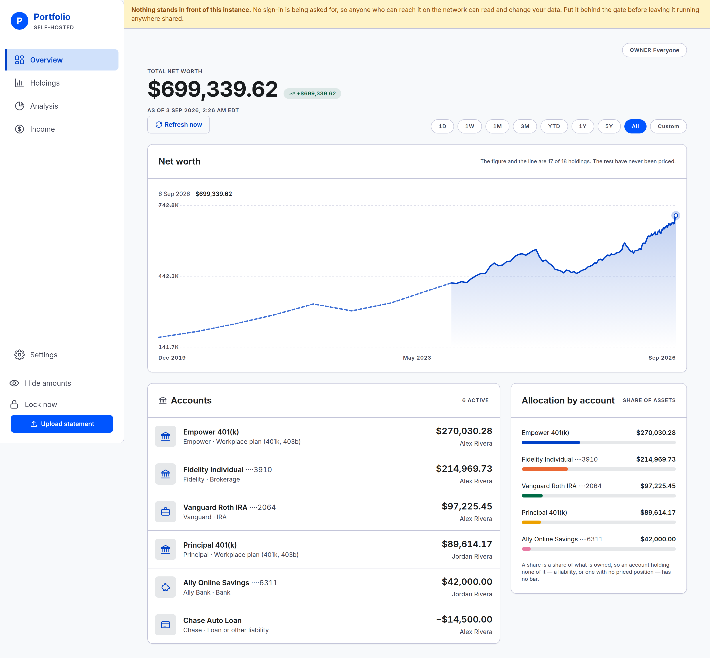

# Overview

What the household is worth today, and the line behind it.

## The headline and the chip beside it

**Total net worth** is every open account added up, valued as of today. A loan subtracts.

The chip beside it is the change over the range you are looking at. It shows the percentage,
then the amount, with an arrow and a sign — so it reads the same way with no colour at all.

Change the range and the chip changes with it. It always measures from the start of the window
on screen to today.

Sometimes there is nothing to measure from. If the window reaches back before your first
statement, the earlier figure is zero, a percentage of zero says nothing, and the chip shows the
amount alone. That is why the All range in the next picture reads `+$687,516.13` with no
percentage.

## The range control

Nine options, top right: **1D**, **1W**, **1M**, **3M**, **YTD**, **1Y**, **5Y**, **All**,
**Custom**. You get 1Y unless you pick another, or unless a browser you have chosen a range on
before opens here again — see below.

- **1D** is the most recent trading session, and it is the one option that is not a span of days —
  see below.
- **1W / 1M / 3M / 1Y / 5Y** are trailing spans back from today — a week, a calendar month, a
  calendar quarter, a year, five years.
- **YTD** is January 1st of this year through today.
- **All** starts at the earliest date anything is recorded — your first statement, or the oldest
  hand-typed point if that is older still. It is not a fixed number of years.
- **Custom** opens a small form with a start and end date. Both boxes refuse a date before your
  earliest data or after today, so you cannot pick a span that could only fail. Once applied, the
  button shows the two dates you chose instead of the word "Custom".

**A greyed-out option is one your data cannot reach yet** — a household eight months old sees 5Y
disabled rather than a click that silently does the same thing All already does. 1D greys out for a
different reason: an instance whose price refresh has never run during market hours has no session
to draw yet.

The choice lives in the address bar as `?range=3m` (or, for Custom, `?range=custom&start=…&end=…`). So it
survives a reload, you can bookmark it, and you can send the address to the other person in the
household and they will see the same window you did. Absent an address-bar range, this browser
reopens on whichever range you picked here last time, remembered in a cookie — a convenience, not a
household setting, so it is not in Settings and does not follow you to another browser.

## Reading a point off the line

Above the line sits a readout. Before you touch anything it names the point the line ends at — its
date, and its value in full rather than rounded the way the axis figures are. On a range ending
today that is the headline figure again, written the same way; on a range ending last month it is
last month's value, which the headline is not.

Point at the chart and the readout follows, naming the point nearest your pointer and marking that
point with a vertical line. A short range holds a point for every day; a longer one thins them out
towards its old end. Either way the nearest point answers, so no stretch of the line is dead.

## 1D — the latest trading session

1D plots one trading session, and it is the only range measured in moments rather than in days. Open
the app mid-session and the line runs from the open to the last price fetched; open it after the
close and the whole session is drawn; open it on a Saturday, on a market holiday, or before the bell
and you get the most recent session there was — Friday's, usually. It is never a blank chart and
never a trailing twenty-four hours.

Three things read differently on it:

- **The axis and the readouts name the time of day**, on the market's clock, rather than a date.
- **The line has one point per price refresh**, unsampled — so it is exactly as detailed as the
  refresh cadence you set at Settings → Prices, and no more.
- **The change beside the headline is measured from yesterday's close**, which is what "today's
  change" means at a brokerage.

Two honest limits. A mutual fund strikes one price a day after the close, so a workplace-plan-heavy
household sees much of its 1D line flat — that is the fund, not the chart. And the line is drawn
once, when the page loads: nothing updates in place, and reloading is how it advances.

## The second, dashed line

Two lines, and they mean different things.

- **The solid line, with the shading under it**, is computed from statements. Every point is your
  accounts valued on that date.
- **The dashed line ahead of it** is a hand-typed net worth history covering the years before this
  instance existed. It is a handful of dates and figures, not a real curve, so it is drawn
  differently rather than blended into the solid line.

Where the two overlap, the computed line wins; the dashed one only fills the gap in front of it.
You will normally see it only at the All range, because the shorter windows start after your first
statement.

Point at one of the hand-typed points and the readout says so, so a rough figure never reads as a
priced valuation. One of them can answer for a wide stretch of chart — for months either side, it
is the nearest thing recorded.

**There is no screen for those points yet.** Settings lists History alongside Classifications and
Instruments as something a later version builds. Until then the dashed prefix is whatever was
loaded into the instance when it was set up: you can read it, and nothing on any screen changes
it.

## What the figure counts

Above the chart you may see a line like:

> The figure and the line are 17 of 18 holdings. The rest have never been priced.

That is the headline and the line telling you what went into them. A holding nobody can put a
price on is left out of the total rather than counted as zero — counting it as zero would quietly
understate the household by the whole position.

The sentence appears only when something is missing. No sentence means every holding is priced.

For why a holding cannot be priced, and what to do about it, see [prices.md](prices.md).

## The accounts list

Every open account, largest first, with its institution, its kind and its owner. The count in the
header — "6 active" — is how many are listed.

- **Click a row to open that account**: its own chart, and what it holds. See
  [account-detail.md](account-detail.md).
- **A liability is an account like any other.** The auto loan reads −$14,500.00 and subtracts from
  the total above. It is not a special case anywhere in the arithmetic.
- **A closed account is not here.** It stops counting toward today's figure and keeps counting on
  every date before you closed it, so the line behind you does not move. Closing is in
  [settings.md](settings.md).

There is no per-account change figure. The list is what each account holds now.

## Allocation by account

The bars are a share of what is **owned**, not a share of the net total.

That has one consequence worth knowing: an account holding nothing ownable has no bar. A loan has
none, and neither does an account whose every position is unpriced. The note under the bars says
so when it applies. The reasoning is in
[the project tour](../../README.md#overview--what-the-household-is-worth).

Only the five largest accounts get a bar. When there are more, the note says how many hold value
altogether.

The figure beside each bar is that account's value, not its percentage. For exact percentages, go
to [Analysis](analysis.md).

## When there is nothing to draw

Two different empty screens, and they are not the same:

- **Nothing uploaded yet.** No figure at all, and a sentence saying so. A net worth of zero and an
  empty instance look identical, and only one of them is worth worrying about. Start at
  [upload.md](upload.md).
- **One dated point.** The panel says a trend needs two dated points and this instance has one.
  The line appears after the second statement.

## On a phone

The same page. The left rail becomes a bar along the bottom, and the panels stack. Nothing is
withheld on a small screen.

The readout above the line is filled in already, so the chart says where the line ends without
being pointed at. Tap a point to read that one instead.

---

**Next:** [Holdings](holdings.md) — every position, and how to see only the ones you want.
