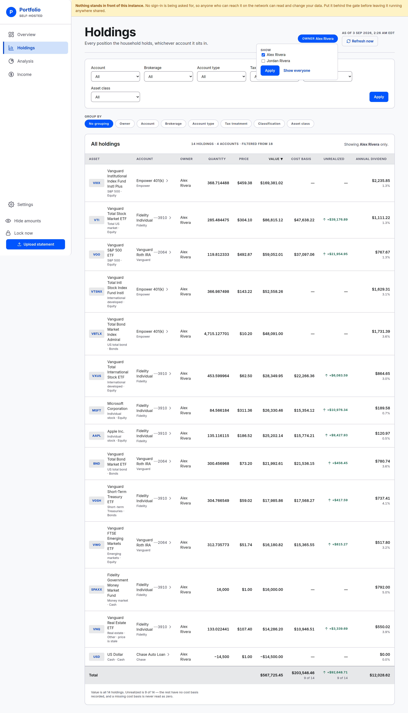

# Reading a screen as one owner

Four screens show the household's money: Overview, Holdings, Analysis and Income. Any of them can be
read as one owner instead — or as two of five, or as everyone but one.

## How to narrow

The control is in the header of each of those four screens, at the top right: a tick box per owner
and an **Apply** button.

1. Tick one or more names.
2. Press **Apply**.

Every figure on the screen is now those owners': the total, the chart, every table, every ring,
every subtotal.

Three things on Holdings deliberately stay the household's, because their whole job is to tell you
what the narrowing left out — the "filtered from" count, the "recorded in all" figure beside an empty
table, and the filter dropdowns, whose options are read from every holding so that narrowing can
never leave you without a way to widen again.

**To widen again**, press **Show everyone**. It sits beside Apply whenever a filter is applied — so
it is there to be pressed on the narrowed screen you are reading, not the moment you tick a box.
Nothing happens until Apply either way: the boxes are a form, and the screen only changes when you
submit it.

Ticking every name is the same as no filter at all — everybody is the household — so the app says so
by tidying the address back to the unnarrowed one.

## It follows you between screens

Narrow on Holdings, click **Analysis**, and Analysis is narrowed too. That is the point: "what does
this look like for just Alex?" is a question you hold while you move around, not a property of one
page.

Some places deliberately do not follow:

- **An account's own page** is already one account, which has exactly one owner. There is nothing
  left to narrow, so no control is drawn.
- **Settings** and **Uploading a statement** are about records rather than about money. They ignore
  the filter, and the links to them do not carry it — so a trip into either ends the reading and you
  set it again on the way back.

## It lasts as long as the address does

The whole of the filter is in the address bar, as `?owner=3` or `?owner=1,3`. Nothing is stored.

- **Reload, bookmark or share it** and you get the same reading. Sending the address to the other
  person in the household shows them exactly what you were looking at.
- **Close the tab and it is gone.** Opening the app fresh — or typing an address by hand — starts
  with everyone, every time.

## It is about noise, not privacy

**Everyone sees everything.** Anyone can set the filter, clear it, and set it to anybody. It narrows
what is *shown*; it decides nothing about what may be *seen*. The Google sign-in at the front door
is the only thing that keeps anyone out.

It is also never chosen for you. The app does not know which person you are — a person here is a
name on an account and nothing else, with no e-mail and no login attached — so a screen never opens
on "your" money. It opens on the household's, and you say if you want less.

## Two things a narrowed screen does differently

**It says who it is showing**, in words, beside the figure it narrowed — "Showing Alex Rivera
only." Holdings also adds the household's own count to its panel header, as "filtered from" that
number. A filter that follows you between screens is a filter you can forget you set, and a total
that quietly means something else is worse than no total.

**The Overview chart cannot reach as far back.** Any hand-typed history from before the app existed
is the household's — there is no owner on it — so a narrowed chart does not draw it and starts at
the selected owners' first recorded holdings instead. **All** gets shorter, and the long ranges may
grey out. A note above the line says so, rather than leaving you with a line that starts
suspiciously late. See [Overview](overview.md#the-second-dashed-line).

## When a narrowed screen is empty

Two different things, and the screen tells them apart.

- **These owners hold nothing.** The screen names them and says so — they are in the household and
  this reading reaches nothing of theirs. Not an error, and everything else is still there;
  **Show everyone** brings it back.
- **The address names an owner the household cannot be read as.** Somebody since removed, or
  somebody whose accounts have all been closed. The screen says which of those it might be. Show
  everyone, or pick a name from the control, which is still on screen.

Neither of those is the first-run message, which says nothing has been uploaded to this instance
yet. That one appears only when it is true.

## Who appears in the list

Everyone who owns at least one **open** account. Somebody whose accounts have all been closed is not
offered, because the screens would come back empty with nothing explaining why.

That is not the app forgetting them. A closed account stops counting toward today's figure — which is
what closing one means, and is true whether or not anybody filters — while it keeps counting on every
date before you closed it, so the line behind you does not move. All of that history is still
recorded and still drawn on the household's chart; it simply cannot be picked out by owner with this
control.

A household with only one owner gets no control at all: there is nothing to choose between.

---

**Next:** [Overview](overview.md#the-second-dashed-line) — the chart, and why a narrowed one starts
later.
