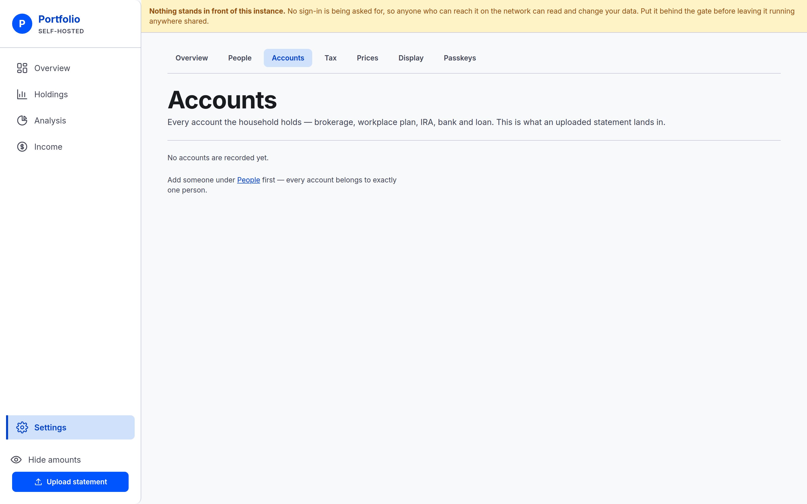
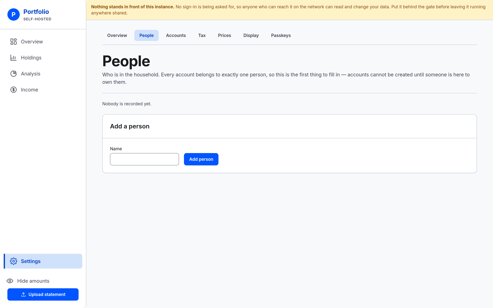
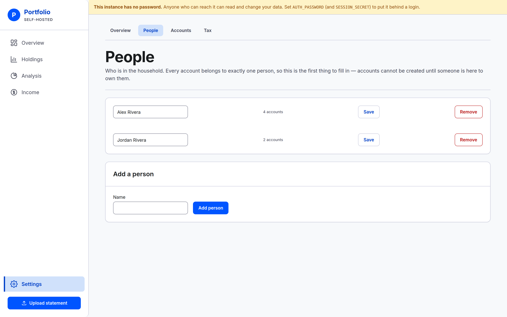

# People and accounts

Record who is in the household, then the accounts they hold, so a statement has somewhere to land.

Do them in that order. Every account belongs to exactly one person, so **Settings → Accounts**
withholds its add form until somebody exists to own one.

> Add someone under People first — every account belongs to exactly one person.

## Add the people

Go to **Settings → People**. On a fresh instance it says **Nobody is recorded yet.**

Under **Add a person**, type a **Name** and select **Add person**. Repeat for everyone whose money
you want counted here.

A name is all there is. Nobody gets a login, an email address or permissions of their own — a person
here is a label for whose money it is. Two people may share a name if they really do.

**To rename someone**, type over the name in their row and select **Save**. Each row carries the
number of accounts that person owns.

## Removing a person

Select **Remove** on their row.

**If they own any account, the removal is refused and the message names the accounts.** Closed
accounts count too, and are listed with `(closed)` after the name. For example:

> Priya still owns Fidelity Brokerage and Old 401k (closed). Change the owner on those accounts
> first — accounts are never deleted, only closed.

The way through is always the same: open each account named, change its **Owner**, then come back.

## Add the accounts

Go to **Settings → Accounts** and fill in **Add an account**.

**Name** — what you call it. Required.

**Institution** — Fidelity, Schwab, your credit union. Optional; leave it blank and the table shows
a dash. It is worth filling in, because column mappings for uploads are remembered per institution.

**Kind** — one of five:

- Brokerage
- Workplace plan (401k, 403b)
- IRA
- Bank
- Loan or other liability

**Owner** — one of the people you just added.

**Tax treatment** — one of three:

- Taxable — tax due on gains
- Tax-deferred — tax due on withdrawal (Traditional)
- Tax-free — no tax on qualified withdrawal (Roth, HSA)

Pick carefully. Changing it later changes every figure computed from that account.

**A plan holding both Traditional and Roth money is two accounts**, at the same institution, one of
each treatment. There is no way to split one account between two treatments.

**Account number** — optional. It is used for one thing: when you upload a statement, the app
compares the number the file carries against this one and refuses to record the file if they name
different accounts. That check happens at the last step of an upload, so it can only ever stop a
statement landing in the wrong account, never move it. Leave it blank and the first uploaded
statement that carries a number fills it in for you.

Select **Add account** and it joins the table above, which lists the account, its institution, kind,
owner, tax treatment and status.

## Correcting or retiring an account

Select an account's name in the table to open it. Change any field and select **Save changes**.

**Nothing is ever deleted here.** There is no delete button anywhere in the app. An account you have
stopped using is *closed* instead: select **Close**, followed by the account's name, at the foot of
its page.

Closing records today as the closing date. From then on:

- The account stops counting toward current net worth.
- It keeps counting on every date before it closed, so your history does not change.
- It disappears from the account list on the upload screen, because a closed account's history does
  not change.

There is no reopen control in this version, so close an account only when it is genuinely finished.

The reasoning behind closing rather than deleting, and behind the three-way tax treatment, is in
[Settings — people and accounts](../../README.md#settings--people-and-accounts).

---

**Next:** [Recording your first statement](first-statement.md) — the four-step upload, end to end.
