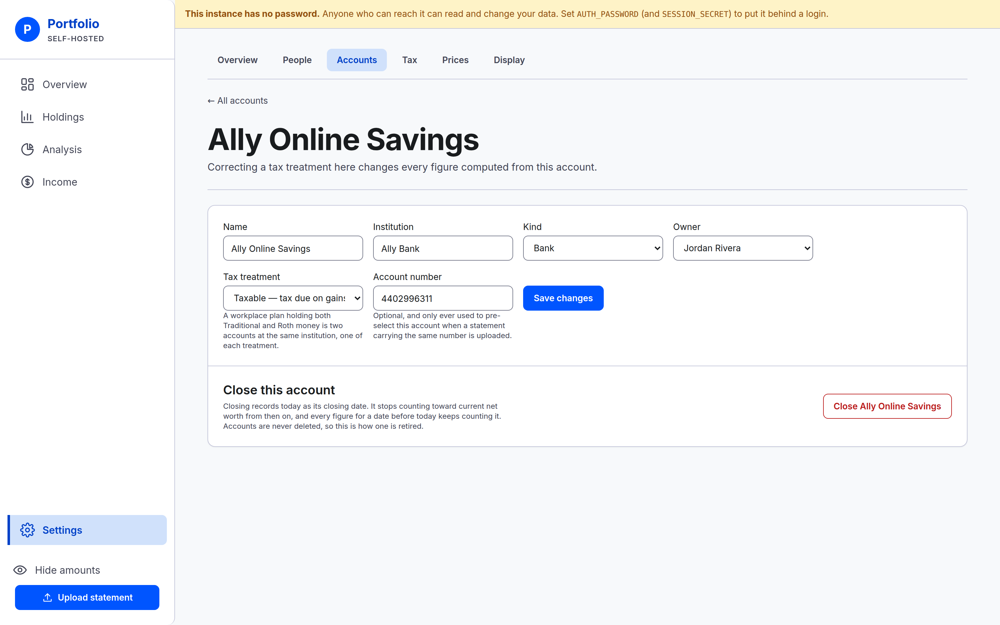
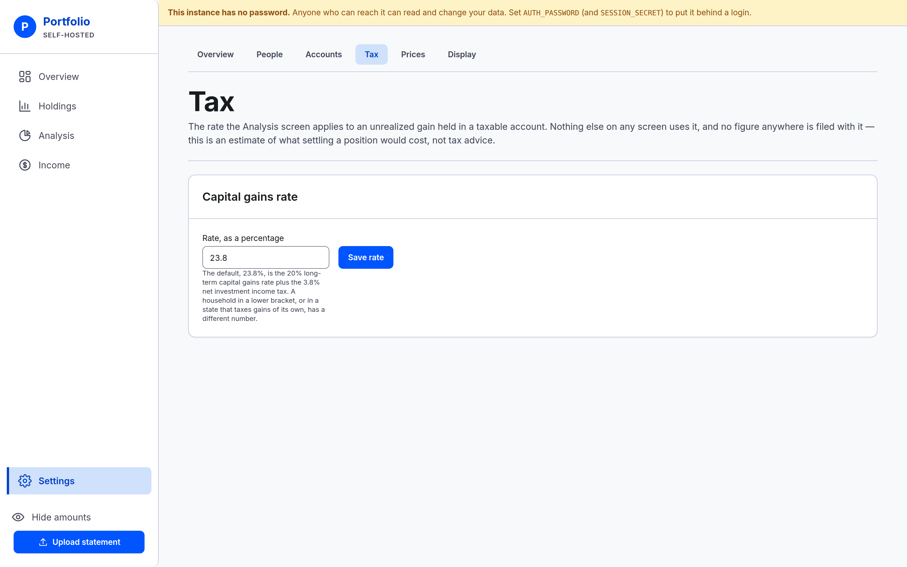
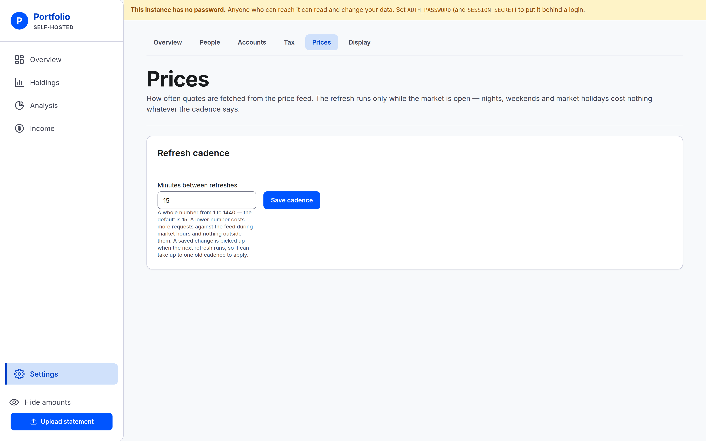

# Settings

Everything that changes what the app knows, apart from [uploading a statement](upload.md).

**Settings** sits at the foot of the left-hand navigation. Inside it, a strip of tabs: **Overview**,
**People**, **Accounts**, **Tax**, **Prices** and **Display**.

## Overview

A one-line description of each tab, and a link into it. It also names the three tabs that are **not
built yet**, so nobody hunts for them:

- **Classifications** — the asset labels an instrument is filed under.
- **Instruments** — managing tickers, and typing a price by hand for something with no public quote.
- **History** — the hand-typed net worth series from before this instance existed.

They are listed with a sentence apiece and nothing to click. See [Not built
yet](../../README.md#not-built-yet).

## People

Who is in the household. Every account belongs to exactly one person, so this is the first thing to
fill in — accounts cannot be created until someone is here to own them.

- **Add** with the form at the foot. A name and nothing else: no email, no login, no role. This is a
  label for whose money it is.
- **Rename** by editing the box on the row and saving it. Names are not required to be unique.
- **Remove** with the button on the row.

Beside each name is how many accounts they own.

### Removal is refused while they own anything

**A person who owns any account cannot be removed** — and that includes accounts that have been
**closed**, because a closed account still counts on every date before it closed, so its owner is
still needed.

The refusal **names each account in the way**, listed by name and marked where one is closed. Change
the owner on those accounts first, then remove the person.

## Accounts

The table lists every account the household holds — the name, the institution, the kind, the owner,
the tax treatment, and whether it is open or closed with its closing date.

A closed account stays in the table, marked as closed. Nothing is removed from this list, ever.

**Add** with the form beneath. If nobody exists yet, the form is replaced by a pointer at People.

The fields, and what a kind and a tax treatment mean for your figures, are covered in [People and
accounts](people-and-accounts.md).

**Account number** is the one worth a word here. It is optional, and it is a **check, not a
chooser**: it never picks an account for you, but if you upload a statement that names a different
account number than the one recorded here, the upload is refused rather than landing in the wrong
place.

### Editing one account

Select the account's name in the table. Every field is editable and saving is one button, but not
every change is accepted.

**Kind** is the one field that can be refused, because it is how the app reads everything the
account already holds. Changing an account to *Bank* or *Loan or other liability* is refused while
its latest statement still lists positions that a single typed balance would replace, and refused
while its balance is recorded the other way round from the kind you picked — savings moved to *Loan
or other liability*, or a debt moved to *Bank*. The message appears beside **Kind** and names what is
in the way. An account with no statement yet can be changed to anything, and so can any account
moving between *Brokerage*, *Workplace plan* and *IRA*.

Correcting a tax treatment here changes every figure computed from this account, everywhere.

This is also where **Edit details** on [the account's own page](account-detail.md) brings you.

### Closing an account

At the foot of that page, set apart from the fields, is the control that closes it. It has its own
button, separate from saving, so an ordinary edit can never retire an account by accident.

**Closing is not deleting.**

- It records **today** as the closing date.
- The account **stops counting toward current net worth** from then on.
- It **keeps counting on every date before it closed**, so your history does not change shape
  because you retired something today.
- **Closing twice changes nothing.** The original closing date stands; a second attempt cannot
  quietly move a boundary your historical figures are computed against.

A closed account is no longer offered when uploading a statement, and will not accept a typed
balance. Its settings page says it is closed and no longer offers the close control, and it drops
out of the current view everywhere else.

**Closing is one-way in this version.** Some refusal messages suggest reopening an account from
Settings; there is no control that does it. If you close one by mistake, add it again and record
against the new one.

**Nothing in this application deletes anything.** There is no delete button anywhere, on any screen.
An account is closed; a balance or a statement is corrected by recording another one; a person can
only be removed once they own nothing at all.

## Tax

One field: the capital gains rate, as a percentage. It starts at **23.8%**.

**Nothing but Analysis uses it**, and no figure anywhere is filed with it. See
[Analysis](analysis.md) for what it estimates and the limits on that estimate.

Type a new rate and save. The box then shows what is stored, which is the confirmation.

## Prices

One field: the **refresh cadence** — how often prices are fetched, in whole minutes from 1 to 1440.
It starts at **15**.

The refresh only runs while the market is open, so a lower number costs more requests against the
price feed during trading hours and nothing at all on evenings, weekends and market holidays.

Type a new cadence and save. The box then shows what is stored, which is the confirmation — and the
change is picked up when the next refresh runs, so it can take up to one old cadence to apply. No
restart is needed. See [Why a number did not change](prices.md) for what a cadence can and cannot
make fresher.

---

**Next:** [When something is refused](when-something-is-refused.md).
