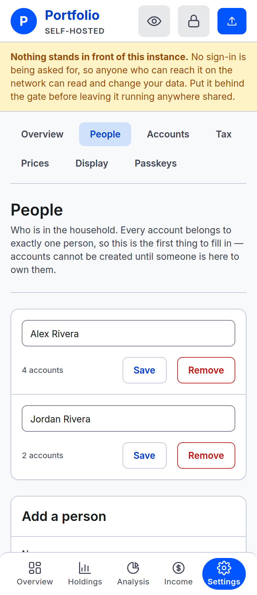
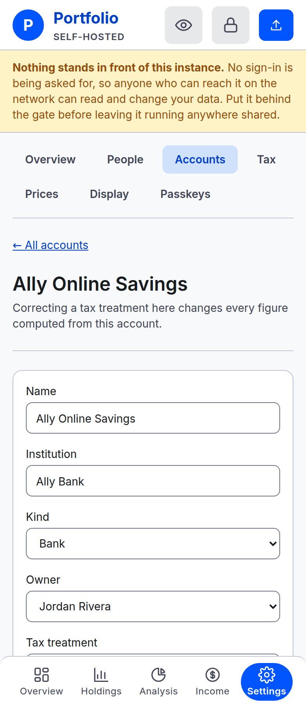
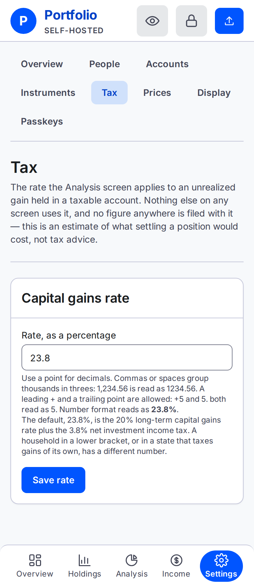
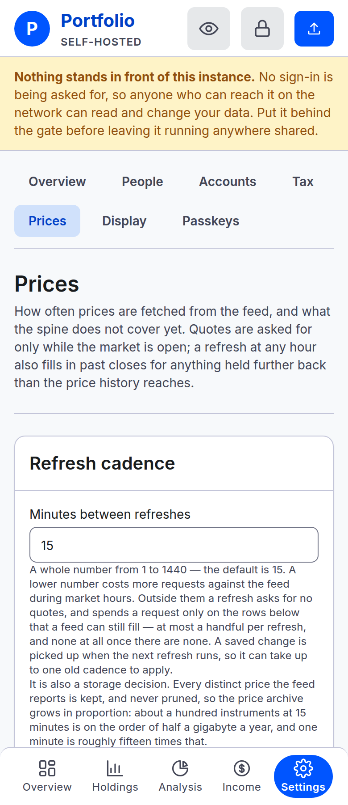
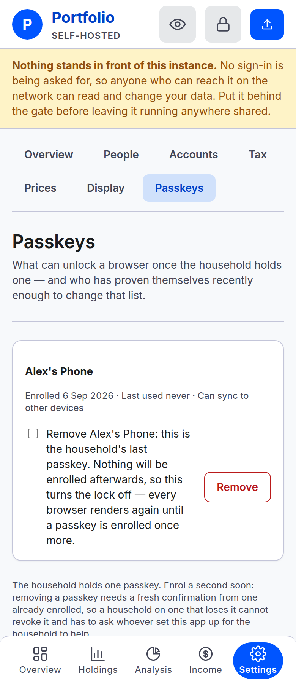
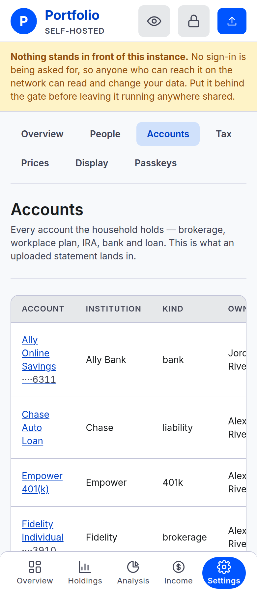

# Settings

Everything that changes what the app knows, apart from [uploading a statement](upload.md).

**Settings** sits at the foot of the left-hand navigation. Inside it, a strip of tabs: **Overview**,
**People**, **Accounts**, **Instruments**, **Tax**, **Prices**, **Display** and **Passkeys**.

## Overview

A one-line description of each tab, and a link into it. It also names what is **not built yet**,
so nobody hunts for it:

- **Classifications.** The asset labels an instrument is filed under.
- **History.** The hand-typed net worth series from before this instance existed.
- The rest of **Instruments**: managing tickers, and typing a price by hand for something with no
  public quote. The tab today holds the names a statement taught the app, below.

They are named together, with a sentence and nothing to click. See [Not built
yet](../../README.md#not-built-yet).

## People

Add, rename, or remove people under this tab. Every account needs an owner.
See [People and accounts](people-and-accounts.md).

### Removal is refused while they own anything

Reassign every account first, including closed accounts. A person with no accounts can be removed.

## Accounts

Add accounts or open one to edit its details. Closed accounts remain listed.
See [People and accounts](people-and-accounts.md#add-the-accounts).

### Editing one account

Edit name, institution, owner, account number, kind, or tax treatment. Kind changes are guarded
against incompatible current holdings. Metadata is not versioned: changing it also changes
historical labels and groupings.

### Closing an account

Closing requires acknowledgement and removes the account from current totals. Existing snapshots
remain for historical queries. Closed accounts cannot accept new uploads or corrections, and
there is no reopen control. See [account lifecycle](people-and-accounts.md#correcting-or-retiring-an-account).

## Instruments

Every name a recorded statement has taught the app, exactly as the file wrote it, beside the
instrument it means and how many open accounts hold that instrument today. The next upload reads
this list before asking anything, so a wrong match here is what silently files a holding under the
wrong security. Two repairs, each behind a preview:

- **Repoint.** Pick the instrument the name should mean and press **Repoint**. The preview says what
  the next upload will read the name as, lists the accounts that hold the old instrument today, and
  lists the recorded statements whose file carries the name. Nothing recorded changes: a holding
  does not remember which name produced it, so a wrong figure already recorded is fixed by
  uploading that account's statement again. Confirm with **Repoint it**, or **Keep it as it is**.
- **Forget.** The next upload naming the string asks what it means, as it did the first time. Use
  this when the right instrument does not exist yet, since creating one happens on that step.

A change made from another tab in between is refused, not applied over the top: the confirm carries
the instrument the preview was drawn against.

## Tax

Set the household rate used by Analysis for its potential-tax estimate. This is a projection,
not a tax calculation for filing. See [Analysis](analysis.md#the-rate-is-yours).

## Prices

Set the quote-refresh cadence, in whole minutes from 1 to 1440; the default is 15. The next scheduled
tick picks up a change. This tab also lists missing historical price coverage and the last backfill outcome.
Rows marked **Never** have no supported feed history (manual pricing, no ticker, or another price
source); waiting for another backfill will not fill them.
It is not a list of all stale current quotes. See [Prices](prices.md).

## Display

What a browser that has never pressed the **Show amounts** control opens showing. Three choices:
masked every time, showing every time, or however that browser was last left. It starts at
masked.

This is the household's standing answer, not the control itself. The control, **Show amounts** /
**Hide amounts**, in the navigation on every screen, flips this one browser right now, and needs
no network to do it. Masking hides every amount behind dots while names, dates, the shape of the
chart and every percentage stay readable. It is not a lock. The amounts are still in the page, and
the sign-in at the front door keeps a person out while the lock keeps a browser out.

## Passkeys

Enrol and remove credentials for the browser lock. The first enrolment locks other browsers;
removing the last passkey disables that lock. Read [Passkeys and the lock](passkeys.md) before changing them.

## On a phone

The tab strip wraps to a second row instead of scrolling, so the seven tabs stay in view together
rather than hiding some off to the side, the way [the upload flow's own step
strip](upload.md#on-a-phone) does too. The tables on
this screen keep their columns and scroll sideways to see them all, the way every table but
Holdings does; **Tax treatment** and the closed/open status are there, just past the edge shown
here.

---

**Next:** [When something is refused](when-something-is-refused.md).
