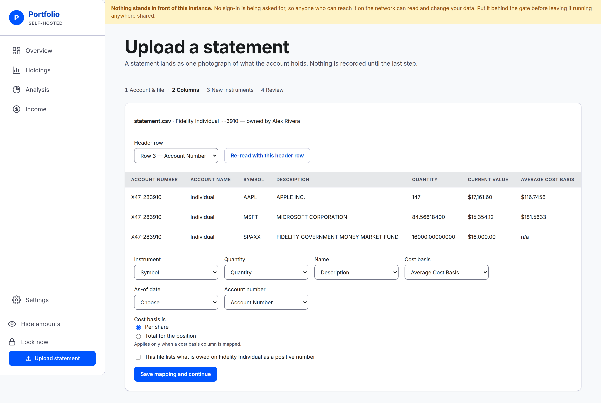
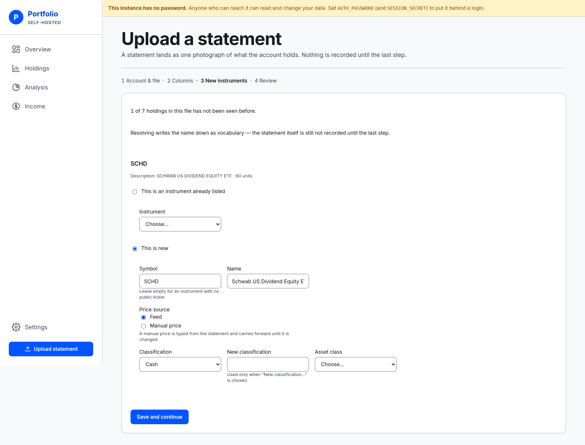

# Uploading a statement

Every rule the CSV upload follows — what it accepts, what it does to your rows, and what it refuses.

Doing one for the first time is walked through in [Your first statement](first-statement.md). This
page is the reference behind it.

## What the app accepts

**CSV files only.** A `.csv` export, saved as text.

- **No OFX, QIF, XLSX or PDF.** A spreadsheet or a PDF statement is not read. Most institutions
  offer a CSV download beside the one you took; use that.
- **No bank linking.** Nothing here connects to an institution, so there is no account to link and
  no credentials to give. A statement gets in because you exported it and uploaded it.
- **Not empty.** A zero-byte download is refused as what it is — export it again.
- **Under the size cap**, which the upload screen states. It is set by whoever runs the instance;
  see [Operating an instance](../operating.md#environment-variables).

A leading byte-order mark — the invisible marker some exports start with — is fine and is stripped.

## What the reader tolerates

You do not have to tidy a file up first.

- **Comma, semicolon and tab are all detected**, by which one divides the file most consistently —
  not by counting commas on the first line.
- **Quoted fields** work as they do everywhere: a quoted cell may contain the delimiter, a line
  break and doubled quotes.
- **Any line ending** — Windows, Unix or old Mac.
- **Preamble and footer rows.** "Account Summary", a date stamp, a blank line, a disclaimer at the
  foot: rows above the header are never read, and a row with nothing in the instrument column is
  passed over.
- **Ragged rows.** Rows shorter or longer than the header do not break the read.

## The account and the file

Pick which account the statement describes, then the file. **Only open accounts are offered** — a
closed account's history does not change, so a statement cannot land in one.

The account you pick is the account the statement lands in. Nothing in the file selects it.

## The header row

The app finds the header row itself — the first plausible row whose column count matches the data
under it, which is what skips a preamble.

**You can override it.** The **Header row** dropdown lists every row it could sensibly be, each
labelled by its number and its first few cells, and re-reading with a different one redraws the
sample rows and every column choice below.

The three sample rows underneath are your file's own words, unaltered — dollar signs, `n/a` and
all. Map by looking at those values rather than at column names.

## The six columns

- **Instrument** — required. The ticker or fund name identifying the position.
- **Quantity** — required. How much is held.
- **Name** — optional. A longer description, used when a new instrument has to be created.
- **Cost basis** — optional.
- **As-of date** — optional. The day the statement is true for.
- **Account number** — optional. Checked, never used to choose the account.

Every optional one can be marked **Not in this file**, which is a different answer from leaving it
unchosen — only the deliberate one saves.

One column cannot be two things at once. Mapping the same column to two roles is refused, naming
both.

**Cost basis is:** choose **Per share** or **Total for the position**. Brokerages split about evenly
between the two, and getting it wrong is wrong by the size of the position. It only matters when a
cost basis column is mapped.

**"lists what is owed as a positive number"** — a checkbox, captioned with the account's name. A
loan statement usually prints the balance as a positive figure; ticking this is what turns it into
something that counts against the household. It arrives pre-ticked on a loan account. Left unticked,
the file's own sign is kept, which is how a genuine overdraft on a bank export records.

## Mapping memory

**A statement format is mapped once per institution.**

The mapping is saved against the account's institution and the shape of the file's header row, so
the next export with that same header arrives with every choice already filled in.

- **It is always shown, never silently applied.** You see what it decided before you continue, so a
  changed export is visible rather than quietly mis-read.
- **A reordered or retitled export is a new shape** and costs one re-map. Capitalisation and extra
  spacing do not count as a change.
- **A saved column the new file no longer has is named on screen**, so you can remap it or mark it
  absent instead of wondering why a choice is blank.
- **Correcting a mapping replaces it.** There is no list of saved mappings to manage.

## Dates

Three spellings are read: `YYYY-MM-DD`, `MM/DD/YYYY` and `M/D/YYYY`.

- **If the file dates itself**, the review screen states that date and offers no date box. The
  statement's own date is not something to override with an opinion.
- **If it does not**, the review screen asks. It opens on today, and a date in the future is
  refused.
- **Rows disagreeing about the date refuse the file**, naming both lines — a statement is one day,
  and the app will not pick between two. The same date written two ways in one file is one date.
- A date that is not on the calendar is refused as such.

## What happens to your rows

- **A row with a blank instrument is skipped silently.** That is a spacer or a footer.
- **A row that names something but whose quantity is an absence marker is skipped and listed on the
  review**, by line number. A blank, a dash or `n/a` in the quantity column is the usual case — a
  "Cash & Cash Investments" heading, a subtotal. It is named rather than dropped quietly, because a
  row that vanishes without a word would count as sold.
- **A quantity that is nonsense refuses the whole file**, naming the line and quoting what it read.
  A disclaimer sitting under the quantity column must not become a position.
- **Figures finer than the app stores are refused rather than rounded** — quantities past eight
  decimal places, money past four. The file's figure is kept exactly or the file is wrong.
- **Rows repeating an instrument are combined**: quantities summed, cost basis weighted by quantity.
  The review lists what was combined.
- **A file with nothing at all under the chosen instrument column** is refused there and then, so
  you fix the column choice rather than meeting an empty diff two screens later.

## New instruments

An instrument name the app has never seen is a **first sighting**, and it is resolved once. Matching
is exact — a respelling of a fund you already hold is a first sighting too, because guessing that
two near-identical strings mean the same fund is how a holding gets attached to the wrong one.

For each, either:

- **Point it at something already listed.** Nothing new is created; the spelling is simply attached.
- **Create it**, with a **symbol** (leave empty for something with no public ticker), a **name**
  (prefilled from the file), a **price source** and a **classification**.

**Price source** is **Feed** — looked up automatically, which needs a symbol — or **Manual price**,
typed by hand and carried forward until changed. A workplace plan's collective investment trust is
the usual manual case.

**Classification** is picked from the list, or **New classification…** with a name and one of Equity,
Bonds, Cash or Other.

There is no skip. A string left unanswered would be a holding silently missing from the statement.

**The answer is remembered permanently**, so that spelling passes straight through on every later
export.

**This is the flow's one early write, and it is kept even if you abandon the draft.** Resolving
records vocabulary, not the statement. Walking away after this step leaves the app knowing the name
and holding no position — which is the right outcome, and makes the next attempt quieter.

**Non-USD is refused, never converted.** Creating an instrument that quotes in another currency is
refused naming the currency; the instance holds dollars only.

## The review

**A statement is one photograph of the whole account.** Anything the account currently holds that
the file does not list counts as **sold**. A filtered export showing 2 of 30 positions is a perfectly
valid statement that sells 28 holdings.

So the review screen is where the reading happens:

- **Added**, **Updated** and **Removed**, in that order. Updated rows show before → after on
  whatever changed.
- **Unchanged rows are counted, not listed.**
- **Every removal is listed individually**, with its quantity and its last known value — never as a
  count. A dash rather than `$0.00` where nothing ever priced it.
- **A file removing more than half of what the account holds cannot be recorded until you tick a
  sentence stating the ratio.** Half or less draws no tick at all. Before ticking, check you
  exported everything rather than a filtered page.
- A first statement for an account reads as additions only.

**Nothing is recorded until you commit here.** The first three screens write only to the draft (and
the vocabulary above). A misread column caught on this screen costs you a walk back to the columns
step and nothing else.

A few things are only caught at the moment of recording, and each refuses the whole file with
nothing written: rows disagreeing about which account number the file describes, a file whose
account number contradicts the one recorded on the account, an account closed while the draft sat
open, and a figure so large the app could not hold it.

## Drafts

An upload in progress is a draft with its own address.

- **Every step is a real URL.** The back button, a reload, and a half-finished upload reopened later
  all behave. It works with JavaScript turned off.
- **Bare draft addresses resume** at whichever step still needs an answer.
- **Drafts are swept after 24 hours.** One left overnight is gone in the morning; nothing was
  recorded, and the column mapping is remembered anyway.
- **A draft is deleted the moment its statement is recorded**, so returning to a finished step lands
  on the expired page.
- **A draft whose account has since been closed reads as expired**, not as forbidden.

## Two things that do not exist

- **Everything is USD.** No currency conversion, anywhere.
- **There is no export or download.** Nothing in the app produces a file. Getting your data out is a
  database backup, which is the instance owner's job — see [Backups](../operating.md#backups).

---

**Next:** [One account](account-detail.md) — where a recorded statement lands.
