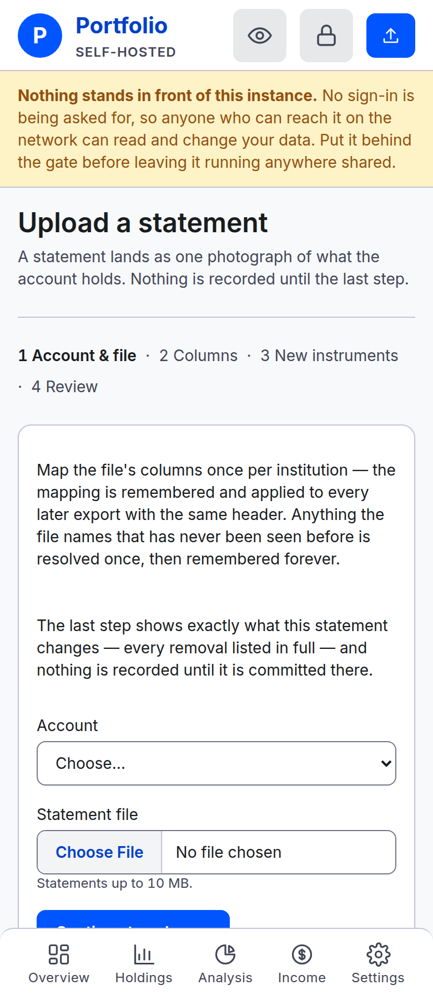
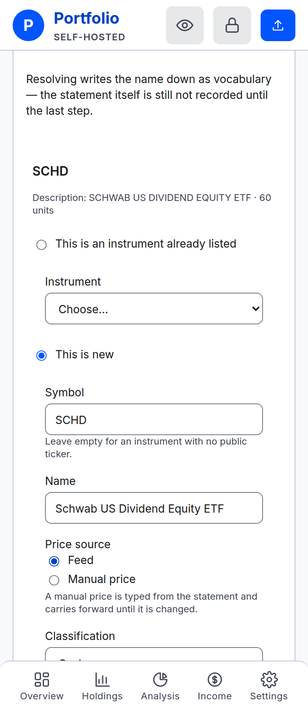
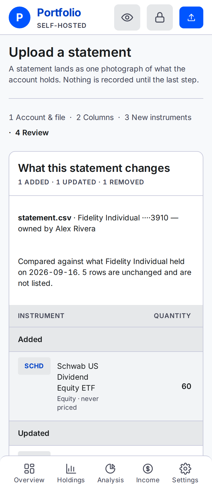

# Uploading a statement

Every rule the CSV upload follows — what it accepts, what it does to your rows, and what it refuses.

Doing one for the first time is walked through in [Your first statement](first-statement.md). This
page is the reference behind it.

## What the app accepts

**CSV files only.** A `.csv` export, saved as text.

- **No OFX, QIF, XLSX or PDF.** The first screen checks one thing: that the file reads as text. A
  spreadsheet or a PDF is binary in practice and is refused there. Anything that does read as
  text — OFX, QIF, the odd all-text PDF — gets past that check and usually stops at the mapping
  screen instead, where the instrument and quantity can never come from the same column. Most
  institutions offer a CSV download beside the one you took; use that.
- **No bank linking.** Nothing here connects to an institution, so there is no account to link and
  no credentials to give. A statement gets in because you exported it and uploaded it.
- **Not empty.** A zero-byte download is refused as what it is — export it again.
- **Under the size cap**, which the upload screen states. It is set by whoever runs the instance;
  see [Operating an instance](../operating.md#environment-variables).

A leading byte-order mark — the invisible marker some exports start with — is fine and is stripped.

## What the reader tolerates

You do not have to tidy a file up first.

- **Comma, semicolon and tab are all detected**, by which one divides the file most consistently —
  not by counting commas on the first line.
- **Quoted fields** work as they do everywhere: a quoted cell may contain the delimiter, a line
  break and doubled quotes.
- **Any line ending** — Windows, Unix or old Mac.
- **Preamble and footer rows.** "Account Summary", a date stamp, a blank line, a disclaimer at the
  foot: rows above the header are never read, and a row with nothing in the instrument column is
  passed over.
- **Ragged rows.** Rows shorter or longer than the header do not break the read.

## The account and the file

Pick which account the statement describes, then the file. **Only open accounts are offered** — a
closed account's history does not change, so a statement cannot land in one.

The account you pick is the account the statement lands in. Nothing in the file selects it.

## The header row

The app finds the header row itself — the first plausible row whose column count matches the data
under it, which is what skips a preamble.

**You can override it.** The **Header row** dropdown lists every row it could sensibly be, each
labelled by its number and its first few cells, and re-reading with a different one redraws the
sample rows and every column choice below.

The three sample rows underneath are your file's own words, unaltered — dollar signs, `n/a` and
all. Map by looking at those values rather than at column names.

## The six columns

Instrument and Quantity are required and must use different columns. Name, Cost basis, As-of date,
and Account number are optional. Choose **Not in this file** for an absent column; an unchosen
optional field is also saved as absent.

For cost basis, specify whether the file gives a per-share figure or the whole position’s total.
The app stores per-share basis to four decimals, so dividing a total by quantity can lose precision.
Use the preview values rather than relying on column names alone.

### No export? Copy the template

When an institution offers no CSV download — a pension portal, a paper statement — copy
[`example-statement.csv`](example-statement.csv) and fill it in by hand. Its header carries a column
for every one of the six roles above, named so each choice is obvious, and its rows show the shapes
the reader accepts: whole and fractional quantities, an instrument with no public ticker, and `n/a`
where a cost basis is unknown (write `n/a`, never `0` — a zero basis reports a fake gain).

Three rules when filling it in:

- **One file is one account.** The account is chosen on the upload screen, not by the file, and a
  statement is a photograph of the whole account — so list *everything* that account holds, and
  make a separate file for each account.
- **Every row carries the same as-of date**, the day the figures are true for. Rows disagreeing
  refuse the file.
- **Cost basis in the template is per share.** Map it and pick **Per share**; if you'd rather
  record each position's total cost, keep the figures consistent and pick **Total for the
  position** instead.

The mapping is remembered against the header row, so once mapped it fills itself in on every later
file built from the same template.

**"lists what is owed as a positive number"** — a checkbox, captioned with the account's name. A
loan statement usually prints the balance as a positive figure; ticking this is what turns it into
something that counts against the household. It arrives pre-ticked on a loan account. Left unticked,
the file's own sign is kept, which is how a genuine overdraft on a bank export records.

## Mapping memory

**A statement format is mapped once per institution.**

The mapping is saved against the account's institution and the shape of the file's header row, so
the next export with that same header arrives with every choice already filled in.

- **It is always shown, never silently applied.** You see what it decided before you continue, so a
  changed export is visible rather than quietly mis-read.
- **A reordered or retitled export is a new shape** and costs one re-map. Capitalisation and extra
  spacing do not count as a change.
- **A saved column the new file no longer has is named on screen**, so you can remap it or mark it
  absent instead of wondering why a choice is blank.
- **Correcting a mapping replaces it.** There is no list of saved mappings to manage.

## Dates

File dates accept ISO or US date notation. Dates on retained rows must agree. If no date is
provided, review asks for one. Dates before 1970 or after tomorrow are refused; tomorrow allows
for households ahead of the server’s time zone.

## What happens to your rows

- **A row with a blank instrument is skipped silently.** That is a spacer or a footer.
- **A row that names something but whose quantity is an absence marker is skipped and listed on the
  review**, by line number. A blank, a dash or `n/a` in the quantity column is the usual case — a
  "Cash & Cash Investments" heading, a subtotal. It is named rather than dropped quietly, because a
  row that vanishes without a word would count as sold.
- **A quantity that is nonsense refuses the whole file**, naming the line and quoting what it read.
  A disclaimer sitting under the quantity column must not become a position.
- **Figures finer than the app stores are refused rather than rounded** — quantities past eight
  decimal places, money past four. The file's figure is kept exactly or the file is wrong.
- **Rows repeating an instrument are combined**: quantities summed, cost basis weighted by quantity.
  The review lists what was combined.
- **A file with nothing at all under the chosen instrument column** is refused there and then, so
  you fix the column choice rather than meeting an empty diff two screens later.

## New instruments

An instrument name the app has never seen is a **first sighting**, and it is resolved once. Matching
is exact — a respelling of a fund you already hold is a first sighting too, because guessing that
two near-identical strings mean the same fund is how a holding gets attached to the wrong one.

For each, either:

- **Point it at something already listed.** Nothing new is created; the spelling is simply attached.
- **Create it**, with a **symbol** (leave empty for something with no public ticker), a **name**
  (prefilled from the file), a **price source** and a **classification**.

**Price source** is **Feed** — looked up automatically, which needs a symbol — or **Manual price**,
typed by hand and carried forward until changed. A workplace plan's collective investment trust is
the usual manual case.

**Classification** is picked from the list, or **New classification…** with a name and one of Equity,
Bonds, Cash or Other.

There is no skip. A string left unanswered would be a holding silently missing from the statement.

**The answer is remembered permanently**, so that spelling passes straight through on every later
export.

Resolving saves the instrument name even if you abandon the draft. It does not add a position;
positions are recorded at commit.

**Non-USD is refused, never converted.** Creating an instrument that quotes in another currency is
refused naming the currency; the instance holds dollars only.

## The review

The review compares the resolved file against current holdings, listing additions, updates, and
every removal. Missing rows mean sold. More than half removed requires acknowledgement.

Commit rebuilds the diff and records a complete dated snapshot in one transaction. The same draft
cannot commit twice. A same-date reupload supersedes the earlier snapshot; an older upload can
change history without becoming current. A page left open while another tab changes data may
show an older preview—review again before committing.

Only account positions wait until commit. Drafts, mappings, and resolved instrument names are
saved earlier and can survive an abandoned upload.

## Drafts

Draft URLs can be bookmarked. Starting an upload removes drafts more than 24 hours old; commit
removes its own draft immediately. A removed draft cannot resume, but saved mappings and
instrument vocabulary remain. Closed accounts cannot accept a draft’s statement.

## On a phone

The flow uses the same steps and fields. The review keeps its columns in a sideways-scrolling
table. Scroll across for the figures and down through every change group before committing.

## Two things that do not exist

- **Everything is USD.** No currency conversion, anywhere.
- **There is no export or download.** Nothing in the app produces a file. Getting your data out is a
  database backup, which is the instance owner's job — see [Backups](../operating.md#backups).

---

**Next:** [Why a number did not change](prices.md) — the statement is recorded; this is how its
rows get their prices.
