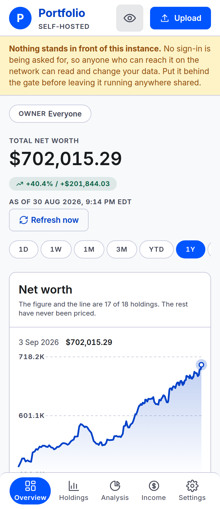
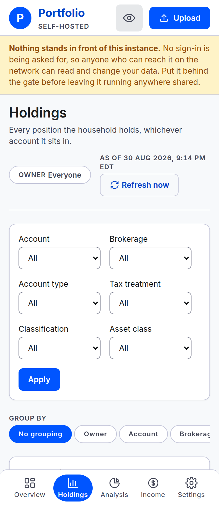
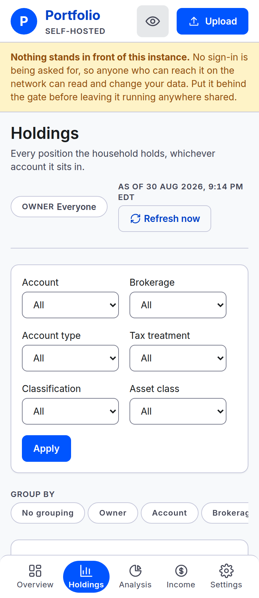
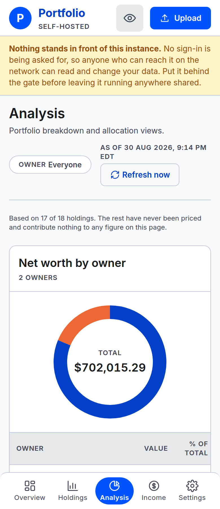
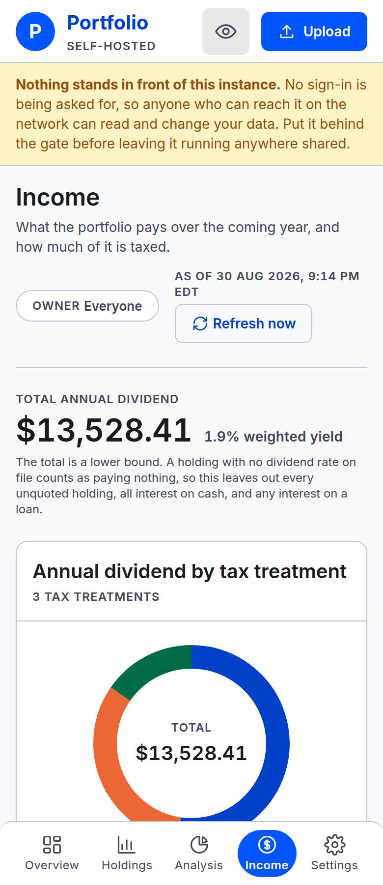
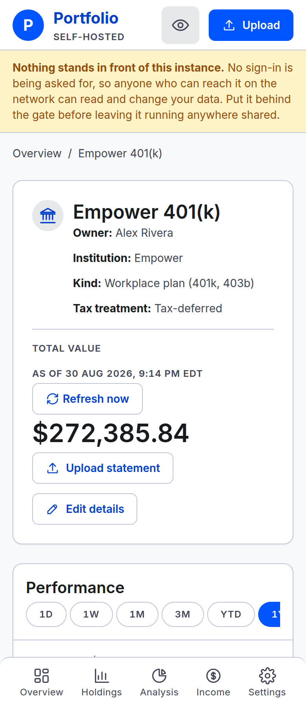
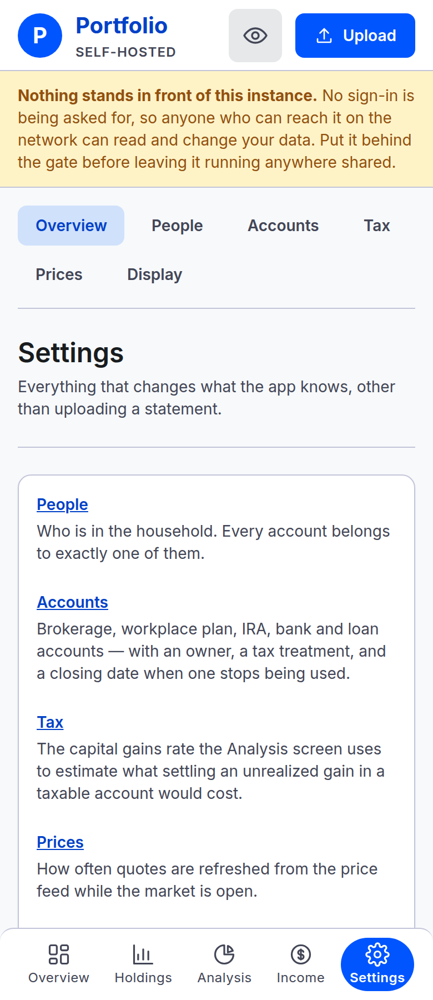
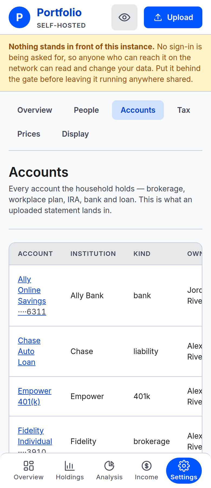
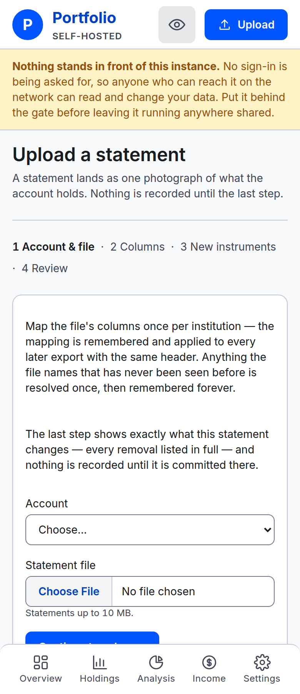

# Phone layout: what §11 decides, and what the stylesheet actually does

Investigation, against `a405806`. **Nothing here is approved.** Measured on the demo household
([`scripts/seed-demo.ts`](../../scripts/seed-demo.ts)) at 390×900 with `isMobile`, the width and
device the committed phone shots already use.

The question that started it: the Overview spends most of a phone's first screenful before the
trend line begins. Is that a decision this project made, or drift? The answer is neither, and the
gap between the two is the whole of this document.

## The three things worth knowing without reading further

1. **§11 names the read pages as what the phone is for, and they are the screens that do not fit.**
   Holdings spends more than the entire first screenful before its first holding row; Income spends
   exactly all of it; Account detail and Analysis more than four fifths. The three write screens
   §11 declines to invest in are the cheapest, none past two fifths. The "no mobile-specific layout
   investment" clause belongs to §11's third bullet — the desktop-shaped write flows, with its own
   stated reason — and was never a decision about the read pages.

2. **Where the phone gets a designed arrangement it is almost always Holdings; everywhere else it
   gets the un-overridden base.** Of the 23 arrangement declarations written *for* the phone, 18
   are in the single block holding the Holdings card reflow, and seven of the twelve phone blocks
   contain none. The more useful half is the other direction: four `min-width: 768px` blocks put
   the *desktop* arrangement in the override, which means the phone is not being designed at all —
   it receives whatever was left when the desktop rule stopped applying. Analysis's donut sitting
   above the table it illustrates is that, exactly.

3. **The method is already written down and shipped; it was never generalised.** The Holdings brief
   argues one DOM rather than two, card reflow through `data-label`, leading with the pair the phone
   is opened to read, hiding nothing, and controls two to a row. Every rule transfers unchanged.
   The one question it answered that no other screen has been asked is which pair its reader opens
   it for.

## 1. What §11 decides, and the clause that gets misread

[`DESIGN.md`](../../DESIGN.md) §11 opens **"The phone is for reading, plus one-field writes"** and
splits three ways:

- **Read** — every read page.
- **Write** — manual balance updates, and single-position corrections on Holdings.
- **Everything else** — "still renders on mobile and still works if you are determined; it simply
  gets no mobile-specific layout investment. Not hidden — hiding it means being stuck on a tablet."

The "no mobile-specific layout investment" clause sits inside the **third** bullet. Its subject is
the desktop-shaped write flows, and §11 gives a specific reason for them: upload → mapping →
resolution → diff → commit "is four screens with real state, and designing it for a 390px viewport
would compromise the desktop version that will actually be used." That argument is sound and
nothing here disputes it.

**What §11 does not contain is any statement that the read screens should be sparse.** That is the
whole of the claim. It is worth being precise about what does *not* follow from it:

- §11's three bullets are a **scope** list — what the phone must be able to do — not an investment
  schedule. Read-screen work is unforbidden by §11, which is different from being mandated by it.
  The case for doing it rests on the measurements below, not on §11.
- The clause is not a wall around the write screens either. `app/app.css:2616-2645` is
  phone-specific layout work on the settings forms and every upload step — "One field per line,
  controls filling" — and it shipped with its reasoning in place and no ADR. So the bar §11 sets is
  against **re-shaping the four-screen flow**, which is what its stated reason is about. Fixing a
  field on a settings form is not that.

Two constraints §11 does set that any change has to keep: nothing is hidden on a phone, and there
is no drawer or hamburger anywhere in the set (§13.5's breakpoints, 768 and 1024).

## 2. Measured

Preamble is the distance from the bottom of the sticky top bar to the top of the first element the
screen exists to show — the first holding row, the chart, the first field. The usable first
screenful at 390×900 is 771px once the 64px top bar and the bottom bar are taken off.

Two corrections are folded into every figure, both of which moved the numbers:

- **The ungated demo's open-instance banner is discounted** — a gated household never sees it. Its
  height only: the banner is a sibling of `.app-main` inside `.app-canvas`, which is not a flex
  container, so it brings no gap with it. Top bar 64 + banner 105 + `.app-main` padding 16 lands
  exactly on the first block on all nine screens, which is the check.
- **The household is unmasked**, for the reason `scripts/capture-screenshots.ts` states at length:
  the policy seeds masked, and a fresh browser context has never been toggled, so without a cookie
  every screen measures as rows of dots.

The write screens are the control group, and their selector means the same thing as the read
screens': the first content *inside* a panel, past its header. Measuring them to the panel's own
top edge would have flattered them by a panel header apiece and exaggerated the gap this report is
about.

| Screen | Preamble | Of the first screenful | §11 class |
|---|---|---|---|
| Holdings | 838px | **109%** | read |
| Income | 769px | 100% | read |
| Account detail | 697px | 90% | read |
| Analysis | 653px | 85% | read |
| Overview | 462px | 60% | read |
| Settings → Accounts | 320px | 42% | write |
| Settings | 275px | 36% | write |
| Upload | 244px | 32% | write |

**The ordering is the finding.** The screens §11 names as the phone's purpose are the expensive
ones; the screens it declines to invest in are the cheap ones. On Holdings the first holding is
entirely below the fold — a phone opened to the screen that answers "what do we hold" shows a
filter bar, a group-by strip and no holding.

One caveat on the ordering, taken seriously: Settings → Accounts is classed as a write screen on
the strength of `DESIGN.md:725` ("Everything else that writes lives behind Settings"), but its
first panel is a read table by any other test — and it is the most expensive of the three.

**Where the budget goes is arrangement, not spacing.** The gaps between top-level blocks total
24–48px per screen: `.page` and `.app-main` both gap at `--space-lg` and neither is overridden on
a phone (`app/app.css:634`, `:495`), while `.panel-header`/`.panel-body` do drop 24→16 (`:828`).
Real, but 48px of Holdings' 838px. The blocks themselves are the cost — Holdings' filter bar alone
is 314px, and Account detail's header is 461px.

## 3. The stylesheet's own account of itself

Counting declarations that change how a box is laid out or how many items share a line —
`flex-direction`, `display`, `grid-template-*`, `order`, `position`, `flex`, `flex-basis`,
`flex-wrap`:

**Twelve `@media (max-width: 767px)` blocks — rules written for the phone — hold 23 of them.**

- **18 are in the one block at `app/app.css:3130`**, which holds the Holdings card reflow and the
  Holdings correction. (One of the 18 is an owner-filter rule sharing the block, not part of the
  reflow.)
- **Seven of the twelve blocks hold none**; they change type size and padding.
- The other five are spread one or two at a time: `.page-header` and `.panel-header` stacking
  (`:703`, `:827`), the range strip going `nowrap` (`:1129`), and the forms block giving every field
  its own line (`:2616`).

**Four `@media (min-width: 768px)` blocks hold seven more — and these are the interesting ones,**
because in them the phone holds the *base* arrangement and the desktop is the override:
`.columns--wide-narrow` (`:746`), `.breakdown` (`:1502`), `.detail-header` (`:1878`).

That inversion is the mechanism behind §2. When a phone layout is what remains after a `min-width`
rule stops applying, nobody chose it. `.breakdown` is the clearest case: the ring sits above its
table on a phone not because that was designed, but because `flex-direction: row` was only ever
added at ≥768. `app/routes/analysis.tsx:33` says the table is the screen and the ring a picture of
it — so the phone leads with the picture that carries no figures, four times over.

## 4. The method already exists

Two places have real phone design, and both state their reasoning.

**The Holdings card reflow** ([`holdings-ui-brief.md`](../design/holdings-ui-brief.md), shipped at
`app/app.css:3138-3341`) establishes five rules:

1. **One DOM, not two.** A separate mobile tree is "two renderings of one query that can disagree,
   and it is the disagreement — not the layout — that is expensive". The reflow is `display: block`
   on the table plus `::before { content: attr(data-label) }` for the labels.
2. **Draw at 390px.**
3. **Lead with the pair the phone is opened to read** — on Holdings, asset and value, side by side.
4. **Hide nothing.** A null value still draws its row with an em dash, because "hiding it would
   make an absence look like a field that does not exist". This is §11's "Not hidden" as a
   component rule.
5. **Controls go two to a row, not one** — "seven stacked full-width controls is most of a phone
   screen consumed before the table they filter has started". The mechanism is
   `flex: 0 1 calc(50% - var(--space-md))` (`app/app.css:3356`).

**The Holdings correction** (`app/app.css:3268-3288` and `:3310-3341`, inside the same block) is
the second: the input takes the whole row with its label at the leading edge, because "A box
sharing its line with the label would be a third of a phone wide" (`:3310`). This is the
§11-permitted write, and it works.

Rule 3 is the one with no answer anywhere else. Holdings knows what pair its reader opens it for.
Overview, Analysis, Income and Account detail have never been asked the question.

## 5. What each read screen spends it on

**Overview** — 462px. The headline block is 216px and holds five stacked full-width rows: eyebrow,
figure with its delta, as-of, refresh button, then the range strip wrapping below. `.kpi`
(`app/app.css:869`) has no phone rule at all; on desktop the range strip sits right of the headline
and on a phone it simply wraps. (A sixth row, the refresh outcome note, appears only after a press.)

**Holdings** — 838px, the only screen whose content is wholly below the fold. The filter bar is
314px: six selects two-up, plus an actions line that always wraps alone because a third item never
fits beside two at `calc(50% - 16px)`. Every select reads its unfiltered default on a pristine
screen. The group-by strip adds 52px and scrolls sideways with eight chips in it.

**Analysis** — 653px, and the composition matters more than the total: the 200px donut is drawn
above its table, four times over, for the `min-width` reason in §3.

**Income** — 769px, one pixel inside the first screenful. Same donut inversion, plus a coverage note
that runs to four lines at 390px; its `max-width: 60ch` cap is wider than the phone, so the cap
never engages.

**Account detail** — 697px. `.detail-header` is 461px on its own: identity block, total, freshness
pair, and the action buttons, which each take their own line because two do not fit in 310px. (The
measured account is a 401(k), which takes no balance edit, so it draws two of them; an account that
does draws three.) `.detail-header` also keeps 24px padding on a phone (`app/app.css:1803`) — the
exact defect `:3343` was written to fix for `.filter-bar`, quoted there as "a step in the phone's
left margin running the length of the page". `.breakdown-chart` (`:1458`) has it too.

## 6. Defect classes — each is one fix, many sites

Found while measuring. These are bugs, not density, and are independent of any redesign.

1. **A cross-axis property left standing after a phone `flex-direction: column`.** When a phone rule
   flips a flex container to a column, a `justify-content` set outside the query silently changes
   axis and goes inert. Three sites: `.page-header--bare`'s `flex-end` (`app/app.css:700`, defeated
   by `:705`); `.page-header`'s `space-between` (`:656`); and `.panel-header`'s `space-between`
   (`:788`), defeated twice over, by `:836` and again by the `@container (max-width: 390px)` query
   at `:857`. A fourth of the same shape but a different property: `.page-header`'s `flex-wrap`
   (`:664`) becomes a block-axis wrap and does nothing. `.panel-header` is the highest-leverage —
   every panel on every screen.

2. **Only `.data-table--holdings` gets the card reflow** (`app/app.css:3138-3341`). Account detail
   renders a plain `.data-table` (`app/routes/account.tsx:496`) with no `data-label` attributes;
   its scroll container measures 525px in a 356px canvas and scrolls sideways. The upload review
   diff is the same: it takes Holdings' table grammar deliberately
   (`app/routes/upload/review.tsx:219`) but gets none of the reflow, so the household scrolls
   horizontally to read the value column on the screen where a statement is committed.

3. **24px padding surviving into the phone** on `.detail-header` (`:1803`) and `.breakdown-chart`
   (`:1458`), already fixed for `.filter-bar` (`:3343`) with the argument written out.

4. **`label.choice` has `align-items: center` and no phone rule** (`app/app.css:2154-2158`). Its
   longest sentence — the close-account acknowledgement — wraps to about five lines at 324px,
   putting the checkbox beside line three. This is the identical failure already diagnosed and
   fixed for `.cell-stack` (`:1608-1621` for the diagnosis, `:1622-1633` for the fix).

5. **No `scroll-margin-top` anywhere in the stylesheet.** The account page's own set-balance
   shortcut is an in-page anchor, and the top bar is `position: sticky` at 64px below 1024px, so
   the jump parks the panel header underneath it. Desktop is unaffected — the bar does not exist
   there. This one is on a §11-supported write.

6. **The 88px bottom reserve is short on a notched phone.** `app/app.css:512` hardcodes 88px while
   the bar's own padding adds `env(safe-area-inset-bottom)` — about 99px on a modern iPhone, so the
   last ~11px of the page sits under the bar, and on every write screen the last element is the
   submit button. Playwright does not emulate the inset, so no screenshot catches this.

**Not a defect but worth recording:** several phone findings are known and were never filed.
[`2026-08-24-exploratory-test-report.md`](./2026-08-24-exploratory-test-report.md) records the
non-Holdings tables overflowing at 390px (503px in a 356px box, against the 525px measured here);
the badges sitting low at exactly 768px are noted in `app/app.css:1618-1620`. There is no `mobile`,
`ui` or `design` label in the tracker, and no issue that amounts to "the phone layout is too
sparse" — phone work here has only ever arrived as defect fixes inside other work.

## 7. Ideas, and the ones already rejected

Graded by what they cost in documents rather than in code, because that is what decides whether
they can start.

**Unconstrained — nothing written down speaks to these.**

- Give `.panel-header` a phone arrangement. It is currently a stacked title, count and note, on
  every panel on every screen, and the count usually restates the row count below it.
- Draw the donut beside or below its table on a phone, rather than leaving it wherever the
  `min-width: 768px` rule drops it. Analysis and Income both lead with a figure-free ring.
- All six defects in §6.

**Contradicts a document.**

- **Moving the refresh control to the panel header's right slot.**
  [`specs/pricing/06-refresh-now-control.md`](../specs/pricing/06-refresh-now-control.md) itself
  specifies no placement — but at `:17-19` it sends the reader to
  [`pricing-ui-brief.md`](../design/pricing-ui-brief.md) for the visual design, and that brief
  carries a per-screen placement table putting the as-of line directly under the figure on
  Overview. So this is a brief change, not a free one — though a small one: the same table already
  puts the timestamp in `.panel-header`'s right slot on Holdings, so the shape is the brief's own,
  just assigned differently per screen. Two constraints to keep either way: the
  timestamp stays adjacent to the button, which is the whole point of the component; and a text
  label stays while busy, because `app/app.css:3556` turns the spinner off under
  `prefers-reduced-motion` and the label is what carries the state for those users. Note also that
  on a phone there is no right slot at all — `.panel-header` stacks — and on Overview the slot
  already carries a coverage note whenever anything is unpriced (`app/routes/overview.tsx:547`).
- **Pairing the owner filter with the range strip.**
  [`specs/0013-owner-filter.md`](../specs/0013-owner-filter.md) places the control inside
  `.page-actions` and states that is the placement on all four screens; it explicitly rejects
  putting it beside the range control, on the grounds that Overview's range control sits in the
  hero. That reason is an observation, not a principle, and no document requires the range control
  to stay there — but changing it is a spec edit. The alignment half (defect 1) is fixable on its
  own.

**Needs an ADR.**

- Re-shaping the upload flow for a phone — the four screens with real state that §11's stated
  reason is about. [`docs/README.md`](../README.md) scopes ADRs to decisions that are hard to
  reverse, surprising without their context, and the result of a real trade-off; that qualifies.
  Per-control phone rules on those screens do not: `app/app.css:2616` already is one.

**Rejected, with reasons, so they are not rediscovered.**

- **Tighten `--space-lg` globally.** 24px is right at 1280px, and §2 shows the rhythm is 48px of
  Holdings' 838px. This would cost desktop and buy almost nothing.
- **A second mobile component tree.** Already rejected in
  [`holdings-ui-brief.md`](../design/holdings-ui-brief.md): two renderings of one query can
  disagree, and the disagreement is the expensive part.
- **Hide anything on a phone.** §11 and the Holdings brief both refuse it, from opposite
  directions.
- **Shrink the Overview headline figure.** It is the page's title —
  `app/routes/overview.tsx:52` argues the figure sits on the canvas rather than in a panel exactly
  so it does not read as one card among several.
- **A phone-specific spacing scale.** §2 shows the cost is in arrangement, not in the tokens, and a
  second scale is a second thing to keep in step.

## 8. Open questions

- **What is the pair each screen is opened to read?** Holdings answered it. Overview is probably
  the net worth and its change; Analysis, Income and Account detail have no answer. This is the
  question that decides every arrangement below it, and it is not a CSS question.
- **The type ramp's in-between rule is the stylesheet's, not the design record's.** §13.4 names
  seven steps but does not forbid sizes between them; `app/app.css:720` and `:904` assert that it
  does. Underneath is a live disagreement: `pricing-ui-brief.md` documents the phone Overview
  headline at 36px and the code overrides it to 32px, calling 36px invented. One of the two should
  change.
- **`--canvas-margin`'s breakpoint is in no authoritative document.** §13.5 gives it as 16px→32px
  mobile→desktop without saying where (`DESIGN.md:1307`); all three UI briefs name 1024px, which is
  what the code does.
- **Should the range strip still scroll sideways?** `specs/0008-chart-ranges.md` left the phone
  layout of eight presets explicitly open. Pull request #221 made the Custom picker reachable and
  bounded the strip to its parent, so the question is narrower now — it scrolls, and that works —
  but it is the only sideways-scrolling control in the app.

## Figures

Each is one 390×900 viewport, unmasked, against the demo household. The write screens are included
as the control group.

| | | |
|---|---|---|
|  |  |  |
| Overview — 60% | Holdings — 109%, no holding in frame | Holdings, grouped |
|  |  |  |
| Analysis — 85%, ring above its table | Income — 100% | Account detail — 90% |
|  |  |  |
| Settings — 36% | Settings → Accounts — 42% | Upload — 32% |

## Reproducing

[`2026-09-03-phone-layout/harness/measure-phone.ts`](./2026-09-03-phone-layout/harness/measure-phone.ts)
walks the box tree of each screen at 390×900 and writes both the captures and
`figures/measurements.json`. It measures rather than reading a screenshot, because at a 2x device
pixel ratio counting pixels off an image is guesswork. Stand a demo instance up as
[`scripts/capture-screenshots.ts`](../../scripts/capture-screenshots.ts) documents, then:

```sh
CHROMIUM_EXECUTABLE=… node ./docs/research/2026-09-03-phone-layout/harness/measure-phone.ts
```

It reads no database of its own — only `BASE_URL` and `CHROMIUM_EXECUTABLE`.
