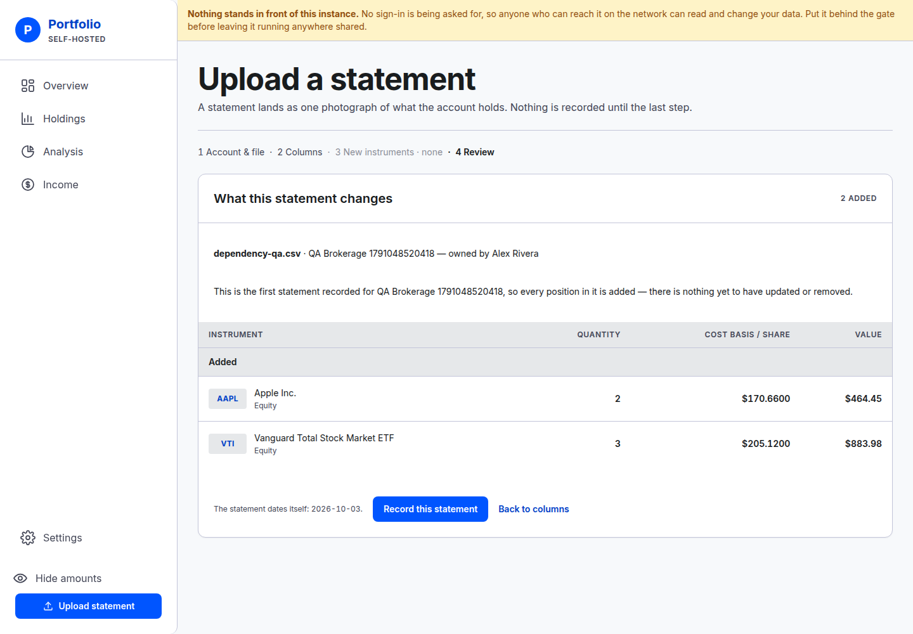
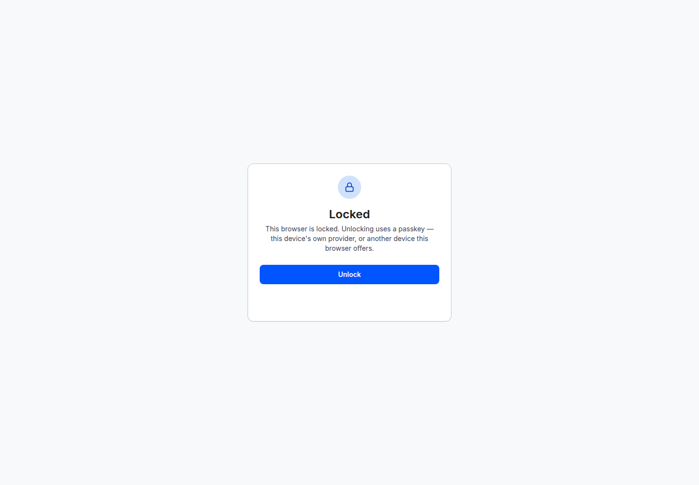

# Dependency updates — verification, 3 October 2026

The security patch set was applied to GitHub main `80373fae`. The production build,
2,495 tests and browser workflows passed with the updated packages. This report
records a disposable local verification; no live deployment was changed.

## Changes

- OAuth2 Proxy **7.15.4 → 7.15.5**: fixes credential disclosure in failed callback
  logs, [GHSA-hhqp-vx7f-5c6m](https://github.com/oauth2-proxy/oauth2-proxy/security/advisories/GHSA-hhqp-vx7f-5c6m).
- Caddy's floating `2-alpine` tag becomes **2.11.6-alpine**, the published patch
  image verified during this work. It includes the
  [forward-auth connection fix](https://github.com/caddyserver/caddy/security/advisories/GHSA-6365-7ppr-5r92).
- `pg` **8.23.0 → 8.23.1**, plus its related protocol packages: fixes TLS identity
  validation for connections to literal IP addresses,
  [upstream change](https://github.com/brianc/node-postgres/pull/3756).
- `sharp` **0.35.4 → 0.35.5**, with updated native binaries: the installed bundle
  reports Expat **2.8.5**, including the
  [CVE-2026-93990 fix](https://github.com/libexpat/libexpat/releases/tag/R_2_8_5).
- SimpleWebAuthn server **14.0.2 → 14.0.3**, its small
  [warning-evaluation patch](https://github.com/MasterKale/SimpleWebAuthn/releases/tag/v14.0.3).
- Vitest's declared minimum becomes **4.1.11**, matching the already-patched
  lockfile version. Coverage remains aligned at 4.1.11.

## Automated checks

- `npm ci --ignore-scripts`: successful fresh install.
- `npm run typecheck`: passed.
- `npm run build`: passed.
- `npm run migrate`: all 19 migrations applied to a new PostgreSQL 17.11 database.
- `npm run db:types -- --verify`: generated database types match.
- `npm test`: **120 files, 2,495 tests passed** against that isolated database.
- `npm audit signatures`: **382 verified registry signatures**, including
  **123 verified attestations**.
- Production native/install-script-marker invariant: no violations.
- `docker build --pull`: succeeded. The built image runs Node **24.21.0** and
  `pg` **8.23.1**.
- Full container smoke: **passed, exit 0, no skipped checks**. Covered startup,
  migrations/restart, runtime pruning and privileges, network isolation, real
  Yahoo proxy connectivity, rejected CONNECT/SNI, dump creation and catch-up,
  authentication refusals and all 12 Caddy body-limit cases.
- `scripts/render-icons.ts`: ran through Chromium and Sharp 0.35.5. All three PWA
  icons and the inline manifest icons regenerated **byte-for-byte unchanged**.
- Production npm audit: **zero advisories**. Full audit still reports three high
  package entries from the one unpatched development-only `braces` advisory,
  [CVE-2026-93687](https://github.com/advisories/GHSA-vfj7-8cjw-p6xm).
  The code generator was not downgraded.

Local Docker's automatic subnet pool was exhausted. The smoke run used a temporary
copy with explicit non-overlapping `/28` subnets and an isolated Compose project
name. Docker 29.8 represents an absent gateway as `invalid IP`; the temporary copy
accepted that representation while retaining the independent host-bridge
no-address assertion. The body-limit helper also used an explicit test subnet.
These environment adaptations were not committed; application checks were retained.

## Browser verification

[The driver](2026-10-03-dependency-update-verification/harness/verify-workflows.mjs)
ran Chromium against the actual built production application and a separately
seeded demo database. Its [result ledger](2026-10-03-dependency-update-verification/harness/browser-results.json)
records **26 successful checks**, with no uncaught page errors or HTTP 5xx responses.

- Opened Overview, Holdings, Analysis, Income and all Settings pages.
- Toggled masking, verified it survived reload, and applied an owner filter.
- Created a bank account, renamed it, recorded a balance of $1,100 and corrected
  that balance to $1,250. The updated receipt and database history agreed.
- Created a brokerage account and uploaded a two-row CSV through column mapping,
  review and commit. AAPL and VTI appeared on the resulting account page.
- Changed the display preference and verified persistence after reload.
- Repeated the main read screens, account detail and Upload at **390 × 844**;
  checked that none exceeded the viewport width.
- Registered a real WebAuthn credential using Chromium's virtual authenticator,
  locked the instance and unlocked it using the credential. No fabricated grant
  or passkey database row was used for this check.

The driver waits for form responses and rendered receipts before proceeding. Early
harness iterations exposed selector/timing mistakes, corrected in the committed
version; the corresponding database writes had succeeded. Browser assertions then
passed end to end.





## Authentication regression

A missing-CSRF OAuth callback was tested against **both** gate images in disposable
containers with networking disabled, using dummy Cookie and Authorization values.
Both returned 403. Version 7.15.4 wrote both markers into its logs; version 7.15.5
wrote neither. This proves the check detects the original regression.

The committed container smoke test now sends the same callback through Caddy,
asserts 403, confirms the CSRF refusal was logged, and verifies neither credential
marker appears. It also checks that a forged identity header receives the normal
anonymous redirect.

## Limits and follow-up

- Browser workflows used the application directly. The separate container smoke
  exercises the real OAuth gate and Caddy. No real Google account or token exchange
  was used; Google redirect construction and refusal paths are the available local
  checks. WebAuthn registration and assertion were exercised end to end.
- Caddy **2.11.7** fixes 2.11.6 regressions, but authenticated registry inspection
  still returned `404 MANIFEST_UNKNOWN` for its official Alpine image. The current
  plain HTTP listener avoids the reported HTTP/2 path. The
  [long-running HTTP/1.1 POST streaming regression](https://github.com/caddyserver/caddy/releases/tag/v2.11.7)
  remains a follow-up: move to 2.11.7 once the official image is published. No
  response lasting more than 60 seconds was claimed as verified.
- No production-host or complete OS-package vulnerability scan was performed.
  Existing deployed images require their own release/deployment process.

## Repeating the browser check

Use a **fresh disposable demo database**, migrated and seeded with
`scripts/seed-demo.ts`, and serve the production build with `PUBLIC_ORIGIN`
matching `BASE_URL`. The driver creates accounts and enrolls a passkey, so it must
never target a real household instance. Use a new seed before repeating the whole
run after enrollment. With Chromium installed:

```sh
BASE_URL=http://localhost:3311 QA_OUTPUT=/tmp/portfolio-dependency-qa \
  node docs/research/2026-10-03-dependency-update-verification/harness/verify-workflows.mjs
```

`CHROMIUM_EXECUTABLE` optionally selects an existing browser. Local verification
used the Chromium binary from `mcr.microsoft.com/playwright:v1.62.1-noble` with the
repository's Playwright 1.63.0 client. Package updates did not change Playwright.
