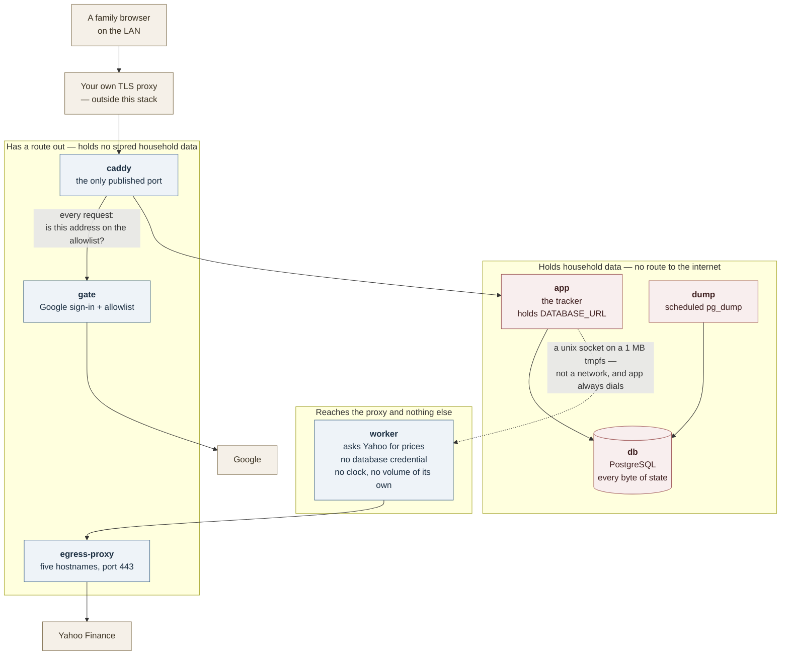
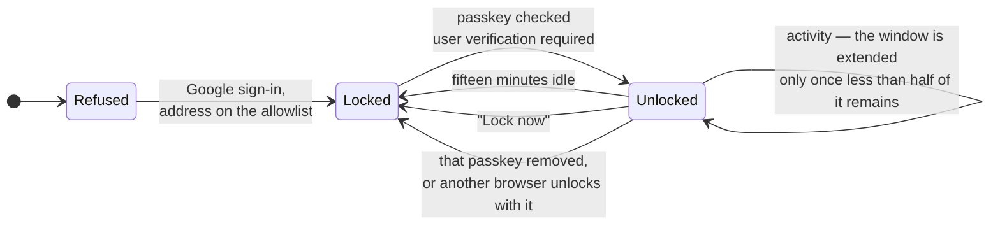

# Security

You are thinking about running this on hardware you own, because the alternative is handing a
bank aggregator every account you have. This page is the argument for whether that trade is worth
it here: what the stack defends, how it defends it, and — the half that decides the question — what
it does not defend and therefore leaves to you.

Three claims shape the design:

- **The containers that hold your money data have no route to the internet.**
- **The container that talks to the internet holds no database credential and cannot reach the database.**
- **A browser that has been idle is refused every screen until a passkey is checked.**

All three are true with named exceptions. The exceptions are in this document, not omitted from it.

`ARCHITECTURE.md` §7.6 holds the control table for a contributor, and
[`operating.md`](operating.md) holds the knobs you actually turn. This page is the third reader's
version: someone deciding whether to trust the thing at all. Where the two disagree with this page,
[`../compose.yaml`](../compose.yaml) is the one to believe — it is the file that enforces most of
what follows, and its comments carry the reasoning.

## The short version

| If this happens | What stops it | What still gets through |
|---|---|---|
| A device on your LAN dials the box | The **gate** — Google sign-in plus an address allowlist, enforced by this stack's own Caddy. There is no route to the app that skips it | `/healthz` answers with no check, and its body names the running version |
| Someone picks up a family phone that is already signed in | The **lock** — every screen refused until a passkey is checked | Pages already drawn stay drawn until that tab asks the server for something |
| A poisoned release of the market-data dependency | It runs in `worker`: no database credential, no shared network with `app` or `db`, one route out to five Yahoo hostnames | It still sees which tickers you hold — pricing them is its job |
| A poisoned dependency inside the app itself | `app` sits on two internal networks with no default route; read-only root filesystem, every capability dropped | An application-layer relay out through `caddy` to `gate`. Named in §2 |
| Someone gets the disk, a dump, or the database volume | Nothing | Everything. Data is plaintext at rest, by decision. Encryption is yours — §7 |
| A script injected into a page | Nothing at the header layer | No CSP, HSTS, frame protection or `nosniff` is set anywhere — §6 |

## 1. The shape of the stack

Seven services on seven networks. Four of those networks are `internal: true` with an isolated
gateway, which in Docker terms means no default route and no bridge address at all — not a firewall
rule that could be misread, but the absence of anywhere to send a packet.



What the picture is claiming, and where it is enforced:

- **Only `caddy` publishes a port.** `db`, `app`, `gate`, `worker` and `egress-proxy` publish
  nothing, so the gate cannot be walked around — there is no address that reaches `app` without
  passing the door where the check happens.
- **`db` is reachable only from `app` and `dump`**, on the internal `backend` network, with no
  published port. Its password has no default; the stack refuses to start without one.
- **`worker` shares no network with `app`, `gate` or `db`.** Not a rule about what it may do — it
  has no address on any network they are on.
- **TLS is not in this stack.** The bundled Caddy serves plain HTTP; the certificate and public
  hostname are your own proxy's job. That is deliberate, and it is why the gate is enforced *here*
  rather than upstairs: a LAN device can dial this box directly, and that device is the threat the
  gate exists for.

## 2. What holds your data cannot call out — and the two ways that is not absolute

`app`, `db` and `dump` sit only on networks declared `internal: true` with
`gateway_mode_ipv4: isolated`. There is no NAT entry, no gateway address, and — a consequence worth
naming — no external DNS either. A dependency inside `app` that wants to phone home has nowhere to
send the packet.

Two exceptions, both documented in the repository rather than discovered:

**The `caddy` → `gate` relay.** A compromised `app` still reaches `caddy`, because it must; `caddy`
proxies `/oauth2/*` to `gate`; and `gate` has real egress, because Google's token endpoint is on the
internet. That is an application-layer path out. `compose.yaml` calls it "known rather than closed."
It is narrow — it is not a socket, it is whatever can be smuggled through an OAuth proxy's endpoints
— but it is not nothing.

**The external-database option.** If you run Postgres elsewhere and load
[`../compose.external-db.yaml`](../compose.external-db.yaml), `app` moves onto a network with a
gateway. That restores public DNS resolution for `app` and gives it a route to the Docker host, and
so to every host service listening on `0.0.0.0`. The file says so in its own header. The worker's
isolation is unaffected — that override touches `app` alone — but the first of this page's three
claims is one you give up when you take that path.

One more thing on the list of what leaves the house: **the gate tells Google who signs in and
when**, and the worker tells Yahoo which tickers you hold. A privacy reader counts two third
parties, not one. Neither receives a balance.

## 3. The price fetcher is the container the design expects to lose

`yahoo-finance2` is the one production dependency that opens a socket to the internet. The design
assumes it will one day be the thing that goes wrong, and arranges for that to be survivable rather
than trying to guarantee it will not happen.

It runs in `worker`, which is the same image as `app` started at a different entrypoint. What makes
it safe is not the image but everything the process is denied:

- **No `DATABASE_URL`, no `PGPASSWORD`** in its environment. A credential it never held cannot be stolen.
- **No shared network** with `app`, `gate` or `db`.
- **No database client in its code at all** — the worker's module imports no `pg` and no Kysely.
- **`pids_limit: 64`, `mem_limit: 256m`**, a read-only root filesystem, every capability dropped.
- **One route out**, and it is the proxy.

**The honest limit of that.** `app`, `worker` and `egress-proxy` are one image started three ways,
so the market-data package's files are physically present in the app container too. What keeps it
out of your database is that `app` never imports it — not that the app image lacks it. A package
that attacks when it is *imported* is contained by this design. A package that attacks when it is
*installed*, during the image build, is inside all three containers before any of this applies. See
§4 for what does and does not guard the build.

The handoff is the interesting part, because it is what lets a container with no network reach a
container with no credentials:

```mermaid
sequenceDiagram
    autonumber
    participant app as app<br/>holds the database
    participant worker as worker<br/>holds no credential
    participant proxy as egress-proxy
    participant yahoo as Yahoo Finance

    app->>worker: POST /quotes over a unix socket
    Note over app,worker: A 1 MB tmpfs volume carries the socket file,<br/>never the data. app dials; worker never dials back.
    worker->>proxy: CONNECT query1.finance.yahoo.com:443
    proxy->>proxy: On the allowlist? Port 443?<br/>Not an IP literal?<br/>DNS answer outside private ranges?
    proxy-->>worker: 200 Connection Established
    worker->>proxy: TLS ClientHello
    proxy->>proxy: Does the SNI equal the host it asked for?
    proxy->>yahoo: relays bytes, never decrypts them
    yahoo-->>worker: quotes
    worker-->>app: raw JSON, validated on arrival
    Note over app: app alone writes to the database
```

The proxy is about a hundred and fifty lines of hand-written Node in
[`../server/egress-proxy.ts`](../server/egress-proxy.ts), not a third-party image. Four properties
are worth knowing:

1. **The allowlist is five Yahoo hostnames, compared exactly** — never as a suffix, so
   `query1.finance.yahoo.com.evil.test` does not match. It is a module constant, not configuration,
   so a compromised process cannot widen it by setting an environment variable.
2. **It never terminates TLS.** It reads the one unencrypted field in the handshake — the SNI — and
   checks it against the host the client asked to connect to. It cannot read your traffic; it also
   cannot be tricked into tunnelling to somewhere else under an allowed name.
3. **A DNS answer inside a private range is refused**, so a poisoned or LAN-aware resolver cannot
   turn the proxy into a pivot back into your network.
4. **Refusals fail closed and are logged**, with a deadline on every stage that waits on a peer.

A compromised market-data dependency, then, gets: the ticker list, the timing, and a tunnel to
Yahoo. It does not get the database, the balances, a route to your LAN, or anywhere to send what it
learns.

## 4. Supply chain

**What is actually in place.** Each of these is a file you can check, not a policy:

- `package-lock.json` is committed and every install path uses `npm ci`, so builds resolve to the
  exact versions and integrity hashes recorded, never to whatever the registry offers today.
- CI runs `npm audit signatures` — the only check that notices a pinned name and version being
  republished with different contents — and blocks on `npm audit --omit=dev --audit-level=high`.
- CI **fails the build if any production package gains an install script, or an `os`/`cpu`
  constraint.** The production tree is enforced to stay pure JavaScript with no install-time step,
  which removes the most common delivery mechanism for a poisoned package.
- The release image prunes the dev tree and unreachable runtime dependencies, and drops the
  TypeScript compiler entirely.
- `app`, `worker`, `egress-proxy` and `db` run non-root, read-only, with `cap_drop: ALL` and
  `no-new-privileges`. The smoke test reads that posture back out of the running containers rather
  than trusting the file.
- **No third-party scripts, no analytics, no CDN.** There is nothing loaded into the page that could
  be compromised upstream. The service worker stores nothing — no Cache Storage, no IndexedDB — so
  there is no cached copy of your figures on the device to steal.
- The internet-facing dependency is quarantined, as §3 describes.

**What is not in place.** Do not assume these:

- **No Dependabot or Renovate.** Updates are manual and deliberate; the repo rejected automating
  them as the owner's call. Nothing sweeps for a newly-disclosed advisory between releases.
- **No SBOM and no build provenance** for the published image — both are explicitly disabled in CI.
  **No image signing.**
- **No digest pinning anywhere.** Base images and the app image are pinned by tag, which trusts the
  publisher not to move it. Pinning `APP_VERSION` to a `tag@sha256:` digest is the only form that
  holds against a compromised publisher, and it is not the documented default.
- **`--ignore-scripts` is used only in the audit job**, not in the build. An install script in a dev
  dependency still executes on the path that produces the release image.
- **No reproducible build, no runtime integrity check.**

## 5. The lock

The gate decides which *person* may reach the instance. The lock decides which *browser* may read it
once admitted. It exists because the gate holds its answer for seven days without rolling and there
is no working sign-out — so an unlocked family phone in someone else's hands would otherwise be a
week of unchallenged access.



How it actually works:

- The refusal is **root middleware**, thrown before any loader runs. A locked browser is not shown a
  blanked-out page; the query that would have fetched your holdings never executes.
- The unlock **grant** is a row in the database, named by an opaque random id in a `__Host-`
  prefixed, `Secure`, `HttpOnly`, `SameSite=Lax` cookie. The cookie is a bearer token carrying no
  claim of its own — **the row is the authority**, so revoking is a delete, not an expiry you have to
  wait out.
- The instance stores only the **public half** of a passkey. It never sees the check that guards it.
- The idle window is **fifteen minutes**, and it is extended only when less than half remains — so
  the lock can arrive as little as seven and a half minutes after your last request.
- Both figures are constants in `app/lib/lock.ts`. **There is no environment variable to change
  them.**

Two corrections to the mental model most people bring:

**It is not necessarily a fingerprint.** WebAuthn's user verification is satisfied by whatever the
authenticator accepts — a device passcode counts exactly as a face or a fingerprint does. The
guarantee is only as strong as whatever unlocks the passkey provider on that device.

**Nothing is encrypted by the passkey.** This is the important one. The lock decides whether the
server will run a route at all. It performs no encryption. Your accounts, holdings, uploaded
statements and every dump remain plaintext in Postgres. Anyone holding the volume, a dump, or the
container filesystem bypasses the lock completely and reads everything. See §7.

## 6. What this does not protect against

Stated plainly, because a security page that only lists wins is not useful.

- **No encryption at rest.** Named again because it is the one most often assumed. Recorded as an
  acceptance, not an oversight, in [`adr/0009`](adr/0009-the-stack-takes-dumps-not-backups.md).
- **No security response headers at all** — no CSP, no HSTS, no `X-Frame-Options`, no `nosniff`.
  Neither the app nor the bundled Caddy sets one.
- **No rate limiting**, at the gate or on the unlock ceremony. The posture is a single-use challenge
  plus whatever the platform throttles.
- **No CSRF token anywhere.** `SameSite=Lax` plus an origin check on the lock's own posts is the
  whole of it.
- **No authorization inside the app.** Everyone the allowlist admits sees everything. The owner
  filter is a view, never a permission.
- **The lock does not un-draw pixels.** A tab already showing figures keeps showing them until it
  next asks the server for something; a browser's back/forward cache can serve a fully rendered
  stale page for minutes after a grant is revoked elsewhere.
- **A passkey check carries no freshness signal.** A provider whose vault is already open may return
  success without prompting anyone. This raises the cost of a borrowed phone; it does not close it.
- **A household with exactly one passkey cannot recover a lost device by itself** — removal needs an
  assertion, and the only credential that can give one is on the missing device. That falls back to
  you, at a shell. **Enrol a second passkey.**
- **Request bodies are bounded only after buffering**, and there is no size limit at the proxy.
- **The documented external-Postgres path never requires TLS** to the database.
- **`/healthz` answers unauthenticated** and its body names your running version.
- **This is not safe to publish on the open internet as it stands.** It is designed for a box behind
  your own proxy on your own network.

The standing list, with severities and which items are still open, is
[`research/2026-09-02-security-and-privacy-audit.md`](research/2026-09-02-security-and-privacy-audit.md).

## 7. What you carry

The stack cannot do these for you.

1. **Encrypt the disk.** Full-disk or dataset encryption on the host. Everything above is
   request-time authorization; none of it survives someone holding the volume.
2. **Encrypt the dumps, and keep them off the host.** A dump is every balance, every statement and
   every original uploaded CSV, in plaintext. Encryption is the collecting tool's job.
3. **Pin `APP_VERSION` to a digest** if you want the image tag to hold against a compromised
   publisher, rather than to a floating major.
4. **Enrol a second passkey**, on a second device, before you need it.
5. **Terminate TLS yourself**, and keep the box off the open internet.
6. **Keep the address allowlist short.** It is the whole of who may enter; there is no second check
   behind it.

## Where the detail lives

- [`operating.md`](operating.md) — the decisions that are yours: the gate's admission conditions,
  the egress proxy's refusal shapes, recovery when every passkey is gone, upgrades.
- `ARCHITECTURE.md` §7.6 — the control table, at contributor altitude.
- [`adr/0005`](adr/0005-auth-is-a-forward-auth-gate.md) — why authentication is a sidecar and not
  code, and why a VPN was rejected for this threat model.
- [`adr/0012`](adr/0012-a-browser-past-the-gate-is-shown-nothing.md) — why the lock exists and what
  it deliberately does not promise.
- [`adr/0002`](adr/0002-masking-is-a-display-state.md) — why masking is a display state and must
  never be described as access control.
- [`guide/passkeys.md`](guide/passkeys.md) — the family-facing version of §5.
