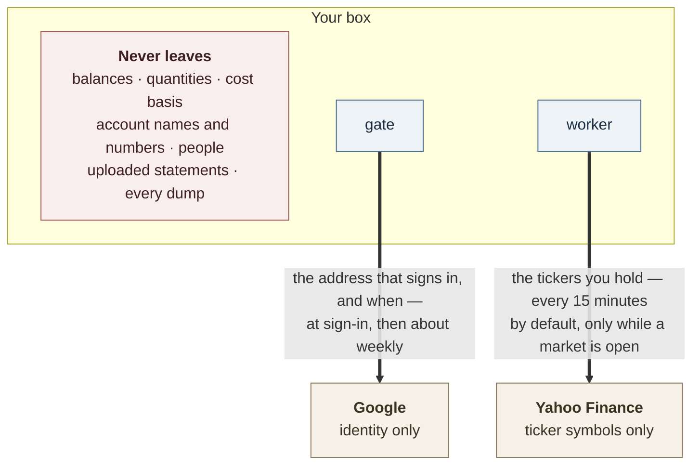
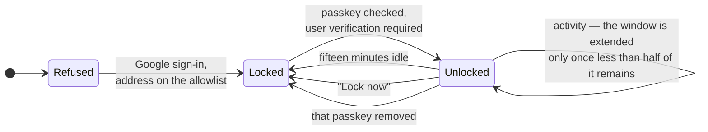
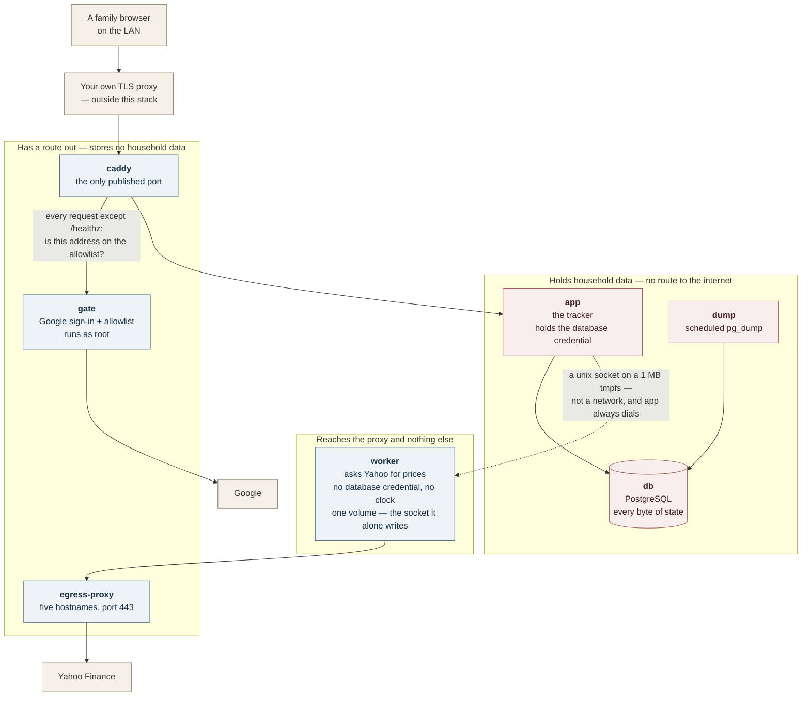

# Security

**This app holds no credential to any bank or broker.** There is no account linking, no Plaid, no
Yodlee, no stored password to anything. It learns what you hold because you upload a statement you
downloaded yourself, or type a balance in. That is the whole of the ingest path, and it is the
reason the rest of this page can be short.

You are weighing this against a hosted aggregator that does hold those logins. This page is what you
need to make that call: what leaves your box, what defends what, and — the half that decides it —
what is not defended, so you know what you are still carrying yourself.

Three claims shape the design. Each is true with named exceptions, and the exceptions are on this
page rather than left off it:

- **The containers holding your money data have no route to the internet.**
- **The container that talks to the internet holds no database credential and cannot reach the database.**
- **A browser that has gone idle is refused every screen until a passkey is checked.**

`ARCHITECTURE.md` §7.6 holds the control table for someone reading the code, and
[`operating.md`](operating.md) holds the knobs you turn. This page is for the decision that comes
before both. Where they disagree with it, [`../compose.yaml`](../compose.yaml) is the one to believe
— it enforces most of what follows, and its comments carry the reasoning.

## 1. What leaves the box

Two things, to two companies, and neither of them is a number you care about.



- **Google learns who signs in and when.** That is what the sign-in gate is. It never sees a figure.
- **Yahoo learns which tickers you hold**, on the refresh cadence — a setting, defaulting to fifteen
  minutes, in Settings → Prices. The poller runs on a timer whether or not anyone is looking, and
  skips the quote fetch outside market hours. Yahoo never learns how many shares, or what they are
  worth to you.
- **Nothing else.** No analytics, no error reporting, no CDN, no fonts fetched at page load, no
  third-party script of any kind in the page. The service worker stores nothing on the device — no
  Cache Storage, no IndexedDB — so there is no cached copy of your figures on the phone either.

A privacy reader counts two third parties, then. Not one, and not zero.

## 2. If something goes wrong

| If this happens | What stops it | What still gets through |
|---|---|---|
| A device on your LAN dials the box | The **gate** — Google sign-in plus an address allowlist, enforced by this stack's own Caddy. `/healthz` is the one path routed past it, and there is no other | `/healthz` says whether the database is reachable and the schema current, and names pending migration files when it is not |
| Someone picks up a family phone that is already signed in | The **lock** — every screen refused until a passkey is checked | Pages already drawn stay drawn until that tab next asks the server for something |
| A poisoned release of the market-data package | It runs in `worker`: no database credential, no shared network with `app` or `db`, one route out to five Yahoo hostnames | It still sees the tickers — pricing them is its job. And it is in the app image too; see §5 |
| A poisoned dependency inside the app itself | `app` sits on two internal networks with no default route; read-only root filesystem, every capability dropped | An application-layer relay out through `caddy` to `gate` — §4 |
| Someone gets the disk, a dump, or the database volume | Nothing | Everything. Data is plaintext at rest, by decision — §8 |
| A script injected into a page | Nothing at the header layer | No CSP, HSTS, frame protection or `nosniff` is set anywhere — §7 |

## 3. The lock

This is the defence you meet daily, so it comes first.

The gate decides which *person* may reach the instance. The lock decides which *browser* may read it
once admitted. It exists because the gate holds its answer for seven days without rolling —
oauth2-proxy's own default, which `compose.yaml` deliberately does not override — and there is no
working sign-out. Without the lock, an unlocked family phone in someone else's hands is a week of
unchallenged access.



- The refusal is **root middleware**, thrown before any loader runs. A locked browser is not shown a
  blanked page — the query that would have fetched your holdings never executes.
- The unlock **grant** is a row in the database, named by an opaque random id in a `__Host-`
  prefixed, `Secure`, `HttpOnly`, `SameSite=Lax` cookie. The cookie carries no claim of its own —
  **the row is the authority**, so revoking is a delete rather than an expiry you wait out.
- The instance stores only the **public half** of a passkey. It never sees the check that guards it.
- The idle window is **fifteen minutes**, extended only when less than half remains — so the lock can
  arrive as little as seven and a half minutes after your last request. The window is a constant in
  `app/lib/lock.ts`; the half is derived from it in the one statement that extends a grant. **There
  is no environment variable to change either.**
- Unlocking again replaces that browser's own previous grant. It does **not** end any other
  browser's — two devices unlocked with the same passkey each hold their own, and removing the
  passkey is what ends all of them at once.

Two corrections to the mental model most people arrive with:

**It is not necessarily a fingerprint.** WebAuthn's user verification is satisfied by whatever the
authenticator accepts; a device passcode counts exactly as a face does. The guarantee is only as
strong as whatever unlocks the passkey provider on that device.

**Nothing is encrypted by the passkey.** This is the one most often assumed. The lock decides
whether the server runs a route at all. It performs no encryption. Your accounts, holdings,
statements and every dump remain plaintext in Postgres, and anyone holding the volume reads them
without ever meeting the lock. See §8.

## 4. The shape of the stack

Seven services on seven networks. Four of those networks are `internal: true` with
`gateway_mode_ipv4: isolated` — in Docker terms, no default route and no bridge address at all. Not
a firewall rule that could be misread, but the absence of anywhere to send a packet.

**This needs Docker Engine 28.0 or newer.** Engine 26 accepts the isolated-gateway option and
ignores it *silently*, which leaves containers on those networks with an address on the host and a
route to whatever else the house binds on `0.0.0.0`; Engine 27 refuses it outright. `internal: true`
holds on every version, so the route to the *internet* is closed either way — but check
`docker version` before believing the stronger half.



- **Only `caddy` publishes a port.** `db`, `app`, `gate`, `worker` and `egress-proxy` publish
  nothing, so there is no address that reaches `app` without passing the door where the check happens.
- **`db` is reachable only from `app` and `dump`**, with no published port. Its password has no
  default; the stack refuses to start without one.
- **`worker` shares no network with `app`, `gate` or `db`** — not a rule about what it may do, but no
  address on any network they are on. The smoke test probes for them by name *and* by every
  container IP.
- **TLS is not in this stack.** The bundled Caddy serves plain HTTP; the certificate and public
  hostname are your proxy's job. That is also why the gate is enforced *here* rather than upstairs: a
  LAN device can dial this box directly, and that device is the threat the gate exists for.
- **Privilege is dropped, with the exceptions named.** `app`, `worker`, `egress-proxy` and `db` run
  non-root and read-only with `cap_drop: ALL` and `no-new-privileges`. The other two are exceptions:
  `caddy` keeps `NET_BIND_SERVICE` because the image's binary will not exec without it, and `gate` —
  the container that faces Google — **runs as root** with `DAC_READ_SEARCH`, because the published
  image sets no user and the allowlist file's mode is yours. Both are still read-only. The smoke test
  reads all six postures back out of the running containers rather than trusting the file.

### The two ways the no-egress claim is not absolute

**The `caddy` → `gate` relay.** A compromised `app` still reaches `caddy`, because it must; `caddy`
proxies `/oauth2/*` to `gate`; `gate` has real egress, because Google's token endpoint is on the
internet. `compose.yaml` calls that "known rather than closed". It is narrow — not a socket, but
whatever can be smuggled through an OAuth proxy's endpoints — and the thing at the far end is the
least constrained container in the stack: `gate` runs as root on a plain bridge with unrestricted
egress, and through that bridge's gateway can reach the Docker host and every host service bound on
`0.0.0.0`. A residual of the same shape: Caddy trusts `X-Forwarded-*` from any private address, and
`app`'s address is private, so `app` can forge those headers through Caddy. Nothing behind Caddy
decides anything on them today, which is why that is affordable.

**The external-database option.** If you run Postgres elsewhere and load
[`../compose.external-db.yaml`](../compose.external-db.yaml), `app` moves onto a network with a
gateway. That restores public DNS for `app` and gives it a route to the Docker host, and so to every
host service on `0.0.0.0`. The file says so in its own header. The worker's isolation is unaffected —
the override adds no network and no variable to it — but note it also profiles `db` and `dump` out,
so on that path the stack takes **no dumps at all**, and backing up the external database is yours.
The first of this page's three claims is what you give up by taking it.

## 5. The price fetcher

`yahoo-finance2` is the one production dependency that opens a socket to the internet. The design
assumes it will eventually be what goes wrong, and arranges for that to be survivable rather than
promising it will not happen.

It runs in `worker`. What makes that safe is not the image but what the process is denied: no
`DATABASE_URL` and no `PGPASSWORD` in its environment, no shared network with `app`, `gate` or `db`,
no database client in its code at all — the worker's import graph contains no `pg` and no Kysely —
plus a capped process count and memory, a read-only root filesystem, and one route out.

**The honest limit of that.** `app`, `worker` and `egress-proxy` are one image started three ways, so
the package's files are physically present in the app container too. What keeps it out of your
database is that `app` never imports it, not that the app image lacks it. A package that attacks when
it is *imported* is contained by this design. A package that attacks when it is *installed*, during
the image build, is inside all three containers before any of this applies — see §6.

```mermaid
sequenceDiagram
    autonumber
    participant app as app<br/>holds the database
    participant worker as worker<br/>holds no credential
    participant proxy as egress-proxy
    participant yahoo as Yahoo Finance

    app->>worker: POST /quotes over a unix socket
    Note over app,worker: A 1 MB tmpfs volume carries the socket file,<br/>never the data. app dials; worker never dials back.
    worker->>proxy: CONNECT query1.finance.yahoo.com:443
    proxy->>proxy: On the allowlist? Port 443?<br/>Not an IP literal?<br/>DNS answer outside private ranges?
    proxy-->>worker: 200 Connection Established
    worker->>proxy: TLS ClientHello
    proxy->>proxy: Does the SNI equal the host it asked for?
    proxy->>yahoo: relays bytes, never decrypts them
    yahoo-->>worker: quotes
    worker-->>app: raw JSON, validated on arrival
    Note over app: app alone writes to the database
```

The proxy is hand-written Node in [`../server/egress-proxy.ts`](../server/egress-proxy.ts) —
`node:http`, `node:net`, `node:dns` and no other import, so it is not itself a third-party
dependency. Four properties are worth knowing:

1. **The allowlist is five Yahoo hostnames, compared exactly** — never as a suffix, so
   `query1.finance.yahoo.com.evil.test` does not match. It is a module constant rather than
   configuration, so a compromised process cannot widen it by setting an environment variable.
2. **It never terminates TLS.** It reads the one unencrypted field in the handshake, the SNI, and
   checks it against the host the client asked to connect to. It cannot read your traffic; it also
   cannot be talked into tunnelling somewhere else under an allowed name.
3. **A DNS answer inside a private range is refused**, so a poisoned or LAN-aware resolver cannot
   turn the proxy into a pivot back into your network.
4. **Refusals fail closed**, with a deadline on every stage that waits on a peer.

A compromised market-data package therefore gets the ticker list, the timing, and a tunnel to Yahoo.
It does not get the database, the balances, a route to your LAN, or anywhere else to send what it
learns.

## 6. Supply chain

**In place** — each is a file you can check, not a policy:

- `package-lock.json` is committed and every install path uses `npm ci`, so builds resolve to the
  exact versions and integrity hashes recorded, never to whatever the registry offers today.
- CI runs `npm audit signatures` — the only check that notices a pinned name and version being
  republished with different contents — and blocks on `npm audit --omit=dev --audit-level=high`.
- CI **fails the build if any production package gains an install script, or an `os`/`cpu`
  constraint**, and the image publish depends on that job. The production tree is held to pure
  JavaScript with no install-time step, which removes the most common delivery mechanism for a
  poisoned package.
- The release image prunes the dev tree and unreachable runtime dependencies, and deletes the
  TypeScript compiler.
- The container hardening and the worker's quarantine, both in §4 and §5.
- No third-party scripts, analytics or CDN in the page at all — nothing loaded that could be
  compromised upstream.

**Not in place** — do not assume these:

- **No Dependabot or Renovate.** Updates are manual and deliberate. Nothing sweeps for a
  newly-disclosed advisory between releases.
- **No SBOM and no build provenance** for the published image; both are explicitly disabled in CI.
  **No image signing.**
- **No digest pinning anywhere.** Base images and the app image are pinned by tag, which trusts the
  publisher not to move it. Pinning `APP_VERSION` to a `tag@sha256:` digest is the only form that
  holds against a compromised publisher, and it is not the documented default.
- **`--ignore-scripts` is used only in the audit job**, not in the build. An install script in a dev
  dependency still runs on the path that produces the release image — which is the gap §5's "honest
  limit" points at.
- **No reproducible build, and no runtime integrity check.**

## 7. What this does not protect against

A security page that only lists wins is worth less than nothing to the person reading it.

- **No encryption at rest.** Recorded as an acceptance, not an oversight, in
  [`adr/0009`](adr/0009-the-stack-takes-dumps-not-backups.md).
- **No security response headers at all** — no CSP, no HSTS, no `X-Frame-Options`, no `nosniff`.
  Neither the app nor the bundled Caddy sets one.
- **No rate limiting**, at the gate or on the unlock ceremony.
- **No CSRF token.** What stands in its place is an origin check on every mutating request — the
  app's own root middleware and, behind it, React Router's — plus `SameSite=Lax` on both cookies. A
  request sending no `Origin` header passes both; browsers always send one on a cross-site POST, so
  that gap is a non-browser client, which carries no cookie to abuse.
- **No authorization inside the app.** Everyone the allowlist admits sees everything. The owner
  filter is a view, never a permission.
- **Request bodies are effectively unbounded.** The upload route refuses a body whose
  `Content-Length` exceeds the limit before reading it, but a chunked request declaring none slips
  past that, only the file part is measured, and every other action buffers whatever arrives. No size
  limit is set at either proxy.
- **The lock does not un-draw pixels.** A tab already showing figures keeps showing them until it
  next asks the server for something, and a browser's back/forward cache can serve a rendered stale
  page for minutes after a grant is revoked elsewhere.
- **A passkey check carries no freshness signal.** A provider whose vault is already open may return
  success without prompting anyone. That raises the cost of a borrowed phone; it does not close it.
- **A household with exactly one passkey cannot recover a lost device by itself** — removal needs an
  assertion, and the only credential that can give one is on the missing device. That falls back to
  you, at a shell. **Enrol a second passkey.**
- **The documented external-Postgres path never requires TLS** to the database.
- **This is not safe to publish on the open internet as it stands.** It is built for a box behind
  your own proxy, on your own network.

The reasoning behind most of these was written up in
[`research/2026-09-02-security-and-privacy-audit.md`](research/2026-09-02-security-and-privacy-audit.md),
a snapshot taken against one commit and not maintained since. Several of its findings have been
closed — the flat service network, the version-check call to npm, the redirect it found — so read it
for the argument, not for current status. The list above is this page's own.

## 8. What you carry

The stack cannot do these for you.

1. **Encrypt the disk.** Everything above is request-time authorization; none of it survives someone
   holding the volume.
2. **Encrypt the dumps and keep them off the host.** A dump is every balance, every statement and
   every original uploaded CSV, in plaintext. Encryption is the collecting tool's job.
3. **Pin `APP_VERSION` to a digest** if you want the image tag to hold against a compromised
   publisher.
4. **Enrol a second passkey**, on a second device, before you need it.
5. **Terminate TLS yourself**, and keep the box off the open internet.
6. **Keep the address allowlist short.** It is the whole of who may enter; there is no second check
   behind it.

## 9. Checking this yourself

Do not take the diagrams on trust. Against your own running stack:

```sh
docker version --format '{{.Server.Version}}'   # 28.0+, or §4's stronger half does not hold

# The worker holds no database credential — expect no output at all.
docker compose exec worker env | grep -E 'DATABASE_URL|PGPASSWORD'

# The app has no route out — expect a DNS or connect failure, not a page.
docker compose exec app node -e "fetch('https://example.com').then(r=>console.log('REACHED',r.status),e=>console.log('refused:',e.message))"

# The worker's route out is the allowlist only — expect a refusal for anything but Yahoo.
docker compose exec worker node -e "fetch('https://example.com').then(r=>console.log('REACHED',r.status),e=>console.log('refused:',e.message))"

# Only one published port in the whole stack.
docker compose ps --format '{{.Service}}\t{{.Ports}}'
```

If any of the first four surprises you, trust the result over this page and check
[`../compose.yaml`](../compose.yaml).

## Where the detail lives

- [`operating.md`](operating.md) — the decisions that are yours: the gate's admission conditions, the
  proxy's refusal shapes, recovery when every passkey is gone, upgrades.
- `ARCHITECTURE.md` §7.6 — the control table, for someone reading the code.
- [`adr/0005`](adr/0005-auth-is-a-forward-auth-gate.md) — why authentication is a sidecar rather than
  code, and why a VPN was rejected for this threat model.
- [`adr/0012`](adr/0012-a-browser-past-the-gate-is-shown-nothing.md) — why the lock exists and what
  it deliberately does not promise.
- [`adr/0002`](adr/0002-masking-is-a-display-state.md) — why masking is a display state and must
  never be described as access control.
- [`guide/passkeys.md`](guide/passkeys.md) — the family-facing version of §3.
- [`data-model.md`](data-model.md) — every table explained, with extraction queries. This is the
  answer to "what if this project stops being maintained": the data is ordinary Postgres, and that
  document is written for someone rebuilding around a dump without the app.
