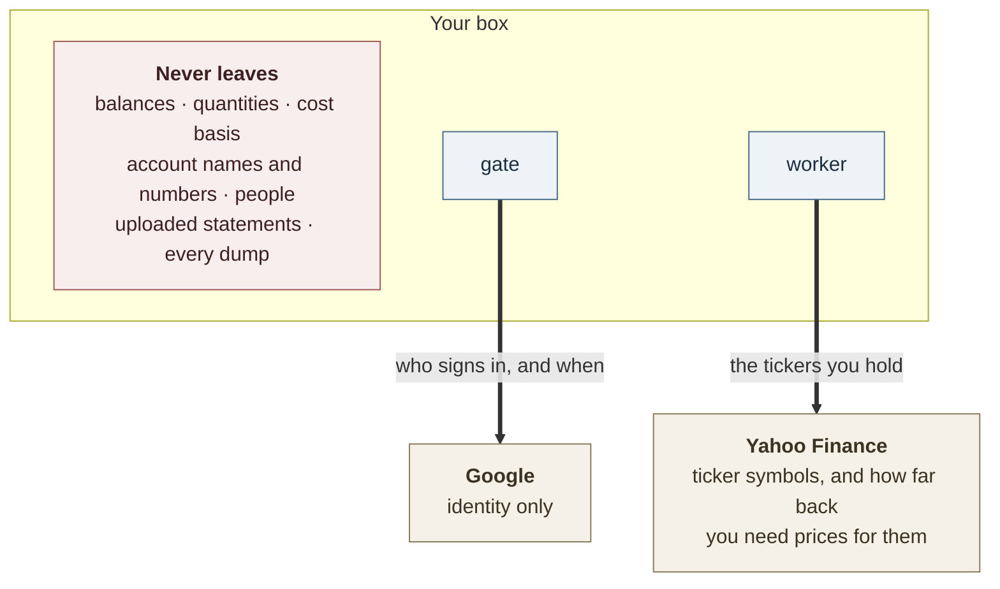
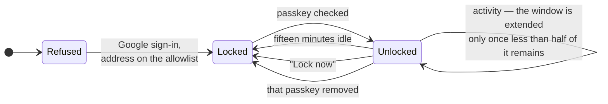
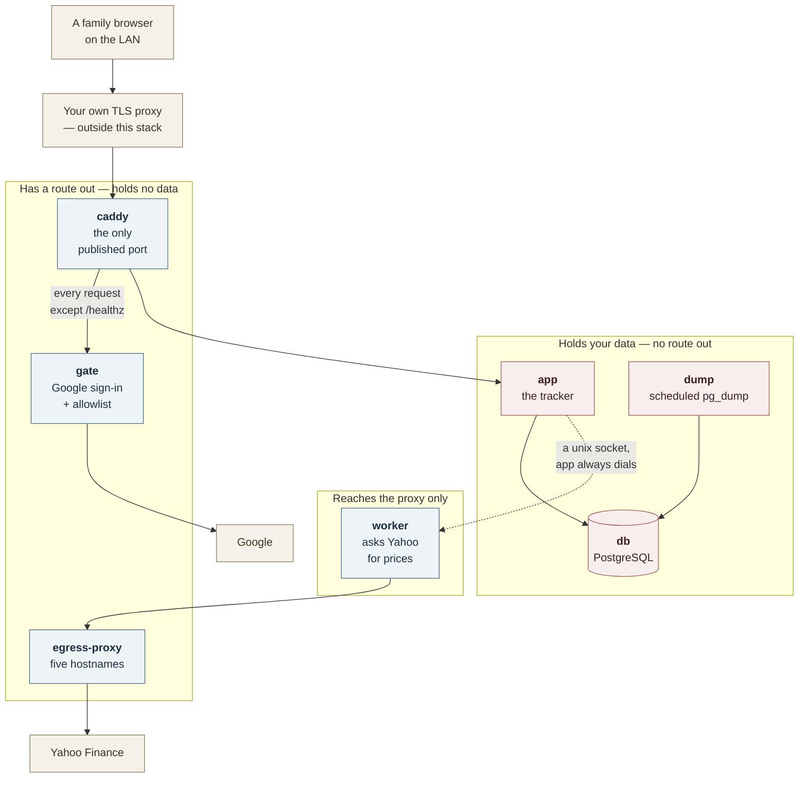
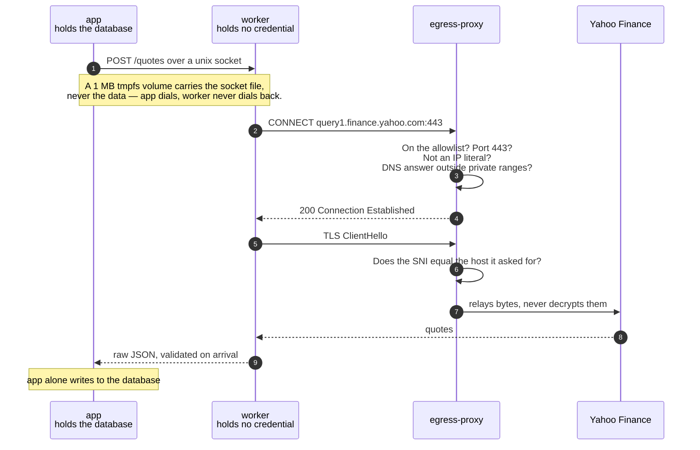

# Security

**This app holds no credential to any bank or broker.** There is no account linking, no Plaid, no
Yodlee, and no password to a financial institution anywhere in it. It learns what you hold because
you upload a statement you downloaded yourself, or type a balance in. That is the whole of the
ingest path, and it is why the rest of this page can be short. The only secrets the box keeps are
its own: the database password and the gate's two Google secrets, in `.env`, plus the unlock grants
in its own database (§3). No credential to anything of yours is among them.

You are weighing this against a hosted aggregator that does hold those logins. This page covers what
leaves your box, what defends what, and what is not defended.

Three claims shape the design. Each holds with exceptions, and the exceptions are named below:

- **The containers holding your money data have no route to the internet.**
- **The container that talks to the internet holds no database credential and cannot reach the database.**
- **A browser that has gone idle is refused every screen until a passkey is checked.**

Where this page and [`../compose.yaml`](../compose.yaml) disagree, believe `compose.yaml` — it
enforces most of what follows, and its comments carry the reasoning.

## 1. What leaves the box

Two things, to two companies, and neither of them is a number you care about.



- **Google learns who signs in and when.** That is what the sign-in gate is. It never sees a figure.
- **Yahoo learns which tickers you hold**, every fifteen minutes by default — a setting in
  Settings → Prices. Once anyone has loaded a page since the last restart, that timer runs whether
  or not anyone is still looking. Its own ticks skip the quote fetch outside market hours, but
  pressing Refresh now or committing an upload fetches at any hour, and any tick may fill in missing
  daily history — a few instruments per tick, and only ones missing prices. Yahoo never learns how
  many shares, or what they are worth to you. It does learn, for a ticker whose history is being
  filled, a date a week before the earliest you have held it.
- **Nothing else.** No analytics, no error reporting, no CDN, no third-party script of any kind in
  the page — and no web font from anyone else's server: the one typeface is a file this box serves
  itself. The service worker stores nothing on the device, so there is no cached copy of your
  figures on the phone either.
- **Starting the stack contacts the image registries** — `ghcr.io`, Docker Hub, `quay.io`. The app's
  three containers are set to pull on every `docker compose up`, so those registries learn when you
  deploy, and nothing else.

## 2. If something goes wrong

| If this happens | What stops it | What still gets through |
|---|---|---|
| A device on your LAN dials the box | The **gate** — Google sign-in plus an address allowlist, enforced by this stack's own Caddy | `/healthz`, the one path that reaches the app without a check — it reports whether the database is reachable and the schema current, and names pending migration files when it is not. `/oauth2/*` goes past the check too, but only ever to the gate's own sign-in endpoints |
| Someone picks up a family phone that is already signed in | The **lock** — every screen refused until a passkey is checked | Pages already drawn stay drawn until that tab next asks the server for something |
| A poisoned release of the market-data package | It runs in `worker`: no database credential, no shared network with `app` or `db`, one route out | It still sees the tickers — pricing them is its job. And it is in the app image too; see §5 |
| A poisoned dependency inside the app itself | `app` sits on two internal networks with no default route; read-only root filesystem, every capability dropped | An application-layer relay out through `caddy` to `gate` — §4 |
| Someone gets the disk, a dump, or the database volume | Nothing | Everything. Data is plaintext at rest, by decision — §8 |
| A script injected into a page | Nothing at the header layer | No CSP, HSTS, frame protection or `nosniff` is set anywhere — §7 |

## 3. The lock

The gate decides which *person* may reach the instance. The lock decides which *browser* may read it
once admitted. It exists because the gate holds its answer for seven days without rolling —
oauth2-proxy's own default, which `compose.yaml` deliberately does not override — and there is no
working sign-out. Without the lock, an unlocked family phone in someone else's hands is a week of
unchallenged access.



- The refusal happens before any page code runs. A locked browser is not shown a blanked page — the
  query that would have fetched your holdings is never made.
- Unlocking writes a row in the database, the **grant**. Your browser gets a cookie holding nothing
  but a random id pointing at that row — HTTPS-only, unreadable by scripts, and not sent when
  another site posts to this one. **The row is what counts**, so revoking access is a delete rather
  than an expiry you wait out.
- The app stores only the **public half** of a passkey. It never sees your face, fingerprint or
  device PIN.
- The idle window is **fifteen minutes**, extended only when less than half remains — so the lock can
  arrive as little as seven and a half minutes after your last request. **There is no setting to
  change either figure.**
- Unlocking again replaces that browser's own previous grant. It does **not** end any other
  browser's — two devices unlocked with the same passkey each hold their own, and removing the
  passkey is what ends all of them at once.

Two corrections to the mental model most people arrive with:

**It is not necessarily a fingerprint.** The check is whatever your device accepts — a face, a
fingerprint and a device PIN all count the same. The lock is only as strong as whatever unlocks
passkeys on that device.

**Nothing is encrypted by the passkey.** This is the one most often assumed. The lock decides whether
the server will answer at all. It encrypts nothing. Anyone holding the database volume reads
everything without ever meeting it — §8.

## 4. The shape of the stack

Seven services on seven networks ([`../compose.yaml`](../compose.yaml)). Four of those are
`internal: true` with `gateway_mode_ipv4: isolated` — in Docker terms, no default route and no
bridge address at all. Not a firewall rule that could be misread, but the absence of anywhere to
send a packet.

**This needs Docker Engine 28.0 or newer.** Engine 26 accepts the option and ignores it, without
saying so; containers then keep an address on the host and can reach anything else your machine is
listening with. Engine 27 refuses the option outright. `internal: true` holds on every version, so
the route to the *internet* is closed either way — but check `docker version` before believing the
stronger half.



- **Only `caddy` publishes a port**, so no address on your LAN reaches `app` without passing the
  gate. `app` holds the database credential and `db` holds every byte of state; neither has a route
  out.
- **`db` is reachable only from `app` and `dump`**, with no published port. Its password has no
  default; the stack refuses to start without one.
- **`worker` shares no network with `app`, `gate` or `db`** — not a rule about what it may do, but no
  address on any network they are on.
- **TLS is not in this stack.** The bundled Caddy serves plain HTTP; the certificate and public
  hostname are your proxy's job. That is also why the gate is enforced *here* rather than upstairs: a
  LAN device can dial this box directly, and that device is the threat the gate exists for.
- **Privilege is dropped, with the exceptions named.** All seven containers run read-only with
  `no-new-privileges` and every Linux capability dropped. Two hold one capability back: `caddy` keeps
  `NET_BIND_SERVICE`, without which the image's binary will not start, and `gate` keeps
  `DAC_READ_SEARCH` so it can open your allowlist file whatever its mode. And one runs as root —
  `gate`, the container that faces Google, because the published image sets no user. An automated
  test in CI reads all seven postures back out of the running containers rather than trusting the
  file, and probes the worker for the others by name and by every container address.

### The two ways the no-egress claim is not absolute

**The `caddy` → `gate` relay.** A compromised `app` still reaches `caddy`, because it must; `caddy`
passes `/oauth2/*` to `gate`; `gate` has real egress, because Google's token endpoint is on the
internet. `compose.yaml` calls that "known rather than closed". The opening is narrow: not a socket,
only whatever can be smuggled through a sign-in proxy's own endpoints. But what is on the far side is
the least restricted container here — `gate` runs as root, can reach the whole internet, and through
its network can reach the Docker host and anything else your machine is listening with. One more of
the same kind: Caddy believes the headers naming the original caller if they come from any address on
the local network, and `app`'s address is one, so `app` could fake them. The app itself decides
nothing on them. The gate does read them, so its sign-in redirects carry the outside hostname — but
the address a browser is returned to is pinned to `PUBLIC_ORIGIN` rather than taken from a header,
which is what keeps a forged one cheap.

**The external-database option.** If you run Postgres elsewhere and load
[`../compose.external-db.yaml`](../compose.external-db.yaml), `app` moves onto a network with a
gateway. That restores public DNS for `app` and gives it a route to the Docker host, and so to
anything else your machine is listening with. The file says so in its own header. The worker's
isolation is unaffected — the override adds no network and no variable to it — but it also removes
the `db` and `dump` containers, so on that path the stack takes **no dumps at all**, and backing up
the external database is yours. Taking this option gives up the first of the three claims at the top
of this page.

## 5. The price worker

`yahoo-finance2` is the one production dependency that opens a socket to the internet. The design
assumes it will eventually be what goes wrong, and is built so that it survives.

It runs in `worker`. What makes that safe is not the image but what the process is denied: no
`DATABASE_URL` and no `PGPASSWORD` in its environment, no database client in its code at all, a
capped process count and memory, a read-only root filesystem, and one route out.

**The honest limit of that.** `app`, `worker` and `egress-proxy` are one image started three ways, so
the package's files are physically present in the app container too. What keeps it out of your
database is that `app` never imports it, not that the app image lacks it. A package that attacks when
it is *imported* is contained by this design. A package that attacks when it is *installed*, during
the image build, is inside all three containers before any of this applies — see §6.



The socket is a 1 MB tmpfs volume defined in [`../compose.yaml`](../compose.yaml). The proxy is
hand-written Node in [`../server/egress-proxy.ts`](../server/egress-proxy.ts) — `node:http`,
`node:net`, `node:dns` and no other import, so it is not itself a third-party dependency. Three
things the diagram cannot show:

1. **The five hostnames are compared exactly** — a list written into that file, not read from
   configuration — never as a suffix, so `query1.finance.yahoo.com.evil.test` does not match, and a
   compromised process cannot widen it.
2. **It never decrypts anything.** It checks the hostname sent in the clear at the start of the
   handshake against the one the client asked for, then relays bytes.
3. **A DNS answer pointing back inside your network is refused**, so a poisoned resolver cannot turn
   the proxy into a way back in.

A compromised market-data package therefore gets the ticker list, the timing, and a tunnel to Yahoo.
It does not get the database, the balances, a route to your LAN, or anywhere else to send what it
learns.

## 6. Supply chain

**In place** — each is a file you can check, not a policy:

- `package-lock.json` is committed and every install path uses `npm ci`, so builds resolve to the
  exact versions and integrity hashes recorded, never to whatever the registry offers today.
- CI runs `npm audit signatures` — the only check that notices a pinned name and version being
  republished with different contents — and blocks on `npm audit --omit=dev --audit-level=high`.
- CI **fails the build if any production package gains an install script, or an `os`/`cpu`
  constraint**, and the image publish depends on that job. The production tree is held to pure
  JavaScript with no install-time step, which removes the most common way a poisoned package runs.
- The release image prunes the dev tree and unreachable runtime dependencies, and deletes the
  TypeScript compiler.
- The container hardening and the worker's quarantine, in §4 and §5.

**Not in place** — do not assume these:

- **No Dependabot or Renovate.** Updates are manual and deliberate. Nothing sweeps for a
  newly-disclosed advisory between releases.
- **No SBOM and no build provenance** for the published image; both are explicitly disabled in CI.
  **No image signing.**
- **No digest pinning anywhere.** Base images and the app image are pinned by tag, which trusts the
  publisher not to move it. Pinning `APP_VERSION` to a `tag@sha256:` digest is the only form that
  holds against a compromised publisher, and it is not the documented default.
- **`--ignore-scripts` is used only in the audit job**, not in the build. An install script in a dev
  dependency still runs on the path that produces the release image — the gap §5's honest limit
  points at.
- **No reproducible build, and no runtime integrity check.**

## 7. What this does not protect against

- **No encryption at rest** — a deliberate choice, argued in
  [`adr/0009`](adr/0009-the-stack-takes-dumps-not-backups.md).
- **No security response headers at all** — no CSP, no HSTS, no `X-Frame-Options`, no `nosniff`.
  Neither the app nor the bundled Caddy sets one.
- **No rate limiting** — not on sign-in, not on unlocking.
- **No CSRF token.** Instead, every request that changes data must say which site it came from, and
  neither cookie is sent when another site posts to this one. A request naming no site at all passes
  that check — but browsers always name one when posting across sites, so anything exploiting the gap
  is not a browser, and has no cookie to abuse.
- **No authorization inside the app.** Everyone the allowlist admits sees everything. Choosing whose
  accounts a screen shows is a filter on the view, never a permission.
- **Request bodies are effectively unbounded.** An upload that declares its size is refused if it is
  too big. One that declares no size is not, only the file part is measured at all, and every other
  form buffers whatever arrives. No size limit is set at either proxy.
- **The lock does not un-draw pixels.** A tab already showing figures keeps showing them until it
  next asks the server for something, and a browser's back/forward cache can serve a rendered stale
  page for minutes after a grant is revoked elsewhere.
- **A passkey check does not prove someone was just there.** A device whose passkeys are already
  unlocked may answer without prompting anyone. That raises the cost of a borrowed phone; it does not
  close it.
- **A household with exactly one passkey cannot recover a lost device by itself** — removing a
  passkey requires checking one, and the only one that will do is on the missing device. That falls
  back to you, at a shell. **Enrol a second passkey.**
- **The documented external-Postgres path never requires TLS** to the database.
- **This is not safe to publish on the open internet as it stands.** It is built for a box behind
  your own proxy, on your own network.

The list above is current. An older audit,
[`research/2026-09-02-security-and-privacy-audit.md`](research/2026-09-02-security-and-privacy-audit.md),
has the longer argument behind several of these, but it is a snapshot against one commit and some of
what it found has since been fixed.

## 8. What you carry

The stack cannot do these for you.

1. **Encrypt the disk.** Everything above only decides who gets an answer from the running app. None
   of it helps once someone has the disk.
2. **Encrypt the dumps and keep them off the host.** A dump is every balance, every statement and
   every original uploaded CSV, in plaintext. Encryption is the collecting tool's job.
3. **Pin `APP_VERSION` to a digest** if you want the image tag to hold against a compromised
   publisher.
4. **Enrol a second passkey**, on a second device, before you need it.
5. **Terminate TLS yourself**, and keep the box off the open internet.
6. **Keep the address allowlist short.** It is the whole of who may enter; there is no second check
   behind it.

`operating.md`'s "Upgrading" and "Reverse proxy and TLS" sections say how each of these is done.

## 9. Checking this yourself

Do not take the diagrams on trust. Against your own running stack:

```sh
docker version --format '{{.Server.Version}}'   # 28.0+, or §4's stronger half does not hold

# The worker holds no database credential — expect no output at all.
docker compose exec worker env | grep -E 'DATABASE_URL|PGPASSWORD'

# The app has no route out — expect a DNS or connect failure, not a page.
docker compose exec app node -e "fetch('https://example.com').then(r=>console.log('REACHED',r.status),e=>console.log('refused:',e.cause?.message??e.message))"

# The worker's route out is the allowlist only — expect a refusal for anything but Yahoo.
docker compose exec worker node -e "fetch('https://example.com').then(r=>console.log('REACHED',r.status),e=>console.log('refused:',e.cause?.message??e.message))"

# Only one published port in the whole stack: exactly one row shows a host
# mapping (`->`). Bare entries like `3000/tcp` are ports nothing publishes.
docker compose ps -a --format '{{.Service}}\t{{.Ports}}'
```

If any of these surprises you, trust the result over this page and check
[`../compose.yaml`](../compose.yaml).

## Where the detail lives

- [`operating.md`](operating.md) — the decisions that are yours: the gate's admission conditions, the
  proxy's refusal shapes, recovery when every passkey is gone, upgrades.
- `ARCHITECTURE.md` §7.6 — the control table, for someone reading the code.
- [`adr/0005`](adr/0005-auth-is-a-forward-auth-gate.md) — why authentication is a sidecar rather than
  code, and why a VPN was rejected for this threat model.
- [`adr/0012`](adr/0012-a-browser-past-the-gate-is-shown-nothing.md) — why the lock exists and what
  it deliberately does not promise.
- [`adr/0002`](adr/0002-masking-is-a-display-state.md) — why masking is a display state and must
  never be described as access control.
- [`guide/passkeys.md`](guide/passkeys.md) — the family-facing version of §3.
- [`data-model.md`](data-model.md) — every table explained, with extraction queries. This is the
  answer to "what if this project stops being maintained": the data is ordinary Postgres, and that
  document is written for someone rebuilding around a dump without the app.
