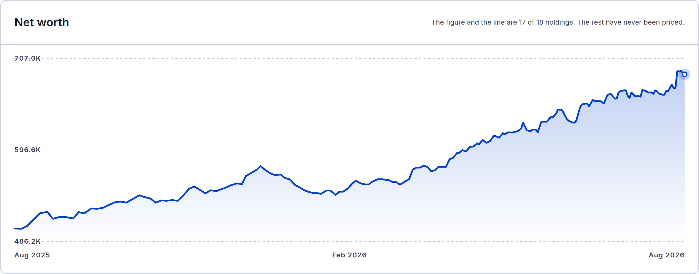
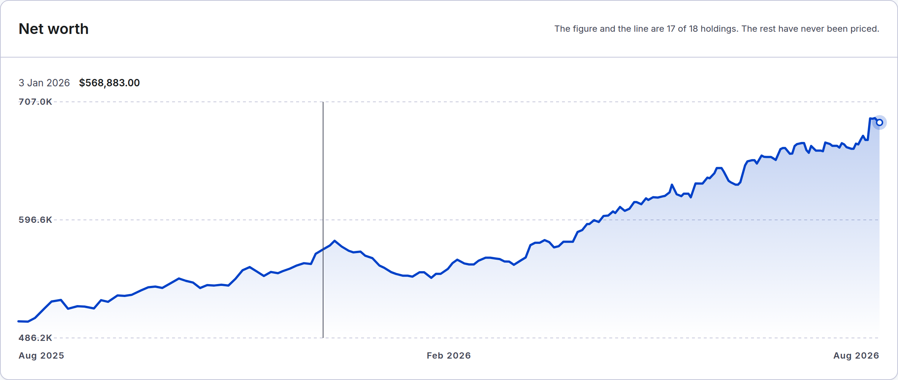
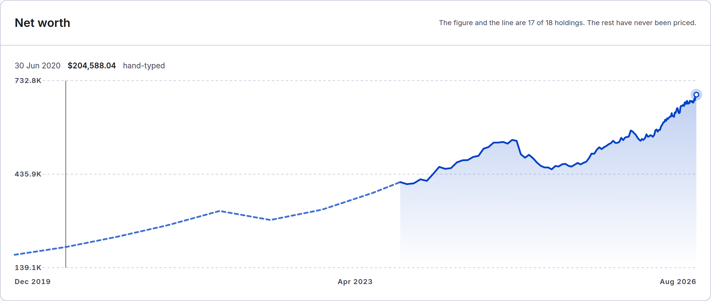
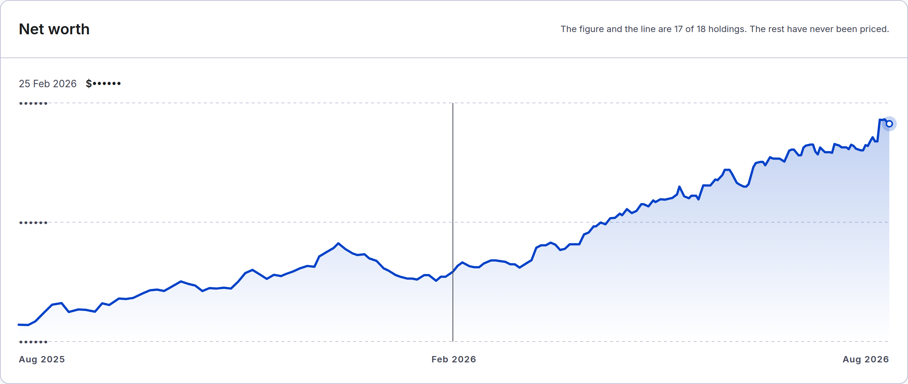
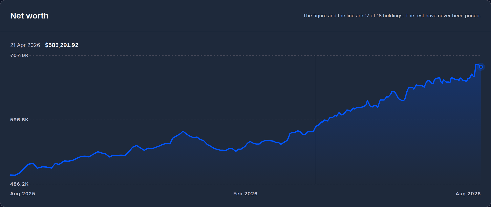
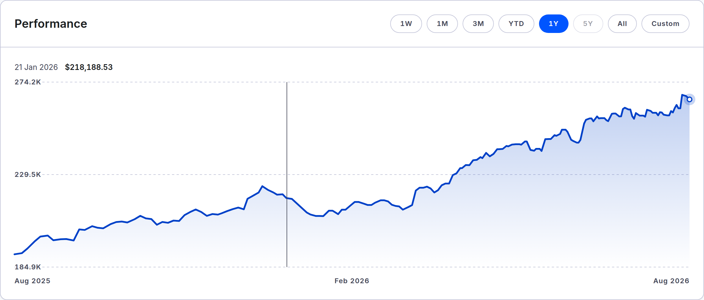
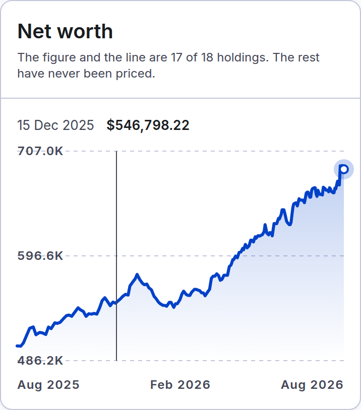

# Spec 0010 — before/after captures

Proof shots for the chart point readout pull request, per the layout table's
`specs/<slice>/screenshots/` row. This directory is deleted once that pull
request merges; the lasting images are the README's and the guide's, retaken
in the same change.

## Before

Hovering does nothing, and nothing on the chart says what a point is worth:

## After

At rest, the strip captions the last plotted point, agreeing with the headline
digit for digit:

Pointing moves the readout to the nearest point and the guide says which:

A hand-typed pre-app point says so in words (far left of the All range):

Masked, the amount is the shared dots, the date stays, and the interaction
keeps working:

Dark theme — the guide and the strip resolve from the theme's tokens:

An account page: same strip, same place, never a hand-typed mark:

A phone: a tap pins the readout:

